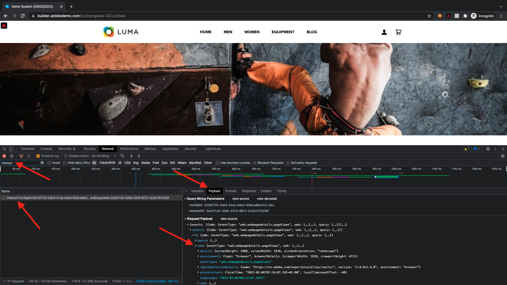

# 1.4 Coleta de dados da Web do lado do cliente

## 1.4.1 Validar os dados na solicitação

### Instalar o Adobe Experience Platform Debugger

O Experience Platform Debugger é uma extensão disponível para navegadores Chrome e Firefox, que ajuda a visualizar a tecnologia Adobe implementada em suas páginas da Web. Baixe a versão do seu navegador preferido:

- [Extensão do Firefox](https://addons.mozilla.org/pt-BR/firefox/addon/adobe-experience-platform-dbg/)

- [Extensão do Chrome](https://chrome.google.com/webstore/detail/adobe-experience-platform/bfnnokhpnncpkdmbokanobigaccjkpob)

Se você nunca usou o Debugger antes - e este é diferente do Adobe Experience Cloud Debugger anterior - talvez você queira assistir a este vídeo de visão geral de cinco minutos:

>[!VIDEO](https://video.tv.adobe.com/v/32156?quality=12&learn=on)

Como você estará carregando o site de demonstração no modo incógnito, é necessário garantir que o Experience Platform Debugger também esteja disponível no modo incógnito. Para fazer isso, acesse **chrome://extensions** no navegador e abra a extensão do Experience Platform Debugger.

Verifique se essas 2 configurações estão ativadas:

- Modo de desenvolvedor
- Permitir no incógnito

### Abra o site de demonstração

Ir para [https://builder.adobedemo.com/projects](https://builder.adobedemo.com/projects). Depois de fazer logon com sua Adobe ID, você verá isso. Clique no projeto do seu site para abri-lo.

No **Telas** página, clique em **Executar**.

Você verá seu site de demonstração aberto. Selecione o URL e copie-o para a área de transferência.

Abra uma nova janela incógnita do navegador.

Cole o URL do site de demonstração, que você copiou na etapa anterior. Em seguida, você será solicitado a fazer logon usando sua Adobe ID.

Selecione o tipo de conta e conclua o processo de logon.

Você verá seu site carregado em uma janela incógnita do navegador. Para cada demonstração, você precisará usar uma nova janela incógnita do navegador para carregar o URL do site de demonstração.

### Use o Experience Platform Debugger para ver as chamadas que vão para o Edge

Certifique-se de que o site de demonstração está aberto e clique no ícone de extensão do Experience Platform Debugger.

O Debugger abrirá e mostrará os detalhes da implementação criada na Propriedade de coleta de dados da Adobe Experience Platform. Lembre-se de que você está depurando a Extensão e as regras que acabou de editar.

Clique no botão **[!UICONTROL Fazer logon]** na parte superior direita para autenticar. Se já tiver uma guia do navegador aberta com a interface da Coleta de dados da Adobe Experience Platform, a etapa de autenticação será automática e você não precisará digitar seu nome de usuário e senha novamente.

Pressione o botão de recarregamento no site de demonstração para conectar o depurador à guia específica.

Confirme se o Debugger está **[!UICONTROL Ligado ao Início]** como mostrado acima e clique no botão **[!UICONTROL bloqueio]** ícone para bloquear o Debugger no site da demonstração. Se você não fizer isso, o Debugger continuará alternando para expor os detalhes de implementação de qualquer guia do navegador em foco, o que pode ser confuso.

Em seguida, vá para qualquer página no site de demonstração como, por exemplo, a variável **Homens** página da categoria.

Em seguida, clique em **[!UICONTROL Experience Platform Web SDK]** na navegação à esquerda, para ver a variável **[!UICONTROL Solicitações de rede]**.

Cada solicitação contém um **[!UICONTROL events]** linha.

Clique para abrir o **[!UICONTROL events]** linha. Observe como é possível visualizar a variável **web.webpagedetails.pageViews** assim como outras variáveis prontas para uso que seguem o **Web SDK ExperienceEvent XDM** formato.

Esses tipos de detalhes da solicitação também estão visíveis na guia Rede. Filtrar solicitações com **interagir** para localizar as solicitações enviadas pelo SDK da Web. Você pode encontrar todos os detalhes da carga XDM nos Cabeçalhos de carga da solicitação:

Próxima etapa: [1.5 Implementar o Adobe Analytics e o Adobe Audience Manager](./ex5.md)

[Voltar ao Módulo 1](./data-ingestion-launch-web-sdk.md)

[Voltar para todos os módulos](./../../overview.md)
