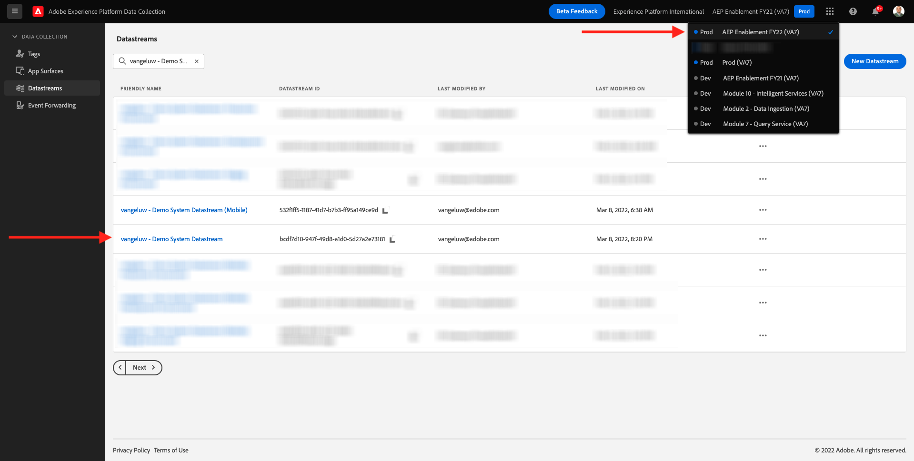
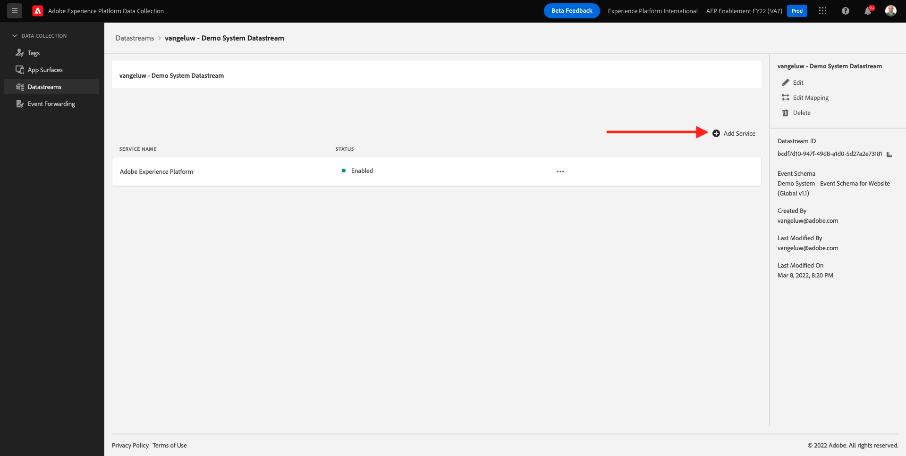

# 1.6 Implementar o Adobe Target

## 1.6. Atualize seu conjunto de dados para usar o Adobe Target

Caso queira enviar dados coletados pelo SDK da Web para o Adobe Target e obter uma resposta do Adobe Target com uma experiência personalizada para cada cliente, siga essas etapas.

Ir para [https://experience.adobe.com/launch/](https://experience.adobe.com/launch/) e ir para **Datastreams**.

No canto superior direito da tela, selecione o nome da sandbox, que deve ser `--aepSandboxId--`. Abra o armazenamento de dados específico, que é nomeado como `--demoProfileLdap-- - Demo System Datastream`.

Você verá isso. Para ativar o Adobe Target, clique em **+Adicionar serviço**.

Você verá isso. Selecionar o serviço **Adobe Target**, depois disso, é possível fornecer informações adicionais opcionalmente. Nesse momento, não há necessidade de salvar isso, então clique em **Cancelar**.

Próxima etapa: [Requisitos do esquema XDM 1.7 no Adobe Experience Platform](./ex7.md)

[Voltar ao Módulo 1](./data-ingestion-launch-web-sdk.md)

[Voltar para todos os módulos](./../../overview.md)
