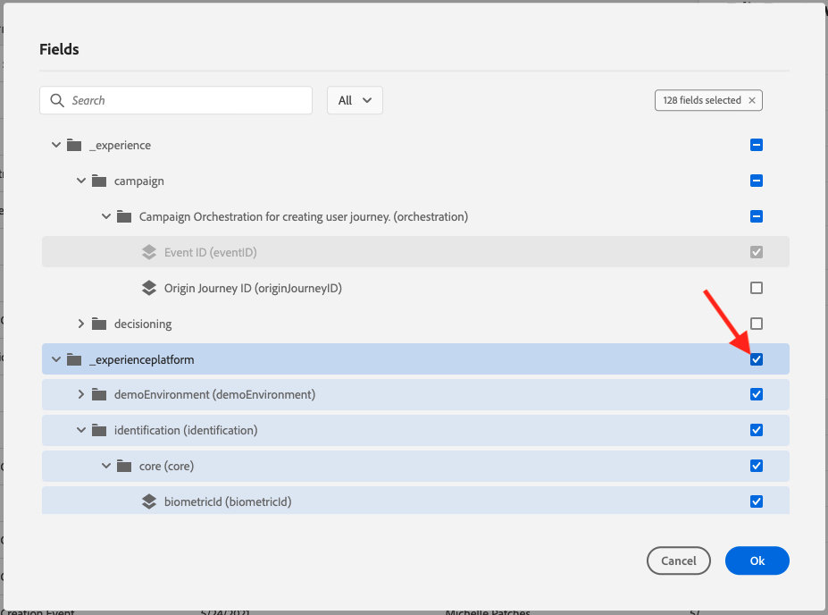
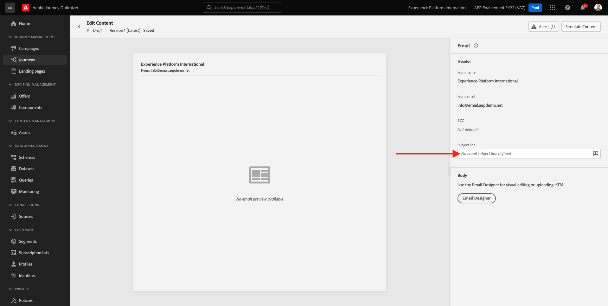
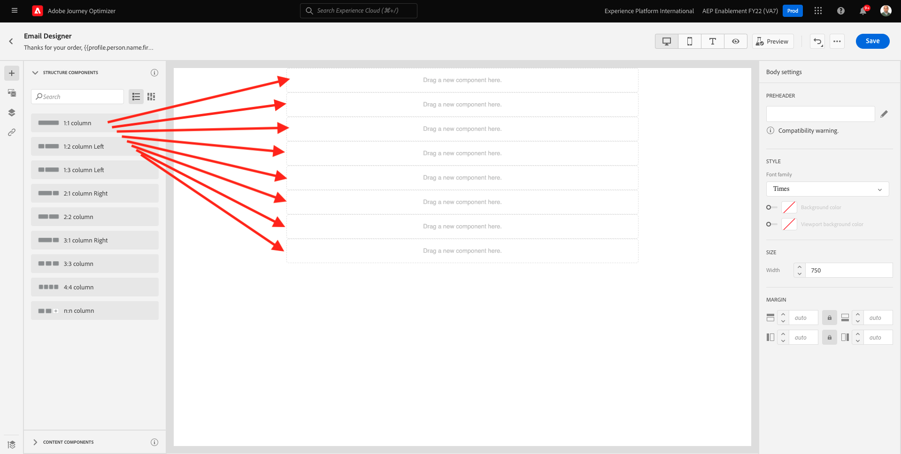
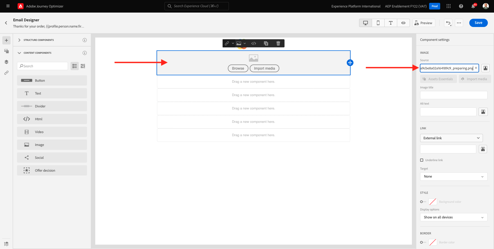
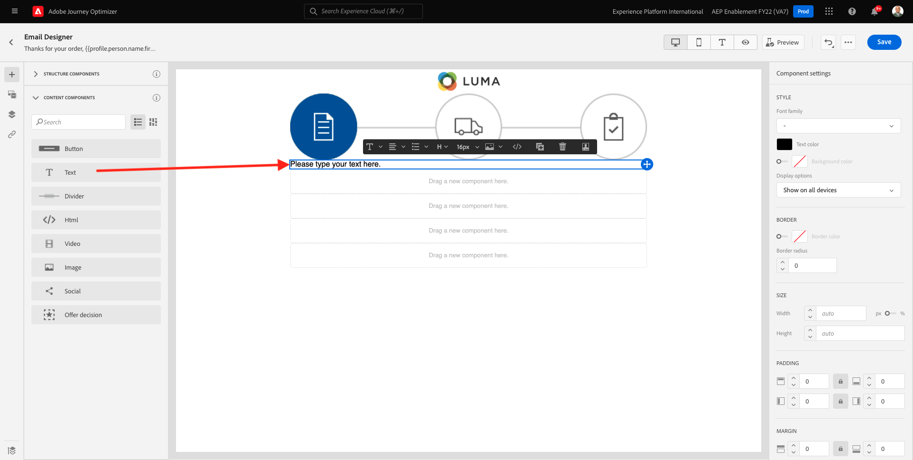
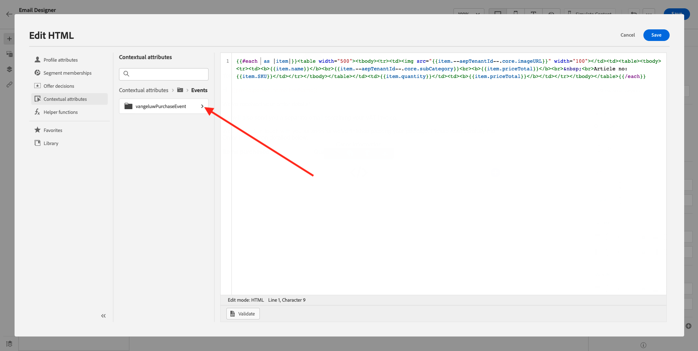
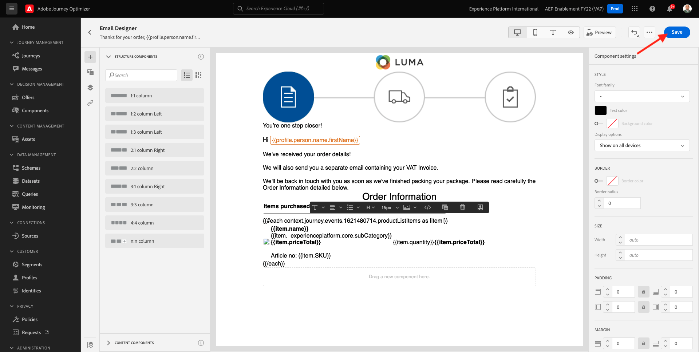
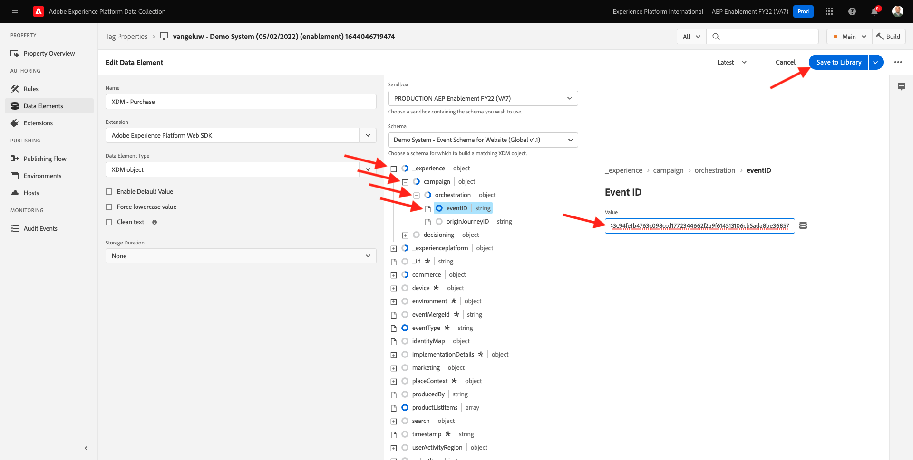

# 10.1 Configurar uma jornada baseada em acionador - Confirmação de pedido

Faça logon no Adobe Journey Optimizer acessando [Adobe Experience Cloud](https://experience.adobe.com). Clique em **Journey Optimizer**.


Você será redirecionado para o **Início**  no Journey Optimizer. Primeiro, certifique-se de usar a sandbox correta. A sandbox a ser usada é chamada de `--aepSandboxId--`. Para alterar de uma sandbox para outra, clique em **Produto de produção (VA7)** e selecione a sandbox na lista. Neste exemplo, a sandbox é chamada de **Ativação AEP FY22**. Você estará no **Início** exibição da sandbox `--aepSandboxId--`.


## 10.1.1 Criar seu evento

No menu , acesse **Configurações** e clique em **Gerenciar** under **Eventos**.


No **Eventos** , você verá uma exibição semelhante a esta. Clique em **Criar evento**.


Em seguida, você verá uma configuração de evento vazia.


Primeiro de tudo, dê a seu Evento um Nome como este: `--demoProfileLdap--PurchaseEvent`e adicione uma descrição como esta: `Purchase Event`.


O próximo é o **Tipo de evento** seleção. Selecionar **Unitário**.


O próximo é o **Tipo de ID do evento** seleção. Selecionar **Sistema gerado**


Em seguida está a seleção Esquema. Um esquema foi preparado para este exercício. Use o esquema `Demo System - Event Schema for Website (Global v1.1) v.1`.


Após selecionar o Esquema, você verá vários campos sendo selecionados na variável **Carga** seção. Clique no botão **Editar/Lápis** para adicionar campos adicionais a esse evento.


Você verá esse pop-up. Agora é necessário marcar caixas de seleção adicionais para acessar dados adicionais quando esse evento for acionado.


Primeiro de tudo, marque a caixa de seleção na linha `--aepTenantId--`.



Em seguida, role para baixo e marque a caixa de seleção na linha `productListItems`.


Em seguida, role para baixo e marque a caixa de seleção na linha `commerce`.


Em seguida, clique em **Ok**.

Você verá que campos adicionais foram adicionados ao evento. Clique em **Salvar**.


O novo evento é compartilhado e você verá o evento na lista de eventos disponíveis agora.

Clique no seu evento novamente para abrir o **Editar evento** novamente.
Passe o mouse sobre **Carga** novamente para ver os 3 ícones novamente. Clique no botão **Exibir carga** ícone .


Você verá um exemplo da carga esperada. Seu evento tem uma orquestration eventID exclusiva, que pode ser encontrada ao rolar para baixo na carga útil até que você veja `_experience.campaign.orchestration.eventID`.


A ID de evento é o que precisa ser enviado para o Adobe Journey Optimizer para acionar a jornada que você criará na próxima etapa. Anote essa eventID, pois ela será necessária em uma das próximas etapas.
`"eventID": "ef6dd943c94fe1b4763c098ccd1772344662f2a9f614513106cb5ada8be36857"`

Clique em **Ok**, seguida de **Cancelar**.

Seu evento agora está configurado e pronto para ser usado.

## 10.1.2 Criar a jornada

No menu , acesse **Jornada** e clique em **Criar Jornada**.


Você verá isso. Dê um nome à sua jornada. Use `--demoProfileLdap-- - Order Confirmation journey`. Clique em **OK**.


Primeiro, é necessário adicionar o evento como ponto de partida da jornada. Procure seu evento `--demoProfileLdap--PurchaseEvent` e arraste e solte na tela. Clique em **OK**.


Em seguida, em **Ações**, pesquise a **Email** e adicione-a à tela.


Defina as **Categoria** para **Marketing** e selecione uma superfície de email que permita enviar emails. Nesse caso, a superfície do email a ser selecionada é **Email**. Certifique-se de que as caixas de seleção de **Cliques no email** e **aberturas de email** estão ativadas.


A próxima etapa é criar a mensagem. Para fazer isso, clique em **Editar conteúdo**.


Agora você vê isso. Clique no botão **Linha de assunto** campo de texto.



Na área de texto, comece a escrever **Obrigado pelo seu pedido.**


A linha de assunto ainda não foi feita. Em seguida, é necessário trazer o token de personalização para o campo **Nome** armazenado em `profile.person.name.firstName`. No menu esquerdo, role para baixo até encontrar a variável **Pessoa** > **Nome completo** >  **Nome** e clique no botão **+** ícone para adicionar o token de personalização na linha de assunto. Clique em **Salvar**.


Então você estará de volta. Clique em **Email Designer** para criar o conteúdo do email.


Na próxima tela, clique em **Design do zero**.


No menu esquerdo, você encontrará os componentes de estrutura que podem ser usados para definir a estrutura do email (linhas e colunas).

Arraste e solte 8 vezes a **Coluna 1:1** na tela, o que deve lhe dar o seguinte:



Ir para **Componentes de conteúdo**.


Arraste e solte um **Imagem** na primeira linha. Clique em **Procurar**.


Vá para a pasta **ativos de habilitação**, selecione o arquivo **luma-logo.png** e clique em **Selecionar**.


Você está de volta. Clique na imagem para selecioná-la e, em seguida, use a variável **Tamanho** controle deslizante para tornar a imagem do logotipo um pouco menor.


Ir para **Componentes de conteúdo** e arraste e solte uma **Imagem** na segunda linha. Selecione o **Componente de imagem** mas NÃO clique em Procurar.


Cole este URL de imagem no campo **Origem**: `https://parsefiles.back4app.com/hgJBdVOS2eff03JCn6qXXOxT5jJFzialLAHJixD9/29043bedcde632a9cbe8a02a164189c9_preparing.png`. Esta imagem é hospedada fora do Adobe.



Ao alterar o escopo para outro campo, a imagem será renderizada e você verá o seguinte:


Em seguida, acesse **Componentes de conteúdo** e arraste e solte uma **Texto** na terceira linha.



Selecionar o texto padrão nesse componente **Digite seu texto aqui.** e substituí-lo pelo texto abaixo:

```javascript
You’re one step closer!

Hi 

We've received your order details!

We will also send you a separate email containing your VAT Invoice.

We'll be back in touch with you as soon as we've finished packing your package. Please read carefully the Order Information detailed below.
```


Coloque o cursor próximo ao texto **Oi** e clique em **Adicionar personalização**.


Navegue até o **Pessoa** > **Nome completo** > **Nome** e clique no botão **+** ícone para adicionar o token de personalização na linha de assunto. Clique em **Salvar**.


Você verá isso:


Em seguida, acesse **Componentes de conteúdo** e arraste e solte uma **Texto** na quarta linha.


Selecionar o texto padrão nesse componente **Digite seu texto aqui.** e substituí-lo pelo texto abaixo:

`Order Information`

Altere o tamanho da fonte para **26px** e centralize o texto nesta célula. Você terá isso:


Em seguida, acesse **Componentes de conteúdo** e arraste e solte uma **HTML** na quinta linha. Clique no componente HTML e, em seguida, clique em **Mostrar o código-fonte**.


No **Editar HTML** pop-up, cole este HTML:

```<table><tbody><tr><td><b>Items purchased</b></td><td></td><td><b>Quantity</b></td><td><b>Subtotal</b></td></tr><tr><td colspan="4" width="500"><hr></td></tr></tbody></table>```

Clique em **Salvar**.


Você terá isso. Clique em **Salvar** para salvar seu progresso.


Ir para **Componentes de conteúdo** e arraste e solte uma **HTML** na sexta linha. Clique no componente HTML e, em seguida, clique em **Mostrar o código-fonte**.


No **Editar HTML** pop-up, cole este HTML:

```{{#each xxx as |item|}}<table width="500"><tbody><tr><td></td><td><table><tbody><tr><td><b>{{item.name}}</b><br>{{item.--aepTenantId--.core.subCategory}}<br><b>{{item.priceTotal}}</b><br>&nbsp;<br>Article no: {{item.SKU}}</td></tr></tbody></table></td><td>{{item.quantity}}</td><td><b>{{item.priceTotal}}</b></td></tr></tbody></table>{{/each}}```

Você terá isso:


Agora é necessário substituir **xxx** por uma referência ao objeto productListItems que faz parte do evento que aciona a jornada.


Primeiro, excluir **xxx** no código do HTML primeiro.


No menu esquerdo, clique em **Atributos contextuais**. Esse contexto é passado para a mensagem da jornada.


Você verá isso. Clique na seta ao lado de **Journey Orchestration** para detalhar.


Clique na seta ao lado de **Eventos** para detalhar.


Clique na seta ao lado de `--demoProfileLdap--PurchaseEvent` para detalhar.



Clique na seta ao lado de **productListItems** para detalhar.


Clique no botão **+** ícone ao lado de **Nome** para adicioná-lo à tela de desenho. Você terá isso. Agora é necessário selecionar  **.name** conforme indicado na captura de tela abaixo, você deve remover **.name**.


Você terá isso. Clique em **Salvar**.


Você estará de volta ao Email Designer agora. Clique em **Salvar** para salvar seu progresso.



Em seguida, acesse **Componentes de conteúdo** e arraste e solte uma **HTML** componente na sétima linha. Clique no componente HTML e, em seguida, clique em **Mostrar o código-fonte**.


No **Editar HTML** pop-up, cole este HTML:

```<table><tbody><tr><td><b>Subtotal</b><br>Delivery charge (included)</td><td align="right"><b>xxx</b><br><b>5</b></td></tr><tr><td colspan="2" width="500"><hr></td></tr><tr><td><b>Total including VAT</b></td><td align="right"><b>xxx</b></td></tr></tbody></table>```

Há duas referências de **xxx** neste código HTML. Agora é necessário substituir cada **xxx** por uma referência ao objeto productListItems que faz parte do evento que aciona a jornada.


Primeiro, exclua o primeiro **xxx** no código do HTML.


No menu esquerdo, clique em **Atributos contextuais**.


Clique na seta ao lado de **Journey Orchestration** para detalhar.


Clique na seta ao lado de **Eventos** para detalhar.


Clique na seta ao lado de `--demoProfileLdap--PurchaseEvent` para detalhar.


Clique na seta ao lado de **Comércio** para detalhar.


Clique na seta ao lado de **Pedido** para detalhar.


Clique no botão **+** ícone ao lado de **Preço total** para adicionar isso à tela.


Você terá isso. Agora exclua o segundo **xxx** no código do HTML.


Clique no botão **+** ícone ao lado de **Preço total** novamente para adicionar isso à tela.


Também é possível adicionar o campo **Moeda** no **Pedido** sobre a tela, como você pode ver aqui.
Quando terminar, clique em **Salvar** para salvar as alterações.


Você estará de volta ao Email Designer. Clique em **Salvar** novamente.


Volte para o painel de mensagens clicando no botão **seta** ao lado do texto da linha de assunto no canto superior esquerdo.


Clique na seta no canto superior esquerdo para retornar à jornada.


Clique em **Ok** para fechar a ação de email.


Clique em **Publicar** para publicar sua jornada.


Clique em **Publicar** novamente.


Sua jornada foi publicada.


## 10.1.5 Atualizar a propriedade do cliente de coleta de dados do Adobe Experience Platform

Ir para [Coleta de dados do Adobe Experience Platform](https://experience.adobe.com/launch/) e selecione **Tags**.

Esta é a página Propriedades da coleta de dados do Adobe Experience Platform que você viu anteriormente.


No módulo 0, o Demo System criou duas propriedades do cliente para você: um para o site e um para o aplicativo móvel. Localizá-los pesquisando por `--demoProfileLdap--` no **[!UICONTROL Pesquisar]** caixa. Clique para abrir o **Web** propriedade.


Ir para **Elementos de dados**. Pesquise e abra o elemento de dados **XDM - Compra**.


Você verá isso. Navegar até o campo **_experience.campaign.orchestration.eventID** e preencha sua eventID aqui. A eventID a ser preenchida aqui é a eventID criada como parte do exercício 10.1.2. Clique em **Salvar** ou **Salvar na biblioteca**.



Salve as alterações na propriedade do cliente e publique as alterações atualizando a biblioteca de desenvolvimento.


Suas alterações foram implantadas e podem ser testadas.

## 10.1.6 Teste o email de confirmação do pedido usando o site de demonstração

Vamos testar a jornada atualizada comprando um produto no site de demonstração.

Ir para [https://builder.adobedemo.com/projects](https://builder.adobedemo.com/projects). Depois de fazer logon com sua Adobe ID, você verá isso. Clique no projeto do seu site para abri-lo.


No **Telas** página, clique em **Executar**.


Você verá seu site de demonstração aberto. Selecione o URL e copie-o para a área de transferência.


Abra uma nova janela incógnita do navegador.


Cole o URL do site de demonstração, que você copiou na etapa anterior. Em seguida, você será solicitado a fazer logon usando sua Adobe ID.


Selecione o tipo de conta e conclua o processo de logon.


Você verá seu site carregado em uma janela incógnita do navegador. Para cada demonstração, você precisará usar uma nova janela incógnita do navegador para carregar o URL do site de demonstração.


Clique no ícone do logotipo do Adobe no canto superior esquerdo da tela para abrir o Visualizador de perfil.


Consulte o painel Visualizador de perfil e o Perfil do cliente em tempo real com a **Experience Cloud ID** como o identificador principal para este cliente atualmente desconhecido.


Vá para a página Registrar/fazer logon . Clique em **CRIAR UMA CONTA**.


Preencha os detalhes e clique em **Registrar** depois disso, você será redirecionado para a página anterior.


Adicione qualquer produto ao carrinho e acesse **Carrinho** página. Clique em **Prossiga para o check-out**.


Em seguida, verifique os campos na página de check-out e clique em **Check-out**.


Você receberá o email de confirmação do pedido em segundos.


Terminou este exercício.

Próxima etapa: [10.2 Configurar uma jornada de boletim informativo em lote](./ex2.md)

[Voltar ao Módulo 10](./journeyoptimizer.md)

[Voltar para todos os módulos](../../overview.md)
