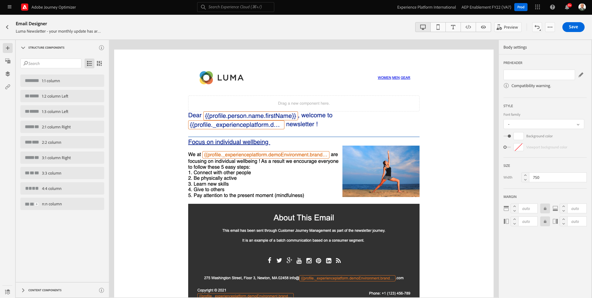

# 10.3 Aplicar personalização em uma mensagem de email

Faça logon no Adobe Experience Cloud acessando [Adobe Experience Cloud](https://experience.adobe.com). Clique em **Adobe Journey Optimizer**.

Você será redirecionado para o **Início** no Journey Optimizer. Antes de continuar, é necessário selecionar um **sandbox**. A sandbox a ser selecionada é chamada de ``--aepTenantId--``. Você pode fazer isso clicando no texto **[!UICONTROL Produto de produção]** na linha azul na parte superior da tela.

## 10.3.1 Personalização baseada em segmentos

Neste exercício, você melhorará sua mensagem de email do informativo com um texto personalizado com base na associação do segmento.

Ir para **Jornada**. Encontre a jornada do boletim informativo que você criou no exercício anterior. Procurar por `--demoProfileLdap-- - Newsletter`. Clique na jornada para abri-la.

Você verá isso. Clique em **Duplicate**.

Clique em ** Duplicar**.

Selecione seu **Email** e clique em **Editar conteúdo**.

Clique em **Email Designer**.

Você verá isso.

Abrir **Componentes de conteúdo** e arraste uma **Texto** abaixo do conteúdo do informativo atual.

Selecione o texto padrão inteiro e exclua-o. Em seguida, clique no botão **Adicionar personalização** na barra de ferramentas.

Você verá isso:

No menu esquerdo, clique em **Associações do segmento**.

>[!NOTE]
>
>Se você não conseguir encontrar seu segmento nesta lista, role para baixo um pouco para encontrar instruções sobre como recuperar a ID do segmento manualmente.

Selecionar o segmento `Luma - Women's Category Interest` e clique no botão **+** ícone , que deve ter esta aparência:

Em seguida, deixe a primeira linha como está e substitua as linhas 2 e 3 por este código:

``
Psssst... a private sale in the women category will launch soon, we will keep you posted

Thanks for taking the time to read our newsletter. Here is a 10% promo code to use on the website: READER10

``

Você terá isso:

Clique em **Validar** para verificar se o código está correto. Clique em **Salvar**.

Agora você pode salvar esta mensagem clicando no botão **Salvar** no canto superior direito. Em seguida, clique em **Simular conteúdo**.

Selecione um dos perfis que você criou como parte deste tutorial e clique em **Visualizar**. Em seguida, você verá o resultado da sua configuração.

Você verá isso. Em seguida, clique em **Fechar**.

Volte para o painel de mensagens clicando no botão **seta** ao lado do texto da linha de assunto no canto superior esquerdo.

Clique na seta no canto superior esquerdo para retornar à jornada.

Clique em **Ok** para fechar a ação de email.

Altere seu **Agendar** para **Uma vez** e defina uma **Data/Hora**. Clique em **Ok**.

>[!NOTE]
>
>A data e a hora de envio da mensagem devem estar dentro de mais de uma hora.

Clique no botão **Publicar** na jornada.

Na janela pop-up , clique em **Publicar** novamente.

Sua jornada básica do boletim informativo foi publicada. Sua mensagem de email do informativo será enviada com base em sua programação e sua jornada parará assim que o último email for enviado.

Terminou este exercício.

Próxima etapa: [10.4 Configurar e usar notificações por push para iOS](./ex4.md)

[Voltar ao Módulo 10](./journeyoptimizer.md)

[Voltar para todos os módulos](../../overview.md)
