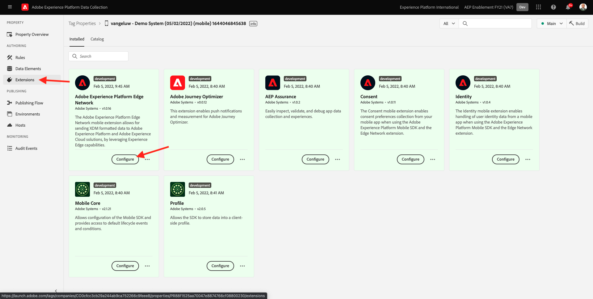
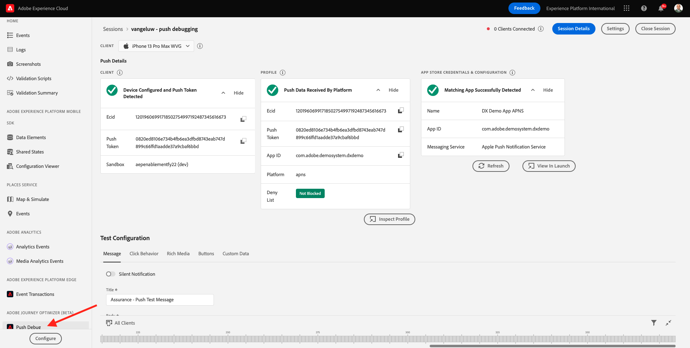
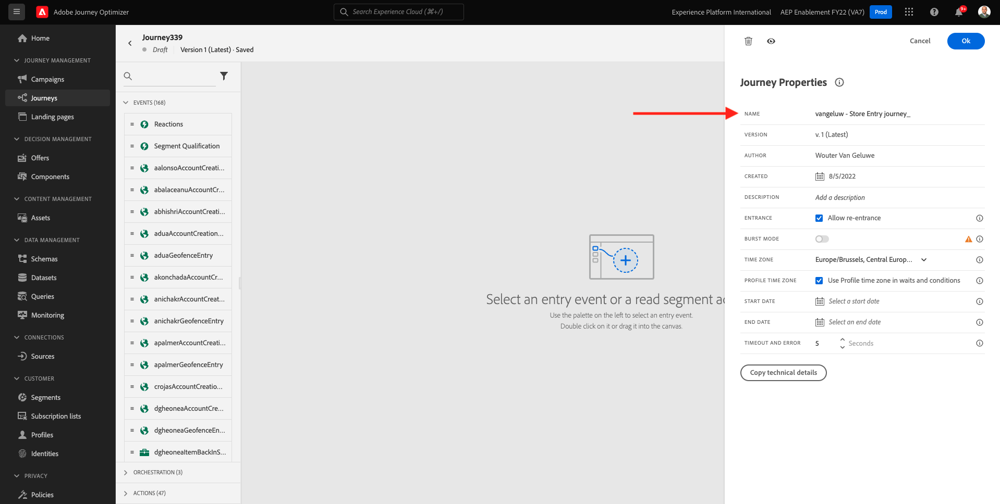

# 10.4 Configurar e usar notificações por push para iOS

Para usar notificações por push com o Adobe Journey Optimizer, há várias configurações para verificar e saber mais.

Estas são todas as configurações a serem verificadas:

- Conjuntos de dados e esquemas no Adobe Experience Platform
- Armazenamento de dados para dispositivos móveis
- Propriedade de coleta de dados para dispositivos móveis
- Superfície do aplicativo para certificados de push
- Teste sua configuração de push usando o AEP Assurance

Vamos rever estes um por um.

Faça logon no Adobe Journey Optimizer acessando [Adobe Experience Cloud](https://experience.adobe.com). Clique em **Journey Optimizer**.

Você será redirecionado para o **Início**  no Journey Optimizer. Primeiro, certifique-se de usar a sandbox correta. A sandbox a ser usada é chamada de `--aepSandboxId--`. Para alterar de uma sandbox para outra, clique em **Produto de produção (VA7)** e selecione a sandbox na lista. Neste exemplo, a sandbox é chamada de **Ativação AEP FY22**. Você estará no **Início** exibição da sandbox `--aepSandboxId--`.

## 10.4.1 Encaminhar conjuntos de dados

O Adobe Journey Optimizer usa conjuntos de dados para armazenar itens como tokens de push de dispositivos móveis ou interações com mensagens de push (como: mensagem enviada, mensagem aberta, etc) em um conjunto de dados no Adobe Journey Optimizer.

Você pode encontrar esses conjuntos de dados acessando **[!UICONTROL Conjuntos de dados]** no menu no lado esquerdo da tela. Para mostrar conjuntos de dados do sistema, clique no ícone de filtro.

Habilite a opção **Mostrar conjuntos de dados do sistema** e procurar **AJO**. Em seguida, você verá os conjuntos de dados usados para notificações por push.

## Armazenamento de dados 10.4.2 para dispositivos móveis

Ir para [https://experience.adobe.com/#/data-collection/](https://experience.adobe.com/#/data-collection/).

No menu esquerdo, acesse **[!UICONTROL Datastream]** e pesquise o conjunto de dados criado em [Exercício 0.2](./../module0/ex2.md), que é nomeado como `--demoProfileLdap-- - Demo System Datastream (Mobile)`. Clique em para abri-lo.

Clique em **Editar** no **Adobe Experience Platform** serviço.

Em seguida, você verá as configurações do conjunto de dados que foram definidas e em quais eventos de conjuntos de dados e atributos de perfil serão armazenados.

Nenhuma alteração é necessária, seu conjunto de dados agora está pronto para ser usado na propriedade do Cliente da coleta de dados para dispositivos móveis.

## 10.4.3 Revise sua propriedade de coleta de dados para dispositivos móveis

Ir para [https://experience.adobe.com/#/data-collection/](https://experience.adobe.com/#/data-collection/). Como parte de [Exercício 0.1](./../module0/ex1.md), 2 propriedades da Coleta de dados foram criadas.
Você já tem usado essas propriedades do Cliente da coleta de dados como parte de módulos anteriores.

Clique em para abrir a propriedade Coleta de dados para dispositivos móveis.

Na propriedade Coleta de dados, acesse **Extensões**. Em seguida, você verá as várias extensões necessárias para o aplicativo móvel. Clique em para abrir a extensão **Rede de borda Adobe Experience Platform**.

Você verá que seu conjunto de dados para dispositivos móveis está vinculado aqui. Em seguida, clique em **Cancelar** para retornar à visão geral das extensões.

Você vai voltar aqui. Você verá a extensão para **Garantia da AEP**. O AEP Assurance ajuda você a inspecionar, testar, simular e validar o modo como você coleta dados ou veicula experiências em seu aplicativo móvel. Leia mais sobre o AEP Assurance e o Project Griffon aqui [https://aep-sdks.gitbook.io/docs/beta/project-griffon](https://aep-sdks.gitbook.io/docs/beta/project-griffon).

Em seguida, clique em **Configurar** para abrir a extensão **Adobe Journey Optimizer**.

Você verá que é aqui que o conjunto de dados para rastrear eventos de push está vinculado.

Não é necessário fazer alterações na propriedade Coleta de dados.

## 10.4.4 Revise a configuração da superfície do aplicativo

Ir para [https://experience.adobe.com/#/data-collection/](https://experience.adobe.com/#/data-collection/). No menu esquerdo, acesse **Superfícies do aplicativo** e abrir, a superfície do aplicativo para **DX Demo App APNS**.

Em seguida, você verá a superfície do aplicativo configurada para iOS e Android.

## 10.4.5 Teste a configuração de notificação por push usando o AEP Assurance.

Depois que o aplicativo for instalado, você o encontrará na tela inicial do seu dispositivo. Clique no ícone para abrir o aplicativo.

Ao usar o aplicativo pela primeira vez, você será solicitado a fazer logon usando sua Adobe ID. Conclua o processo de logon.

Depois de fazer logon, você verá uma notificação solicitando sua permissão para enviar notificações. Enviaremos notificações como parte do tutorial, portanto, clique em **Permitir**.

Você verá a página inicial do aplicativo. Ir para **Configurações**.

Nas configurações, você verá que atualmente uma **Projeto público** é carregada no aplicativo. Clique em **Projeto personalizado**.

Agora é possível carregar um projeto personalizado. Clique no código QR para carregar facilmente seu projeto.

Após o exercício 0.1, teve este resultado. Clique para abrir o **Projeto de varejo móvel** que foi criado para você.

Caso tenha fechado acidentalmente a janela do navegador, ou para futuras sessões de demonstração ou ativação, também é possível acessar o projeto do site indo até [https://builder.adobedemo.com/projects](https://builder.adobedemo.com/projects). Depois de fazer logon com sua Adobe ID, você verá isso. Clique no projeto do aplicativo móvel para abri-lo.

Você verá isso. Clique em **Integrações**.

É necessário selecionar a propriedade Coleta de dados para dispositivos móveis que foi criada no exercício 0.1. Em seguida, clique em **Executar**.

Você verá esse pop-up, que contém um código QR. Verifique este código QR no aplicativo móvel.

Em seguida, você verá a ID do projeto exibida no aplicativo, depois de clicar em **Salvar**.

Agora, volte para **Início** no aplicativo. Seu aplicativo está pronto para ser usado.

Agora é necessário digitalizar um código QR para conectar seu dispositivo móvel à sessão do AEP Assurance.

Para iniciar uma sessão do AEP Assurance, acesse [https://experience.adobe.com/#/@experienceplatform/griffon](https://experience.adobe.com/#/@experienceplatform/griffon). Clique em **Criar sessão**.

Clique em **Start**.

Preencha os valores:

- Nome da sessão: use `--demoProfileLdap-- - push debugging` e substitua ldap pelo seu ldap
- URL base: use **dxdemo://default**

Clique em **Próximo**.

Em seguida, você verá um código QR em sua tela, que deve ser verificado com o dispositivo iOS.

No seu dispositivo móvel, abra o aplicativo de câmera e digitalize o código QR exibido pelo AEP Assurance.

Em seguida, você verá uma tela pop-up, solicitando que você digite o código PIN. Copie o código PIN da tela AEP Assurance e clique em **Connect**.

Você verá isso.

No AEP Assurance, você verá que um dispositivo está na sessão do AEP Assurance.

Ir para **Depuração por push**. Você verá algo assim.

Algumas explicações:

- A primeira coluna, **Cliente**, mostra os identificadores disponíveis no dispositivo iOS. Você verá um ECID e um token de push.
- A segunda coluna mostra **Perfil** , com informações adicionais sobre em qual plataforma o token de push está (APNS ou APNSSandbox). Se você clicar no botão **Perfil do Inspect** , você será levado ao Adobe Experience Platform e verá o Perfil completo do cliente em tempo real.
- A terceira coluna mostra o **Configuração do aplicativo**, que foi criada no âmbito do exercício **10.5.4 Criar configuração de aplicativo no Launch**

Para testar a configuração de Push, clique no botão **Enviar notificação por push** botão.

Você precisa ter certeza de que a variável **Demonstração do DX** o aplicativo não está aberto no momento do clique no **Enviar notificação por push** botão. Se o aplicativo estiver aberto, a Notificação por push pode ser recebida em segundo plano e não ficar visível.

Em seguida, você verá uma notificação por push como essa no seu dispositivo móvel.

Se você recebeu a notificação por push, significa que a configuração está correta e está funcionando bem.

## 10.4.6 Criar um novo evento

No menu , acesse **Administração de jornada** e clique em **Gerenciar** under **Eventos**.

No **Eventos** , você verá uma exibição semelhante a esta. Clique em **Criar evento**.

Em seguida, você verá uma configuração de evento vazia.

Primeiro de tudo, dê a seu Evento um Nome como este: `--demoProfileLdap--StoreEntryEvent` e defina a descrição como `Store Entry Event`.

O próximo é o **Tipo de evento** seleção. Selecionar **Unitário**.

O próximo é o **Tipo de ID do evento** seleção. Selecionar **Sistema gerado**

Em seguida está a seleção Esquema. Um esquema foi preparado para este exercício. Use o esquema `Demo System - Event Schema for Mobile App (Global v1.1) v.1`.

Após selecionar o Esquema, você verá vários campos sendo selecionados na variável **Carga** seção. Seu evento está totalmente configurado.

Você deveria ver isso. Clique em **Salvar**.

Seu Evento agora está configurado e salvo. Clique no seu evento novamente para abrir o **Editar evento** novamente.

Passe o mouse sobre **Carga** e clique no botão **Exibir carga** ícone .

Você verá um exemplo da carga esperada.

Seu evento tem uma orquestration eventID exclusiva, que pode ser encontrada ao rolar para baixo na carga útil até que você veja `_experience.campaign.orchestration.eventID`.

A ID de evento é o que precisa ser enviado para o Adobe Experience Platform para acionar a Jornada que você criará na próxima etapa. Anote essa eventID, pois você precisará dela na próxima etapa.
`"eventID": "e3a8f0bdc0b609667cd96a72a6b1e5aafa0ddaf6ccf121c574e6a2030860a633"`

Clique em **Ok**, seguida de **Cancelar**.

## 10.4.7 Criar uma jornada

No menu , acesse **Jornada** e clique em **Criar Jornada**.

Você verá isso. Dê um nome à sua jornada. Use `--demoProfileLdap-- - Store Entry journey`. Clique em **OK**.

Primeiro, é necessário adicionar o evento como ponto de partida da jornada. Procure seu evento `--demoProfileLdap--StoreEntryEvent` e arraste e solte na tela. Clique em **OK**.

Em seguida, em **Ações**, pesquise a **Empurrar** ação.
Arraste e solte a **Empurrar** ação na tela.

Defina as **Categoria** para **Marketing** e selecione uma superfície de push que permite enviar notificações por push. Nesse caso, a superfície do email a ser selecionada é **Push-iOS-Android**.

A próxima etapa é criar a mensagem. Para fazer isso, clique em **Editar conteúdo**.

Você verá isso. Clique no botão **personalização** ícone para o **Título** campo.

Você verá isso. Agora é possível selecionar qualquer atributo de perfil diretamente do Perfil do cliente em tempo real.

Pesquisar pelo campo **Nome**, em seguida, clique no botão **+** ícone ao lado do campo **Nome**. Em seguida, você verá o token de personalização do Nome sendo adicionado: **{{profile.person.name.firstName}}**.

Em seguida, adicione o texto **, bem-vindo à nossa loja!** behind **{{profile.person.name.firstName}}**.

Clique em **Salvar**.

Agora você tem isso. Clique no botão **personalização** ícone para o **Corpo** campo.

Inserir este texto **Clique aqui para obter um desconto de 10% quando você comprar hoje!** e clique em **Salvar**.

Você terá isso. Clique na seta no canto superior esquerdo para retornar à jornada.

Clique em **OK** para fechar sua ação de push.

Clique em **Publicar**.

Clique em **Publicar** novamente.

Sua jornada foi publicada.

## 10.4.8 Teste sua jornada e mensagem por push

No aplicativo DX Demo 2.0 para dispositivos móveis, acesse **Configurações** tela. Clique no botão **Entrada da loja** botão.

>[!NOTE]
>
>O **Entrada da loja** está sendo implementado no momento. Você ainda não o encontrará no aplicativo.

Feche o aplicativo imediatamente após clicar no link **Entrada da loja** caso contrário, a mensagem de push não será exibida.

Após alguns segundos, você verá a mensagem aparecer.

Terminou este exercício.

Próxima etapa: [10.5 Criar uma jornada de evento comercial](./ex5.md)

[Voltar ao Módulo 10](./journeyoptimizer.md)

[Voltar para todos os módulos](../../overview.md)
