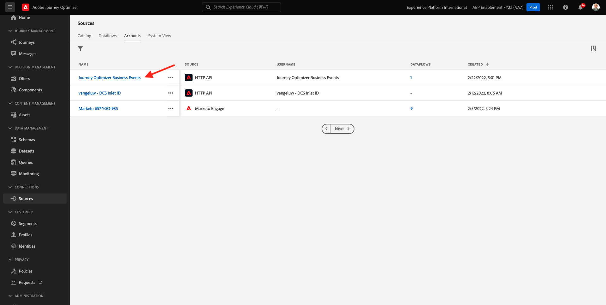

# 10.5 Criar uma jornada de evento comercial

Faça logon no Adobe Journey Optimizer acessando [Adobe Experience Cloud](https://experience.adobe.com). Clique em **Journey Optimizer**.


Você será redirecionado para o **Início**  no Journey Optimizer. Primeiro, certifique-se de usar a sandbox correta. A sandbox a ser usada é chamada de `--aepSandboxId--`. Para alterar de uma sandbox para outra, clique em **Produto de produção (VA7)** e selecione a sandbox na lista. Neste exemplo, a sandbox é chamada de **Ativação AEP FY22**. Você estará no **Início** exibição da sandbox `--aepSandboxId--`.


## 10.5.1 Criar um evento comercial

No menu esquerdo, clique em **Configurações**. Clique no botão **Gerenciar** botão dentro do **Eventos** cartão.


Os eventos comerciais são um novo tipo de evento que pode ser criado dentro do Journey Optimizer. Ao contrário do **Unitário** eventos que você criou em módulos anteriores, os eventos comerciais não são acionados pelo cliente, mas pela organização. Agora você criará seu evento comercial.

Clique em **Criar evento**.


Insira os seguintes valores no formulário de criação Evento:

- **Nome**: `--demoProfileLdap--ItemBackInStock`. Por exemplo: **vangeluwItemBackInStock**
- **Descrição**: Esse evento é acionado quando um produto volta ao estoque
- **Tipo**: select **Negócios** no menu suspenso


Para o Esquema, selecione **Demo System - Event Schema for JO Business Events (Global v1.1) v.1**. Agora é necessário selecionar os campos no schema necessário para o nosso caso de uso.


Siga estas etapas:

Clique no botão **lápis** ícone no campo onde diz **1 campo selecionado**.


Selecione todos os campos disponíveis no esquema e clique em **OK**.


Para a condição: você precisa especificar quais registros nesse schema acionarão o evento de negócios.

Siga estas etapas:

Clique no botão **lápis** ícone no campo onde diz **Adicionar uma condição**.


No lado esquerdo, expanda a `--aepTenantId--` objeto , expanda o objeto **joBusinessEvents** e arrastar e soltar o campo **eventName** na tela.


Para o campo **eventName**, insira o seguinte valor: `--demoProfileLdap--ItemBackInStock`. Por exemplo: vangeluwItemBackInStock.
Clique em **OK**.


Clique em **OK**.


Por fim, o formulário de criação de eventos deve ficar parecido com este. Clique em **Salvar** para salvar seu evento comercial.


## 10.5.2 Criar uma jornada de evento comercial

Agora você pode aproveitar esse evento de negócios e a mensagem dentro de uma jornada. Ir para **Jornada**. Clique em **Criar Jornada**.


No lado direito, você verá um formulário no qual será necessário especificar o nome e a descrição da jornada. Insira os seguintes valores:

- **Nome**: `--demoProfileLdap-- - Item back in stock journey`. Por exemplo: vangeluw - Item de volta na jornada de estoque
- **Descrição**: Essa jornada envia um SMS quando um item retorna ao estoque para um visitante que demonstrou interesse.

Clique em **OK**.


No menu esquerdo, em **Eventos**, procure pelo seu ldap. Você encontrará o evento de negócios criado anteriormente `--demoProfileLdap--ItemBackInStock`. Arraste e solte esse evento na tela, pois este será o ponto inicial da jornada.


Como você pode ver, uma **Ler segmento** atividade foi adicionada automaticamente à tela de desenho. Isso ocorre porque os eventos comerciais enviam apenas um acionador para a jornada ler um segmento específico, que recuperará a lista de perfis para essa jornada.

Clique no botão **Ler segmento** atividade .
O **Ler segmento** a configuração do espera que você selecione o segmento que deseja notificar do evento comercial que acabou de acontecer. Clique no botão **Selecionar um segmento** campo.


No **Escolher um segmento** pop-up, pesquise pelo ldap e selecione o segmento criado em [Módulo 6 - CDP em tempo real - Crie um segmento e execute ações](../module6/real-time-cdp-build-a-segment-take-action.md) nomeado `--demoProfileLdap-- - Interest in PROTEUS FITNESS JACKSHIRT`. por exemplo: vangeluw - Interesse em TEUS FITNESS JACKSHIRT. Clique em **Salvar**.


Em seguida, clique em **Ok**.


A próxima etapa é arrastar e soltar a ação que queremos executar nesta jornada. Selecione a ação **SMS**, em seguida, arraste-a e solte-a depois da condição que você acabou de adicionar.


Defina as **Categoria** para **Marketing** e selecione uma superfície de sms que permita enviar sms. Nesse caso, a superfície do email a ser selecionada é **SMS**.


A próxima etapa é criar a mensagem. Para fazer isso, clique em **Editar conteúdo**.


Agora você verá o painel de mensagens, onde poderá configurar o texto do seu SMS. Clique no botão **Compor mensagem** área para criar a mensagem.


Insira o seguinte texto: `Hi {{profile.person.name.firstName}}, the Proteus Fitness Jackshirt is back in stock at Luma.`. Clique em **Salvar**.


Volte para o painel de mensagens clicando no botão **seta** ao lado do texto da linha de assunto no canto superior esquerdo.


Agora você verá a ação de SMS concluída. Clique em **Ok**.


Sua jornada agora está pronta para ser publicada. Clique em **Publicar**.


Clique em **Publicar** novamente.


Sua jornada foi publicada, agora você pode testá-la!


## 10.5.3 Testar a jornada de eventos da sua empresa

Agora você simulará o reestoque de um produto assimilando um novo evento em relação à variável **Demo System - Event Schema for JO Business Events (Global v1.1) v.1** usando o Postman.

No menu esquerdo, clique em **Fontes** e clique no botão **Contas** guia .


No **Contas** , você encontrará a conta nomeada **Eventos comerciais do Journey Optimizer**. Clique para abri-lo.



Essa conta tem apenas um fluxo de dados, clique no nome do fluxo de dados para selecioná-la.


Clique em **Copiar carga do esquema** no menu à direita. Essa opção copia o todo **curl** para inserir um registro no **Demo System - Event Schema for JO Business Events (Global v1.1) v.1** para a área de transferência.


Cole o comando Curl dentro de um editor de texto


Vamos dar uma olhada mais de perto nesta solicitação.

- A solicitação de POST é enviada para a ID de entrada do DCS
- A solicitação faz referência ao esquema, ao conjunto de dados e à ID da organização.
- Finalmente, ele contém o nó xdmEntity que representa os dados que queremos criar dentro do conjunto de dados.

Agora é necessário substituir o seguinte `xdmEntity` linha...

```json
"xdmEntity": {
  "_experienceplatform": {
    "joBusinessEvents": {
      "eventDescription": "string",
      "eventName": "string",
      "stockEventId": "string"
    }
  },
  "_id": "/uri-reference",
  "eventType": "advertising.completes",
  "timestamp": "2018-11-12T20:20:39+00:00"
}
```

...por esta linha, verifique o campo eventName como deve dizer `--demoProfileLdap--ItemBackInStock`, que representa a condição especificada no evento comercial para acionar a jornada.

```json
"xdmEntity": {
  "_experienceplatform": {
    "joBusinessEvents": {
      "eventDescription": "Product Proteus Fitness Jackshirt is back in stock",
      "eventName": "--demoProfileLdap--ItemBackInStock",
      "stockEventId": "1"
    }
  },
  "_id": "/uri-reference",
  "eventType": "productBackInStock",
  "timestamp": "2021-04-19T15:25:39+00:00"
}
```

O arquivo **curl** O comando deve ter esta aparência:


Selecione tudo e copie-o para a área de transferência.

Abra o Postman. No lado esquerdo do Postman, clique em **Importar**.


Selecione o **Texto bruto** e cole o comando copiado anteriormente aqui. Clique em **Continuar**.


Clique em **Importar**.


A Postman converteu automaticamente a variável **curl** em um comando REST pronto para ser acionado, basta pressionar o **Enviar** para solicitar a criação desse registro dentro do conjunto de dados.


Verifique se sua solicitação foi recebida com êxito. Procure um **200 OK** status no postman.


O SMS pode levar alguns minutos para chegar em seu celular. Caso contrário, a **Interesse em Jackshirt da Fitness de Proteus** pode não conter um perfil com um celular correto. Em caso afirmativo, acesse o site Luma , visite o **Jaqueta da Fitness Proteus** registre-se e forneça o número de telefone celular correto.


Terminou agora este exercício.

Próxima etapa: [Resumo e benefícios](./summary.md)

[Voltar ao Módulo 10](./journeyoptimizer.md)

[Voltar para todos os módulos](../../overview.md)
