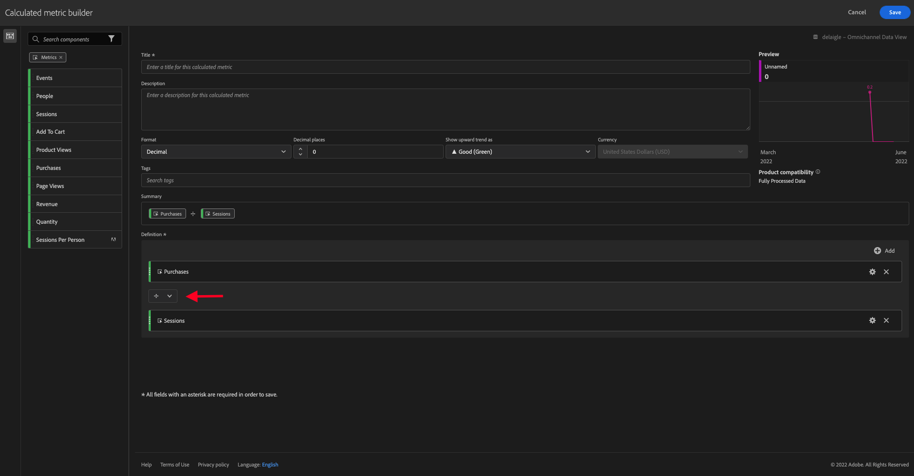

# 11.4 Preparação de dados no Analysis Workspace

## Objetivos

- Entender a interface do usuário do Analysis Workspace no CJA
- Entender os conceitos de preparação de dados no Analysis Workspace
- Saiba como fazer cálculos de dados

## Interface do usuário do Analysis Workspace 11.4.1 no CJA

O Analysis Workspace remove todas as limitações típicas de um único relatório do Analytics. Ela oferece uma tela robusta e flexível para criar projetos de análise personalizados. Arraste e solte qualquer número de tabelas de dados, visualizações e componentes (dimensões, métricas, segmentos e granularidades de tempo) em um projeto. Crie detalhamentos e segmentos instantaneamente, crie coortes para análise, crie alertas, compare segmentos, faça análises de fluxo e fallout e prepare e programe relatórios para compartilhamento com qualquer pessoa em sua empresa.

O Customer Journey Analytics traz essa solução para cima dos dados da plataforma. É altamente recomendável assistir a este vídeo de visão geral de quatro minutos:

>[!VIDEO](https://video.tv.adobe.com/v/35109?quality=12&learn=on)

Se você não tiver usado o Analysis Workspace antes, é altamente recomendável assistir a este vídeo:

>[!VIDEO](https://video.tv.adobe.com/v/26266?quality=12&learn=on)

### Criar o projeto

Agora é hora de criar seu primeiro projeto do CJA. Acesse a guia projects dentro do CJA.
clique em **Criar novo**.

Você verá isso. Selecionar **Projeto em branco** e, em seguida, clique em **Criar**.

Você verá um projeto vazio.

Primeiro, selecione a Exibição de dados correta no canto superior direito da tela. Neste exemplo, a Exibição de dados a ser selecionada é `vangeluwe - Omnichannel Data View`.

Em seguida, você salvará seu projeto e lhe dará um nome. Você pode usar o seguinte comando para salvar:

| OS | Curto |
| ----------------- |-------------| 
| Windows | Controle + S |
| Mac | Command+S |

Você verá este pop-up:

Use esta convenção de nomenclatura:

| Nome | Descrição |
| ----------------- |-------------| 
| `--demoProfileLdap-- - Omnichannel Analysis` | `--demoProfileLdap-- - Omnichannel Analysis` |

Em seguida, clique em **Salvar**.

## 11.4.2 Métricas calculadas

Embora tenhamos organizado todos os componentes na Exibição de dados, você ainda precisa adaptar alguns deles, para que os usuários empresariais estejam prontos para iniciar a análise. Além disso, durante qualquer análise, você pode criar uma métrica calculada para ir mais fundo na descoberta dos insights.

Como exemplo, criaremos um **Índice de conversão** usando o **Compras** métrica/evento definido na Exibição de dados.

### Taxa de conversão

Vamos começar a abrir o construtor de métricas calculadas. Clique no botão **+** para criar sua primeira métrica calculada no Analysis Workspace.

O **Criador de métricas calculadas** será exibido:

Encontre a **Compras** na lista de Métricas no menu do lado esquerdo. Em **Métricas** click **Mostrar tudo**

Agora arraste uma solta **Compras** em para a definição de métrica calculada.

Normalmente, a taxa de conversão significa **Conversões / Sessões**. Então vamos fazer o mesmo cálculo na tela de definição de Métrica calculada. Encontre a **Sessões** e arraste e solte-a no construtor de definições, no **Compras** evento.

Observe que o operador de divisão é selecionado automaticamente.

A taxa de conversão é normalmente representada em porcentagem. Portanto, vamos alterar o formato para porcentagem e selecionar também 2 decimais.

Finalmente, altere o nome e a descrição da métrica calculada:

| Title | Descrição |
| ----------------- |-------------| 
| Taxa de conversão | Taxa de conversão |

Você terá algo como isto na sua tela:

Não se esqueça de **Salvar** a Métrica calculada.

## 11.4.3 Dimension calculadas: Filtros (segmentação) e intervalos de datas

### Filtros: Dimension calculadas

Os cálculos não devem ser feitos apenas para Métricas. Antes de iniciar qualquer análise, também é interessante criar alguns **Dimension calculadas**. Isso basicamente significava **segmentos** de volta ao Adobe Analytics. No Customer Journey Analytics, esses segmentos são chamados de **Filtros**.

A criação de filtros ajudará os usuários corporativos a iniciar a análise com algumas dimensões calculadas valiosas. Isso automatizará algumas tarefas, além de ajudar na parte de adoção. Veja alguns exemplos:

1. Mídia Própria, Mídia Paga,
2. Novas versus visitas recorrentes
3. Clientes com carrinho abandonado

Esses filtros podem ser criados antes ou durante a parte de análise (o que você fará no próximo exercício).

### Intervalos de datas: Dimension de hora calculadas

Dimension de tempo são outro tipo de dimensões calculadas. Alguns já foram criados, mas você também pode criar seus próprios Dimension de tempo personalizados na fase de preparação de dados.

Com essas Dimension de tempo calculadas, ajudaremos os analistas e usuários de negócios a lembrar datas importantes e usá-las para filtrar e alterar o tempo dos relatórios. Questões típicas e dúvidas que nos vêm à mente quando fazemos análises:

- Quando foi a Black Friday no ano passado? 21º-29º?
- Quando é que realizámos essa campanha de televisão em dezembro?
- De quando a quando fizemos as vendas do verão de 2018? Quero compará-lo com 2019. A propósito, você sabe exatamente os dias de 2019?

Agora você terminou o exercício de preparação de dados usando o CJA Analysis Workspace.

Próxima etapa: [11.5 Visualização usando Customer Journey Analytics](./ex5.md)

[Volte para o Módulo 11](./customer-journey-analytics-build-a-dashboard.md)

[Voltar para todos os módulos](./../../overview.md)
