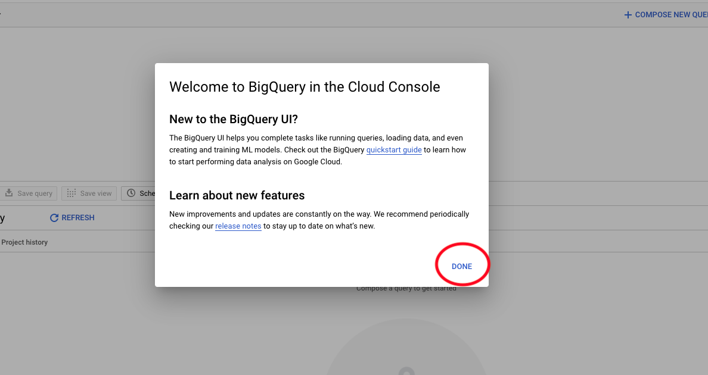

# 12.1 Criar a conta da Google Cloud Platform

## Objetivos

- Criar a conta da Google Cloud Platform
- Familiarize-se com o Google Cloud Platform Console
- Crie e prepare seu projeto BigQuery

## 12.1.1 Por que conectar o Google BigQuery ao Adobe Experience Platform para obter dados de Google Analytics

A Google Cloud Platform (GCP) é um conjunto de serviços públicos de computação em nuvem oferecidos pela Google. A Google Cloud Platform inclui uma variedade de serviços hospedados para desenvolvimento de computação, armazenamento e aplicativos que são executados em hardware Google.

O BigQuery é um desses serviços e está sempre incluído no Google Analytics 360. Os dados do Google Analytics são frequentemente coletados quando tentamos obter dados diretamente dele (API por exemplo). É por isso que o Google inclui o BigQuery para obter dados sem amostragem, de modo que as marcas podem fazer análise avançada usando o SQL e se beneficiar do poder do GCP.

Os dados do Google Analytics são carregados diariamente no BigQuery usando um mecanismo em lote. Dessa forma, não faz sentido usar essa integração GCP/BigQuery para casos de uso de personalização e ativação em tempo real.

Se uma marca quiser fornecer casos de uso de personalização em tempo real com base nos dados do Google Analytics, ela poderá coletar esses dados no site com o Gerenciador de tags da Google e, em seguida, transmiti-los para a Adobe Experience Platform em tempo real.

O Conector de Origem GCP/BigQuery deve ser usado para...

- rastreie todo o comportamento do cliente no site e carregue esses dados no Adobe Experience Platform para casos de uso de análise, ciência de dados e personalização que não exigem ativação em tempo real.
- carregar dados históricos do Google Analytics no Adobe Experience Platform, novamente para casos de uso de análise e ciência de dados

## 12.1.2 Criar a conta do Google

Para obter uma conta da Google Cloud Platform, você precisa de uma conta da Google.

## 12.1.3 Ativar sua conta da Google Cloud Platform

Agora que você tem sua conta Google, é possível criar um ambiente da Google Cloud Platform. Para fazer isso, acesse [https://console.cloud.google.com/](https://console.cloud.google.com/).

Na próxima página, aceite os Termos e condições.

Em seguida, clique em **Selecionar um projeto**.

Clique em **NOVO PROJETO**.

Nomeie seu projeto seguindo essa convenção de nomenclatura:

| Convenção | Exemplo |
| ----------------- |-------------| 
| `--demoProfileLdap---googlecloud` | delaigle-googlecloud |

Clique em **Criar**.

Aguarde até que a notificação no lado superior direito da tela informe que a criação foi concluída. Em seguida, clique em **Exibir projeto**.

Em seguida, acesse a barra de pesquisa na parte superior da tela e digite **BigQuery**. Selecione o primeiro resultado.

Em seguida, você será redirecionado para o BigQuery Console e verá uma mensagem pop-up.

**Clique em Concluído**.

O objetivo desse módulo é obter dados do Google Analytics no Adobe Experience Platform. Para fazer isso, precisamos começar com dados fictícios em um conjunto de dados do Google Analytics.

Clique em **Adicionar dados** no menu à esquerda, seguido de um clique **Explorar conjuntos de dados públicos**.

Você verá esta janela:

Insira o termo de pesquisa **Amostra do Google Analytics** na barra de pesquisa e selecione o primeiro resultado.

Você verá a tela a seguir com uma descrição do conjunto de dados. Clique em **EXIBIR CONJUNTO DE DADOS**.

Você será redirecionado para o BigQuery, onde verá isso **bigquery-public-data** conjunto de dados em **Explorer**.

Em **Explorer**, agora você deve ver várias tabelas. Sinta-se à vontade para explorá-los. Vá para `google_analytics_sample`.

Clique em para abrir a tabela `ga_sessions`.

Antes de continuar com o próximo exercício, anote os seguintes itens em um arquivo de texto separado no seu computador:

| Credencial | Nomenclatura | Exemplo |
| ----------------- |-------------| -------------|
| Projeto Nome | `--demoProfileLdap---googlecloud` | vangeluw-googlecloud |
| ID do projeto | random | parent-task-306413 |

Você pode encontrar o Nome do projeto e a ID do projeto clicando em **Nome do projeto** na barra do menu superior:

Em seguida, você verá sua ID do projeto no lado direito:

Agora você pode migrar para o Exercício 12.2, onde você sujará suas mãos consultando os dados do Google Analytics.

Próxima etapa: [12.2 Criar sua primeira query no BigQuery](./ex2.md)

[Voltar ao Módulo 12](./customer-journey-analytics-bigquery-gcp.md)

[Voltar para todos os módulos](./../../overview.md)
