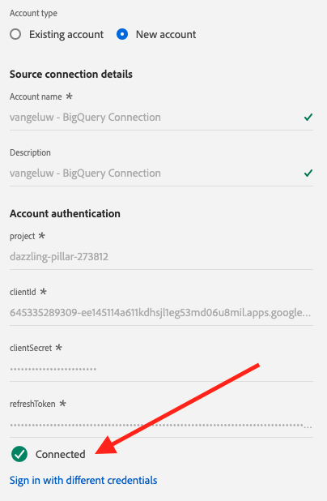

# 12.3 Conectar GCP e BigQuery ao Adobe Experience Platform

## Objetivos

- Explore a API e os serviços na Google Cloud Platform
- Familiarize-se com o OAuth Playground para testar as APIs do Google
- Criar sua primeira conexão BigQuery no Adobe Experience Platform

## Contexto

O Adobe Experience Platform fornece um conector dentro de **Fontes** isso ajudará você a trazer conjuntos de dados do BigQuery para o Adobe Experience Platform. Esse conector de dados é baseado na API BigQuery do Google. Portanto, é importante preparar adequadamente a Google Cloud Platform e o ambiente BigQuery para receber chamadas de API do Adobe Experience Platform.

Para configurar o BigQuery Source Connector no Adobe Experience Platform, você precisará desses quatro valores:

- projeto
- clientId
- clientSecret
- refreshToken

Até agora só tem o primeiro. **ID do projeto**. Essa **ID do projeto** é uma ID aleatória que foi gerada pelo Google quando você criou seu projeto BigQuery durante o exercício 12.1.

Copie a ID do projeto em um arquivo de texto separado.

| Credencial | Nomenclatura | Exemplo |
| ----------------- |-------------| -------------|
| ID do projeto | random | parent-task-306413 |

Você pode verificar a ID do projeto a qualquer momento clicando em **Nome do projeto** na barra do menu superior:

Você verá a ID do projeto no lado direito:

Neste exercício, você aprenderá a obter os outros 3 campos obrigatórios:

- clientId
- clientSecret
- refreshToken

## API e serviços da Google Cloud 12.3.1

Para iniciar, volte para a página inicial da Google Cloud Platform. Para fazer isso, basta clicar no logotipo no canto superior esquerdo da tela.

Quando estiver na página inicial, vá para o menu esquerdo e clique em **APIs e serviços**, em seguida, clique em **Painel**.

Agora você verá o **APIs e serviços** homepage.

Nesta página, você pode ver o uso de várias conexões de API do Google. Para configurar uma Conexão de API para que o Adobe Experience Platform possa ler do BigQuery, siga estas etapas:

- Primeiro, você precisa criar uma tela de consentimento do OAuth para ativar autenticações futuras. Os motivos de segurança da Google também exigem que um ser humano faça a primeira autenticação, antes que um acesso programático seja permitido.
- Em segundo lugar, você precisa de credenciais de API (clientId e clientSecret) que serão usadas para autenticação de API e acesso ao seu BigQuery Connector.

## 12.3.2 Tela de consentimento do OAuth

Vamos começar com a criação da Tela de consentimento do OAuth. No menu à esquerda da **APIs e serviços** página inicial, clique em **Tela de consentimento OAuth**.

Você verá isso:

Selecione o Tipo de Usuário: **Externo**. Em seguida, clique em **CRIAR**.

Você estará no **Configuração da tela de consentimento do OAuth** janela.

A única coisa a fazer aqui é inserir o nome da tela de consentimento na **Nome do aplicativo** e selecione o **Email de suporte ao usuário**. Para o nome do Aplicativo, use esta convenção de nomenclatura:

| Nomenclatura | Exemplo |
| ----------------- |-------------| 
| `--demoProfileLdap-- - AEP BigQuery Connector` | vangeluw - Conector AEP BigQuery |

Em seguida, role para baixo até visualizar **Informações de contato do desenvolvedor** e preencha um endereço de email.

Clique em **SALVAR E CONTINUAR**.

Você verá isso. Clique em **SALVAR E CONTINUAR**.

Você verá isso. Clique em **SALVAR E CONTINUAR**.

Você verá isso. Clique em **VOLTAR AO PAINEL**.

Você verá isso. Clique em **PUBLICAR APLICATIVO**.

Clique em **CONFIRMAR**.

Você verá isso.

Na próxima etapa, você concluirá a configuração da API e obterá as credenciais da API.

## 12.3.3 Credenciais da API do Google: Segredo do cliente e ID do cliente

No menu esquerdo, clique em **Credenciais**. Você verá isso:

Clique no botão **+ CRIAR CREDENCIAIS** botão.

Você verá 3 opções. Clique no botão **ID de cliente OAuth**:

Na próxima tela, selecione **aplicação web**.

Vários novos campos aparecerão. Agora é necessário inserir o **Nome** da ID do cliente OAuth e também insira o **URIs de redirecionamento autorizados**.

Siga esta convenção de nomenclatura:

| Campo | Valor | Exemplo |
| ----------------- |-------------| -------------| 
| Nome | ldap - AEP BigQuery Connector | vangeluw - Conector Platform BigQuery |
| URIs de redirecionamento autorizados | https://developers.google.com/oauthplayground | https://developers.google.com/oauthplayground |

O **URIs de redirecionamento autorizados** O campo é um campo muito importante porque você precisará dele posteriormente para obter o RefreshToken, é necessário concluir a configuração do BigQuery Source Connector no Adobe Experience Platform.

Antes de continuar, você precisa empurrar fisicamente o **Enter** depois de inserir o URL para armazenar o valor no **URIs de redirecionamento autorizados** campo. Se você não clicar no botão **Enter** , você encontrará problemas posteriormente, na **Campanha do OAuth 2.0**.

Em seguida, clique em **Criar**:

Agora você verá sua ID do cliente e seu Segredo do cliente.

Copie estes dois campos e cole-os em um arquivo de texto na área de trabalho. Você sempre pode acessar essas credenciais posteriormente, mas é mais fácil salvá-las em um arquivo de texto ao lado da ID do projeto BigQuery.

Como recapitulação da configuração do BigQuery Source Connector no Adobe Experience Platform, agora você já tem esses valores disponíveis:

| Credenciais do Conector BigQuery | Valor |
| ----------------- |-------------| 
| ID do projeto | sua própria ID do projeto (por exemplo,: parent-task-306413) |
| clientid | yourclientid |
| cilentsecret | yourclientsecret |

Você ainda está perdendo o **refreshToken**. O refreshToken é um requisito por motivos de segurança. No mundo das APIs, os tokens normalmente expiram a cada 24 horas. Assim, o **refreshToken** O é necessário para atualizar o token de segurança a cada 24 horas, para que a configuração do Conector de origem possa continuar a se conectar à Google Cloud Platform e ao BigQuery.

## 12.3.4 API BigQuery e refreshToken

Há muitas maneiras de obter um refreshToken para acessar as APIs da Google Cloud Platform. Uma dessas opções é, por exemplo, usar o Postman.
No entanto, a Google criou algo mais fácil de testar e reproduzir com suas APIs, uma ferramenta chamada **Campanha do OAuth 2.0**.

Para acessar **Campanha do OAuth 2.0**, vá para [https://developers.google.com/oauthplayground](https://developers.google.com/oauthplayground).

Você verá o **Campanha do OAuth 2.0** homepage.

Clique no botão **engrenagem** ícone na parte superior direita da tela:

Certifique-se de que suas configurações sejam as mesmas que você pode ver na imagem acima.

Verifique novamente as configurações para ter 100% de certeza.

Quando terminar, marque a caixa de **Use suas próprias credenciais do OAuth**

Dois campos devem aparecer e você tem o valor para eles.

Preencha os campos após esta tabela:

| Configurações da API de reprodução | Suas credenciais da API do Google |
| ----------------- |-------------| 
| ID do cliente OAuth | sua própria ID do cliente (no arquivo de texto da área de trabalho) |
| Segredo do Cliente OAuth | seu próprio Segredo do cliente (no arquivo de texto da área de trabalho) |

Copie o **ID do cliente** e **Segredo do cliente** no arquivo de texto criado na área de trabalho.

Depois de preencher suas credenciais, clique em **Fechar**

No menu esquerdo, é possível visualizar todas as APIs do Google disponíveis. Procurar por **API BigQuery v2**.

Em seguida, selecione o escopo conforme indicado na imagem abaixo:

Depois de selecioná-los, você deve ver um botão azul que diz **Autorizar APIs**. Clique nela.

Selecione a conta do Google usada para configurar o GCP e o BigQuery.

Você pode ver um grande aviso: **Este aplicativo não foi verificado**. Isso ocorre porque o Platform BigQuery Connector ainda não foi revisado formalmente, portanto a Google não sabe se é um aplicativo autêntico ou não. Você deve ignorar esta notificação.

Clique em **Avançado**.

Em seguida, clique em **Vá para ldap - AEP BigQuery Connector (não seguro)**.

Você será redirecionado para nossa Tela de consentimento do OAuth criada.

Se usar a Autenticação de dois fatores (2FA), digite o código de verificação enviado para você.

O Google agora mostra oito diferentes **Permissão** prompts. Clique em **Permitir** para as oito solicitações de permissão. (Esse é um procedimento que deve ser seguido e confirmado uma vez por um ser humano real, antes que a API permita solicitações programáticas)

Novamente, **oito janelas pop-up diferentes** não será exibido, é necessário clicar em **Permitir** para todos eles.

Após as oito solicitações de permissão, você verá essa visão geral. Clique em **Permitir** para concluir o processo.

Depois da última **Permitir** Clique com o botão direito do mouse para retornar ao OAuth 2.0 Playground e você verá o seguinte:

Clique em **Código de autorização de troca de tokens**.

Após alguns segundos, a variável **Etapa 2 - Código de autorização de troca de tokens** a exibição será fechada automaticamente e você verá **Etapa 3 - Configurar solicitação para API**.

Você tem que voltar para **Etapa 2 Código de autorização de troca de tokens**, portanto clique em **Etapa 2 Código de autorização de troca de tokens** novamente para visualizar o **Atualizar token**.

Agora você verá o **Atualizar token**.

Copie o **Atualizar token** e cole-o no arquivo de texto na área de trabalho, juntamente com as outras Credenciais do Conector de Origem do BigQuery:

| Credenciais do Conector de Origem BigQuery | Valor |
| ----------------- |-------------| 
| ID do projeto | sua própria ID de projeto aleatória (por exemplo,: apt-verão-273608) |
| clientid | yourclientid |
| cilentsecret | yourclientsecret |
| atualizar token | yourrefreshtoken |

Em seguida, vamos configurar seu Conector de origem no Adobe Experience Platform.

## Exercício 12.3.5 - Conecte a plataforma com sua própria tabela BigQuery

Faça logon no Adobe Experience Platform acessando este URL: [https://experience.adobe.com/platform](https://experience.adobe.com/platform).

Depois de fazer logon, você será direcionado para a página inicial do Adobe Experience Platform.

Antes de continuar, é necessário selecionar um **sandbox**. A sandbox a ser selecionada é chamada de ``--aepSandboxId--``. Você pode fazer isso clicando no texto **[!UICONTROL Produto de produção]** na linha azul na parte superior da tela. Depois de selecionar a sandbox apropriada, você verá a tela mudar e agora estará na sandbox dedicada.

No menu esquerdo, vá para Fontes. Você verá o **Fontes** homepage. No **Fontes** , clique em **Bancos de dados**. Clique no botão **Google BigQuery** cartão. Em seguida, clique em **Configurar** ou **+ Configurar**.

Agora você deve criar uma nova conexão.

Clique em **Nova conta**. Agora é necessário preencher todos os campos abaixo, com base na configuração realizada em GCP e BigQuery.

Vamos começar nomeando a conexão:

Use esta convenção de nomenclatura:

| Credenciais do Conector BigQuery | Valor | Exemplo |
| ----------------- |-------------| -------------| 
| Nome da conta | `--demoProfileLdap-- - BigQuery Connection` | vangeluw - Conexão BigQuery |
| Descrição | `--demoProfileLdap-- - BigQuery Connection` | vangeluw - Conexão BigQuery |

O que deve lhe dar algo como isto:

Em seguida, preencha a API GCP e BigQuery **Autenticação de conta**-detalhes armazenados em um arquivo de texto na área de trabalho:

| Credenciais do Conector BigQuery | Valor |
| ----------------- |-------------| 
| ID do projeto | sua própria ID de projeto aleatória (por exemplo,: apt-verão-273608) |
| clientId | ... |
| cilentSecret | ... |
| refreshToken | ... |

Seu **Autenticação de conta**-os detalhes agora devem ser iguais a:

Depois de preencher todos esses campos, clique em **Conectar-se à origem**.

Se o seu **Autenticação de conta** os detalhes foram preenchidos corretamente, você deve ver uma confirmação visual de que a conexão está funcionando corretamente, vendo a variável **Conectado** confirmação.

Agora que sua conexão foi criada, clique em **Próximo**:

Agora você verá o conjunto de dados BigQuery criado durante o exercício 12.2.

Muito bem! No próximo exercício, você carregará os dados dessa tabela e os mapeará em relação a um esquema e conjunto de dados no Adobe Experience Platform.

Próxima etapa: [12.4 Carregar dados do BigQuery no Adobe Experience Platform](./ex4.md)

[Voltar ao Módulo 12](./customer-journey-analytics-bigquery-gcp.md)

[Voltar para todos os módulos](./../../overview.md)
