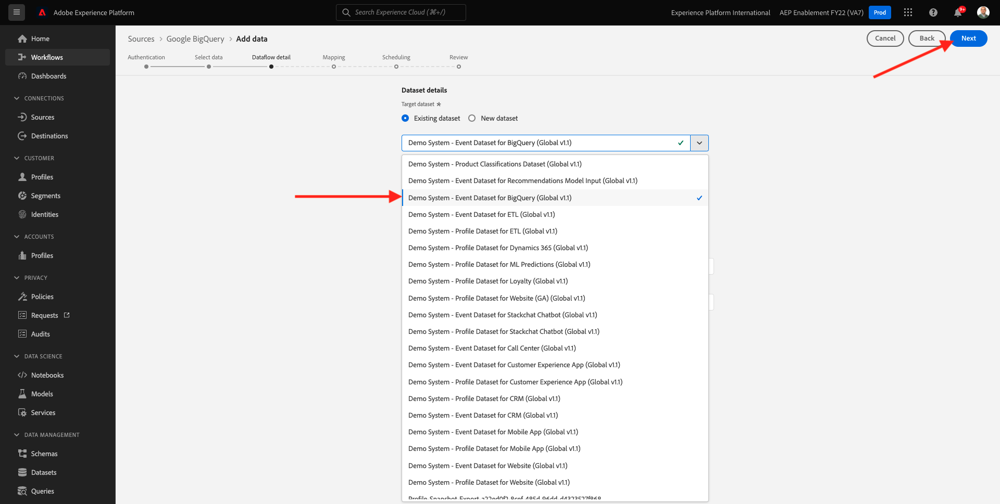
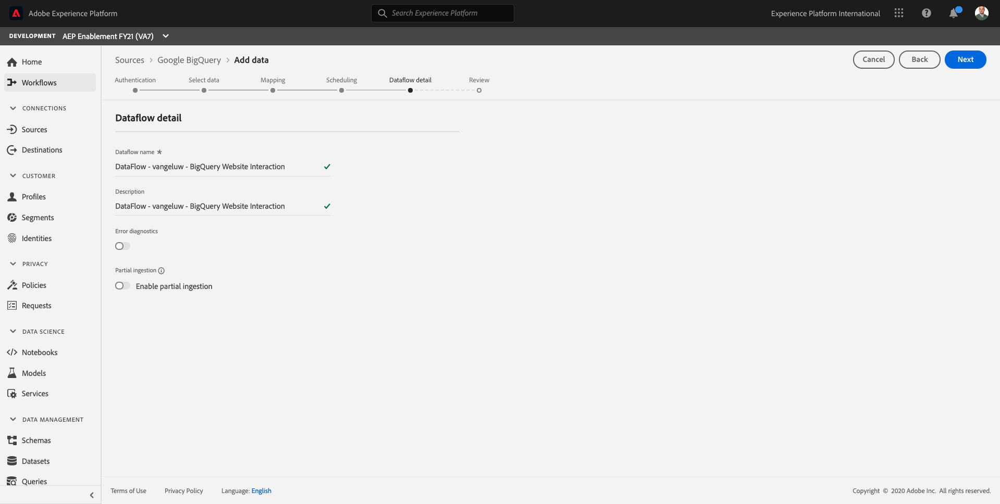
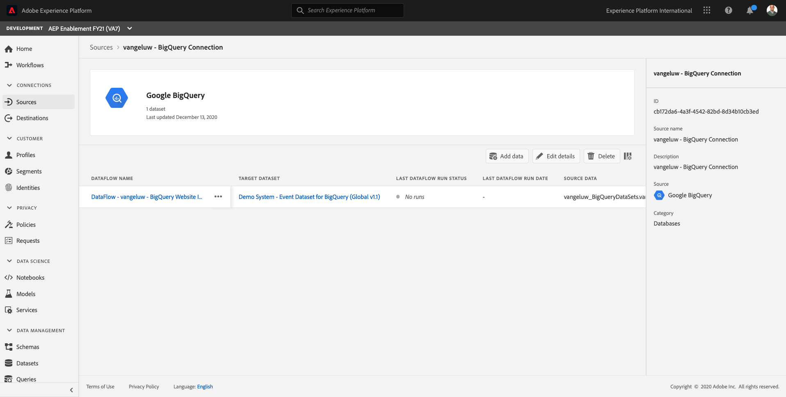

# 12.4 Carregar dados do BigQuery no Adobe Experience Platform

## Objetivos

- Mapear dados do BigQuery para um esquema XDM
- Carregar dados do BigQuery no Adobe Experience Platform
- Familiarize-se com a interface do usuário do Conector do BigQuery Source

## Antes de começar

Após o exercício 12.3, você deve ter essa página aberta no Adobe Experience Platform:

**Se o tiver aberto, continue com o exercício 12.4.1.**

**Se você não tiver aberto, vá para [Adobe Experience Platform](https://experience.adobe.com/platform/home).**

No menu esquerdo, vá para Fontes. Você verá o **Fontes** homepage. No **Fontes** , clique em **Bancos de dados**.

Selecione o **Google BigQuery** Source Connector e clique em **+ Configurar**.

Em seguida, você verá a tela de seleção de Conta do Google BigQuery .

Selecione sua conta e clique em **Próximo**.

Você verá o **Adicionar dados** exibir.

## 12.4.1 Seleção de tabela BigQuery

No **Adicionar dados** selecione seu conjunto de dados BigQuery.

Agora é possível ver uma amostra de visualização de dados do Google Analytics no BigQuery.

Clique em **Próximo**.

## Mapeamento XDM 12.4.2

Agora você verá o seguinte:

Agora é necessário criar um novo conjunto de dados ou selecionar um conjunto de dados existente para carregar os dados do Google Analytics. Para este exercício, um conjunto de dados e um schema já foram criados. Não é necessário criar um novo esquema ou conjunto de dados.

Selecionar **Conjunto de dados existente**. Abra o menu suspenso para selecionar um conjunto de dados. Pesquise pelo conjunto de dados chamado `Demo System - Event Dataset for BigQuery (Global v1.1)` e selecione-a. Clique em **Próximo**.

Role para baixo. Agora você precisa mapear cada **Campo de origem** do Google Analytics/BigQuery para um XDM **Campo de destino**, campo por campo.

Use a tabela de mapeamento abaixo para este exercício.

| Campo de origem | Campo de destino |
| ----------------- |-------------| 
| **_id** | _id |
| **_id** | channel._id |
| timeStamp | carimbo de data e hora |
| GA_ID | ``--aepTenantId--``.identification.core.gaid |
| customerID | ``--aepTenantId--``.identification.core.loyaltyId |
| Página | web.webPageDetails.name |
| Dispositivo | device.type |
| Navegador | environment.browserDetails.vendor |
| Canal de marketing | marketing.trackingCode |
| TrafficSource | channel.typeAtSource |
| TráfegoMédio | channel.mediaType |
| TransactionID | commerce.order.payments.transactionID |
| Ecommerce_Action_Type | eventType |
| Pageviews | web.webPageDetails.pageViews.value |
| Unique_Purchases | commerce.purchases.value |
| Product_Detail_Views | commerce.productViews.value |
| Adiciona_Ao_Carrinho | commerce.productListAdds.value |
| Product_Remove_From_Cart | commerce.productListRemovals.value |
| Product_Checkouts | commerce.checkouts.value |

Depois de copiar e colar o mapeamento acima na interface do usuário do Adobe Experience Platform, verifique se você não vê erros devido a erros de digitação ou espaços à esquerda/direita.

Agora você tem um **Mapeamento** como este:

Os campos de origem **GA_ID** e **customerID** são mapeadas para um Identificador neste Esquema XDM. Isso permitirá enriquecer os dados do Google Analytics (dados de comportamento da Web/aplicativo) com outros conjuntos de dados, como dados do Loyalty ou do Call Center.

Clique em **Próximo**.

## 12.4.3 Conexão e agendamento de assimilação de dados

Agora você verá o **Agendamento** guia :

No **Agendamento** , é possível definir uma frequência para o processo de assimilação de dados para essa **Mapeamento** e dados.

Como você está usando dados de demonstração no Google BigQuery que não serão atualizados, não há necessidade real de definir um agendamento neste exercício. Você precisa selecionar algo e, para evitar muitos processos de assimilação de dados inúteis, é necessário definir a frequência da seguinte maneira:

- Frequência: **Semana**
- Intervalo: **200**

**Importante**: certifique-se de ativar o **Preenchimento retroativo** switch.

Por último, mas não menos importante, você deve definir um **delta** campo.

O **delta** O campo é usado para agendar a conexão e fazer upload somente de novas linhas que entram em seu conjunto de dados do BigQuery. Normalmente, um campo delta é sempre uma coluna de carimbo de data e hora. Portanto, para assimilações de dados agendados futuras, somente as linhas com um novo carimbo de data e hora mais recente serão assimiladas.

Selecionar **timeStamp** como o campo delta.

Agora você tem isso.

Clique em **Próximo**.

## 12.4.4 Conexão de revisão e inicialização

No **Detalhes do fluxo do conjunto de dados** exibir. é necessário nomear sua conexão, o que ajudará você a encontrá-la posteriormente.

Use esta convenção de nomenclatura:

| Campo | Nomenclatura | Exemplo |
| ----------------- |-------------| -------------|
| Nome do fluxo do conjunto de dados | DataFlow - ldap - Interação do Site BigQuery | DataFlow - vangeluw - Interação do Site BigQuery |
| Descrição | DataFlow - ldap - Interação do Site BigQuery | DataFlow - vangeluw - Interação do Site BigQuery |

Clique em **Próximo**.

Agora você verá uma visão geral detalhada de sua conexão. Certifique-se de que tudo está correto antes de continuar, pois algumas configurações não podem mais ser alteradas posteriormente, como, por exemplo, o mapeamento XDM.

Clique em **Concluir**.

A configuração da conexão pode levar algum tempo, portanto, não se preocupe se você vir isso:

Depois que a conexão for criada, você verá o seguinte:

Agora você está pronto para continuar com o próximo exercício, no qual usará o Customer Journey Analytics para criar visualizações poderosas sobre os dados do Google Analytics.

Próxima etapa: [12.5 Analisar dados do Google Analytics usando o Customer Journey Analytics](./ex5.md)

[Voltar ao Módulo 12](./customer-journey-analytics-bigquery-gcp.md)

[Voltar para todos os módulos](./../../overview.md)
