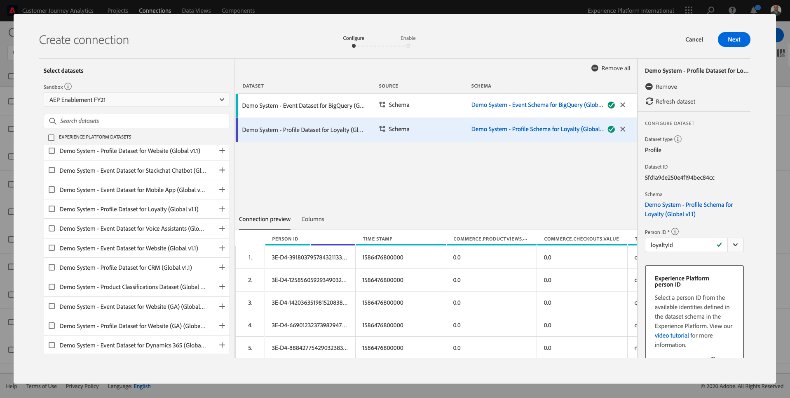
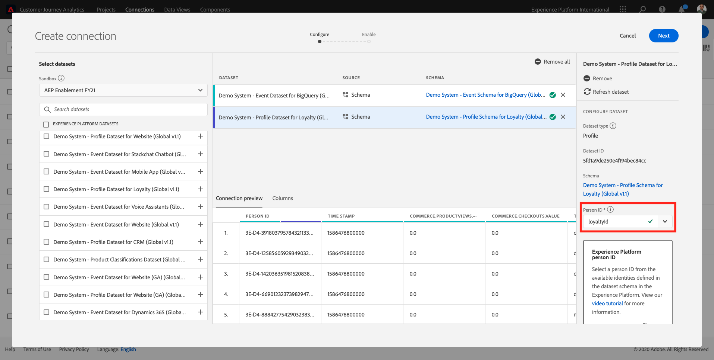
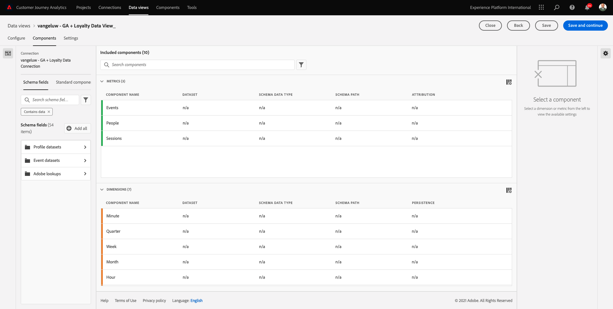
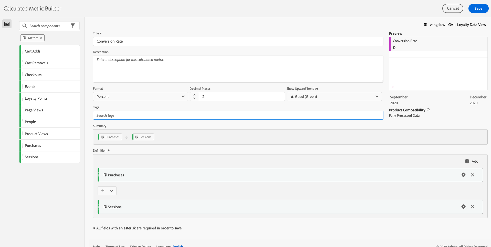

# 12.5 Analisar dados do Google Analytics usando o Customer Journey Analytics

## Objetivos

- Conecte nosso conjunto de dados BigQuery ao Customer Journey Analytics (CJA)
- Conecte-se e participe do Google Analytics com dados de fidelidade.
- Familiarize-se com a interface do usuário do CJA

## 12.5.1 Criar uma conexão

Ir para [analytics.adobe.com](https://analytics.adobe.com) para acessar o Customer Journey Analytics.

Na página inicial do Customer Journey Analytics, vá para **Conexões**.

Aqui você pode ver todas as diferentes conexões feitas entre o CJA e a Platform. Essas conexões têm o mesmo objetivo dos conjuntos de relatórios no Adobe Analytics. Mas a coleta dos dados é totalmente diferente. Todos os dados vêm de conjuntos de dados da Adobe Experience Platform.

Clique em **Criar nova conexão**.

Você verá o **Criar conexão** IU.

Primeiro, você precisa selecionar a sandbox correta para usar. No menu sandbox, selecione a sandbox que deve ser `--aepSandboxId--`. Neste exemplo, a sandbox a ser usada é **Ativação AEP FY21**.

Após selecionar sua sandbox, os conjuntos de dados disponíveis serão atualizados.

No menu esquerdo, é possível visualizar todos os conjuntos de dados disponíveis do Adobe Experience Platform. Pesquisar pelo conjunto de dados `Demo System - Event Dataset for BigQuery (Global v1.1)`. Clique em **+** para adicionar o conjunto de dados a essa conexão.

Após adicioná-lo, você verá o conjunto de dados dentro da conexão.

Agora é necessário selecionar a variável **ID da pessoa**. Certifique-se de que **loyaltyId** é selecionada como ID de pessoa.

Agora você enriquecerá os dados de interação do site do Google Analytics com outro conjunto de dados do Adobe Experience Platform.

Pesquisar pelo conjunto de dados `Demo System - Profile Dataset for Loyalty (Global v1.1)` conjunto de dados e adicione-o a essa conexão.

Você verá isso:

Para unir ambos os conjuntos de dados, é necessário selecionar um **ID da pessoa** que contém o mesmo tipo de IDs. O conjunto de dados `Demo System - Profile Dataset for Loyalty (Global v1.1)` usa a variável **loyaltyId** como ID de pessoa, que contém o mesmo tipo de IDs como `Demo System - Event Dataset for BigQuery (Global v1.1)`, que também utiliza o **loyaltyId** como uma ID de pessoa.

Clique em **Próximo**.

Você verá isso:

Aqui você precisa dar um nome à sua conexão.

Use esta convenção de nomenclatura: `ldap - GA + Loyalty Data Connection`.

Exemplo: `vangeluw - GA + Loyalty Data Connection`

Antes de terminar, ative também **Importe automaticamente todos os novos dados para todos os conjuntos de dados nesta conexão, a partir de hoje.** como na imagem abaixo.

Isso iniciará um fluxo de dados do Adobe Experience Platform para o CJA a cada 60 minutos, no entanto, com grandes volumes de dados, pode levar até 24 horas.

Você também precisa preencher dados históricos, portanto, marque a caixa de seleção para **Importar todos os dados existentes** e selecione **menos de 1 milhão** under **Número médio de eventos diários**.

Depois de criar a **Conexão** pode levar algumas horas até que seus dados estejam disponíveis no CJA.

Clique em **Salvar** e vá para o próximo exercício.

Em seguida, você verá sua conexão na lista de conexões disponíveis.

## 12.5.2 Criar uma visualização de dados

Com a conexão concluída, agora é possível avançar para influenciar a visualização. Uma diferença entre o Adobe Analytics e o CJA é que o CJA precisa de uma visualização de dados para limpar e preparar os dados antes da visualização.

Uma visualização de dados é semelhante ao conceito de conjuntos de relatórios virtuais no Adobe Analytics, onde você define definições de visitas sensíveis ao contexto, filtragem e também como os componentes são chamados.

Você precisará de no mínimo uma visualização de dados por conexão. No entanto, para alguns casos de uso, é ótimo ter várias visualizações de dados para a mesma conexão, com o objetivo de fornecer diferentes insights para diferentes equipes.

Se quiser que sua empresa se torne orientada por dados, você deve adaptar como os dados são visualizados em cada equipe. Alguns exemplos:

- Métricas UX somente para a equipe de Design UX
- Use os mesmos nomes para KPIs e Métricas para Google Analytics, assim como para o Customer Journey Analytics, para que a equipe de análise digital possa falar apenas um idioma.
- visualização de dados filtrada para mostrar, por exemplo, dados para 1 mercado ou 1 marca ou apenas para dispositivos móveis.

No **Conexões** marque a caixa de seleção na frente da conexão que você acabou de criar.

Em seguida, clique em **Criar Exibição de Dados**.

Você será redirecionado para o **Criar Exibição de Dados** fluxo de trabalho.

Agora é possível configurar as definições básicas para a visualização de dados. Coisas como Fuso horário, Tempo limite da sessão ou filtragem da visualização de dados (a parte de segmentação semelhante aos Conjuntos de relatórios virtuais no Adobe Analytics).

O **Conexão** você criou no exercício anterior já está selecionado. Sua conexão é nomeada `ldap - GA + Loyalty Data Connection`.

Em seguida, nomeie a visualização de dados seguindo esta convenção de nomenclatura: `ldap - GA + Loyalty Data View`.

Insira o mesmo valor para a descrição: `ldap - GA + Loyalty Data View`.

Antes de fazer qualquer análise ou visualização, precisamos criar uma visualização de dados com todos os campos, dimensões e métricas e suas configurações de atribuição.

| Campo | Convenção de nomenclatura | Exemplo |
| ----------------- |-------------|-------------|  
| Nomear a conexão | ldap - GA + Exibição de dados de fidelidade | vangeluw - GA + Exibição de dados de fidelidade |
| Descrição | ldap - GA + Exibição de dados de fidelidade | vangeluw - GA + Exibição de dados de fidelidade |

Clique em **Salvar e continuar**.

Agora é possível adicionar componentes à visualização de dados. Como é possível observar, algumas métricas e dimensões são adicionadas automaticamente.

Adicione os seguintes componentes à visualização de dados:

| Nome do componente | Tipo de componente | Caminho do componente |
| -----------------|-----------------|-----------------|
| nível | Dimensão | _experienceplatform.loyaltyDetails.level |
| pontos | Métrica | _experienceplatform.loyaltyDetails.points |
| commerce.checkouts.value | Métrica | commerce.checkouts.value |
| commerce.productListRemovals.value | Métrica | commerce.productListRemovals.value |
| commerce.productListAdds | Métrica | commerce.productListAdds |
| commerce.productViews.value | Métrica | commerce.productViews.value |
| commerce.purchases.value | Métrica | commerce.purchases.value |
| web.webPageDetails.pageViews | Métrica | web.webPageDetails.pageViews |
| ID da transação | Dimensão | commerce.order.payments.transactionID |
| channel.mediaType | Dimensão | channel.mediaType |
| channel.typeAtSource | Dimensão | channel.typeAtSource |
| Código de rastreamento | Dimensão | marketing.trackingCode |
| gaid | Dimensão | _experienceplatform.identification.core.gaid |
| web.webPageDetails.name | Dimensão | web.webPageDetails.name |
| Tipo de evento | Dimensão | eventType |
| Fornecedor | Dimensão | environment.browserDetails.vendor |
| Identificador | Dimensão | _id |
| Carimbo de data e hora | Dimensão | carimbo de data e hora |
| Tipo | Dimensão | device.type |
| loyaltyId | Dimensão | _experienceplatform.identification.core.loyaltyId |

Você terá isso:

Em seguida, é necessário alterar o nome amigável de algumas das métricas e dimensões acima para usá-las facilmente ao criar a análise. Para fazer isso, selecione a métrica ou dimensão e atualize a variável **Nome** como indicado na imagem abaixo.

| Nome original do componente | Nome de exibição |
| -----------------|-----------------|
| nível | Nível de Fidelidade |
| pontos | Pontos de fidelidade |
| commerce.checkouts.value | Check-outs |
| commerce.productListRemovals.value | Remoções do carrinho |
| commerce.productListAdds | Adições ao carrinho |
| commerce.productViews.value | Visualizações de produto |
| commerce.purchases.value | Compras |
| web.webPageDetails.pageViews | Page Views |
| channel.mediaType | Meio do tráfego |
| channel.typeAtSource | Traffic Source |
| Código de rastreamento | Canal de marketing |
| gaid | Google Analytics ID |
| Nome | Título da página |
| Fornecedor | Navegador |
| Tipo | Device Type |
| loyaltyId | ID de fidelidade |

Você terá algo como isto:

Em seguida, você precisa fazer algumas alterações no contexto Pessoa e Sessão para alguns desses componentes alterando o **Configurações de atribuição**.

Altere o **Configurações de atribuição** para os componentes abaixo:

| Componente |
| -----------------|
| Fonte de tráfego |
| Canal de marketing |
| Navegador |
| Meio do tráfego |
| Tipo de dispositivo |
| Google Analytics ID |
| ID de fidelidade |
| Nível de Fidelidade |
| Pontos de fidelidade |

Para fazer isso, selecione o componente, clique em **Usar modelo de atribuição personalizado** e defina a **Modelo** para **Último contato** e o **Expiração** para **Pessoa (Janela Relatórios)**. Repita isso para todos os componentes mencionados acima.

Depois de fazer as alterações nas configurações de atribuição para todos os componentes mencionados acima, você deve ter esta exibição:

Sua visualização de dados está configurada. Clique em **Salvar**.

Agora você está pronto para analisar dados do Google Analytics no Adobe Analytics Analysis Workspace. Vamos para o próximo exercício.

## 12.5.3 Criar o projeto

No Customer Journey Analytics, acesse **Projetos**.

Você verá isso:

Criar um projeto clicando em **Criar novo projeto**.

Agora você tem um Projeto em branco:

Primeiro, salve o projeto e dê um nome a ele. Você pode usar o seguinte comando para salvar:

| OS | Curto |
| ----------------- |-------------| 
| Windows | Controle + S |
| Mac | Command+S |

Você verá este pop-up:

Use esta convenção de nomenclatura:

| Nome | Descrição |
| ----------------- |-------------| 
| ldap - GA + Espaço de Trabalho de Fidelidade | ldap - GA + Espaço de Trabalho de Fidelidade |

Em seguida, clique em **Salvar projeto**.

Em seguida, selecione a visualização de dados correta no canto superior direito da tela. Essa é a visualização de dados criada no exercício anterior, com a convenção de nomenclatura `ldap - GA + Loyalty Data View`. Neste exemplo, a Exibição de dados a ser selecionada é `ldap - GA + Loyalty Data View`.

### 12.5.3.1 Tabelas de forma livre

As tabelas de forma livre funcionam mais ou menos como tabelas dinâmicas no Excel. Escolha algo na barra esquerda, arraste-o e solte-o na Forma livre, e você obterá um relatório de tabela.

As tabelas de forma livre são quase ilimitadas. Você pode fazer (quase) qualquer coisa e isso oferece tanto valor quando comparado a Google Analytics (já que essa ferramenta tem algumas limitações de análise). Esse é um dos motivos para carregar dados do Google Analytics em outra ferramenta de análise.

Veja dois exemplos em que você precisa usar SQL, BigQuery e algum tempo para responder perguntas simples que não são possíveis de fazer na interface do usuário do Google Analytics ou no Google Data Studio:

- Quantas pessoas chegam ao check-out do navegador Safari divididas por canal de marketing? Verifique se a métrica de check-out está sendo filtrada pelo navegador Safari. Acabamos de arrastar e soltar a variável Navegador = Safari na parte superior da coluna de check-out.

- Como analista, posso ver que o Canal de marketing social tem baixas conversões. Estou usando a atribuição de Último contato como padrão, mas e o Primeiro contato? Ao passar o mouse sobre qualquer métrica, as configurações da métrica são exibidas. Lá posso selecionar o modelo de atribuição desejado. Você pode fazer a Atribuição no GA (não no estúdio de dados) como uma atividade independente, mas não pode ter outras métricas ou dimensões não relacionadas à análise de atribuição na mesma tabela.

Respondamos a essas perguntas e mais com o Analysis Workspace no CJA.

Primeiro, selecione o intervalo de datas correto (**Últimas 53 semanas completas**) no lado direito do painel.

Em seguida, clique em **Aplicar** para aplicar o intervalo de datas. Lembre-se desta etapa para próximos exercícios.

>[!NOTE]
>
>Se você acabou de criar a variável **Conexão de dados** e **Exibição de dados** talvez você precise esperar algumas horas. O CJA precisa de algum tempo para preencher retroativamente dados históricos quando há uma grande quantidade de registros de dados.

Vamos arrastar e soltar algumas dimensões e métricas para analisar os canais de marketing. Primeiro use a dimensão **Canal de marketing** e arraste e solte na tela do **Tabela de forma livre**. (Clique em **Mostrar tudo** caso não veja a métrica imediatamente no menu Métricas)

Você verá isso:

Em seguida, é necessário adicionar as métricas à tabela de forma livre. Adicione as seguintes métricas: **Pessoas**, **Sessões**, **Exibições do produto**, **Check-outs**, **Compras**, **Índice de conversão** (Métrica calculada).

Antes de fazer isso, é necessário criar a métrica calculada **Índice de conversão**. Para fazer isso, clique no botão **+** ícone ao lado de Métricas:

Como nome para a Métrica calculada, use **Índice de conversão**. Em seguida, arraste as Métricas **purchase** e **Sessões** na tela. Definir **Formato** para **Porcentagem** e **Casas decimais** para **2**. Finalmente, clique em **Salvar**.

Em seguida, para usar todas essas métricas no **Tabela de forma livre**, arraste e solte-os um por um na **Tabela de forma livre**. Veja o exemplo abaixo.

Você acabará com uma tabela como esta:

Tal como acima mencionado, **Tabelas de forma livre** dê a você a liberdade de realizar análises profundas. Por exemplo, você pode escolher qualquer outro Dimension para analisar uma métrica específica dentro da tabela.

Como exemplo, vá para dimensões e pesquise e selecione a variável **Navegador** variável.

Você verá uma visão geral dos valores disponíveis para este Dimension.

Escolha a Dimension **Safari** e arraste e solte-a sobre uma Métrica, por exemplo **Check-outs**. Você verá isso:

Ao fazer isso, você acabou de responder a uma possível pergunta que tinha: Quantas pessoas chegam à página de checkout usando o Safari, dividido por Canal de marketing?

Agora responderemos à pergunta Atribuição.

Encontre a **Compra** na tabela.

Passe o mouse sobre a métrica e uma **Configurações** será exibido. Clique.

Um menu contextual será exibido. Marque a caixa de seleção para **modelo de atribuição não padrão**.

Na janela pop-up que você verá, é possível alterar facilmente os modelos de atribuição e a janela de lookback (que é bastante complexa de se obter com o SQL).

Selecionar **Primeiro contato** como seu modelo de atribuição.

Choose **Pessoa** para a janela de pesquisa.

Em seguida, clique em **Aplicar**.

Agora você pode ver que o modelo de atribuição para essa métrica específica agora é Primeiro contato.

É possível fazer o detalhamento desejado, sem limites de tipos de variáveis, segmentos, dimensões ou intervalos de datas.

Algo ainda mais especial é a capacidade de ingressar em qualquer conjunto de dados do Adobe Experience Platform para enriquecer os dados comportamentais digitais do Google Analytics. Por exemplo, offline, call center, fidelidade ou dados de CRM.

Para mostrar essa funcionalidade, vamos configurar seu primeiro detalhamento que combina dados offline com dados online. Escolha a dimensão **Nível de Fidelidade** e arraste e solte em qualquer **Canal de marketing**, por exemplo, **Pesquisa orgânica**:

Em seguida, vamos analisar qual **Tipo de dispositivo** é usada por clientes que chegaram ao site usando **Pesquisa orgânica** com um **Nível de Fidelidade** que **Bronze**. Pegue o Dimension **Tipo de dispositivo** e arraste e solte-o em **Bronze**. Você verá isso:

Você pode ver que para seu primeiro detalhamento, o Nível de fidelidade é usado. Essa dimensão vem de um conjunto de dados diferente e de um esquema diferente daquele usado para o conector BigQuery. A ID de pessoa **loyaltyID** (Sistema de demonstração - Esquema de evento para BigQuery (Global v1.1) e **loyaltyID** (Sistema de demonstração - Esquema de perfil para fidelidade (Global v1.1)) correspondem entre si. Portanto, você pode combinar Eventos de experiência do Google Analytics com Dados de perfil do Esquema de fidelidade.

Podemos continuar dividindo as linhas com segmentos ou intervalos de datas específicos (talvez para refletir campanhas de TV específicas) para fazer perguntas ao Customer Journey Analytics e obter as respostas onde você for.

Alcançar o mesmo resultado final com o SQL e, em seguida, uma ferramenta de visualização de terceiros é um grande desafio. Especialmente quando você está fazendo perguntas e tentando obter as respostas em tempo real. O Customer Journey Analytics não tem esse desafio e permite que os analistas de dados consultem os dados de forma flexível e em tempo real.

## 12.5.3.2 Análise de funil ou fallout

Os funis são um excelente mecanismo para entender as principais etapas em uma jornada do cliente. Essas etapas também podem vir de interações offline (por exemplo, da central de chamadas) e, em seguida, é possível combiná-las com pontos de contato digitais no mesmo funil.

O Customer Journey Analytics permite que você faça isso e muito mais. Se você se lembrar do Módulo 13, é possível clicar com o botão direito do mouse e fazer coisas como:

- Analisar onde os usuários estão indo após uma etapa de fallout
- Criar um segmento a partir de qualquer ponto do funil
- Visualizar a Tendência em qualquer estágio em uma visualização de Gráfico de linha

Vamos ver outra coisa que você pode fazer: Como está o meu Funil de Jornada do cliente este mês em relação ao mês anterior? E quanto a dispositivos móveis vs desktop?

Abaixo você criará dois painéis:

- Análise de funil (janeiro)
- Análise de funil (fevereiro)

Você verá que estamos comparando um funil em diferentes períodos de tempo (janeiro e fevereiro) dividido por Tipo de dispositivo.

Esse tipo de análise não é possível na interface do usuário do Google Analytics ou é muito limitada. Então o CJA novamente agrega muito valor aos dados capturados pelo Google Analytics.

Para criar sua primeira visualização de fallout. Feche o painel atual para começar com um novo.

Observe o lado direito do painel e clique na seta para fechá-lo.

Em seguida, clique em **+** para criar um novo painel.

Em seguida, selecione o **Fallout** Visualização.

Como analista, imagine que deseja entender o que está acontecendo com seu funil de comércio eletrônico principal: Início > Pesquisa interna > Detalhes do produto > Check-out > Compra.

Vamos começar adicionando algumas novas etapas ao funil. Para fazer isso, abra o **Nome da página** dimensão.

Você verá todas as páginas disponíveis que foram visitadas.

Arrastar e soltar **Início** para o primeiro passo.

Como segunda etapa, use o **Armazenar resultados de pesquisa**

Agora, é necessário adicionar algumas ações de comércio eletrônico. No Dimension, procure o Dimension **Tipo de evento** dimensão. Clique em para abrir a dimensão.

Selecionar **Product_Detail_Views** e arraste e solte-o na próxima etapa.

Selecionar **Product_Checkouts** e arraste e solte-o na próxima etapa.

Redimensione sua visualização de Fallout.

A visualização de fallout agora está pronta.

Para começar a analisar e documentar os insights, é sempre uma boa ideia **Texto** visualização. Para adicionar uma **Texto** , clique no botão **Gráfico** no menu esquerdo para ver todas as visualizações disponíveis. Em seguida, arraste e solte a **Texto** visualização na tela. Redimensione e mova-a para que pareça com a imagem abaixo.

E novamente, redimensione-o para caber no painel:

As visualizações de Fallouts também permitem detalhamentos. Use o **Tipo de dispositivo** abrindo-a e arraste e solte alguns dos valores em um para a visualização:

Você acabará com uma visualização mais avançada:

O Customer Journey Analytics permite que você faça isso e muito mais. Ao clicar com o botão direito do mouse em qualquer lugar do fallout, você pode..

- Analisar onde os usuários estão indo de uma etapa de fallout
- Criar um segmento a partir de qualquer ponto do funil
- Analise a tendência de qualquer etapa em uma visualização de Linha
- Compare qualquer funil a diferentes períodos de tempo de forma visual.

Como exemplo, faça um clique com o botão direito do mouse em qualquer etapa do fallout para ver algumas dessas opções de análise.

## 12.5.3.3 Análise e visualização do fluxo

Se quiser fazer análise de fluxo avançada usando o Google Analytics, é necessário usar o SQL para extrair os dados e, em seguida, usar uma solução de terceiros para a parte de visualização. Customer Journey Analytics ajudará com isso.

Nesta etapa, você configurará uma análise de fluxo para responder a esta pergunta: Quais são os principais canais que contribuem antes de uma Landing page específica.  Com dois arrastar e soltar e um clique, como analista, você pode descobrir o fluxo do usuário em direção à Landing page com os dois últimos toques de canais de marketing.

Outras perguntas que o Customer Journey Analytics pode ajudá-lo a responder:

- Qual é a principal combinação de canais antes de uma Landing page específica?
- O que faz com que um usuário saia da sessão quando ele chega ao Product_Checkout? Onde estão as etapas anteriores?

Vamos começar com um painel em branco novamente para responder essas perguntas. Feche o painel atual e clique em **+**.

Em seguida, selecione o **Fluxo** visualização.

Agora vamos configurar uma Análise de fluxo de canal de marketing de vários caminhos. Arraste e solte a **Canal de marketing** em **Dimension de entrada** área.

Agora é possível ver os primeiros caminhos de entrada:

Clique no primeiro caminho para detalhar.

Agora você pode ver o próximo caminho (Canal de marketing).

Vamos fazer um terceiro detalhamento. Clique na primeira opção no novo caminho, **Consulta**.

Agora você deve ver a visualização desta forma:

Vamos complicar as coisas. Imagine que você queira analisar o que era a landing page depois de dois caminhos de marketing? Para fazer isso, você pode usar uma dimensão secundária para alterar o último caminho. Encontre a **Nome da página** e arraste e solte desta forma:

Agora você verá o seguinte:

Vamos fazer outra análise de fluxo. Desta vez, você analisará o que aconteceu após um ponto de saída específico. Outras soluções do Analytics exigem o uso do SQL/ETL e, novamente, uma ferramenta de visualização de terceiros para obter a mesma coisa.

Traga um novo **Visualização de fluxo** no painel.

Você terá isso:

Encontre o Dimension **Tipo de evento** e arraste e solte no **Dimensão Saída** área.

Agora você pode ver qual **Tipo de evento**-paths levou os clientes para a saída.

Vamos investigar o que aconteceu antes da saída da ação de finalização. Clique no botão **Product_Checkouts** caminho:

Um novo caminho de ação será exibido com alguns dados que não são reveladores.

Vamos analisar mais detalhadamente! Pesquise no Dimension **Nome da página** e arraste-o e solte-o no novo caminho gerado.

Agora você tem uma análise de fluxo avançada feita em minutos. Você pode clicar nos diferentes caminhos para ver como eles se conectam da saída para as etapas anteriores.

Agora você tem um kit potente para analisar funis e explorar caminhos do comportamento do cliente em pontos de contato digitais, mas também offline.

Não esqueça de salvar suas alterações!

## 12.5.4 Compartilhar o projeto

>[!IMPORTANT]
>
>O conteúdo abaixo destina-se a FYI - Você **NOT** tem que compartilhar seu projeto com qualquer pessoa.

FYI - Você pode compartilhar este projeto com colegas para colaborar ou analisar questões comerciais em conjunto.

Próxima etapa: [Resumo e benefícios](./summary.md)

[Voltar ao Módulo 12](./customer-journey-analytics-bigquery-gcp.md)

[Voltar para todos os módulos](./../../overview.md)
