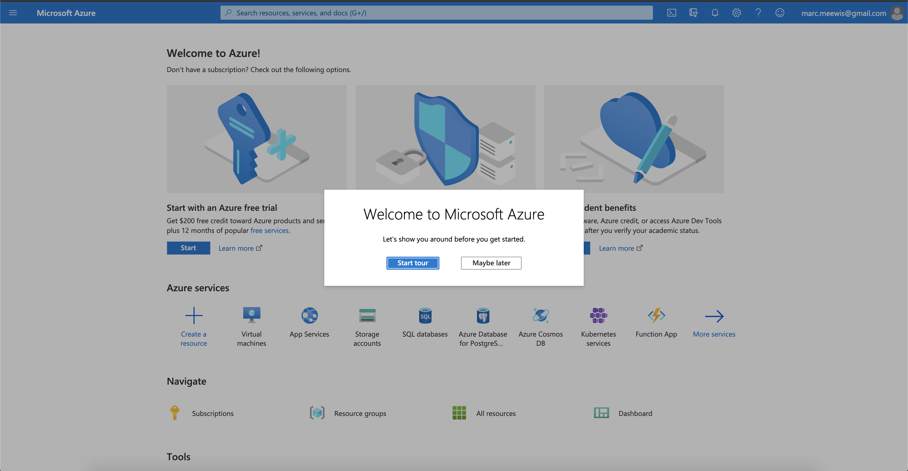
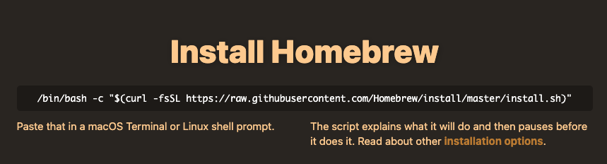

# 13.0 Configurar o ambiente

## 13.0.1 Criar uma assinatura do Azure

>[!NOTE]
>
>Se já tiver uma Assinatura do Azure, ignore esta etapa. Por favor, continue com o exercício 13.0.2 nesse caso.

Ir para [https://portal.azure.com](https://portal.azure.com) e faça logon com sua conta do Azure. Se você não tiver um, use seu endereço de email pessoal para criar sua conta do Azure.


Após o logon bem-sucedido, você verá a seguinte tela:



Clique no menu à esquerda e selecione **Todos os recursos**, a tela de assinatura do Azure será exibida se você ainda não tiver feito a assinatura. Nesse caso, selecione **Comece com uma avaliação gratuita do Azure**.


Preencha o formulário de assinatura do Azure, forneça seu celular e cartão de crédito para a ativação (você terá um nível gratuito por 30 dias e não será cobrado, a menos que atualize):


Quando o processo de assinatura estiver concluído, você estará pronto para:


## 13.0.2 Instalar o Visual Code Studio

Você usará o Microsoft Visual Code Studio para gerenciar seu projeto do Azure. Você pode baixá-lo via [este link](https://code.visualstudio.com/download). Siga as instruções de instalação para seu sistema operacional específico no mesmo site.

## 13.0.3 Instalar extensões de código visual

Instale as Funções do Azure para o Código do Visual Studio em [https://marketplace.visualstudio.com/items?itemName=ms-azuretools.vscode-azurefunctions](https://marketplace.visualstudio.com/items?itemName=ms-azuretools.vscode-azurefunctions). Clique no botão de instalação:


Instale a Conta do Azure e o Logon para o Código do Visual Studio em [https://marketplace.visualstudio.com/items?itemName=ms-vscode.azure-account](https://marketplace.visualstudio.com/items?itemName=ms-vscode.azure-account). Clique no botão de instalação:


## 13.0.4 Instalar o node.js

>[!NOTE]
>
>Se você já tiver o node.js instalado, ignore esta etapa. Por favor, continue com o exercício 13.0.5 nesse caso.

### macOS

Certifique-se de ter [Homebrew](https://brew.sh/) instalado primeiro. Siga as instruções [here](https://brew.sh/).



Depois de instalar o Homebrew, execute este comando:

```javascript
brew install node
```

### Windows

Baixe o [Instalador do Windows](https://nodejs.org/en/#home-downloadhead) diretamente da [nodejs.org](https://nodejs.org/en/) Web site.

## 13.0.5 Verificar a versão do node.js

Para este módulo, você precisa ter o node.js versão 12 instalada. Qualquer outra versão do node.js pode causar problemas com o exercício 13.5.

Antes de continuar, verifique sua versão do node.js agora.

Execute este comando para verificar a versão do node.js:

```javascript
node -v
```

Se a sua versão for inferior ou superior a 12, será necessário atualizar ou fazer o downgrade.

### Atualizar/baixar a versão do node.js no macOS

Certifique-se de ter o pacote **n** instalado.

Para instalar o pacote **n**, execute este comando:

```javascript
sudo npm install -g n
```

Se a versão for inferior ou superior à versão 12, execute este comando para atualizar ou fazer o downgrade:

```javascript
sudo n 12.6.0
```

### Atualizar/fazer downgrade da versão node.js no Windows

Desinstale o node.js em Windows > Painel de controle > Adicionar ou remover programas.

Instalação da versão necessária do [nodejs.org](https://nodejs.org/en/) site.

## 13.0.6 Instale o pacote NPM: solicitação

É necessário instalar o pacote **solicitação** como parte da configuração do node.js .

Para instalar o pacote **solicitação**, execute este comando:

```javascript
npm install request
```


Próxima etapa: [13.1 Configurar o ambiente do Microsoft Azure EventHub](./ex1.md)

[Voltar ao Módulo 13](./segment-activation-microsoft-azure-eventhub.md)

[Voltar para todos os módulos](./../../overview.md)
