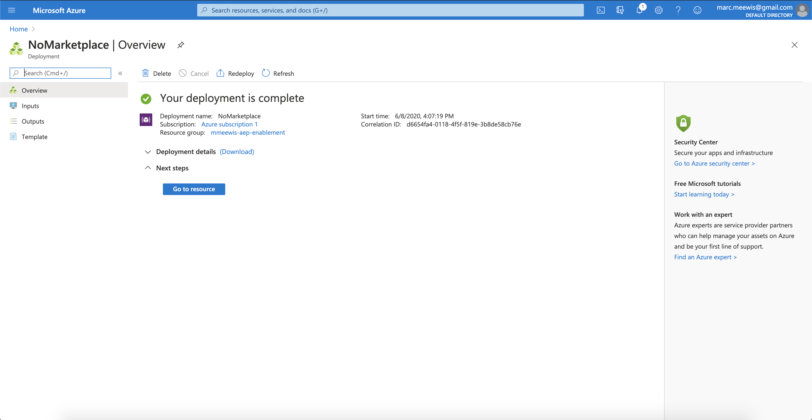
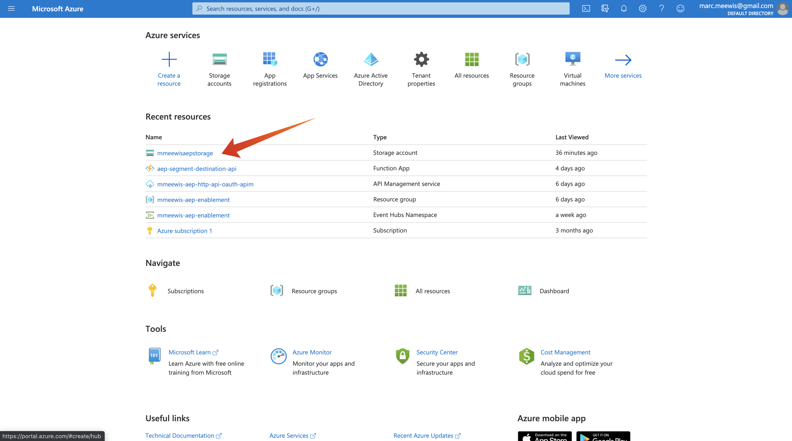

# 13.1 Configurar o ambiente do Microsoft Azure EventHub

O Hubs de Eventos do Azure é um serviço de assinatura de publicação altamente escalável que pode assimilar milhões de eventos por segundo e fazer o stream deles em vários aplicativos. Isso permite processar e analisar a grande quantidade de dados produzidos por seus dispositivos e aplicativos conectados.

## 13.1.1 O que é o Hubs de Eventos do Azure?

O Hubs de eventos do Azure é uma grande plataforma de transmissão de dados e serviço de assimilação de eventos. Ele pode receber e processar milhões de eventos por segundo. Os dados enviados para um hub de eventos podem ser transformados e armazenados usando qualquer provedor de análise em tempo real ou adaptadores de armazenamento/agrupamento.

O Hubs de evento representa a variável **porta da frente** para um pipeline de evento, normalmente chamado de ingresso de evento em arquiteturas de solução. Um assimilador de eventos é um componente ou serviço que se situa entre editores de eventos (como Adobe Experience Platform RTCDP) e consumidores de eventos para dissociar a produção de um fluxo de eventos do consumo desses eventos. O Event Hubs fornece uma plataforma de transmissão unificada com buffer de retenção de tempo, dissociando produtores de eventos dos consumidores de eventos.

## 13.1.2 Criar um namespace de Hubs de evento

Ir para [https://portal.azure.com/#home](https://portal.azure.com/#home) e selecione **Criar um recurso**.

Na tela de recursos, digite **Evento** na barra de pesquisa e selecione **Hubs de evento** na lista suspensa:

Clique em **Criar**:

Se esta for a primeira vez que você cria um recurso no Azure, será necessário criar um novo **Grupo de recursos**. Se você já tiver um grupo de recursos, poderá selecioná-lo (ou criar um novo).

Selecionar **Criar novo**, nomeie o grupo `--demoProfileLdap---aep-enablement`.

Complete o teste dos campos conforme indicado:

- Namespace : Defina seu namespace, ele deve ser exclusivo, use o seguinte padrão `--demoProfileLdap---aep-enablement`
- Localização: **Europa Ocidental** refere-se ao datacenter do Azure em Amsterdam
- Nível de preços: **Básico**
- Unidades de Taxa de Transferência: **1**

Clique em **Revisar + criar**.

Clique em **Criar**.

A implantação do seu grupo de recursos pode levar de 1 a 2 minutos, quando for bem-sucedida, você verá a seguinte tela:

## 13.1.3 Configurar seu Hub de Eventos no Azure

Ir para [https://portal.azure.com/#home](https://portal.azure.com/#home) e selecione **Todos os recursos**.

Na lista de recursos, selecione o `--demoProfileLdap---aep-enablement` namespace:

Em `--demoProfileLdap---aep-enablement` tela de detalhes, selecione **Hubs de evento**:

Clique em **+ Hub de eventos**.

Use `--demoProfileLdap---aep-enablement-event-hub` como o nome e clique em **Criar**.

Clique em **Hubs de evento** no namespace do hub de eventos. Agora você deve ver seu **Hub de eventos** listado. Se for esse o caso, você pode passar para o próximo exercício.

## 13.1.4 Configurar sua conta de armazenamento do Azure

Para depurar sua função do Hub de Eventos do Azure em exercícios posteriores, você precisará fornecer uma Conta de Armazenamento do Azure como parte da configuração do projeto do Visual Studio Code. Agora você criará essa Conta de Armazenamento do Azure.

Ir para [https://portal.azure.com/#home](https://portal.azure.com/#home) e selecione **Criar um recurso**.

Enter **armazenamento** na pesquisa e selecione **Conta de armazenamento** na lista.

Selecione **Criar**.

Especifique seu **Grupo de recursos** (criado no início deste exercício), use `--demoProfileLdap--aepstorage` como o nome da conta de Armazenamento e selecione **Armazenamento local redundante (LRS)**, depois clique em **Revisar + criar**.

Clique em **Criar**.

A criação da Conta de Armazenamento levará alguns segundos:

Quando terminar, a tela exibirá a variável **Ir para recurso** botão.

Clique em **Microsoft Azure**.

Sua conta de armazenamento agora está visível em **Recursos recentes**.

Próxima etapa: [13.2 Configurar o destino do Hub de eventos do Azure no Adobe Experience Platform](./ex2.md)

[Voltar ao Módulo 13](./segment-activation-microsoft-azure-eventhub.md)

[Voltar para todos os módulos](./../../overview.md)
