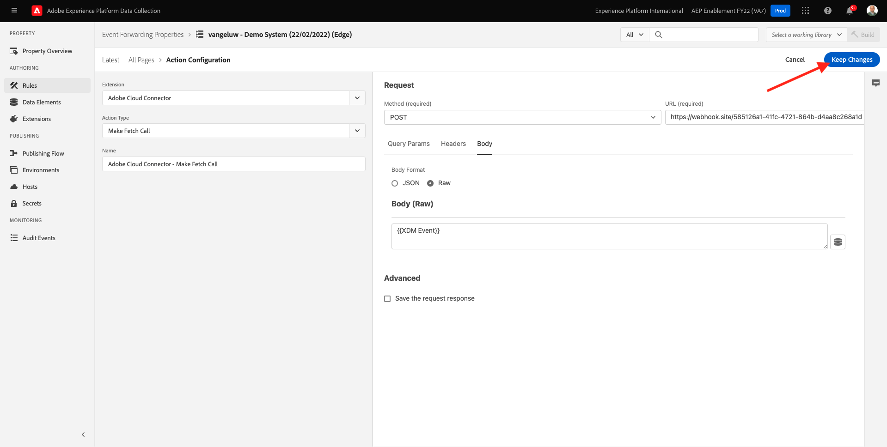
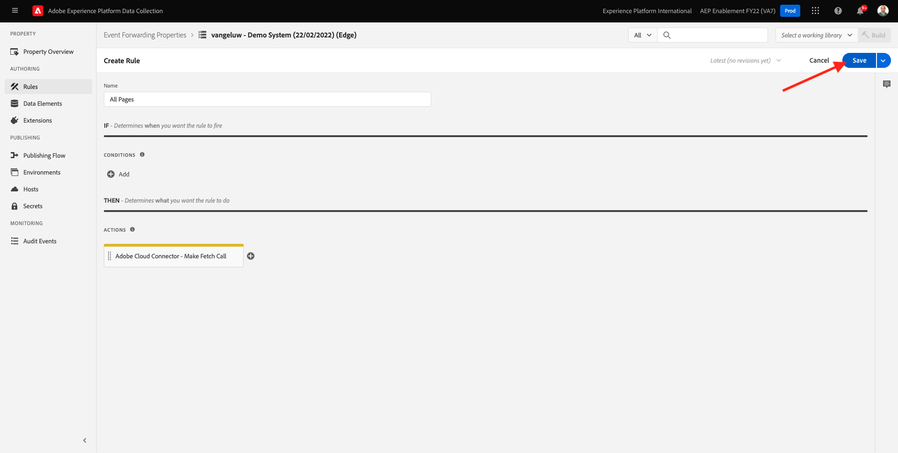

# 14.3 Criar e configurar um webhook personalizado

## 14.3.1 Crie seu webhook personalizado

Ir para [https://webhook.site/](https://webhook.site/). Você verá algo como isto:

Você verá seu URL exclusivo, com esta aparência: `https://webhook.site/585126a1-41fc-4721-864b-d4aa8c268a1d`.

Este site já criou este webhook para você e você poderá configurar este webhook em seu **[!DNL Event Forwarding property]** para iniciar o teste do encaminhamento de eventos.

## 14.3.2 Atualize sua propriedade de Encaminhamento de eventos: Criar um elemento de dados

Ir para [https://experience.adobe.com/#/data-collection/](https://experience.adobe.com/#/data-collection/) e ir para **Encaminhamento de evento**. Pesquise sua propriedade Encaminhamento de eventos e clique nela para abri-la.

No menu esquerdo, acesse **Elementos de dados**. Clique em **Criar novo elemento de dados**.

Você verá um novo elemento de dados para configurar.

Faça a seguinte seleção:

- Como **Nome**, insira **Evento XDM**.
- Como **Extensão**, selecione **Núcleo**.
- Como **Tipo de elemento de dados**, selecione **Caminho**.
- Como **Caminho**, insira **arc.event.xdm**. Ao digitar esse caminho, você filtrará a variável **XDM** na seção do payload do evento que é enviado pelo site ou aplicativo móvel para a Adobe Edge.

Agora você terá isso. Clique em **Salvar**.

>[!NOTE]
>
>No caminho acima, é feita referência a **arco**. **arco** significa Contexto de Recurso do Adobe e **arco** sempre representa o objeto mais alto disponível no contexto do lado do servidor. Podem ser acrescentados, a este último, enriquecimentos e transformações **arco** objeto que usa funções do Servidor de coleta de dados da Adobe Experience Platform.
>
>No caminho acima, é feita referência a **evento**. **evento** significa um evento exclusivo e o Adobe Experience Platform Data Collection Server sempre avaliará cada evento individualmente. Às vezes, você pode ver uma referência para **events** no payload enviado pelo lado do cliente do SDK da Web, mas no Adobe Experience Platform Data Collection Server, cada evento é avaliado individualmente.

## 14.3.3 Atualize sua propriedade do Servidor de coleta de dados da Adobe Experience Platform: Criar uma regra

No menu esquerdo, acesse **Regras**. Clique em **Criar nova regra**.

Em seguida, você verá uma nova regra para configurar. Insira o **Nome**: **Todas as páginas**. Para este exercício, você não precisará configurar uma condição. Em vez disso, você configurará uma ação. Clique no botão **+ Adicionar** botão abaixo **Ações**.

Você verá isso. Faça a seguinte seleção:

- Selecione o **Extensão**: **Conector da nuvem do Adobe**.
- Selecione o **Tipo de ação**: **Efetuar chamada de busca**.

Isso deveria dar-vos isto **Nome**: **Conector da Adobe Cloud - Efetuar chamada de busca**. Agora você deve ver o seguinte:

Em seguida, configure o seguinte:

- Altere o método de solicitação de GET para **POST**
- Insira o URL do webhook personalizado que você criou em uma das etapas anteriores na [https://webhook.site/](https://webhook.site/) site, que se parece com isto: `https://webhook.site/585126a1-41fc-4721-864b-d4aa8c268a1d`

Você deveria ter isso agora. Em seguida, acesse **Corpo**.

Você verá isso. Clique no ícone do elemento de dados, conforme indicado abaixo.

Na janela pop-up , selecione o elemento de dados **Evento XDM** criado na etapa anterior. Clique em **Selecionar**.

Você verá isso. Clique em **Manter alterações**.

Você verá isso. Clique em **Salvar**.

Agora você configurou sua primeira regra em uma propriedade de Encaminhamento de eventos. Ir para **Fluxo de publicação** para publicar suas alterações.
Abra a biblioteca de desenvolvimento **Principal** clicando em **Editar** conforme indicado.

Clique no botão **Adicionar todos os recursos alterados** , depois disso, você verá sua Regra e o Elemento de dados aparecer nesta biblioteca. Em seguida, clique em **Salvar e criar para desenvolvimento**. Suas alterações estão sendo implantadas.

Após alguns minutos, você verá que a implantação foi concluída e está pronta para ser testada.

## 14.3.4 Testar sua configuração

Ir para [https://builder.adobedemo.com/projects](https://builder.adobedemo.com/projects). Depois de fazer logon com sua Adobe ID, você verá isso. Clique no projeto do seu site para abri-lo.

Agora você pode seguir o fluxo abaixo para acessar o site. Clique em **Integrações**.

No **Integrações** , é necessário selecionar a propriedade Data Collection criada no exercício 0.1.

Você verá seu site de demonstração aberto. Selecione o URL e copie-o para a área de transferência.

Abra uma nova janela incógnita do navegador.

Cole o URL do site de demonstração, que você copiou na etapa anterior. Em seguida, você será solicitado a fazer logon usando sua Adobe ID.

Selecione o tipo de conta e conclua o processo de logon.

Você verá seu site carregado em uma janela incógnita do navegador. Para cada demonstração, você precisará usar uma nova janela incógnita do navegador para carregar o URL do site de demonstração.

Ao abrir a Visualização do desenvolvedor do navegador, você pode inspecionar as solicitações de rede, conforme indicado abaixo. Ao usar o filtro **interagir**, você verá as solicitações de rede enviadas pelo cliente de coleta de dados da Adobe Experience Platform para a Adobe Edge.

Se você selecionar a carga bruta, acesse [https://jsonformatter.org/json-pretty-print](https://jsonformatter.org/json-pretty-print) e cole a carga. Clique em **Tornar bonito**. Você verá a carga JSON, a **events** e o **xdm** objeto. Em uma das etapas anteriores, ao definir o Elemento de dados, a referência **arc.event.xdm**, o que resultará na análise da variável **xdm** objeto desta carga.

Mudar a vista para o Web site [https://webhook.site/](https://webhook.site/) que você usou em uma das etapas anteriores. Agora você deve ter uma exibição semelhante a esta, com as solicitações de rede sendo exibidas no menu esquerdo. Você está vendo o **xdm** carga que foi filtrada da solicitação de rede mostrada acima.

Role para baixo um pouco na carga para localizar o nome da página, que nesse caso é **vangeluw-OCUC** (que é o nome do projeto do site de demonstração).

Se agora você navegar pelo site, verá solicitações de rede adicionais sendo disponibilizadas neste webhook personalizado em tempo real.

Agora você configurou o encaminhamento pelo lado do servidor de cargas de SDK/XDM da Web para um webhook personalizado externo. Nos próximos exercícios, você configurará uma abordagem semelhante e enviará os mesmos dados para ambientes Google e AWS.

Próxima etapa: [14.4 Criar e configurar uma função da Google Cloud](./ex4.md)

[Voltar ao Módulo 14](./aep-data-collection-ssf.md)

[Voltar para todos os módulos](./../../overview.md)
