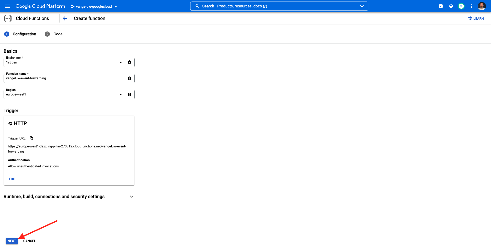
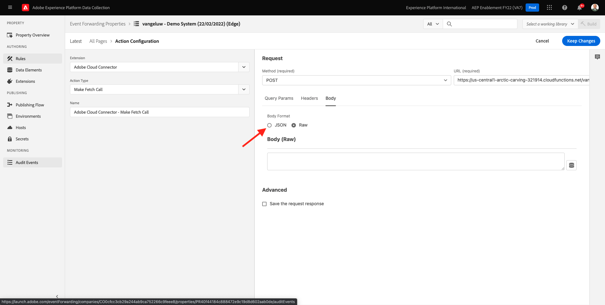

# 14.4 Criar e configurar uma função da Google Cloud

## 14.4.1 Criar a função de nuvem da Google

Ir para [https://console.cloud.google.com/](https://console.cloud.google.com/). Ir para **Funções da nuvem**.


Você verá isso. Clique em **CRIAR FUNÇÃO**.


Você verá isso.


Faça as seguintes opções:

- **Nome da função**: `--demoProfileLdap---event-forwarding`
- **Região**: selecione qualquer região
- **Tipo de acionador**: select **HTTP**
- **Autenticação**: select **Permitir invocações não autenticadas**

Você deveria ter isso agora. Clique em **SALVAR**.


Clique em **PRÓXIMO**.



Você verá isso:


Faça as seguintes opções:

- **Tempo de execução**: select **Node.js 16** (ou mais recente)
- **Ponto de entrada**: enter **helloAEP**

Clique em **HABILITAR API** para ativar **API de build de nuvem**. Você verá uma nova janela. Nessa nova janela, clique em **ATIVAR** novamente.


Você verá isso. Clique em **Habilitar**.


Uma vez **API de build de nuvem** estiver habilitado, você verá isso.


Volte para o **Função na nuvem**.
No Editor em linha da função da nuvem, verifique se você tem o seguinte código:

```javascript
/**
 * Responds to any HTTP request.
 *
 * @param {!express:Request} req HTTP request context.
 * @param {!express:Response} res HTTP response context.
 */
exports.helloAEP = (req, res) => {
  let message = req.query.message || req.body.message || 'Hello World!';
  res.status(200).send(message);
};
```

Em seguida, clique em **IMPLANTAR**.


Você verá isso. Sua função da nuvem está sendo criada. Isso pode levar alguns minutos.


Depois que sua função for criada e executada, você verá isso. Clique no nome da sua função para abri-la.


Você verá isso. Ir para **ACIONADOR**. Você verá o **URL do acionador** que é o que você usará para definir o terminal no lado do servidor do Launch.


Copie o URL do acionador, que tem a seguinte aparência: **https://europe-west1-dazzling-pillar-273812.cloudfunctions.net/vangeluw-event-forwarding**.

Nas próximas etapas, você configurará o Adobe Experience Platform Data Collection Server para transmitir informações específicas sobre **Exibições de página** à função da Google Cloud. Em vez de apenas encaminhar a carga útil completa como está, você só enviará itens como **ECID**, **timestamp** e **Nome da página** à função da Google Cloud.

Este é um exemplo de uma carga que você precisará analisar para filtrar as variáveis mencionadas acima:

```json
{
  "events": [
    {
      "xdm": {
        "eventType": "web.webpagedetails.pageViews",
        "web": {
          "webPageDetails": {
            "URL": "https://builder.adobedemo.com/run/vangeluw-OCUC",
            "name": "vangeluw-OCUC",
            "viewName": "vangeluw-OCUC",
            "pageViews": {
              "value": 1
            }
          },
          "webReferrer": {
            "URL": "https://builder.adobedemo.com/run/vangeluw-OCUC/equipment"
          }
        },
        "device": {
          "screenHeight": 1080,
          "screenWidth": 1920,
          "screenOrientation": "landscape"
        },
        "environment": {
          "type": "browser",
          "browserDetails": {
            "viewportWidth": 1920,
            "viewportHeight": 451
          }
        },
        "placeContext": {
          "localTime": "2022-02-23T06:51:07.140+01:00",
          "localTimezoneOffset": -60
        },
        "timestamp": "2022-02-23T05:51:07.140Z",
        "implementationDetails": {
          "name": "https://ns.adobe.com/experience/alloy/reactor",
          "version": "2.8.0+2.9.0",
          "environment": "browser"
        },
        "_experienceplatform": {
          "identification": {
            "core": {
              "ecid": "08346969856929444850590365495949561249"
            }
          },
          "demoEnvironment": {
            "brandName": "vangeluw-OCUC"
          },
          "interactionDetails": {
            "core": {
              "channel": "web"
            }
          }
        }
      },
      "query": {
        "personalization": {
          "schemas": [
            "https://ns.adobe.com/personalization/html-content-item",
            "https://ns.adobe.com/personalization/json-content-item",
            "https://ns.adobe.com/personalization/redirect-item",
            "https://ns.adobe.com/personalization/dom-action"
          ],
          "decisionScopes": [
            "eyJ4ZG06YWN0aXZpdHlJZCI6Inhjb3JlOm9mZmVyLWFjdGl2aXR5OjE0YzA1MjM4MmUxYjY1MDUiLCJ4ZG06cGxhY2VtZW50SWQiOiJ4Y29yZTpvZmZlci1wbGFjZW1lbnQ6MTRiZjA5ZGM0MTkwZWJiYSJ9",
            "__view__"
          ]
        }
      }
    }
  ],
  "query": {
    "identity": {
      "fetch": [
        "ECID"
      ]
    }
  },
  "meta": {
    "state": {
      "domain": "adobedemo.com",
      "cookiesEnabled": true,
      "entries": [
        {
          "key": "kndctr_907075E95BF479EC0A495C73_AdobeOrg_identity",
          "value": "CiYwODM0Njk2OTg1NjkyOTQ0NDg1MDU5MDM2NTQ5NTk0OTU2MTI0OVIPCPn66KfyLxgBKgRJUkwx8AH5-uin8i8="
        },
        {
          "key": "kndctr_907075E95BF479EC0A495C73_AdobeOrg_consent_check",
          "value": "1"
        },
        {
          "key": "kndctr_907075E95BF479EC0A495C73_AdobeOrg_consent",
          "value": "general=in"
        }
      ]
    }
  }
}
```

Esses são os campos que contêm as informações que precisam ser analisadas:

- ECID: **events.xdm._experienceplatform.identification.core.ecid**
- timestamp: **timestamp**
- Nome da página: **events.xdm.web.webPageDetails.name**

Vamos para o Adobe Experience Platform Data Collection Server agora, para configurar os elementos de dados para tornar isso possível.

## 14.4.2 Atualize sua propriedade de Encaminhamento de eventos: Elementos de dados

Ir para [https://experience.adobe.com/#/data-collection/](https://experience.adobe.com/#/data-collection/) e ir para **Encaminhamento de evento**. Pesquise sua propriedade Encaminhamento de eventos e clique nela para abri-la.


No menu esquerdo, acesse **Elementos de dados**. Clique em **Adicionar elemento de dados**.


Você verá um novo elemento de dados para configurar.


Faça a seguinte seleção:

- Como **Nome**, insira **customerECID**.
- Como **Extensão**, selecione **Núcleo**.
- Como **Tipo de elemento de dados**, selecione **Caminho**.
- Como **Caminho**, insira `arc.event.xdm.--aepTenantId--.identification.core.ecid`. Ao digitar esse caminho, você estará filtrando o campo **ecid** a partir do payload do evento enviado pelo site ou pelo aplicativo móvel para o Adobe Edge.

>[!NOTE]
>
>Nos caminhos acima e abaixo, é feita referência a **arco**. **arco** significa Contexto de Recurso do Adobe e **arco** sempre representa o objeto mais alto disponível no contexto do lado do servidor. Podem ser acrescentados, a este último, enriquecimentos e transformações **arco** objeto que usa funções do Servidor de coleta de dados da Adobe Experience Platform.
>
>Nos caminhos acima e abaixo, é feita referência a **evento**. **evento** significa um evento exclusivo e o Adobe Experience Platform Data Collection Server sempre avaliará cada evento individualmente. Às vezes, você pode ver uma referência para **events** no payload enviado pelo lado do cliente do SDK da Web, mas no Adobe Experience Platform Data Collection Server, cada evento é avaliado individualmente.

Agora você terá isso. Clique em **Salvar**.


Clique em **Adicionar elemento de dados**.


Você verá um novo elemento de dados para configurar.


Faça a seguinte seleção:

- Como **Nome**, insira **eventTimestamp**.
- Como **Extensão**, selecione **Núcleo**.
- Como **Tipo de elemento de dados**, selecione **Caminho**.
- Como **Caminho**, insira **arc.event.xdm.timestamp**. Ao digitar esse caminho, você estará filtrando o campo **timestamp** a partir do payload do evento enviado pelo site ou pelo aplicativo móvel para o Adobe Edge.

Agora você terá isso. Clique em **Salvar**.


Clique em **Adicionar elemento de dados**.


Você verá um novo elemento de dados para configurar.


Faça a seguinte seleção:

- Como **Nome**, insira **pageName**.
- Como **Extensão**, selecione **Núcleo**.
- Como **Tipo de elemento de dados**, selecione **Caminho**.
- Como **Caminho**, insira **arc.event.xdm.web.webPageDetails.name**. Ao digitar esse caminho, você estará filtrando o campo **name** a partir do payload do evento enviado pelo site ou pelo aplicativo móvel para o Adobe Edge.

Agora você terá isso. Clique em **Salvar**.


Agora, esses elementos de dados são criados:


## 14.4.3 Atualize sua propriedade de Encaminhamento de eventos: Atualizar uma regra

No menu esquerdo, acesse **Regras**. No exercício anterior, você criou a regra **Todas as páginas**. Clique nessa regra para abri-la.


Então você vai fazer isso. Clique no botão **+** ícone abaixo **Ações** para adicionar uma nova ação.


Você verá isso.


Faça a seguinte seleção:

- Selecione o **Extensão**: **Conector da nuvem do Adobe**.
- Selecione o **Tipo de ação**: **Efetuar chamada de busca**.

Isso deveria dar-vos isto **Nome**: **Conector da Adobe Cloud - Efetuar chamada de busca**. Agora você deve ver o seguinte:


Em seguida, configure o seguinte:

- Altere o protocolo de solicitação de GET para **POST**
- Insira o URL da Função de Nuvem da Google criada em uma das etapas anteriores, que tem a seguinte aparência: **https://europe-west1-dazzling-pillar-273812.cloudfunctions.net/vangeluw-event-forwarding**

Você deveria ter isso agora. Em seguida, acesse **Corpo**.


Você verá isso. Clique no botão de opção para **JSON**.



Configure o **Corpo** como se segue:

| CHAVE | VALOR |
|--- |--- |
| customerECID | {{customerECID}} |
| pageName | {{pageName}} |
| eventTimestamp | {{eventTimestamp}} |

Você verá isso. Clique em **Manter alterações**.


Você verá isso. Clique em **Salvar**.


Agora você atualizou sua regra existente em uma propriedade do Adobe Experience Platform Data Collection Server. Ir para **Fluxo de publicação** para publicar suas alterações. Abra a biblioteca de desenvolvimento **Principal** clicando em **Editar** conforme indicado.


Clique no botão **Adicionar todos os recursos alterados** , depois disso, você verá sua Regra e o Elemento de dados aparecer nesta biblioteca. Em seguida, clique em **Salvar e criar para desenvolvimento**. Suas alterações estão sendo implantadas.


Após alguns minutos, você verá que a implantação foi concluída e está pronta para ser testada.


## 14.3.4 Testar sua configuração

Ir para [https://builder.adobedemo.com/projects](https://builder.adobedemo.com/projects). Depois de fazer logon com sua Adobe ID, você verá isso. Clique no projeto do seu site para abri-lo.


Agora você pode seguir o fluxo abaixo para acessar o site. Clique em **Integrações**.


No **Integrações** , é necessário selecionar a propriedade Data Collection criada no exercício 0.1.


Você verá seu site de demonstração aberto. Selecione o URL e copie-o para a área de transferência.


Abra uma nova janela incógnita do navegador.


Cole o URL do site de demonstração, que você copiou na etapa anterior. Em seguida, você será solicitado a fazer logon usando sua Adobe ID.


Selecione o tipo de conta e conclua o processo de logon.


Você verá seu site carregado em uma janela incógnita do navegador. Para cada demonstração, você precisará usar uma nova janela incógnita do navegador para carregar o URL do site de demonstração.


Ao abrir a Visualização do desenvolvedor do navegador, você pode inspecionar as solicitações de rede, conforme indicado abaixo. Ao usar o filtro **interagir**, você verá as solicitações de rede enviadas pelo cliente de coleta de dados da Adobe Experience Platform para a Adobe Edge.


Alterne a exibição para a Função da nuvem da Google e acesse **LOGS**. Agora você deve ter uma exibição semelhante a essa, com várias entradas de log sendo mostradas. Cada vez que você vê **Execução da função iniciada**, significa que o tráfego de entrada foi recebido na função da Google Cloud.


Vamos atualizar sua função um pouco para funcionar com os dados recebidos e exibir as informações recebidas do Servidor de coleta de dados da Adobe Experience Platform. Ir para **FONTE** e clique em **EDITAR**.


Na próxima tela, clique em **PRÓXIMO**.


Atualize seu código desta forma:

```javascript
/**
 * Responds to any HTTP request.
 *
 * @param {!express:Request} req HTTP request context.
 * @param {!express:Response} res HTTP response context.
 */
exports.helloAEP = (req, res) => {
  console.log('>>>>> Function has started. The following information was received from Event Forwarding:');
  console.log(req.body);

  let message = req.query.message || req.body.message || 'Hello World!';
  res.status(200).send(message);
};
```

Você terá isso. Clique em **IMPLANTAR**.


Após alguns minutos, sua função será implantada novamente. Clique no nome da sua função para abri-la.


No seu site de demonstração, navegue até um produto, como por exemplo **DEIRDRE - CAPRI DE AJUSTE RELAXADO**.


Alterne a exibição para a Função da nuvem da Google e acesse **LOGS**. Agora você deve ter uma exibição semelhante a essa, com várias entradas de log sendo mostradas.

Para cada exibição de página no seu site de demonstração, você deve ver uma nova entrada de log pop-up nos logs da função da Google Cloud, que mostram as informações recebidas.


Agora você enviou com sucesso os dados coletados pela Coleta de dados da Adobe Experience Platform, em tempo real, para um endpoint da Função da Google Cloud . A partir daí, esses dados podem ser usados por qualquer aplicativo da Google Cloud Platform, como o BigQuery para armazenamento e relatórios ou para casos de uso do Machine Learning.

Próxima etapa: [14.5 Encaminhar eventos para o ecossistema do AWS](./ex5.md)

[Voltar ao Módulo 14](./aep-data-collection-ssf.md)

[Voltar para todos os módulos](./../../overview.md)
