# 14.5 Encaminhar eventos para o ecossistema do AWS

>[!IMPORTANT]
>
>A conclusão deste exercício é opcional e um custo está envolvido para usar o AWS Kinesis. Embora a AWS forneça uma conta de camada gratuita que permite testar e configurar muitos serviços sem um custo, a AWS Kinesis não faz parte dessa conta de camada gratuita. Assim, para implementar e testar este exercício, haverá um custo envolvido para usar o AWS Kinesis.

## Bom saber

O Adobe Experience Platform é compatível com vários serviços Amazon como destino.
O Kinesis e o S3 são ambos [destinos de exportação de perfil](https://experienceleague.adobe.com/docs/experience-platform/destinations/destination-types.html?lang=en) e podem ser usadas como parte do Adobe Experience Platform Real-Time CDP.
Você pode facilmente alimentar eventos de segmento de alto valor e atributos de perfil associados em seus sistemas de escolha.

Nesta nota, você aprenderá a configurar seu próprio fluxo do Amazon Kinesis para transmitir dados de evento provenientes do ecossistema do Adobe Experience Platform Edge para um destino de armazenamento em nuvem, como o Amazon S3. Isso é útil caso você queira coletar eventos de experiência de propriedades da Web e móveis e enviá-los para o conjunto de dados para análise e relatórios operacionais. Os bancos de dados geralmente assimilam dados em lote com grandes importações diárias de arquivos, eles não expõem o endpoint http público que pode ser usado junto com o encaminhamento de eventos.

O suporte aos casos de uso acima implica que os dados transmitidos precisam ser armazenados em buffer ou colocados em uma fila antes de serem gravados em um arquivo. É necessário ter cuidado para não abrir o arquivo para acesso de gravação em vários processos. Delegar essa tarefa a um sistema dedicado é ideal para dimensionar bem, garantindo um grande nível de serviço, é aqui que a Kinesis chega ao resgate.

Os fluxos de dados do Amazon Kinesis se concentram na assimilação e no armazenamento de fluxos de dados. O Kinesis Data Firefox tem como foco a entrega de fluxos de dados para destinos selecionados, como buckets do S3.

Como parte deste exercício, você...

- Executar uma configuração básica de um fluxo de dados do Kinesis
- Crie um fluxo de delivery do Firehose e use o bucket S3 como destino
- Configure o gateway da API do Amazon como um endpoint da api rest para receber os dados do evento
- Encaminhar dados brutos do evento do Adobe Edge para o seu fluxo do Kinesis

## 14.5.1 Configurar o bucket do AWS S3

Ir para [https://console.aws.amazon.com](https://console.aws.amazon.com) e faça logon com a conta Amazon criada anteriormente.


Depois de fazer logon, você será redirecionado para a variável **Console de gerenciamento do AWS**.


No **Localizar Serviços** , pesquisar por **s3**. Clique no primeiro resultado da pesquisa: **S3 - Armazenamento escalável na nuvem**.


Você verá o **Amazon S3** homepage. Clique em **Criar bucket**.


No **Criar bucket** , você precisa configurar duas coisas:

- Nome: usar o nome `eventforwarding---demoProfileLdap--`. Como exemplo, neste exercício, o nome do bucket é **aepmodulertcdpvangeluw**
- Região: usar a região **UE (Frankfurt) eu-central-1**


Deixe todas as outras configurações padrão como estão. Role para baixo e clique em **Criar bucket**.


Você verá seu bucket sendo criado e será redirecionado para a página inicial do Amazon S3.


## 14.5.2 Configurar o fluxo de dados do AWS Kinesis

No **Localizar Serviços** , pesquisar por **cinese**. Clique no primeiro resultado da pesquisa: **Kinesis - Trabalhar com dados de transmissão em tempo real**.


Selecionar **Fluxos de dados do Kinesis**. Clique em **Criar fluxo de dados**.


Para o **Nome do fluxo de dados**, use `--demoProfileLdap---datastream`.

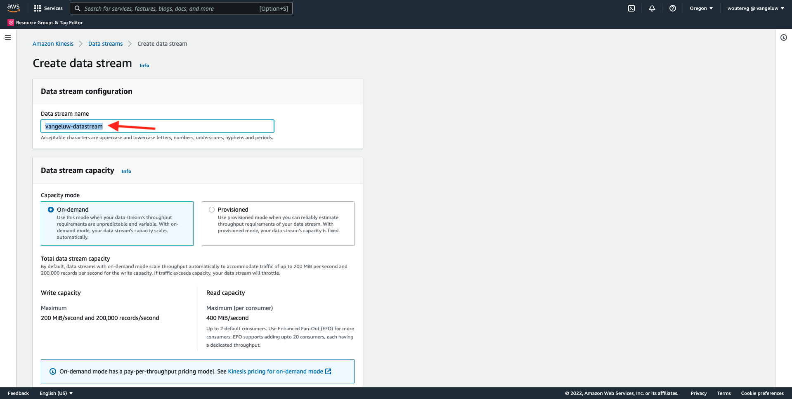

Não é necessário alterar nenhuma das outras configurações. Role para baixo e clique em **Criar fluxo de dados**.


Você verá isso. Depois que o fluxo de dados for criado com êxito, você poderá seguir para o próximo exercício.


## 14.5.3 Configurar o fluxo de entrega do AWS Firehose

No **Localizar Serviços** , pesquisar por **cinese**. Clique em **Kinesis Data Firehose**.

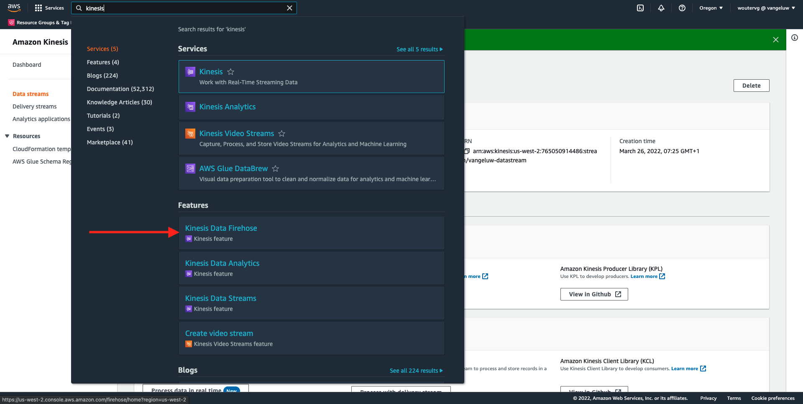

Clique em **Criar fluxo de delivery**.


Para **Origem**, selecione **Fluxos de dados do Amazon Kinesis**. Para **Destino**, selecione **Amazon S3**. Clique em **Procurar** para selecionar o fluxo de dados.


Selecione o fluxo de dados. Clique em **Choose**.


Você verá isso. Lembre-se do **Nome do fluxo de delivery** como você precisará mais tarde.


Role para baixo até ver **Configurações de destino**. Clique em **Procurar** para selecionar seu bucket S3.


Selecione o bucket S3 e clique em **Choose**.


Você verá algo assim. Atualize as seguintes configurações:

- Particionamento dinâmico: defina como **Ativado**
- Desagregação de vários registros: defina como **Desabilitado**
- Delimitador de nova linha: defina como **Ativado**
- Análise em linha para JSON: defina como **Ativado**

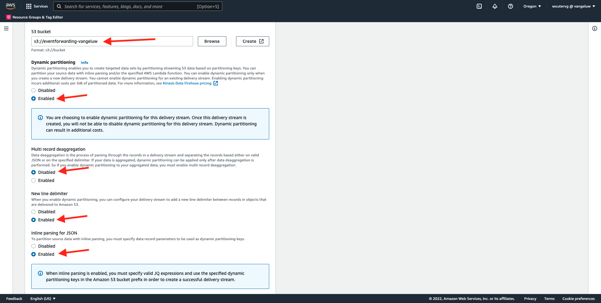

Percorra um pouco para baixo e verá isso. Atualize as seguintes configurações:

- Chaves dinâmicas de partição
   - Nome da chave: **dynamicPartitioningKey**
   - Expressão JQ: **.dynamicPartitioningKey**
- Prefixo do bucket S3: adicione o seguinte código:

```bash
!{partitionKeyFromQuery:dynamicPartitioningKey}/!{timestamp:yyyy}/!{timestamp:MM}/!{timestamp:dd}/!{timestamp:HH}/}
```

- Prefixo de saída do erro de bucket S3: defina como **erro**


Finalmente, role para baixo um pouco mais e clique em **Criar fluxo de delivery**


Após alguns minutos, seu fluxo de delivery será criado e **Ativo**.

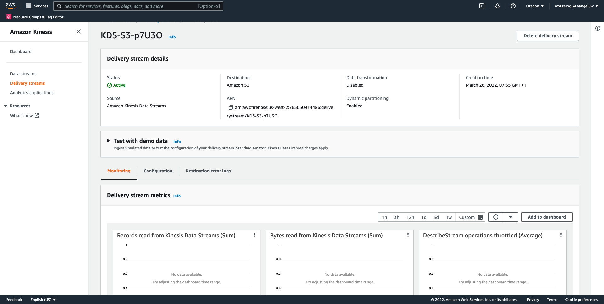

## 14.5.4 Configurar sua função do AWS IAM

No **Localizar Serviços** , pesquisar por **iam**. Clique em **Gateway de API**.


Clique em **Funções**.

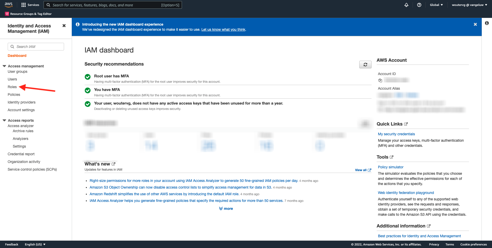

Procure por seu **KinesisFirehose** função. Clique para abri-lo.


Clique no nome da Política de permissões para abri-la.


Na nova tela que será aberta, clique em **Editar política**.


Em **Kinesis** - **Ações**, assegure que **Gravar** permissões para **PutRecord** estiver ativado. Clique em **Política de revisão**.


Clique em **Salvar alterações**.


Então você estará de volta. Clique em **Funções**.


Procure por seu **KinesisFirehose** função. Clique para abri-lo.


Ir para **Relações de confiança** e clique em **Editar política de confiança**.


Substitua a política de confiança atual colando este código para substituir o código existente:

```json
{
	"Version": "2012-10-17",
	"Statement": [
		{
			"Effect": "Allow",
			"Principal": {
				"Service": [
                    "firehose.amazonaws.com",
                    "kinesis.amazonaws.com",
                    "apigateway.amazonaws.com"
                ]
			},
			"Action": "sts:AssumeRole"
		}
	]
}
```

Clique em **Atualizar política**


Você verá isso. Você precisará especificar a variável **SAIBA** para essa função na próxima etapa.


## 14.5.5 Configurar o gateway da API do AWS

O Amazon API Gateway é um serviço da AWS para criar, publicar, manter, monitorar e proteger REST, HTTP e APIs do WebSocket em qualquer escala. Os desenvolvedores de API podem criar APIs que acessam o AWS ou outros serviços da Web, bem como dados armazenados na AWS Cloud.

Agora você exporá o fluxo de dados do Kinesis para a Internet por meio de um terminal HTTPS que pode ser consumido diretamente pelos serviços da Adobe, como o Encaminhamento de eventos.

No **Localizar Serviços** , pesquisar por **gateway de api**. Clique em **Gateway de API**.


Você verá algo assim. Clique em **Criar API**.


Clique em **Criar** no **REST API** cartão.


Você verá isso. Preencha as configurações desta forma:

- Escolha o protocolo : select **REST**
- Criar nova API: select **Nova API**
- Configurações:
   - Nome da API: use `--demoProfileLdap---eventforwarding`
   - Tipo de Endpoint: select **Regional**

Clique em **Criar API**.


Você verá isso. Clique em **Ações** e, em seguida, clique em **Criar recurso**.


Você verá isso. Definir **Nome do recurso** para **fluxo**. Clique em **Criar recurso**.


Você verá isso. Clique em **Ações** e, em seguida, clique em **Criar método**.


Na lista suspensa , selecione **POST** e clique no botão **v** botão.

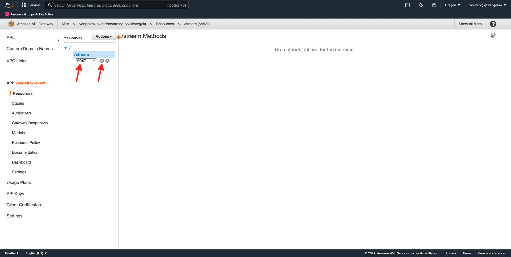

Você verá isso. Preencha as configurações desta forma:

- Tipo de integração: **Serviço AWS**
- Região do AWS: selecione a região usada pelo seu Kinesis Data Stream, neste caso: **us-west-2**
- Serviço AWS: select **Kinesis**
- Subdomínio do AWS: deixar vazio
- Método HTTP: select **POST**
- Tipo de ação: select **Usar nome da ação**
- Ação: enter **PutRecord**
- Função de execução: cole o **SAIBA** da função de execução usada pelo Kinesis Data Firehose, conforme instruído no exercício anterior
- Manuseio de conteúdo: select **Passagem**
- Usar tempo limite padrão: ativar a caixa de seleção

Clique em **Salvar**.


Você verá isso. Clique em **Solicitação de integração**.


Clique em **Cabeçalhos HTTP**.


Role para baixo um pouco e clique **Adicionar cabeçalho**.


Definir **Nome** para **Tipo de conteúdo**, definir **Mapeado de** para `'application/x-amz-json-1.1'`. Clique no botão **v** para salvar suas alterações.


Você verá isso. Para **Passagem do corpo da solicitação**, selecione **Quando não houver modelos definidos (recomendado)**. Em seguida, clique em **Adicionar modelo de mapeamento**.

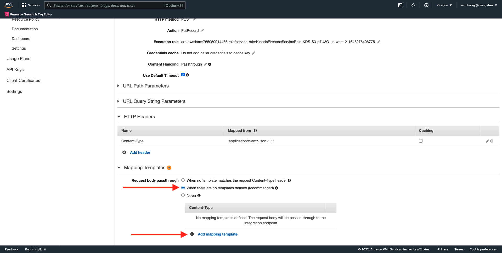

Em **Tipo de conteúdo**, insira **application/json**. Clique no botão **v** para salvar suas alterações.


Role para baixo para localizar uma janela do editor de código. Cole o código abaixo aqui:

```json
{
  "StreamName": "$input.path('StreamName')",
  "Data": "$util.base64Encode($input.json('$.Data'))",
  "PartitionKey": "$input.path('$.PartitionKey')"
}
```

Clique em **Salvar**.


Em seguida, role para cima e clique em **&lt;- Execução do método** para voltar.


Clique em **TESTE**.


Role para baixo e cole este código em **Corpo da solicitação**. Clique em **Teste**.

```json
{
  "Data": {
    "message": "Hello World",
    "dynamicPartitioningKey": "v2"
  },
  "PartitionKey": "1",
  "StreamName": "--demoProfileLdap---datastream"
}
```


Você verá um resultado semelhante:


Você verá isso. Clique em **Ações** e, em seguida, clique em **Implantar API**.


Para **Fase de implantação**, selecione **Nova Fase**. As **Nome da fase**, insira **prod**. Clique em **Implantar**.


Você verá isso. Clique em **Salvar alterações**. FYI: o URL na imagem é o URL para o qual enviar dados (neste exemplo: https://vv1i5vwg2k.execute-api.us-west-2.amazonaws.com/prod).


Você pode testar sua configuração usando a solicitação de cURL abaixo, tudo o que você precisa fazer é substituir o URL abaixo pelo seu, `https://vv1i5vwg2k.execute-api.us-west-2.amazonaws.com/prod` neste exemplo, e adicione `/stream` no final do URL.

```json
curl --location --request POST 'https://vv1i5vwg2k.execute-api.us-west-2.amazonaws.com/prod/stream' \
--header 'Content-Type: application/json' \
--data-raw '{
    "Data": {
        "userid": "--demoProfileLdap--@adobe.com",
        "firstName":"--demoProfileLdap--",
        "offerName":"10% off on outdoor gears",
        "offerCode": "10OFF-SPRING",
        "dynamicPartitioningKey": "campaign"
    },
    "PartitionKey": "1",
    "StreamName": "--demoProfileLdap---datastream"
}'
```

Cole o código atualizado acima em uma janela do Terminal e pressione enter. Em seguida, você verá essa resposta, semelhante à resposta que você poderia ver ao testar acima.


## 14.5.6 Atualize sua propriedade de Encaminhamento de eventos

Agora é possível ativar o para o fluxo de dados do AWS Kinesis por meio do gateway da API do AWS, para enviar os eventos de experiência brutos para o ecossistema do AWS. Com as Conexões do Real-Time CDP e o Encaminhamento de eventos, agora é possível habilitar facilmente o encaminhamento de eventos para o endpoint do Gateway de API da AWS recém-criado.

### 14.5.6.1 Atualize sua propriedade de Encaminhamento de eventos: Criar um elemento de dados

Ir para [https://experience.adobe.com/#/data-collection/](https://experience.adobe.com/#/data-collection/) e ir para **Encaminhamento de evento**. Pesquise sua propriedade Encaminhamento de eventos e clique nela para abri-la.


No menu esquerdo, acesse **Elementos de dados**. Clique em **Adicionar elemento de dados**.

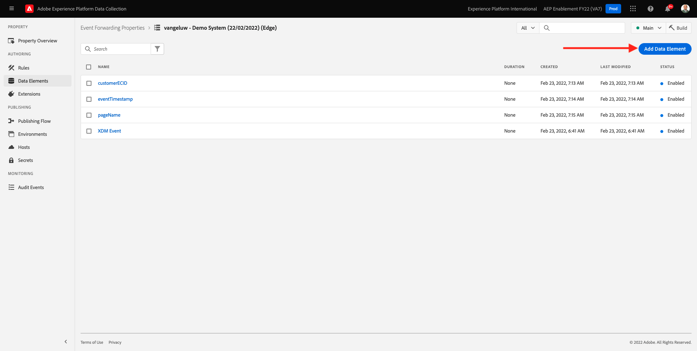

Você verá um novo elemento de dados para configurar.


Faça a seguinte seleção:

- Como **Nome**, insira **awsDataObject**.
- Como **Extensão**, selecione **Núcleo**.
- Como **Tipo de elemento de dados**, selecione **Código personalizado**.

Agora você terá isso. Clique em **&lt;/> Abrir editor**.


No Editor, cole o seguinte código na linha 3. Clique em **Salvar**.

```javascript
const newObj = {...arc.event.xdm, dynamicPartitioningKey: "event_forwarding"}
return JSON.stringify(newObj);
```

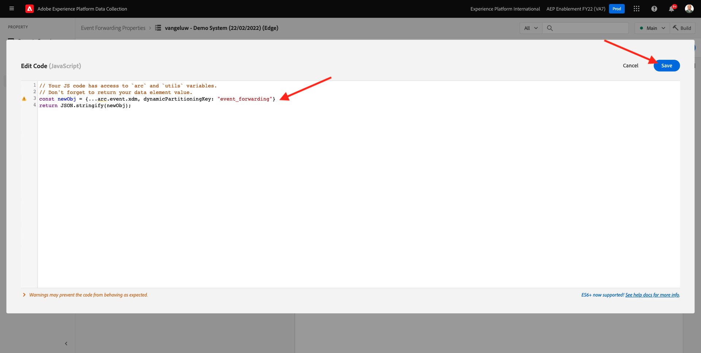

>[!NOTE]
>
>No caminho acima, é feita referência a **arco**. **arco** significa Contexto de Recurso do Adobe e **arco** sempre representa o objeto mais alto disponível no contexto do lado do servidor. Podem ser acrescentados, a este último, enriquecimentos e transformações **arco** objeto que usa funções do Servidor de coleta de dados da Adobe Experience Platform.
>
>No caminho acima, é feita referência a **evento**. **evento** significa um evento exclusivo e o Adobe Experience Platform Data Collection Server sempre avaliará cada evento individualmente. Às vezes, você pode ver uma referência para **events** no payload enviado pelo lado do cliente do SDK da Web, mas no Adobe Experience Platform Data Collection Event Forwarding, cada evento é avaliado individualmente.

Então você estará de volta. Clique em **Salvar** ou **Salvar na biblioteca**.


### 14.5.6.2 Atualize sua propriedade do Servidor de coleta de dados do Adobe Experience Platform: Atualizar sua regra

No menu esquerdo, acesse **Regras**. Clique em para abrir a regra **Todas as páginas** que você criou em um dos exercícios anteriores.


Você verá isso. Clique no botão **+** para adicionar uma nova ação.


Você verá isso. Faça a seguinte seleção:

- Selecione o **Extensão**: **Conector da nuvem do Adobe**.
- Selecione o **Tipo de ação**: **Efetuar chamada de busca**.

Isso deveria dar-vos isto **Nome**: **Conector da Adobe Cloud - Efetuar chamada de busca**. Agora você deve ver o seguinte:

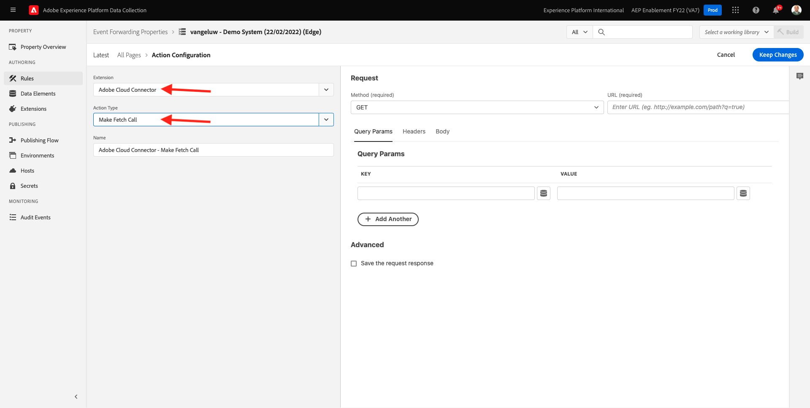

Em seguida, configure o seguinte:

- Altere o método de solicitação de GET para **POST**
- Insira o URL do endpoint do gateway da API do AWS que você criou em uma das etapas anteriores, a saber: `https://vv1i5vwg2k.execute-api.us-west-2.amazonaws.com/prod/stream`

Você deveria ter isso agora. Em seguida, acesse **Cabeçalhos**.


Em cabeçalhos, adicione um novo cabeçalho com chave **Tipo de conteúdo** e valor **application/json**. Em seguida, acesse **Corpo**.

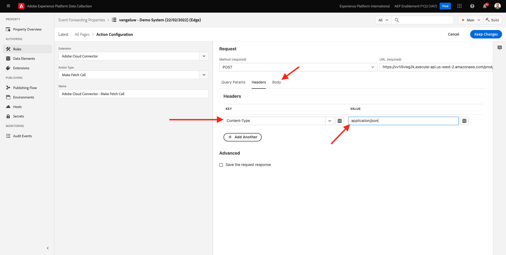

Você verá isso. Cole o seguinte código no campo **Corpo (Bruto)**. Clique em **Manter alterações**.

```json
{
    "Data":{{awsDataObject}},
    "PartitionKey": "1",
    "StreamName": "--demoProfileLdap---datastream"
}
```


Você verá que está de volta aqui. Clique em **Salvar** ou **Salvar na biblioteca**.


Agora você configurou sua primeira regra em uma propriedade de Encaminhamento de eventos. Ir para **Fluxo de publicação** para publicar suas alterações.
Abra a biblioteca de desenvolvimento clicando em **Principal**.


Clique no botão **Adicionar todos os recursos alterados** , depois disso, suas alterações na Regra e no Elemento de dados serão exibidas nessa biblioteca. Em seguida, clique em **Salvar e criar para desenvolvimento**. Suas alterações estão sendo implantadas.


Após alguns minutos, você verá que a implantação foi concluída e está pronta para ser testada.


## 14.5.7 Teste sua configuração

Ir para [https://builder.adobedemo.com/projects](https://builder.adobedemo.com/projects). Depois de fazer logon com sua Adobe ID, você verá isso. Clique no projeto do seu site para abri-lo.

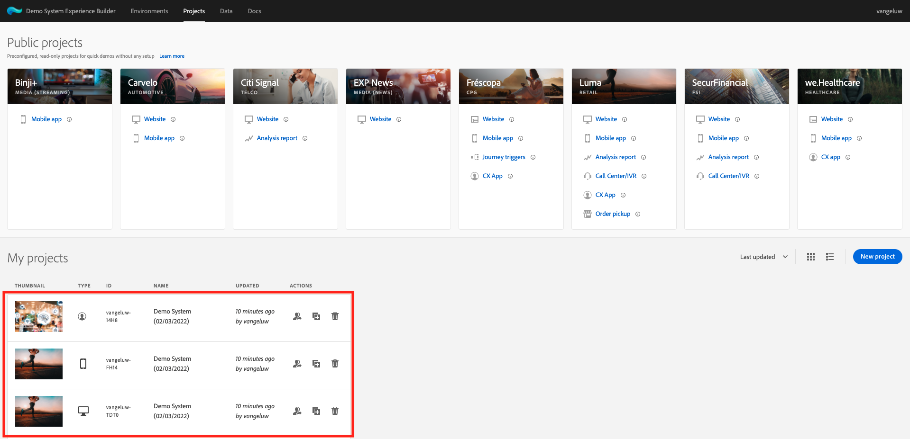

Agora você pode seguir o fluxo abaixo para acessar o site. Clique em **Integrações**.


No **Integrações** , é necessário selecionar a propriedade Data Collection criada no exercício 0.1.


Você verá seu site de demonstração aberto. Selecione o URL e copie-o para a área de transferência.


Abra uma nova janela incógnita do navegador.


Cole o URL do site de demonstração, que você copiou na etapa anterior. Em seguida, você será solicitado a fazer logon usando sua Adobe ID.

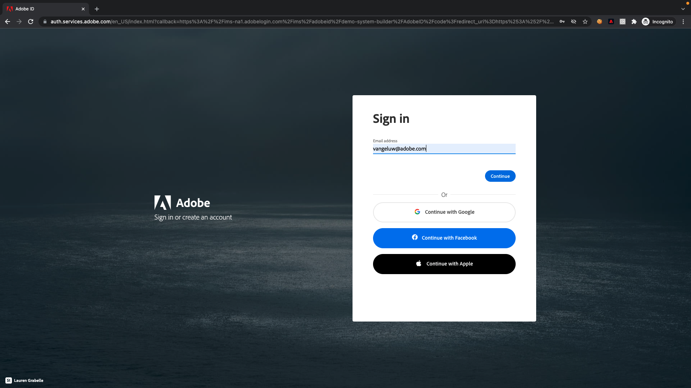

Selecione o tipo de conta e conclua o processo de logon.


Você verá seu site carregado em uma janela incógnita do navegador. Para cada demonstração, você precisará usar uma nova janela incógnita do navegador para carregar o URL do site de demonstração.


Ao abrir a Visualização do desenvolvedor do navegador, você pode inspecionar as solicitações de rede, conforme indicado abaixo. Ao usar o filtro **interagir**, você verá as solicitações de rede enviadas pelo cliente de coleta de dados da Adobe Experience Platform para a Adobe Edge.


Se você selecionar a carga bruta, acesse [https://jsonformatter.org/json-pretty-print](https://jsonformatter.org/json-pretty-print) e cole a carga. Clique em **Tornar bonito**. Você verá a carga JSON, a **events** e o **xdm** objeto. Em uma das etapas anteriores, ao definir o Elemento de dados, a referência **arc.event.xdm**, o que resultará na análise da variável **xdm** objeto desta carga.


Alterne sua exibição para **AWS**. Ao abrir seu fluxo de dados e entrar na **Monitoramento** , você verá o tráfego de entrada.


Ao abrir seu fluxo de delivery e acessar o **Monitoramento** , você também verá o tráfego de entrada.

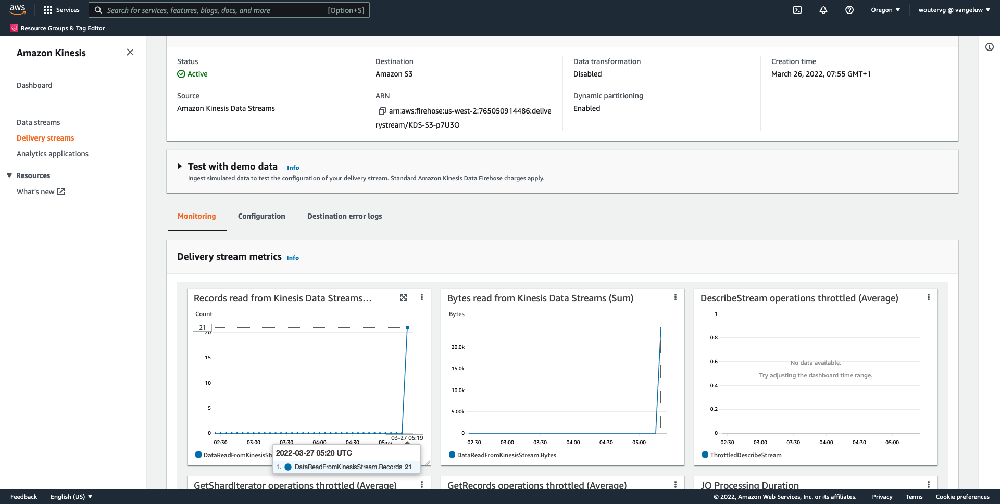

Por fim, quando você observar seu bucket S3, verá arquivos sendo criados lá como consequência da assimilação de dados.


Ao baixar esse arquivo e abri-lo usando um editor de texto, você verá que ele contém a carga XDM dos eventos que foram encaminhados.


Próxima etapa: [Resumo e benefícios](./summary.md)

[Voltar ao Módulo 14](./aep-data-collection-ssf.md)

[Voltar para todos os módulos](./../../overview.md)
