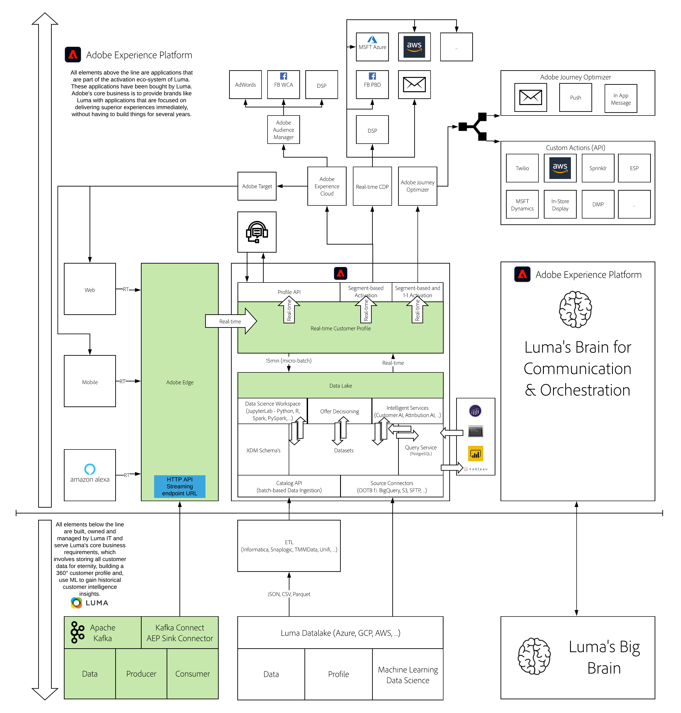

# 15. Transmitir dados do Apache Kafka para o Adobe Experience Platform

**Autores: [Vivek Tiwari](https://www.linkedin.com/in/vivek-tiwari-25092656/), [Nipun Nair](https://www.linkedin.com/in/nipunnair/), [Wouter Van Geluwe](https://www.linkedin.com/in/woutervangeluwe/)**

Neste módulo, você aprenderá a configurar seu próprio cluster Apache Kafka, definir tópicos, produtores e consumidores e transmitir dados para o Adobe Experience Platform usando o Adobe Experience Platform Sink Connector por meio do Kafka Connect.

## Objetivos de aprendizagem

- Executar uma configuração básica de um cluster Kafka local
- Crie um tópico do Kafka, use um produtor Kafka e um consumidor Kafka
- Configure o Kafka Connect e o Adobe Experience Platform Sink Connector
- Produza eventos manualmente e veja esses eventos serem assimilados no Adobe Experience Platform
- Usar uma biblioteca de produtores do Twitter existente do Kafka Connect para transmitir dados do Twitter ao Adobe Experience Platform

## Pré-requisitos

- O Java JDK11 ou superior precisa ser instalado no seu computador. Você pode baixar esse JDK aqui: [https://www.oracle.com/java/technologies/javase-jdk11-downloads.html](https://www.oracle.com/java/technologies/javase-jdk11-downloads.html)
- Acesso à Adobe Experience Platform

## Visão geral da arquitetura

Consulte a arquitetura abaixo, que destaca os componentes que serão discutidos e usados neste módulo.

## Sandbox para usar

Para este módulo, use esta sandbox: `--aepSandboxId--`.

>[!NOTE]
>
>Não se esqueça de instalar, configurar e usar a Extensão do Chrome, conforme referenciado em [0.1 - Instalar a extensão do Chrome para a documentação do Experience League](../module0/ex1.md)

## Exercícios

[15.1 Introdução ao Apache Kafka](./ex1.md)

Neste exercício, você aprenderá sobre as noções básicas do Apache Kafka

[15.2 Instalar e configurar seu cluster do Kafka](./ex2.md)

Neste exercício, você baixará, instalará e configurará seu cluster básico Apache Kafka.

[15.3 Configurar endpoint de transmissão da API HTTP no Adobe Experience Platform](./ex3.md)

Neste exercício, você configurará um Conector de origem da API HTTP no Adobe Experience Platform.

[15.4 Instale e configure o Kafka Connect e o conector do dissipador de tinta Adobe Experience Platform](./ex4.md)

Neste exercício, você usará o Kafka Connect para instalar e usar o Adobe Experience Platform Sink Connector e enviará eventos para o Adobe Experience Platform manualmente.

[Resumo e benefícios](./summary.md)

Resumo deste módulo e visão geral dos benefícios.

>[!NOTE]
>
>Obrigado por investir seu tempo em aprender tudo o que há para saber sobre a Adobe Experience Platform. Se você tiver dúvidas, queira compartilhar comentários gerais de suas sugestões sobre conteúdo futuro, entre em contato diretamente com Wouter Van Geluwe, enviando um email para **vangeluw@adobe.com**.

[Voltar para todos os módulos](../../overview.md)
