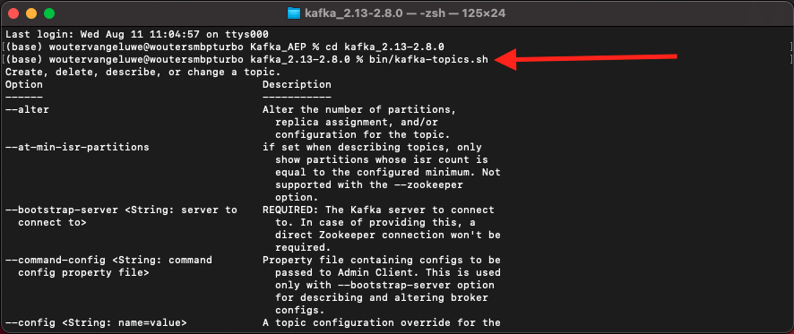

# 15.2 Instalar e configurar seu cluster do Kafka

## 15.2.1 Baixar o Apache Kafka

Ir para [https://kafka.apache.org/downloads](https://kafka.apache.org/downloads) e faça o download da versão mais recente. Selecione a versão binária mais recente, neste caso **Scala 2.13**.

Você é levado a um espelho. Clique no link sugerido para baixar o Kafka.

Crie uma pasta na área de trabalho com o nome **Kafka_AEP** e coloque o arquivo baixado nesse diretório.

Abra um **Terminal** clicando com o botão direito do mouse na pasta e clicando em **Novo terminal na pasta**.

Execute este comando na janela Terminal para descompactar o arquivo baixado:

`tar -xvf kafka_2.13-3.1.0.tgz`

>[!NOTE]
>
>Verifique se o comando acima corresponde à versão do arquivo baixado. Se a sua versão for mais recente, será necessário atualizar o comando acima para corresponder a essa versão.

Você verá isso:

Depois de descompactar esse arquivo, agora há um diretório como este:

E nesse diretório, você verá esses subdiretórios:

Volte para a janela Terminal. Digite o seguinte comando:

`cd kafka_2.13-3.1.0`

>[!NOTE]
>
>Verifique se o comando acima corresponde à versão do arquivo baixado. Se a sua versão for mais recente, será necessário atualizar o comando acima para corresponder a essa versão.

Em seguida, digite o comando `bin/kafka-topics.sh`.

Você deverá ver essa resposta. Isso significa que o Kafka está instalado corretamente e que o Java está funcionando bem. (Lembrete: você precisa do JDK Java 8 ou Java 11 JDK instalado para que isso funcione! Você pode ver qual versão do Java instalou usando o comando `java -version`.)

## 15.2.2 Iniciar Kafka

Para começar Kafka, você precisa começar o Zookeeper Kafka e Kafka, nesta ordem.

Abra um **Terminal** clicando com o botão direito do mouse em sua pasta **kafka_2.13-3.1.0** e clicando em **Novo terminal na pasta**.

Digite este comando:

`bin/zookeeper-server-start.sh config/zookeeper.properties`

Você verá isso:

Mantenha essa janela aberta enquanto passa por esses exercícios!

Abra outro, novo **Terminal** clicando com o botão direito do mouse em sua pasta **kafka_2.13-3.1.0** e clicando em **Novo terminal na pasta**.

Digite este comando:

`bin/kafka-server-start.sh config/server.properties`

Você verá isso:

Mantenha essa janela aberta enquanto passa por esses exercícios!

## 15.2.3 Criar um tópico do Kafka

Abra um **Terminal** clicando com o botão direito do mouse em sua pasta **kafka_2.13-3.1.0** e clicando em **Novo terminal na pasta**.

Digite este comando para criar um novo tópico do Kafka com o nome **aeptest**. Este tópico será usado para testes neste exercício.

`bin/kafka-topics.sh --create --topic aeptest --bootstrap-server localhost:9092`

Você verá uma confirmação semelhante:

Digite este comando para criar um novo tópico do Kafka com o nome **aep**. Este tópico será usado pelo Adobe Experience Platform Sink Connector que você configurará nos próximos exercícios.

`bin/kafka-topics.sh --create --topic aep --bootstrap-server localhost:9092`

Você verá uma confirmação semelhante:

## 15.2.4 Produzir eventos

Volte para a janela Terminal na qual você criou seu primeiro tópico do Kafka e insira o seguinte comando:

`bin/kafka-console-producer.sh --broker-list 127.0.0.1:9092 --topic aeptest`

Você verá isso. Cada nova linha seguida do botão Inserir resultará no envio de uma nova mensagem para o tópico **aeptest**.

Enter `Hello AEP` e pressione Enter. Seu primeiro evento foi enviado para sua instância Kafka local, para o tópico **aeptest**.

Enter `Hello AEP again.` e pressione Enter.

Enter `AEP Data Collection is the best.` e pressione Enter.

Agora você produziu três eventos no tópico **aeptest**. Esses eventos agora podem ser consumidos por um aplicativo que pode precisar desses dados.

No teclado, clique em `Control` e `C` ao mesmo tempo para fechar seu produtor.

## 15.2.4 Eventos de consumo

Na mesma janela Terminal usada para produzir eventos, digite o seguinte comando:

`bin/kafka-console-consumer.sh --bootstrap-server 127.0.0.1:9092 --topic aeptest --from-beginning`

Você verá todas as mensagens que foram produzidas no exercício anterior para o tópico **aeptest**, aparecem no consumidor. O Apache Kafka funciona assim: um produtor cria eventos em um pipeline, e um consumidor consome esses eventos.

No teclado, clique em `Control` e `C` ao mesmo tempo para fechar seu produtor.

Neste exercício, você passou por todas as noções básicas para configurar um cluster Kafka local, criar um tópico Kafka, produzir eventos e consumir eventos.

O objetivo desse módulo é simular o que aconteceria se uma organização real já tivesse implementado um cluster Apache Kafka e quisesse transmitir dados de seu cluster Kafka para o Adobe Experience Platform.

Para facilitar essa implementação, um Conector do Adobe Experience Platform Sink foi criado e pode ser implementado com o Kafka Connect. Você pode encontrar a documentação do Adobe Experience Platform Sink Connector aqui: [https://github.com/adobe/experience-platform-streaming-connect](https://github.com/adobe/experience-platform-streaming-connect).

Nos próximos exercícios, você implementará tudo o que precisa para usar o Adobe Experience Platform Sink Connector de dentro de seu próprio cluster Kafka local.

Feche a janela do terminal.

Terminou este exercício.

Próxima etapa: [15.3 Configurar endpoint da API HTTP no Adobe Experience Platform](./ex3.md)

[Voltar ao Módulo 15](./aep-apache-kafka.md)

[Voltar para todos os módulos](../../overview.md)
