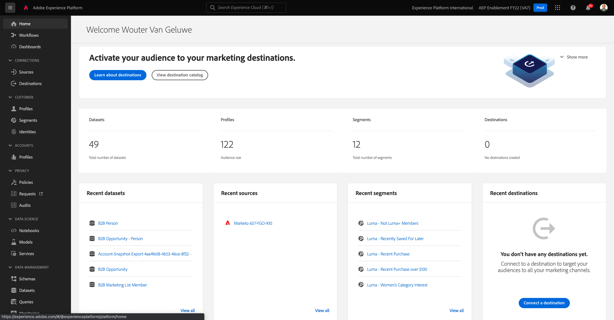

# 15.3 Configurar endpoint de transmissão da API HTTP no Adobe Experience Platform

Antes de configurar o Conector do Adobe Experience Platform Sink no Kafka, é necessário criar um Conector de fonte de API HTTP no Adobe Experience Platform. O URL do ponto de extremidade de Transmissão da API HTTP é necessário para configurar o Conector do Sink do Adobe Experience Platform.

Para criar um Conector de origem da API HTTP, faça logon no Adobe Experience Platform acessando este URL: [https://experience.adobe.com/platform](https://experience.adobe.com/platform).

Depois de fazer logon, você será direcionado para a página inicial do Adobe Experience Platform.

Antes de continuar, é necessário selecionar um **sandbox**. A sandbox a ser selecionada é chamada de ``--aepSandboxId--``. Você pode fazer isso clicando no texto **[!UICONTROL Produto de produção]** na linha azul na parte superior da tela. Depois de selecionar a sandbox apropriada, você verá a tela mudar e agora estará na sandbox dedicada.

No menu esquerdo, acesse **Fontes** e role para baixo no **Catálogo de Fontes** até que você veja **API HTTP**. Clique em **Adicionar dados**.

Clique em **Nova conta**. Use `--demoProfileLdap-- - Kafka` como o nome da conexão da API HTTP, nesse caso **vangeluw - Kafka**. Ative a caixa de seleção para **Compatível com XDM**. Clique em **Conectar-se à origem**.

Você verá isso, clique em **Próximo**.

Selecionar **Conjunto de dados existente**, abra o menu suspenso. Pesquise e selecione o conjunto de dados **Sistema de demonstração - Conjunto de dados de eventos para Central de chamadas (Global v1.1)**.

Clique em **Próximo**.

Clique em **Próximo**.

Clique em **Concluir**.

Em seguida, você verá uma visão geral do Conector de origem da API HTTP que acabou de criar.

Você precisará copiar o **Ponto de extremidade de transmissão** URL, que se parece com o abaixo, pois você precisará dele no próximo exercício.

`https://dcs.adobedc.net/collection/d282bbfc8a540321341576275a8d052e9dc4ea80625dd9a5fe5b02397cfd80dc`

Terminou este exercício.

Próxima etapa: [15.4 Instale e configure o Kafka Connect e o conector do dissipador de tinta Adobe Experience Platform](./ex4.md)

[Voltar ao Módulo 15](./aep-apache-kafka.md)

[Voltar para todos os módulos](../../overview.md)
