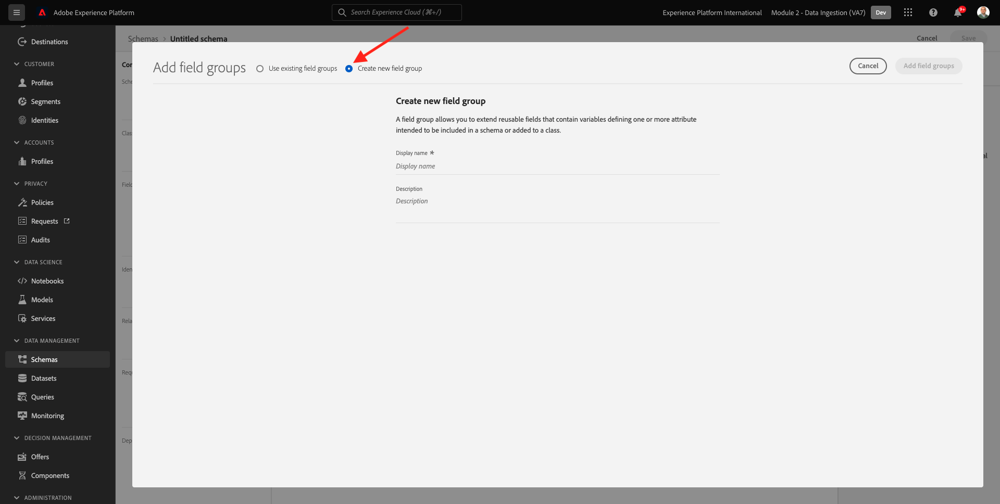
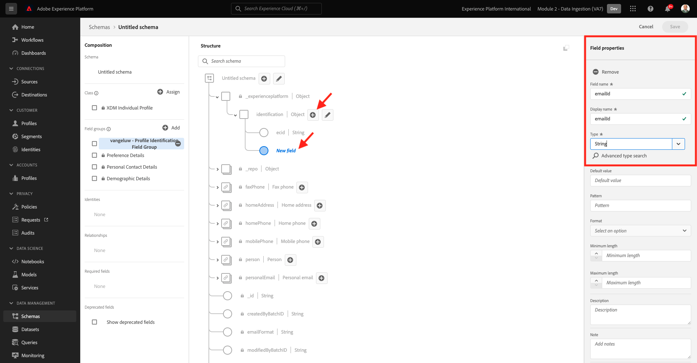
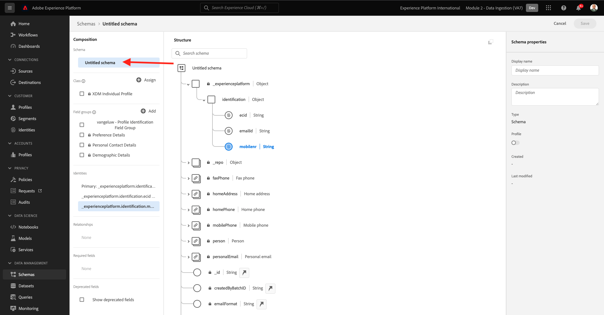
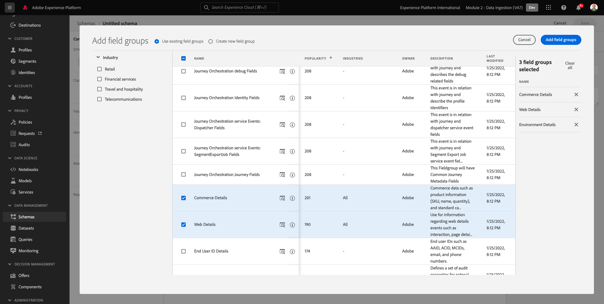
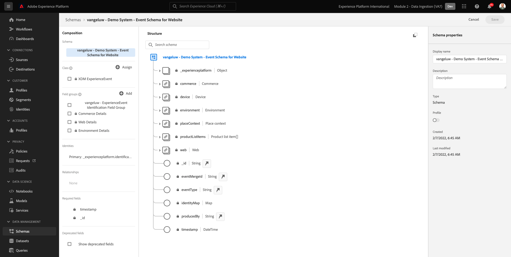
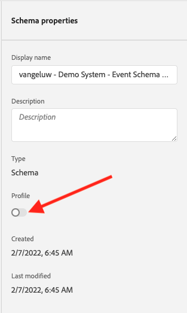

# 2.2 Configurar esquemas e definir identificadores

Neste exercício, você configurará os esquemas XDM necessários para classificar as informações do perfil e o comportamento do cliente. Em cada esquema XDM, também será necessário configurar um identificador principal para vincular todas as informações.

## História

Antes de começar a configurar o Esquema XDM e definir os Identificadores Primários, precisamos pensar no contexto comercial do que estamos tentando fazer:

- Você deseja dados
- Você deseja vincular dados a um cliente
- Você deseja criar um Perfil do cliente progressivo em tempo real

Há dois tipos de dados que queremos capturar:

- Quem é esse cliente?
- O que esse cliente faz?

No entanto, a questão **Quem é esse cliente?** É uma pergunta muito aberta que tem muitas respostas. Quando sua empresa quer que essa pergunta seja respondida, você está procurando informações demográficas como Nome, Sobrenome e Endereço. Mas também para informações de contato, como Endereço de email ou Número de telefone celular. E também para informações vinculadas a Idioma, Aceitação/Não participação e talvez até mesmo imagens de perfil. E finalmente, o que você realmente precisa saber é como vamos identificar esse cliente nos vários sistemas que sua empresa usa.

O mesmo se aplica à questão **O que esse cliente faz?**. É uma pergunta muito aberta com muitas respostas. Quando sua empresa quiser que essa pergunta seja respondida, você está procurando qualquer interação que um cliente tenha tido com qualquer uma de suas propriedades online e offline. Quais páginas ou produtos foram visitados? Esse cliente adicionou um produto ao carrinho ou até comprou um item? Qual dispositivo e navegador foram usados para navegar no site? Que tipo de informação este cliente está procurando e como podemos usá-la para configurar e fornecer uma experiência agradável a este cliente? E finalmente, o que realmente precisamos saber é como vamos identificar esse cliente nos vários sistemas que sua empresa usará.

## 2.1.1 - Quem é este cliente

Capturando a resposta para **Quem é esse cliente?** para sua empresa, é feito por meio da página Logon/Registro .

Da perspectiva do Esquema, olhamos para isto como um **Classe**. A questão: **Quem é esse cliente?** é algo que definimos na Classe **[!UICONTROL Perfil individual XDM]**.

Assim, ao criar um Esquema XDM para capturar a resposta para **Quem é esse cliente?**, primeiro, você precisará criar e definir 1 schema que faça referência à classe **[!UICONTROL Perfil individual XDM]**.

Para especificar que tipo de resposta pode ser dada a essa pergunta, você precisará definir [!UICONTROL Grupos de campos]. [!UICONTROL Grupos de campos] são extensões da classe Profile e têm configurações muito específicas. Por exemplo, informações demográficas como Nome, Sobrenome, Gênero e Aniversário são parte do [!UICONTROL Grupo de campos]: **[!UICONTROL Detalhes demográficos]**.

Em segundo lugar, sua empresa precisa decidir como identificar esse cliente. No caso de sua empresa, o identificador principal de um cliente conhecido pode ser uma ID de cliente específica, como, por exemplo, um endereço de email. Tecnicamente, existem outras maneiras de identificar um cliente em sua empresa, como usar um número de telefone celular.
Neste laboratório, definiremos o endereço de email como o identificador principal e o número de telefone como um identificador secundário.

Por fim, é importante distinguir o canal em que os dados foram capturados. Nesse caso, falaremos sobre Registros de site e o schema que precisa ser definido precisa refletir **em que** os dados de registro foram capturados. O canal também terá um papel importante para influenciar quais dados são capturados. Dessa forma, é uma prática recomendada definir esquemas para cada combinação de canal, identificador principal e tipo de dados coletados.

Com base no acima, você precisará configurar um Esquema no Adobe Experience Platform.

Faça logon no Adobe Experience Platform acessando este URL: [https://experience.adobe.com/platform](https://experience.adobe.com/platform).

Depois de fazer logon, você será direcionado para a página inicial do Adobe Experience Platform.

Antes de continuar, é necessário selecionar um **sandbox**. A sandbox a ser selecionada é chamada de ``--module2sandbox--``. Você pode fazer isso clicando no texto **[!UICONTROL Produto de produção]** na linha azul na parte superior da tela. Depois de selecionar a sandbox apropriada, você verá a tela mudar e agora estará na sandbox dedicada.

No Adobe Experience Platform, clique em **[!UICONTROL Esquemas]** no menu no lado esquerdo da tela. Você verá a lista de [!UICONTROL Esquemas].

Você deve criar um novo schema. Para criar um novo schema, clique no botão **[!UICONTROL + Criar esquema]** e selecione **[!UICONTROL Perfil individual XDM]**.

Depois de clicar no botão **[!UICONTROL + Criar esquema]** , um novo schema é criado e você será solicitado a selecionar ou criar **grupos de campos**.

Agora você precisa definir qual resposta para a pergunta **Quem é esse cliente?** deveria parecer.
Na introdução deste laboratório, observamos a necessidade dos seguintes atributos para definir um cliente:

- Informações demográficas como Nome, Sobrenome e Endereço
- Informações de contato como endereço residencial, endereço de email ou número de telefone celular
- Outras informações vinculadas a Idioma, Aceitação/Não participação e talvez até mesmo imagens de perfil.
- Identificador principal para um cliente

Para tornar essas informações parte do esquema, é necessário adicionar o seguinte [!UICONTROL Grupos de campos] ao esquema:

- Detalhes demográficos (informações demográficas)
- Detalhes de contato pessoal (Informações de contato)
- Detalhes da Preferência (Outras Informações)
- grupo de campos de identificação de perfil personalizado de sua empresa (identificadores primário e secundário)

No **[!UICONTROL Adicionar grupo de campos]** selecione o [!UICONTROL Grupo de campos] **[!UICONTROL Detalhes demográficos]**, **[!UICONTROL Detalhes de contato pessoal]** e **[!UICONTROL Detalhes da Preferência]**.

Clique no botão **[!UICONTROL Adicionar grupos de campos]** para adicionar o botão [!UICONTROL Grupo de campos] ao esquema.

Agora você terá isto:

Em seguida, você precisa de um novo [!UICONTROL Grupo de campos] para capturar a **[!UICONTROL Identificador]** usado para coleta de dados. Como vocês viram no exercício anterior, há um conceito de Identificadores Primários e Secundários. Um Identificador Principal é o mais importante, pois todos os dados coletados serão vinculados a esse Identificador.

Agora você criará seu próprio [!UICONTROL Grupo de campos] e, como tal, você estenderá o [!UICONTROL Esquema XDM] para atender aos requisitos de sua própria empresa.

Clique no botão **[!UICONTROL + Adicionar]** botão para começar a adicionar um [!UICONTROL Grupo de campos].

Em vez de reutilizar um [!UICONTROL Grupo de campos], você criará seu próprio [!UICONTROL Grupo de campos]. Você pode fazer isso selecionando **[!UICONTROL Criar novo grupo de campos]**.

Agora, é necessário fornecer um **[!UICONTROL Nome de exibição]** e **[!UICONTROL Descrição]** para o novo [!UICONTROL Grupo de campos].

Como o nome do nosso schema, usaremos isso:
`--demoProfileLdap-- - Profile Identification Field Group`

Como exemplo, para ldap **[!UICONTROL vangeluco]**, esse deve ser o nome do schema:

**[!UICONTROL vangeluw - Grupo de campos de identificação de perfil]**

Isso deve lhe dar algo assim:

Clique no botão **[!UICONTROL Adicionar grupos de campos]** para adicionar o botão recém-criado [!UICONTROL Grupo de campos] ao esquema.

Agora, você deve ter essa estrutura de schema em vigor.

Seu novo [!UICONTROL Grupo de campos] ainda está vazio, portanto, agora você terá que adicionar campos a [!UICONTROL Grupo de campos].
No [!UICONTROL Grupo de campos]-list, clique em seu [!UICONTROL Grupo de campos].

Agora você vê vários novos botões serem exibidos.

No nível superior do Esquema, clique no botão **[!UICONTROL + Adicionar campo]** botão.

Depois de clicar no botão **[!UICONTROL + Adicionar campo]** , agora você verá um novo **[!UICONTROL objeto]** no esquema. Este objeto representa um **[!UICONTROL objeto]** em seu Esquema e é nomeado após sua ID de locatário da Adobe Experience Platform. Sua ID do locatário do Adobe Experience Platform é `--aepTenantId--`.

Agora você adicionará um novo objeto sob esse locatário. Para fazer isso, clique no campo **[!UICONTROL Novo campo]** sob o objeto tenant.

Use estas definições de objeto:

- Nome do campo: **[!UICONTROL identificação]**
- Nome de exibição:  **[!UICONTROL identificação]**
- Tipo: **[!UICONTROL Objeto]**

Clique em **[!UICONTROL Aplicar]** para salvar as alterações.

Depois de clicar **[!UICONTROL Aplicar]**, agora você verá seu **[!UICONTROL identificação]** no Esquema.

Agora você adicionará 3 novos campos sob a variável  **[!UICONTROL identificação]** objeto:

- ecid:
   - Nome do campo: **[!UICONTROL ecid]**
   - Nome de exibição:  **[!UICONTROL ecid]**
   - Tipo:**[!UICONTROL cadeia de caracteres]**

- emailId
   - Nome do campo: **[!UICONTROL emailId]**
   - Nome de exibição:  **[!UICONTROL emailId]**
   - Tipo:**[!UICONTROL cadeia de caracteres]**

- mobilenr
   - Nome do campo: **[!UICONTROL mobilenr]**
   - Nome de exibição:  **[!UICONTROL mobilenr]**
   - Tipo:**[!UICONTROL cadeia de caracteres]**

Cada campo será definido como tipo **[!UICONTROL String]** e vamos configurar esses campos como **[!UICONTROL Identidades]**. Para o esquema **[!UICONTROL Esquema de registro do site]**, presumimos que um cliente sempre será identificado pelo endereço de email, o que significa que é necessário configurar o campo . **[!UICONTROL emailId]** como **[!UICONTROL principal]** e os outros campos como **[!UICONTROL secundário]** identificadores.

Para adicionar os campos, clique no botão **[!UICONTROL +]** botão ao lado do **[!UICONTROL identificação]** objeto.

Agora você tem um campo vazio. Você precisa configurar os 3 campos acima conforme indicado.

É assim que cada campo deve cuidar da configuração inicial do campo.

Clique no botão **[!UICONTROL +]** botão ao lado do **[!UICONTROL identificação]** para criar um novo campo e preencher os campos conforme indicado.

- ecid

Para salvar seu campo, role para baixo no **[!UICONTROL Propriedades do campo]** até visualizar o botão **[!UICONTROL Aplicar]**. Clique no botão **[!UICONTROL Aplicar]** botão.

Clique no botão **[!UICONTROL +]** botão ao lado do **[!UICONTROL identificação]** para criar um novo campo e preencher os campos conforme indicado.

- emailId

Para salvar seu campo, role para baixo no **[!UICONTROL Propriedades do campo]** até visualizar o botão **[!UICONTROL Aplicar]**. Clique no botão **[!UICONTROL Aplicar]** botão.

Clique no botão **[!UICONTROL +]** botão ao lado do **[!UICONTROL identificação]** para criar um novo campo e preencher os campos conforme indicado.

- mobilenr

Para salvar seu campo, role para baixo no **[!UICONTROL Propriedades do campo]** até visualizar o botão **[!UICONTROL Aplicar]**. Clique no botão **[!UICONTROL Aplicar]** botão.

Agora você tem 3 campos, mas esses campos não foram definidos como **[!UICONTROL Identidade]**-campos ainda.

Para começar a definir esses campos como **[!UICONTROL Identidade]**-campos, siga estas etapas:

- Selecione o campo **[!UICONTROL emailId]**.
- No lado direito, nas propriedades do campo, role para baixo até visualizar **[!UICONTROL Identidade]**. Marque a caixa de seleção para **[!UICONTROL Identidade]**.

   

- Agora marque a caixa de seleção para **[!UICONTROL Identidade principal]**.

   

- Por fim, selecione o namespace **[!UICONTROL Email]** na lista de **[!UICONTROL Namespaces]**. Um Namespace é usado pelo Gráfico de identidade na Adobe Experience Platform para classificar identificadores em namespaces e definir a relação entre esses namespaces.

   

- Finalmente, clique em **[!UICONTROL Aplicar]** para salvar as alterações.

   

Em seguida, é necessário definir os outros campos para **[!UICONTROL ecid]** e **[!UICONTROL mobilenr]** como identificadores secundários.

- Selecione o campo **[!UICONTROL ecid]**.
- No lado direito, nas propriedades do campo, role para baixo até visualizar **[!UICONTROL Identidade]**. Marque a caixa de seleção para **[!UICONTROL Identidade]**.

   

- Em seguida, selecione o namespace **[!UICONTROL ECID]** na lista de **[!UICONTROL Namespaces]**. A [!UICONTROL Namespace] é usada pelo Gráfico de identidade na Adobe Experience Platform para classificar identificadores em namespaces e definir a relação entre esses namespaces.

   

- Clique em **[!UICONTROL Aplicar]** para salvar as alterações.

   

- Selecione o campo **[!UICONTROL mobilenr]**.
- No lado direito, nas propriedades do campo, role para baixo até visualizar **[!UICONTROL Identidade]**. Marque a caixa de seleção para **[!UICONTROL Identidade]**.

   

- Certifique-se de selecionar o namespace **[!UICONTROL Telefone]** na lista de **[!UICONTROL Namespaces]**. Um Namespace é usado pelo Gráfico de identidade na Adobe Experience Platform para classificar identificadores em namespaces e definir a relação entre esses namespaces.

   

- Clique em **[!UICONTROL Aplicar]** para salvar as alterações.

   

O **[!UICONTROL identificação]** Agora, o objeto deve ficar assim, com os 3 campos id também mostrando um **[!UICONTROL impressão digital]** ícone para mostrar que eles foram definidos como identificadores.

Agora vamos dar um nome ao esquema. Selecione o campo **Esquema sem título**.

Como o nome do nosso schema, você usará isto:

`--demoProfileLdap-- - Demo System - Profile Schema for Website`

Substituir **[!UICONTROL ldap]** pelo seu ldap específico. Como exemplo, para ldap **[!UICONTROL vangeluco]**, esse deve ser o nome do schema:

**[!UICONTROL vangeluw - Sistema de demonstração - Esquema de perfil do site]**

Isso deve lhe dar algo assim:

Agora você definiu um Esquema, vinculado existente e recém-criado [!UICONTROL Grupos de campos] e têm identificadores definidos.

Clique em **[!UICONTROL Salvar]** para salvar as alterações.

A última coisa a fazer aqui é ativar o Esquema a ser vinculado ao **[!UICONTROL Perfil]**.
Ao ativar seu esquema para Perfil, você garante que todos os dados enviados para a Adobe Experience Platform em relação a esse esquema façam parte do ambiente de Perfil do cliente em tempo real, o que garante que todos esses dados possam ser usados em tempo real para consultas, segmentação e ativação.

Para fazer isso, vamos selecionar o nome do esquema.

Na guia direita do esquema, você verá um **[!UICONTROL Ativar/desativar perfil]**, que está desativada no momento.

Ative o [!UICONTROL Perfil] - alterne clicando nele.

Você verá esta mensagem:

Clique em **[!UICONTROL Habilitar]** para ativar este esquema no Perfil.

Seu Esquema agora está configurado para fazer parte do [!UICONTROL Perfil do cliente em tempo real].

Finalmente, clique em **[!UICONTROL Salvar]** para salvar o esquema.

### 2.1.2 - O que esse cliente faz

Capturando a resposta à pergunta **O que esse cliente faz?** para sua empresa, é feito por meio de, por exemplo, uma visualização de produto em uma página de produto.

Da perspectiva do schema, vemos isso como uma **[!UICONTROL Classe]**. A questão: **O que esse cliente faz?** é algo que definimos na classe **[!UICONTROL ExperienceEvent]**.

Assim, ao criar um [!UICONTROL Esquema XDM] para capturar a resposta para **O que esse cliente faz?**, primeiro, você precisará criar e definir 1 schema que faça referência à classe **[!UICONTROL ExperienceEvent]**.

Para especificar que tipo de resposta pode ser dada a essa pergunta, você precisará definir [!UICONTROL Grupo de campos]. [!UICONTROL Grupos de campos] são extensões do [!UICONTROL ExperienceEvent]-classe e tem configurações muito específicas. Por exemplo, informações sobre que tipo de produtos um cliente visualizou ou adicionou ao carrinho são parte do [!UICONTROL Grupo de campos] **Detalhes de comércio**.

Em segundo lugar, sua empresa precisa decidir como você identificará o comportamento desse cliente. Como estamos falando de interações em um site, é possível que sua empresa conheça o cliente, mas é igualmente possível que um visitante desconhecido e anônimo esteja ativo no site. Portanto, não podemos usar um identificador como endereço de email. Nesse caso, sua empresa provavelmente decidirá usar a variável [!UICONTROL Experience Cloud ID (ECID)] como o identificador principal.

Por fim, é importante distinguir o canal em que os dados foram capturados. Nesse caso, falaremos sobre interações de site e o schema que precisa ser definido precisa refletir **em que** os dados de interação foram capturados. O canal também terá um papel importante para influenciar quais dados são capturados. Dessa forma, é uma prática recomendada definir esquemas para cada combinação de canal, identificador principal e tipo de dados coletados.

Com base no acima, você precisará configurar um schema no Adobe Experience Platform.

Depois de fazer logon, você será direcionado para a página inicial do Adobe Experience Platform.

Antes de continuar, é necessário selecionar um **[!UICONTROL sandbox]**. O [!UICONTROL sandbox] para selecionar é nomeado ``--module2sandbox--``. Você pode fazer isso clicando no texto **[!UICONTROL Produto de produção]** na linha azul na parte superior da tela. Depois de selecionar a sandbox apropriada, você verá a tela mudar e agora estará na sandbox dedicada.

No Adobe Experience Platform, clique em **[!UICONTROL Esquemas]** no menu no lado esquerdo da tela.

Em [!UICONTROL Esquemas], você verá todos os esquemas existentes.

Você deve criar um novo schema. Para criar um novo schema, clique no botão **[!UICONTROL + Criar esquema]** e selecione **[!UICONTROL ExperiênciaEvento XDM]**.

Depois de clicar no botão **[!UICONTROL + Criar esquema]** , um novo schema é criado e você será solicitado a selecionar ou criar **grupos de campos**.

Agora você precisa definir qual resposta para a pergunta **O que esse cliente faz?** deveria parecer.
Na introdução deste laboratório, observamos a necessidade dos seguintes atributos para definir o que um cliente faz:

- Quais páginas ou produtos foram visitados?
- Esse cliente adicionou um produto ao carrinho ou até comprou um item?
- Qual dispositivo e navegador foram usados para navegar no site?
- Que tipo de informação este cliente está procurando e como podemos usá-la para configurar e fornecer uma experiência agradável a este cliente?
- Identificador principal para um cliente

Para tornar essas informações parte do esquema, é necessário adicionar o seguinte [!UICONTROL Grupo de campos] ao esquema:

- Detalhes da Web
- Detalhes de comércio
- Detalhes do ambiente
- a identificação de perfil personalizada de sua empresa [!UICONTROL Grupo de campos] (Identificadores primário e secundário)

No **[!UICONTROL Adicionar grupo de campos]** selecione o [!UICONTROL Grupos de campos] **[!UICONTROL Detalhes da Web]**, **[!UICONTROL Detalhes de comércio]** e **[!UICONTROL Detalhes do ambiente]**.

Clique no botão **[!UICONTROL Adicionar grupos de campos]** para adicionar o Grupo de campos ao esquema.

Você terá isso:

Em seguida, é necessário criar um novo [!UICONTROL Grupo de campos] para capturar a **[!UICONTROL Identificador]** usado para coleta de dados. Como vocês viram no exercício anterior, há um conceito de Identificadores Primários e Secundários. Um Identificador Principal é o mais importante, pois todos os dados coletados serão vinculados a esse Identificador.

Agora você criará seu próprio [!UICONTROL Grupo de campos] e, como tal, você estenderá o [!UICONTROL Esquema XDM] para atender aos requisitos de sua própria empresa.

A [!UICONTROL Grupo de campos] está vinculada a um [!UICONTROL Classe], portanto, isso significa que você não pode simplesmente reutilizar o criado anteriormente [!UICONTROL Grupo de campos].

Clique no botão **[!UICONTROL + Adicionar]** botão para começar a adicionar um [!UICONTROL Grupo de campos].

Em vez de reutilizar um [!UICONTROL Grupo de campos], você criará seu próprio [!UICONTROL Grupo de campos]. Você pode fazer isso selecionando **[!UICONTROL Criar novo grupo de campos]**.

Agora, é necessário fornecer um **[!UICONTROL Nome de exibição]** e **[!UICONTROL Descrição]** para seu novo Grupo de campos.

Use esta opção para usar o nome do Grupo de campos:

`--demoProfileLdap-- - ExperienceEvent Identification Field Group`

Como exemplo, para ldap **[!UICONTROL vangeluco]**, esse deve ser o nome do schema:

**[!UICONTROL vangeluw - Grupo de campos de identificação do ExperienceEvent]**

Isso deve lhe dar algo assim:

Clique no botão **[!UICONTROL Adicionar grupo de campos]** para adicionar o botão recém-criado [!UICONTROL Grupo de campos] ao esquema.

Agora você deve ter isso [!UICONTROL Esquema] estrutura em vigor.

Seu novo [!UICONTROL Grupo de campos] O ainda está vazio, portanto, agora você terá que adicionar campos a esse Grupo de campos.
No [!UICONTROL Grupo de campos]-list, clique em seu [!UICONTROL Grupo de campos].

Agora você vê vários novos botões serem exibidos.

No nível superior do Esquema, ao lado do Esquema - nome, clique no botão **[!UICONTROL +]** botão.

Depois de clicar no botão **[!UICONTROL +]** , agora você verá um novo **[!UICONTROL objeto]** no esquema. Este objeto representa um **[!UICONTROL objeto]** em seu [!UICONTROL Esquema] e é nomeado a partir da ID do locatário da Adobe Experience Platform. Sua ID do locatário do Adobe Experience Platform é `--aepTenantId--`.

Agora você adicionará um novo objeto sob esse locatário. Para fazer isso, clique no campo **[!UICONTROL Novo campo]** sob o objeto tenant.

Use estas definições de objeto:

- Nome do campo: **[!UICONTROL identificação]**
- Nome de exibição:  **[!UICONTROL identificação]**
- Tipo: **[!UICONTROL Objeto]**

Role para baixo e clique em **[!UICONTROL Aplicar]** para salvar as alterações.

Depois de clicar **[!UICONTROL Aplicar]**, agora você verá seu **[!UICONTROL identificação]** no Esquema.

Agora, você adicionará um novo campo sob a variável  **[!UICONTROL identificação]** objeto.

Clique no botão **[!UICONTROL +]** botão ao lado do **[!UICONTROL identificação]** para criar um novo campo.

O campo ECID será definido como tipo **[!UICONTROL String]** e você configurará esse campo como um **[!UICONTROL Identidade]**. Para o esquema **[!UICONTROL Sistema de demonstração - Esquema de evento para site]**, presumimos que um cliente sempre será identificado por seus [!UICONTROL ECID], o que significa que é necessário configurar o campo **[!UICONTROL ECID]** como **principal** identifier

Agora você tem um campo vazio. Você precisa configurar o campo acima conforme indicado.

- ecid:

   - Nome do campo: **[!UICONTROL ecid]**
   - Nome de exibição:  **[!UICONTROL ecid]**
   - Tipo:**[!UICONTROL cadeia de caracteres]**

É assim que a função [!UICONTROL ecid]-field deve cuidar da configuração inicial do campo:

Role para baixo e clique em **[!UICONTROL Aplicar]**.

Agora você tem um novo campo, mas esse campo não foi definido como um **[!UICONTROL Identidade]**-campo ainda.

Para começar a definir esses campos como **[!UICONTROL Identidade]**-campos, siga estas etapas:

- Selecione o campo **[!UICONTROL ecid]**.
- No lado direito, nas propriedades do campo, role para baixo até visualizar **[!UICONTROL Identidade]**. Marque a caixa de seleção para **[!UICONTROL Identidade]**.

- Agora marque a caixa de seleção para **[!UICONTROL Identidade principal]**.

- Por fim, selecione o namespace **[!UICONTROL ECID]** na lista de **[!UICONTROL Namespaces]**. A [!UICONTROL Namespace] é usada pelo [!UICONTROL Gráfico de identidade] no Adobe Experience Platform para classificar identificadores em namespaces e definir a relação entre esses namespaces.

   

- Finalmente, clique em **[!UICONTROL Aplicar]** para salvar as alterações.

   

O **[!UICONTROL identificação]** agora, o objeto deve ficar assim, com o campo ecid também mostrando um **impressão digital** ícone para mostrar que eles foram definidos como identificadores.

Agora vamos dar um nome ao esquema. Selecione o campo **Esquema sem título**.

Como o nome do nosso schema, usaremos isso:
`--demoProfileLdap-- - Demo System - Event Schema for Website`

Como exemplo, para ldap **[!UICONTROL vangeluco]**, esse deve ser o nome do schema:

**[!UICONTROL vangeluw - Sistema de demonstração - Esquema de evento para site]**

Isso deve lhe dar algo assim:

Clique em **[!UICONTROL Salvar]** para salvar as alterações.

É importante observar que, ao assimilar dados em relação a esse esquema, alguns campos são obrigatórios.
Por exemplo, os campos **[!UICONTROL _id]** e **[!UICONTROL timestamp]** são campos obrigatórios.

- _id precisa conter uma id exclusiva para uma assimilação de dados específica
- o carimbo de data e hora precisa ser o carimbo de data e hora dessa ocorrência, no formato **[!UICONTROL &quot;AAAA-MM-DDTHH:MM:SSSZ&quot;]**, como por exemplo: **[!UICONTROL &quot;2019-04-08T07:20:000Z&quot;]**

Agora você definiu um schema, vinculou os existentes e os recém-criados [!UICONTROL Grupos de campos] e têm identificadores definidos.

A última coisa a fazer aqui é ativar o Esquema a ser vinculado ao **[!UICONTROL Perfil]**.
Ao ativar seu esquema para [!UICONTROL Perfil], certifique-se de que todos os dados enviados para a Adobe Experience Platform em relação a esse esquema façam parte do Perfil do cliente em tempo real, o que garante que todos os dados possam ser usados em tempo real para consultas, segmentação e ativação.

Para fazer isso, vamos selecionar o nome do esquema.

Na guia direita do esquema, você verá um **[!UICONTROL Perfil] alternar**, que está desativada no momento.

Ative o [!UICONTROL Perfil] - alterne clicando nele.

Você verá esta mensagem:

Clique em **[!UICONTROL Habilitar]** para ativar este esquema no Perfil.

Seu esquema agora está configurado para fazer parte do Perfil do cliente em tempo real.

Finalmente, clique em **[!UICONTROL Salvar]** para salvar o esquema.

Agora você terminou de criar esquemas ativados para serem usados no Perfil do cliente em tempo real.

Vamos analisar os conjuntos de dados no próximo exercício.

Próxima etapa: [2.3 Configurar conjuntos de dados](./ex3.md)

[Voltar ao Módulo 2](./data-ingestion.md)

[Voltar para todos os módulos](../../overview.md)
