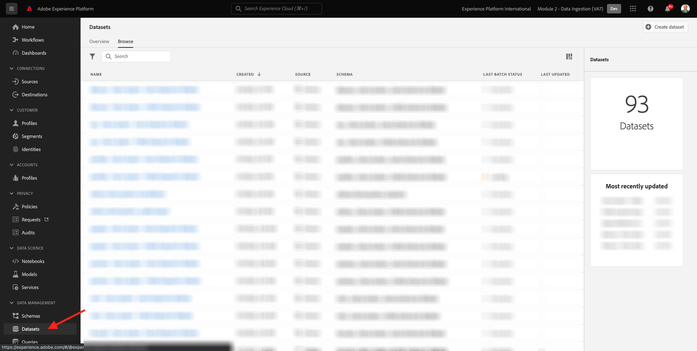
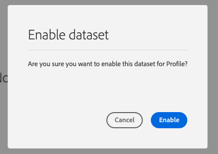

# 2.3 Configurar conjuntos de dados

Neste exercício, você configurará os conjuntos de dados necessários para capturar e armazenar informações de perfil e o comportamento do cliente. Todos os conjuntos de dados criados neste link usarão um dos esquemas criados na etapa anterior.

## História

Depois de definir qual resposta às perguntas **Quem é esse cliente?** e **O que esse cliente faz?** Por exemplo, agora é necessário criar um compartimento que use essas informações para receber e validar os dados enviados para o Adobe Experience Platform.

## 2.3.1 - Criar conjuntos de dados

Agora, é necessário criar dois conjuntos de dados:

- 1 conjunto de dados para capturar as informações que respondem a variável **Quem é esse cliente?** - pergunta.
- 1 conjunto de dados para capturar as informações que respondem a variável **O que esse cliente faz?** - pergunta.

Faça logon no Adobe Experience Platform acessando este URL: [https://experience.adobe.com/platform](https://experience.adobe.com/platform).

Depois de fazer logon, você será direcionado para a página inicial do Adobe Experience Platform.

Antes de continuar, é necessário selecionar um **[!UICONTROL sandbox]**. A sandbox a ser selecionada é chamada de ``--module2sandbox--``. Você pode fazer isso clicando no texto **[!UICONTROL Produto de produção]** na linha azul na parte superior da tela. Depois de selecionar a [!UICONTROL sandbox], você verá a tela mudar e agora você estará em seu [!UICONTROL sandbox].

No Adobe Experience Platform, clique em **[!UICONTROL Conjuntos de dados]** no menu no lado esquerdo da tela.  Você verá isso:

Vamos começar criando o conjunto de dados para capturar as informações de registro do site.

Você deve criar um novo conjunto de dados. Para criar um novo conjunto de dados, clique no botão **[!UICONTROL + Criar conjunto de dados]**.

Depois de clicar no botão **[!UICONTROL + Criar conjunto de dados]** , você verá a tela a seguir.

É necessário definir um conjunto de dados a partir do schema definido na etapa anterior. Clique no botão **[!UICONTROL Criar conjunto de dados a partir do esquema]** - opção.

Na próxima tela, é necessário selecionar o schema criado em 1, `--demoProfileLdap-- - Demo System - Profile Schema for Website`.

Depois de selecionar o schema, clique em **[!UICONTROL Próximo]** para continuar.

Vamos dar um nome ao seu conjunto de dados.

Como o nome do nosso conjunto de dados, use o seguinte:

`--demoProfileLdap-- - Demo System - Profile Dataset for Website`

Como exemplo, para ldap **[!UICONTROL vangeluco]**, esse deve ser o nome do schema:

**[!UICONTROL vangeluw - Sistema de demonstração - Conjunto de dados de perfil para site]**

Isso deve lhe dar algo assim:

Clique em **[!UICONTROL Concluir]** para concluir a configuração do conjunto de dados.

Agora você verá o seguinte:

Volte para o [!UICONTROL Conjuntos de dados] visão geral. Agora você verá o pop-up do conjunto de dados criado na visão geral.

Em seguida, você configurará um segundo conjunto de dados para capturar as interações do site.

Você deve criar um novo conjunto de dados. Para criar um novo conjunto de dados, clique no botão **[!UICONTROL + Criar conjunto de dados]**.

Depois de clicar no botão **[!UICONTROL + Criar conjunto de dados]** , você verá a tela a seguir.

É necessário definir um conjunto de dados a partir do schema definido na etapa anterior. Clique no botão **[!UICONTROL Criar conjunto de dados a partir do esquema]** - opção.

Na próxima tela, é necessário selecionar o schema criado em 2.2, `--demoProfileLdap-- - Demo System - Event Schema for Website`.

Depois de selecionar o schema, clique em **[!UICONTROL Próximo]** para continuar.

Vamos dar um nome ao seu conjunto de dados.

Como o nome do nosso conjunto de dados, usaremos isso:

`--demoProfileLdap-- - Demo System - Event Dataset for Website`

Como exemplo, para ldap **[!UICONTROL vangeluco]**, esse deve ser o nome do schema:

**[!UICONTROL vangeluw - Sistema de demonstração - Conjunto de dados do evento para site]**

Isso deve lhe dar algo assim:

Clique em **[!UICONTROL Concluir]** para concluir a configuração do conjunto de dados.

Você verá isso:

Volte para o [!UICONTROL Conjuntos de dados] tela de visão geral.

Agora é necessário ativar seus conjuntos de dados para fazerem parte do Perfil do cliente em tempo real da Adobe Experience Platform.

Abrir seu conjunto de dados `--demoProfileLdap--` - Sistema de demonstração - Conjunto de dados de perfil para site clicando nele.

Localize a variável [!UICONTROL Perfil] ícone de alternância no lado direito da tela.

Clique no botão [!UICONTROL Perfil] alternar para ativar este conjunto de dados para [!UICONTROL Perfil].

Clique no botão **[!UICONTROL Habilitar]**.

Seu conjunto de dados agora está habilitado para [!UICONTROL Perfil].

Retorne à visão geral dos conjuntos de dados e abra seu conjunto de dados `--demoProfileLdap-- - Demo System - Event Dataset` para site, clicando nele.

Localize a variável [!UICONTROL Perfil] ícone de alternância no lado direito da tela.

Clique no botão [!UICONTROL Perfil] alternar para ativar [!UICONTROL Perfil].

Clique em **[!UICONTROL Habilitar]**.

Seu conjunto de dados agora está habilitado para [!UICONTROL Perfil].

Próxima etapa: [2.4 Assimilação de dados de fontes offline](./ex4.md)

[Voltar ao Módulo 2](./data-ingestion.md)

[Voltar para todos os módulos](../../overview.md)
