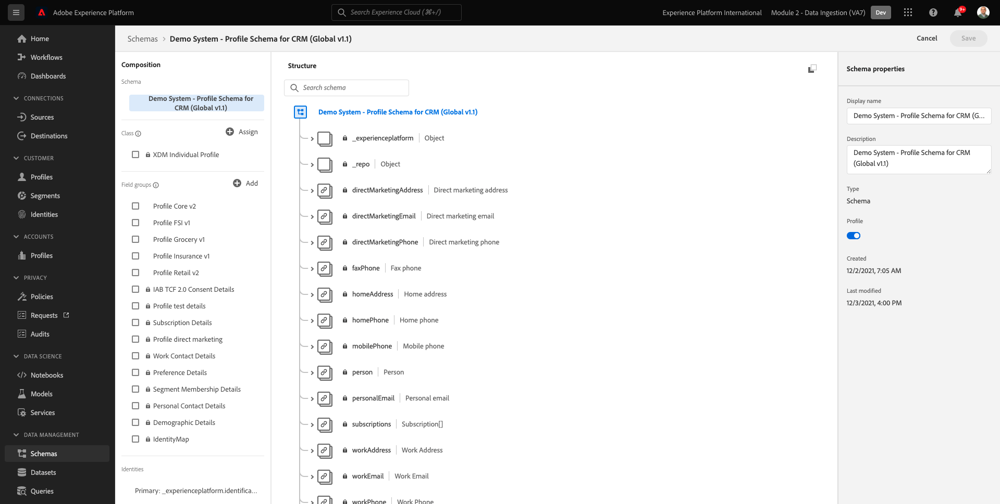

# 2.4 Assimilação de dados de fontes offline

Neste exercício, o objetivo é integrar dados externos, como Dados de CRM na plataforma.

## Objetivos de aprendizagem

- Saiba como gerar dados de teste
- Saiba como assimilar CSV
- Saiba como usar a interface do usuário da Web para assimilação de dados por meio de fluxos de trabalho
- Entenda os recursos de controle de dados do Experience Platform

## Recursos

- Interface do usuário do Mockaroo: [https://www.mockaroo.com/](https://www.mockaroo.com/)
- Interface do usuário do Experience Platform: [https://experience.adobe.com/platform/](https://experience.adobe.com/platform/)

## Tarefas

- Crie um arquivo CSV com data de demonstração. Assimile o arquivo CSV no Adobe Experience Platform usando os workflows disponíveis.
- Entender as opções de governança de dados no Adobe Experience Platform

## 2.4.1 Criar seu conjunto de dados do CRM por meio de uma ferramenta geradora de dados

Para isso, você precisa de 1000 linhas de amostra de dados do CRM.

Abra o Modelo Mockaroo indo até [https://www.mockaroo.com/12674210](https://www.mockaroo.com/12674210).

No modelo, você observará os seguintes campos:

- id
- first_name
- last_name
- email
- gender
- birthDate
- home_latitude
- home_longitude
- country_code
- city
- country

Todos esses campos foram definidos para produzir dados compatíveis com o Platform.

Para gerar seu arquivo CSV, clique no botão **[!UICONTROL Baixar dados]** , que fornecerá um arquivo CSV com 1000 linhas de dados de demonstração.

Abra seu arquivo CSV no Microsoft Excel para visualizar seu conteúdo.

Com seu arquivo CSV pronto, você pode continuar com o mapeamento em relação ao XDM.

### 2.4.2 Verificar o conjunto de dados integrado do CRM no Adobe Experience Platform

Abrir [Adobe Experience Platform](https://experience.adobe.com/platform) e ir para **[!UICONTROL Conjuntos de dados]**.

Antes de continuar, é necessário selecionar um **[!UICONTROL sandbox]**. A sandbox a ser selecionada é chamada de ``--module2sandbox--``. Você pode fazer isso clicando no texto **[!UICONTROL Produto de produção]** na linha azul na parte superior da tela. Depois de selecionar a [!UICONTROL sandbox], você verá a tela mudar e agora você estará em seu [!UICONTROL sandbox].

No Adobe Experience Platform, clique em **[!UICONTROL Conjuntos de dados]** no menu no lado esquerdo da tela.

Você usará um conjunto de dados compartilhado com base nessa ativação. O conjunto de dados compartilhado já foi criado e é chamado de **[!UICONTROL Sistema de demonstração - Conjunto de dados de perfil para CRM (Global v1.1)]**.

Abra o conjunto de dados **[!UICONTROL Sistema de demonstração - Conjunto de dados de perfil para CRM (Global v1.1)]**.

Na tela de visão geral, você pode ver 3 informações principais.

Em primeiro lugar, o [!UICONTROL Atividade do conjunto de dados] o painel mostra o número total de registros de CRM no conjunto de dados e os lotes assimilados e seu status

Em segundo lugar, ao rolar para baixo na página, você pode verificar quando lotes de dados foram assimilados, quantos registros foram integrados e também, se o lote foi ou não integrado com êxito. O **[!UICONTROL ID em lote]** é o identificador de um job em lote específico e a variável **[!UICONTROL ID em lote]** é importante, pois pode ser usado para solucionar por que um lote específico não foi integrado com êxito.

Por último, a [!UICONTROL Informações do conjunto de dados] mostra informações importantes como a guia [!UICONTROL ID do conjunto de dados] (novamente, importante de uma perspectiva de solução de problemas), o Nome do conjunto de dados e se o conjunto de dados foi ativado para o Perfil.

A configuração mais importante aqui é o link entre o conjunto de dados e o Esquema. O Esquema define quais dados podem ser assimilados e como eles devem ser.

Nesse caso, estamos usando a variável **[!UICONTROL Sistema de demonstração - Esquema de perfil do CRM (Global v1.1)]**, que é mapeado em relação à classe de **[!UICONTROL Perfil]** e implementou extensões, também chamadas de grupos de campos.

Ao clicar no nome do schema, você é levado ao [!UICONTROL Esquema] onde você pode ver todos os campos que foram ativados para esse esquema.

Cada schema precisa ter um descritor primário personalizado definido. No caso do conjunto de dados do CRM, o esquema definiu que o campo **[!UICONTROL crmId]** deve ser o identificador principal. Se quiser criar um schema e vinculá-lo à variável [!UICONTROL Perfil do cliente em tempo real], é necessário definir um [!UICONTROL Grupo de campos] que se refere ao descritor principal.

Na captura de tela acima, você pode ver que nosso descritor está localizado em `--aepTenantId--.identification.core.crmId`, que é definido como [!UICONTROL Identificador primário], vinculado ao [!UICONTROL namespace] de **[!UICONTROL Sistema de demonstração - CRMID]**.

Cada schema e, como tal, cada conjunto de dados que deve ser usado no [!UICONTROL Perfil do cliente em tempo real] deve ter um [!UICONTROL Identificador principal]. Essa [!UICONTROL Identificador primário] é o usuário identificador da marca para um cliente nesse conjunto de dados. No caso de um conjunto de dados de CRM, pode ser o endereço de email ou a ID do CRM, no caso de um conjunto de dados da Central de chamadas, pode ser o número móvel de um cliente.

É uma prática recomendada criar um esquema específico e separado para cada conjunto de dados e definir o descritor para cada conjunto de dados especificamente para corresponder a como as soluções atuais usadas pela marca operam.

### 2.4.3 Uso de um fluxo de trabalho para mapear um arquivo CSV para um esquema XDM

O objetivo disso é integrar dados de CRM na plataforma. Todos os dados assimilados na Platform devem ser mapeados em relação ao Esquema XDM específico. O que você tem atualmente é um conjunto de dados CSV com 1000 linhas de um lado e um conjunto de dados vinculado a um esquema do outro lado. Para carregar esse arquivo CSV nesse conjunto de dados, é necessário realizar um mapeamento. Para facilitar esse exercício de mapeamento, temos **[!UICONTROL Fluxos de trabalho]** disponível no Adobe Experience Platform.

O [!UICONTROL workflow] que usaremos aqui, é o [!UICONTROL workflow] nomeado **[!UICONTROL Mapear CSV para esquema XDM]** no [!UICONTROL Assimilação de dados] menu.

Clique no botão **[!UICONTROL Mapear CSV para esquema XDM]** botão. Clique em **[!UICONTROL Launch]** para iniciar o processo.

Na próxima tela, é necessário selecionar um conjunto de dados para assimilar o arquivo. Você tem a escolha entre selecionar um conjunto de dados já existente ou criar um novo. Para este exercício, vamos reutilizar um já existente: selecione **[!UICONTROL Sistema de demonstração - Conjunto de dados de perfil para CRM (Global v1.1)]** conforme indicado abaixo e deixe as outras configurações definidas como padrão.

Clique em **[!UICONTROL Próximo]** para ir para a próxima etapa.

Arraste e solte seu arquivo CSV ou clique em **[!UICONTROL Procurar]** e navegue no computador até a área de trabalho e selecione o arquivo CSV.

Após selecionar seu arquivo CSV, ele será carregado imediatamente e você verá uma pré-visualização do arquivo em segundos.

Clique em **[!UICONTROL Próximo]** para ir para a próxima etapa. Pode levar alguns segundos enquanto o arquivo é processado completamente.

Agora, é necessário mapear seus Cabeçalhos de coluna CSV com uma propriedade XDM em seu **[!UICONTROL Sistema de demonstração - Conjunto de dados de perfil para CRM]**.

A Adobe Experience Platform já fez algumas propostas para você, tentando vincular o [!UICONTROL Atributos de origem] com o [!UICONTROL Campos de esquema de destino].

Para o [!UICONTROL Mapeamentos de esquema], a Adobe Experience Platform já tentou vincular os campos. No entanto, nem todas as propostas de mapeamento estão corretas. Agora é necessário **Aceitar campos de destino** um por um.

#### birthDate

O campo Esquema de origem **birthDate** deve estar vinculado ao campo de destino **person.birthDate**.

#### cidade

O campo Esquema de origem **cidade** deve estar vinculado ao campo de destino **homeAddress.city**.

#### country

O campo Esquema de origem **country** deve estar vinculado ao campo de destino **homeAddress.country**.

#### country_code

O campo Esquema de origem **country_code** deve estar vinculado ao campo de destino **homeAddress.countryCode**.

#### email

O campo Esquema de origem **email** deve estar vinculado ao campo de destino **emailpessoal.address**.

#### crmid

O campo Esquema de origem ** crmid** deve ser vinculado ao campo de destino **`--aepTenantId--`.identification.core.crmId**.

#### first_name

O campo Esquema de origem **first_name** deve estar vinculado ao campo de destino **person.name.firstName**.

#### gênero

O campo Esquema de origem **gênero** deve estar vinculado ao campo de destino **person.gender**.

#### home_latitude

O campo Esquema de origem **home_latitude** deve estar vinculado ao campo de destino **homeAddress._schema.latitude**.

#### home_longitude

O campo Esquema de origem **home_longitude** deve estar vinculado ao campo de destino **homeAddress._schema.longitude**.

#### id

O campo Esquema de origem **id** deve estar vinculado ao campo de destino **_id**.

#### last_name

O campo Esquema de origem **last_name** deve estar vinculado ao campo de destino **person.name.lastName**.

Agora você deve ter o seguinte:

Clique no botão **[!UICONTROL Concluir]** para concluir o fluxo de trabalho.

Depois de clicar **[!UICONTROL Concluir]**, você verá a variável **Fluxo de dados** e após alguns minutos, você poderá atualizar a tela para ver se o fluxo de trabalho foi concluído com êxito. Clique no seu **Nome do conjunto de dados do Target**.

Em seguida, você verá o conjunto de dados em que a assimilação foi processada.

No conjunto de dados, você verá um [!UICONTROL ID em lote] que foi assimilada há pouco, com 1000 registros assimilados e um status de **[!UICONTROL Sucesso]**.

Clique no botão **[!UICONTROL Visualizar conjunto de dados]**- botão para obter uma visualização rápida de uma pequena amostra do conjunto de dados para garantir que os dados carregados estejam corretos.

Depois que os dados forem carregados, você poderá definir a abordagem de governança de dados correta para nosso conjunto de dados.

### 2.5.4 Adicionar o controle de dados ao seu conjunto de dados

Agora que os dados do cliente são assimilados, é necessário garantir que esse conjunto de dados seja controlado corretamente para uso e controle de exportação. Clique no botão **[!UICONTROL Governança de dados]** observe que é possível definir três tipos de restrições: Dados contratuais, de identidade e confidenciais

Você pode encontrar mais informações sobre os diferentes rótulos e como eles serão aplicados no futuro através da estrutura de política neste link: [https://www.adobe.io/apis/experienceplatform/home/dule/duleservices.html](https://www.adobe.io/apis/experienceplatform/home/dule/duleservices.html)

Vamos restringir os dados de identidade de todo o conjunto de dados. Passe o mouse sobre o nome do conjunto de dados e clique no ícone Lápis para editar as configurações.

Ir para **[!UICONTROL Dados de identidade]** e você verá que a variável **[!UICONTROL I2]** estiver marcada - isso presumirá que todas as informações neste conjunto de dados são pelo menos indiretamente identificáveis para a pessoa.

Clique em **[!UICONTROL Salvar alterações]** e observe que **[!UICONTROL I2]** agora é definido para todos os campos de dados no conjunto de dados.

Também é possível definir esses sinalizadores para campos de dados individuais, por exemplo, a variável **[!UICONTROL firstName]** é provável que o campo seja classificado como um **[!UICONTROL I1]** para informações diretamente identificáveis.

Selecione o campo **[!UICONTROL firstName]** marcando a caixa de seleção e clicando em **[!UICONTROL Editar rótulos de governança]** no canto superior direito da tela.

Ir para **[!UICONTROL Dados de identidade]** e você verá que a variável **[!UICONTROL I2]** já está marcada (herdada do conjunto de dados). O campo firstName também tem uma configuração específica de campo e é definido como **[!UICONTROL I1 - Dados diretamente identificáveis]**.

Com isso, agora você assimilou e classificou com êxito os dados do CRM no Adobe Experience Platform.

Próxima etapa: [2.5 Zona de aterrissagem de dados](./ex5.md)

[Voltar ao Módulo 2](./data-ingestion.md)

[Voltar para todos os módulos](../../overview.md)
