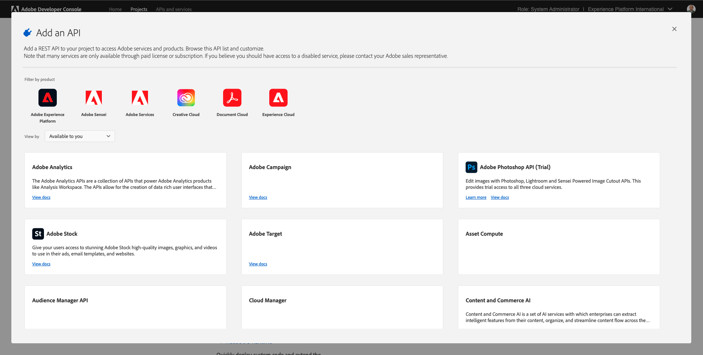
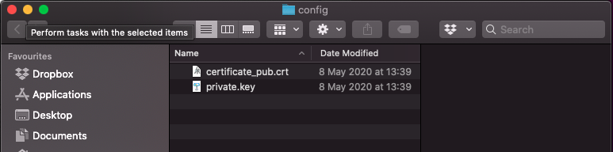
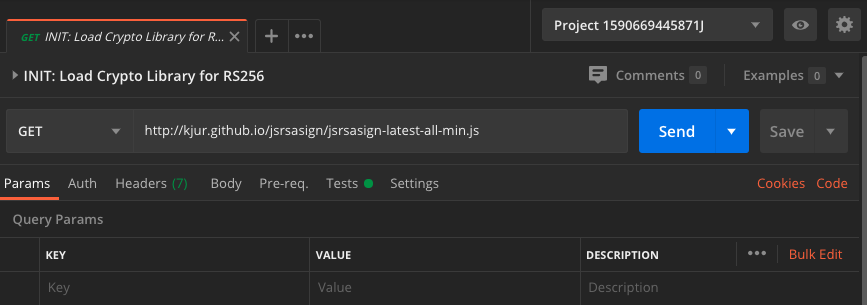

# 3.3 Visualizar seu próprio perfil de cliente em tempo real - API

Neste exercício, você usará o Postman e o Adobe I/O para consultar as APIs do Adobe Experience Platform para visualizar seu próprio perfil de cliente em tempo real.

## História

No Perfil do cliente em tempo real, todos os dados do perfil são mostrados junto aos dados do evento, bem como às associações de segmento existentes. Os dados mostrados podem vir de qualquer lugar, de aplicativos Adobe e soluções externas. Essa é a exibição mais poderosa no Adobe Experience Platform, o sistema de experiência de registro.

O Perfil do cliente em tempo real pode ser consumido por todos os aplicativos do Adobe, mas também por soluções externas como Call Centers ou aplicativos de clientes na loja. A maneira de fazer isso é conectar essas soluções externas às APIs do Adobe Experience Platform.

## 3.3.1 Seus identificadores

No painel Visualizador de perfil do site, você pode encontrar várias identidades. Cada identidade está vinculada a um Namespace.


No painel de raio X, podemos ver 4 combinações diferentes de IDs e namespaces:

| Identidade | Namespace |
|:-------------:| :---------------:|
| Experience Cloud ID (ECID) | 1250756068732495704459439363261812234 |
| ID de email | woutervangeluwe+06022022-01@gmail.com |
| ID do número do dispositivo móvel | +32473622044+06022022-01 |

Lembre-se desses identificadores para a próxima etapa.

Com essas IDs em mente, acesse Postman.

## 3.3.2 Configurar o projeto do Adobe I/O

Neste exercício, você usará o Adobe I/O intensamente para consultar as APIs da Platform. Siga as etapas abaixo para configurar o Adobe I/O.

Ir para [https://developer.adobe.com/console/home](https://developer.adobe.com/console/home)


Selecione a instância correta do Adobe Experience Platform no canto superior direito da tela. Sua instância é `--envName--`.


Clique em **Criar novo projeto**.

 ou


Selecionar **+ Adicionar ao projeto** e selecione **API**.


Você verá isso:



Clique no botão **Adobe Experience Platform** ícone .


Clique em **API Experience Platform**.


Clique em **Próximo**.


Agora você pode optar por fazer com que o Adobe I/O gere seu par de chaves de segurança ou faça upload de um existente.

Choose **Opção 1 - Gerar um par de chaves**.


Clique em **Gerar par de chaves**.


Você verá um ponteiro por cerca de 30 segundos.


Você verá isso e seu par de chaves gerado será baixado como um arquivo zip: **config.zip**.

Descompacte o arquivo **config.zip** no desktop, você verá que ele contém 2 arquivos:



- **certificate_pub.crt** é seu certificado de chave pública. Do ponto de vista de segurança, esse é o certificado livremente usado para configurar integrações com aplicativos online.
- **private.key** é sua chave privada. Isso nunca deve ser compartilhado com ninguém. A Chave privada é o que você usa para autenticar na implementação da API e deve ser um segredo. Se você compartilhar sua Chave privada com qualquer pessoa, ela poderá acessar sua implementação e utilizar a API para assimilar dados mal-intencionados no Platform e extrair todos os dados que estão no Platform.


Certifique-se de salvar o **config.zip** em um local seguro, pois será necessário para as próximas etapas e para acesso futuro às APIs do Adobe I/O e Adobe Experience Platform.

Clique em **Próximo**.


Agora é necessário selecionar a variável **Perfil(s) de produto** para sua integração.

Selecione os Perfis de produto necessários.

**FYI**: na instância do Adobe Experience Platform, os Perfis de produto terão um nome diferente. É necessário selecionar pelo menos um perfil de produto com os direitos de acesso adequados, que são configurados na Adobe Admin Console.


Clique em **Salvar API configurada**.


Você verá um ponteiro por alguns segundos.


E em seguida, você verá sua integração.


Clique no botão **Download para Postman** e clique em **Conta de serviço (JWT)** para baixar um ambiente Postman (aguarde até que o ambiente seja baixado, isso pode levar alguns segundos).


Role para baixo até ver **Conta de serviço (JWT)**, que é o local onde você pode encontrar todos os detalhes de integração usados para configurar a integração com o Adobe Experience Platform.


O Projeto de E/S tem um nome genérico no momento. Você precisa dar um nome amigável à integração. Clique em **Projeto 1** (ou nome similar), conforme indicado


Clique em **Editar projeto**.


Insira um Nome e uma Descrição para a integração. Como convenção de nomenclatura, usaremos `AEP API --demoProfileLdap--`. Substitua o ldap pelo seu ldap.
Por exemplo, se seu ldap é vangeluw, o nome e a descrição da sua integração se tornam vangeluw da API AEP.

Enter `AEP API --demoProfileLdap--` como **Título do projeto**. Clique em **Salvar**.


A integração do Adobe I/O foi concluída.


## 3.3.3 Autenticação Postman para o Adobe I/O

Ir para [https://www.getpostman.com/](https://www.getpostman.com/).

Clique em **Introdução**.


Em seguida, baixe e instale o Postman.


Após a instalação do Postman, inicie o aplicativo.

No Postman, há dois conceitos: Ambientes e coleções.

- O Ambiente contém todas as variáveis ambientais que são mais ou menos consistentes. No Ambiente, você encontrará coisas como o IMSOrg do nosso ambiente da plataforma, junto com credenciais de segurança como sua chave privada e outras. O arquivo de ambiente é aquele que você baixou durante a configuração do Adobe I/O no exercício anterior, é o nome a seguir: **service.postman_environment.json**.

- A coleção contém várias solicitações de API que podem ser usadas. Usaremos duas coleções
   - 1 Collection for Authentication to Adobe I/0
   - 1 Coleção para os exercícios neste módulo
   - 1 coleção para os exercícios no módulo Real-Time CDP, para Criação de destinos

Baixe o arquivo [postman.zip](../../assets/postman/postman_profile.zip) no desktop local.

Neste **postman.zip** , você encontrará os seguintes arquivos:

- `_Adobe I-O - Token.postman_collection.json`
- `_Adobe Experience Platform Enablement.postman_collection.json`
- `Destination_Authoring_API.json`

Descompacte o **postman.zip** armazene esses 3 arquivos em uma pasta no desktop, junto com o ambiente Postman baixado do Adobe I/O. Você precisa ter esses 4 arquivos nessa pasta:


Volte para o Postman. Clique em **Importar**.


Clique em **Fazer upload de arquivos**.


Navegue até a pasta na área de trabalho na qual você extraiu os 4 arquivos baixados. Selecione esses 4 arquivos ao mesmo tempo e clique em **Abrir**.


Depois de clicar **Abrir**, o Postman exibirá uma visão geral do Ambiente e das Coleções que você está prestes a importar. Clique em **Importar**.


Agora você tem tudo o que precisa no Postman para começar a interagir com o Adobe Experience Platform por meio das APIs.

A primeira coisa a fazer é certificar-se de que você está autenticado corretamente. Para ser autenticado, é necessário solicitar um token de acesso.

Certifique-se de ter o Ambiente correto selecionado antes de executar qualquer solicitação. Você pode verificar o Ambiente atualmente selecionado, verificando a lista suspensa Ambiente no canto superior direito.

O Ambiente selecionado deve ter um nome semelhante a este:


Clique no botão **olho** e clique em **Editar** para atualizar a Chave privada no arquivo de ambiente.


Você verá isso. Todos os campos são preenchidos previamente, exceto pelo campo **PRIVATE_KEY**.


A chave privada foi gerada quando você criou o Projeto Adobe I/O. Ele foi baixado como um arquivo zip, chamado **config.zip**. Extraia o arquivo zip para a área de trabalho.


Abra a pasta **configuração** e abra o arquivo **private.key** com o editor de texto de sua escolha.


Você verá algo semelhante a isto, copie todo o texto para a área de transferência.


Retorne ao Postman e cole a chave privada nos campos ao lado da variável **PRIVATE_KEY**, para ambas as colunas **VALOR INICIAL** e **VALOR ATUAL**. Clique em **Salvar**.


Seu ambiente e coleções do Postman agora estão configurados e funcionando. Agora é possível autenticar do Postman para o Adobe I/O.

Para fazer isso, você precisa carregar uma biblioteca externa que cuidará da criptografia e da descriptografia da comunicação. Para carregar essa biblioteca, você deve executar a solicitação com o nome **INIT: Carregar biblioteca de criptografia para RS256**. Selecione essa solicitação no **_Adobe I/O - Coleção de tokens** e vocês verão-no no meio da tela.




Clique no azul **Enviar** botão. Após alguns segundos, você deverá ver uma resposta exibida na **Corpo** seção do Postman:


Com a biblioteca de criptografia carregada, podemos autenticar para o Adobe I/O.

No **\_Adobe I/O - Coleção de tokens**, selecione a solicitação com o nome **IMS: Gerar JWT + Auth**. Novamente, você verá os detalhes da solicitação exibidos no meio da tela.


Clique no azul **Enviar** botão. Após alguns segundos, você deverá ver uma resposta exibida na **Corpo** seção do Postman:


Se sua configuração foi bem-sucedida, você deve ver uma resposta semelhante que contém as seguintes informações:

| Chave | Valor |
|:-------------:| :---------------:| 
| token_type | **portador** |
| access_token | **eyJ4NXUiJpbXNfbmEx...QT7mqZkumN1tdsPEioOEl4087Dg** |
| expires_in | **86399973** |

Adobe I/O deu-lhe uma **portador**-token, com um valor específico (esse acesso_token muito longo) e uma janela de expiração.

O token que recebemos agora é válido por 24 horas. Isso significa que, após 24 horas, se quiser usar o Postman para autenticar no Adobe I/O, será necessário gerar um novo token executando essa solicitação novamente.

## 3.3.4 API de perfil do cliente em tempo real, Esquema: Perfil

Agora, você pode enviar sua primeira solicitação para as APIs do Perfil do cliente em tempo real da Platform.

No Postman, localize a coleção **_Ativação Adobe Experience Platform**.


Em **1. Serviço de perfil unificado**, selecione a primeira solicitação com o nome **UPS - Perfil do GET por ID de entidade e NS**.


Para essa solicitação, há três variáveis obrigatórias:

| Chave | Valor | Definição |
|:-------------:| :---------------:| :---------------:| 
| entityId | **id** | a ID específica do cliente |
| entityIdNS | **namespace** | o namespace específico aplicável à ID |
| schema.name | **_xdm.context.profile** | o schema específico para o qual deseja receber informações |

Portanto, se você quiser solicitar às APIs do Adobe Experience Platform que forneçam todas as informações de perfil para sua própria ECID, será necessário configurar a solicitação da seguinte maneira:

| Chave | Valor |
|:-------------:| :---------------:| 
| entityId | **yourECID** |
| entityIdNS | **ecid** |
| schema.name | **_xdm.context.profile** |


Você também deve verificar a variável **Cabeçalho** - campos da sua solicitação. Ir para **Cabeçalhos**. Você verá isso:


| Chave | Valor |
| ----------- | ----------- |
| x-sandbox-name | `--aepSandboxId--` |

>[!NOTE]
>
>Você precisa especificar o nome da sandbox do Adobe Experience Platform que está usando. Seu nome x-sandbox deve ser `--aepSandboxId--`.

Clique em **Enviar** para enviar sua solicitação à Platform.

Você deve obter uma resposta imediata da Platform, mostrando algo como o seguinte:


Esta é a resposta completa da Platform:

```javascript
{
    "A28iM3aJBJRbEQpOnUh5HOM9": {
        "entityId": "A28iM3aJBJRbEQpOnUh5HOM9",
        "mergePolicy": {
            "id": "e632ccb8-882a-4b5e-8375-96a1ba3df1aa"
        },
        "sources": [
            "61fe23c5be4b5f19485dc379",
            "profile-streaming-segment",
            "61fe23cfa07c1219489b3ba4"
        ],
        "tags": [
            "1644130566774:1542:232:va7",
            "0a1e9dd4-940a-46ec-9114-7e371cf5c4d0",
            "aep_ups_partitioned_profile_cdc_low_lag_sla_0:106:1090888313",
            "a6fed09e-2c56-403e-8692-4e99e4779dfa:IRL1",
            "1644419616318:2989:31:va7",
            "aep_ups_profile_change_event_prod_va7:71:7946633524-8361f22c-c09e-4364-b24b-b57435c4d14f"
        ],
        "identityGraph": [
            "BUF9zMKLrXq72p4HpbsHv1SSBnr0LTAxQGdtYWlsLmNvbQ",
            "GkicrkFjgmCjUg",
            "GtCbrkFjgkSOFg",
            "A2-AP9zOsakzNTe9Rqwf7Wse",
            "BkFuK4QcJpSPByuSBnr0LTAx",
            "A28jSB484ziuECF3fEoXmFlF",
            "A28iM3aJBJRbEQpOnUh5HOM9"
        ],
        "entity": {
            "_experienceplatform": {
                "individualCharacteristics": {},
                "loyaltyDetails": {
                    "level": "Basic",
                    "points": 0
                },
                "identification": {
                    "core": {
                        "phoneNumber": "+32473622044+06022022-01",
                        "email": "woutervangeluwe+06022022-01@gmail.com",
                        "loyaltyId": "5415776",
                        "ecid": "12019606991718502754997192487345616673",
                        "crmId": "1478212"
                    }
                }
            },
            "personalEmail": {
                "address": "woutervangeluwe+06022022-01@gmail.com"
            },
            "_repo": {
                "createDate": "2022-02-06T06:56:06.424Z"
            },
            "testProfile": true,
            "homeAddress": {
                "postalCode": "1831",
                "city": "Diegem",
                "street1": "Culliganlaan 2F"
            },
            "mobilePhone": {
                "number": "+32473622044+06022022-01"
            },
            "segmentMembership": {
                "ups": {
                    "bc999ded-b6d7-40d4-87a7-d3a280b950e3": {
                        "lastQualificationTime": "2022-02-09T20:38:33Z",
                        "status": "exited"
                    },
                    "23b1cd4e-d62f-44bd-8392-3095a33109c4": {
                        "lastQualificationTime": "2022-02-09T20:38:33Z",
                        "status": "exited"
                    },
                    "f0807704-a1c8-4ac4-85dd-60db2fbf18f1": {
                        "lastQualificationTime": "2022-02-09T20:38:33Z",
                        "status": "existing"
                    }
                }
            },
            "person": {
                "name": {
                    "lastName": "Van Geluwe",
                    "firstName": "Wouter"
                },
                "gender": "female",
                "birthDate": "1982-07-08"
            },
            "userActivityRegions": {
                "IRL1": {
                    "captureTimestamp": "2022-02-09T15:21:11Z"
                }
            },
            "identityMap": {
                "email": [
                    {
                        "id": "woutervangeluwe+06022022-01@gmail.com"
                    }
                ],
                "crmid": [
                    {
                        "id": "1478212"
                    }
                ],
                "ecid": [
                    {
                        "id": "12507560687324495704459439363261812234"
                    },
                    {
                        "id": "12019606991718502754997192487345616673"
                    },
                    {
                        "id": "38335942889672702722192106363935964471"
                    }
                ],
                "phone": [
                    {
                        "id": "+32473622044+06022022-01"
                    }
                ],
                "loyaltyid": [
                    {
                        "id": "5415776"
                    }
                ]
            }
        },
        "lastModifiedAt": "2022-02-09T20:38:36Z"
    }
}
```

Atualmente, todos os dados de perfil disponíveis na Platform para essa ECID.

Não é necessário usar a ECID para solicitar dados de Perfil do Perfil do cliente em tempo real da plataforma, você pode usar qualquer ID em qualquer namespace para solicitar esses dados.

Vamos voltar para a Postman e fingir que somos a central de atendimento e enviar uma solicitação para a Platform especificando o namespace de **Telefone** e seu número de celular.

Portanto, se você quiser solicitar às APIs da Platform que forneçam todas as informações de Perfil de um Telefone específico, será necessário configurar a solicitação da seguinte maneira:

| Chave | Valor |
|:-------------:| :---------------:| 
| entityId | **seu número de telefone** |
| entityIdNS | **Telefone** (substitua ecid por telefone) |
| schema.name | **_xdm.context.profile** |

Se o seu número de telefone contém símbolos especiais, como **+**, você precisa selecionar o número de telefone completo, clicar com o botão direito do mouse e clicar em **EncodeURIComponent**.


Você terá isso:


Você também deve verificar a variável **Cabeçalho** - campos da sua solicitação. Ir para **Cabeçalhos**. Você verá isso:


| Chave | Valor |
| ----------- | ----------- |
| x-sandbox-name | `--aepSandboxId--` |

>[!NOTE]
>
>Você precisa especificar o nome da sandbox do Adobe Experience Platform que está usando. Seu nome x-sandbox deve ser `--aepSandboxId--`.

Clique no azul **Enviar** e verifique a resposta.


Vamos fazer o mesmo para seu endereço de email especificando o namespace de **email** e seu endereço de email.

Portanto, se você quiser solicitar às APIs da Platform que forneçam todas as informações do Perfil para um endereço de email específico, será necessário configurar a solicitação da seguinte maneira:

| Chave | Valor |
|:-------------:| :---------------:| 
| entityId | **youremail** |
| entityIdNS | **email** (substitua Telefone por email) |
| schema.name | **_xdm.context.profile** |

Se seu endereço de email contiver símbolos especiais, como **+**, é necessário selecionar seu endereço de email completo, clicar com o botão direito do mouse e **EncodeURIComponent**.


Você terá isso:


Você também deve verificar a variável **Cabeçalho** - campos da sua solicitação. Ir para **Cabeçalhos**. Você verá isso:


| Chave | Valor |
| ----------- | ----------- |
| x-sandbox-name | `--aepSandboxId--` |

>[!NOTE]
>
>Você precisa especificar o nome da sandbox do Adobe Experience Platform que está usando. Seu nome x-sandbox deve ser `--aepSandboxId--`.

Clique no azul **Enviar** e verifique a resposta.


Este é um tipo de flexibilidade muito importante que é oferecido às marcas. Isso significa que qualquer ambiente pode enviar uma solicitação para a Platform, usando sua própria ID e namespace, sem precisar entender a complexidade de vários namespaces e IDs.

Como exemplo:

- o Call Center solicitará dados da Platform usando o namespace **Telefone**
- o sistema de fidelidade solicitará dados da Platform usando o namespace **email**
- aplicativos online podem usar o namespace **ecid**

O Call Center não sabe necessariamente que tipo de identificador é usado no sistema de fidelidade e o sistema de fidelidade não sabe necessariamente que tipo de identificador é usado por aplicativos online. Cada sistema individual pode usar as informações que tem e entender para obter as informações necessárias, quando elas precisarem.

## 3.3.5 API de perfil do cliente em tempo real, Esquema: Perfil e ExperienceEvent

Depois de consultar as APIs da Platform com sucesso para dados do perfil, vamos fazer o mesmo com os dados do ExperienceEvent.

No Postman, localize a coleção **_Ativação Adobe Experience Platform**.


Em **1. Serviço de perfil unificado**, selecione a segunda solicitação com o nome **UPS - Perfil do GET e EE por ID de entidade e NS**.


Para essa solicitação, há quatro variáveis obrigatórias:

| Chave | Valor | Definição |
|:-------------:| :---------------:|  :---------------:| 
| schema.name | **_xdm.context.experienceevent** | o schema específico para o qual você deseja receber informações. Nesse caso, estamos procurando dados mapeados em relação ao schema ExperienceEvent. |
| relatedSchema.name | **_xdm.context.profile** | Embora estejamos procurando dados mapeados em relação ao esquema ExperienceEvent, precisamos especificar uma identidade para a qual queremos receber esses dados. O schema que tem acesso à identidade é o Profile-schema, portanto, o relatedSchema aqui é o Profile-schema. |
| relatedEntityId | **id** | a ID específica do cliente |
| relatedEntityIdNS | **namespace** | o namespace específico aplicável à ID |

Portanto, se você quiser solicitar às APIs da Platform que forneçam todas as informações do Perfil para sua própria ecid, será necessário configurar a solicitação da seguinte maneira:

| Chave | Valor |
|:-------------:| :---------------:| 
| schema.name | **_xdm.context.experienceevent** |
| relatedSchema.name | **_xdm.context.profile** |
| relatedEntityId | **yourECID** |
| relatedEntityIdNS | **ecid** |


Você também deve verificar a variável **Cabeçalho** - campos da sua solicitação. Ir para **Cabeçalhos**. Você verá isso:


| Chave | Valor |
| ----------- | ----------- |
| x-sandbox-name | `--aepSandboxId--` |

>[!NOTE]
>
>Você precisa especificar o nome da sandbox do Adobe Experience Platform que está usando. Seu nome x-sandbox deve ser `--aepSandboxId--`.

Clique em **Enviar** para enviar sua solicitação à Platform.

Você deve obter uma resposta imediata da Platform, mostrando algo como o seguinte:


Abaixo está a resposta completa da Platform. Neste exemplo, há oito ExperienceEvents vinculados à ECID deste cliente. Consulte o abaixo para ver as diferentes variáveis na solicitação, pois o que você vê abaixo é a consequência direta da sua configuração no Launch em exercícios anteriores.

Além disso, quando o painel de raios X mostra informações do ExperienceEvent, ele está usando a carga abaixo para analisar e recuperar informações como Nome do produto (procure por productName na carga abaixo) e URL da imagem do produto (procure por productImageUrl na carga abaixo).

```javascript
{
    "_page": {
        "orderby": "timestamp",
        "start": "d686ab8a-2d0c-4722-9ff5-bfc1020b0b55-0",
        "count": 31,
        "next": ""
    },
    "children": [
        {
            "relatedEntityId": "A28iM3aJBJRbEQpOnUh5HOM9",
            "entityId": "d686ab8a-2d0c-4722-9ff5-bfc1020b0b55-0",
            "timestamp": 1644127126596,
            "entity": {
                "environment": {
                    "ipV4": "213.118.129.117",
                    "type": "browser",
                    "browserDetails": {
                        "viewportHeight": 969,
                        "viewportWidth": 1920,
                        "userAgent": "Mozilla/5.0 (Macintosh; Intel Mac OS X 10_15_7) AppleWebKit/537.36 (KHTML, like Gecko) Chrome/98.0.4758.80 Safari/537.36"
                    }
                },
                "web": {
                    "webPageDetails": {
                        "pageViews": {
                            "value": 1
                        },
                        "name": "vangeluw-OCUC",
                        "URL": "https://builder.adobedemo.com/run/vangeluw-OCUC"
                    },
                    "webReferrer": {
                        "URL": "https://adobe.okta.com/"
                    }
                },
                "_experienceplatform": {
                    "interactionDetails": {
                        "core": {
                            "channel": "web"
                        }
                    },
                    "demoEnvironment": {
                        "brandName": "vangeluw-OCUC"
                    },
                    "identification": {
                        "core": {
                            "ecid": "12507560687324495704459439363261812234"
                        }
                    }
                },
                "implementationDetails": {
                    "name": "https://ns.adobe.com/experience/alloy/reactor",
                    "version": "2.8.0+2.9.0",
                    "environment": "browser"
                },
                "identityMap": {
                    "ECID": [
                        {
                            "id": "12507560687324495704459439363261812234",
                            "authenticatedState": "ambiguous",
                            "primary": true
                        }
                    ]
                },
                "eventType": "web.webpagedetails.pageViews",
                "_id": "d686ab8a-2d0c-4722-9ff5-bfc1020b0b55-0",
                "placeContext": {
                    "localTime": "2022-02-06T06:58:46.596+01:00",
                    "localTimezoneOffset": -60
                },
                "device": {
                    "screenOrientation": "landscape",
                    "screenWidth": 1920,
                    "screenHeight": 1080
                },
                "timestamp": "2022-02-06T05:58:46.596Z"
            },
            "lastModifiedAt": "2022-02-06T05:59:48Z"
        },
        {
            "relatedEntityId": "A28iM3aJBJRbEQpOnUh5HOM9",
            "entityId": "919a46bf-a591-4c32-9201-b72250d5f5d9-0",
            "timestamp": 1644127129876,
            "entity": {
                "environment": {
                    "ipV4": "213.118.129.117",
                    "type": "browser",
                    "browserDetails": {
                        "viewportHeight": 969,
                        "viewportWidth": 1920,
                        "userAgent": "Mozilla/5.0 (Macintosh; Intel Mac OS X 10_15_7) AppleWebKit/537.36 (KHTML, like Gecko) Chrome/98.0.4758.80 Safari/537.36"
                    }
                },
                "web": {
                    "webPageDetails": {
                        "pageViews": {
                            "value": 1
                        },
                        "name": "vangeluw-OCUC#",
                        "URL": "https://builder.adobedemo.com/run/vangeluw-OCUC#"
                    },
                    "webReferrer": {
                        "URL": "https://adobe.okta.com/"
                    }
                },
                "_experienceplatform": {
                    "interactionDetails": {
                        "core": {
                            "channel": "web"
                        }
                    },
                    "demoEnvironment": {
                        "brandName": "vangeluw-OCUC"
                    },
                    "identification": {
                        "core": {
                            "ecid": "12507560687324495704459439363261812234"
                        }
                    }
                },
                "implementationDetails": {
                    "name": "https://ns.adobe.com/experience/alloy/reactor",
                    "version": "2.8.0+2.9.0",
                    "environment": "browser"
                },
                "identityMap": {
                    "ECID": [
                        {
                            "id": "12507560687324495704459439363261812234",
                            "authenticatedState": "ambiguous",
                            "primary": true
                        }
                    ]
                },
                "eventType": "web.webpagedetails.pageViews",
                "_id": "919a46bf-a591-4c32-9201-b72250d5f5d9-0",
                "placeContext": {
                    "localTime": "2022-02-06T06:58:49.876+01:00",
                    "localTimezoneOffset": -60
                },
                "device": {
                    "screenOrientation": "landscape",
                    "screenWidth": 1920,
                    "screenHeight": 1080
                },
                "timestamp": "2022-02-06T05:58:49.876Z"
            },
            "lastModifiedAt": "2022-02-06T05:59:48Z"
        },
        {
            "relatedEntityId": "A28iM3aJBJRbEQpOnUh5HOM9",
            "entityId": "41a80489-00d4-446c-b456-8cb19c3f309a-0",
            "timestamp": 1644130597134,
            "entity": {
                "environment": {
                    "ipV4": "213.118.129.117",
                    "type": "browser",
                    "browserDetails": {
                        "viewportHeight": 1001,
                        "viewportWidth": 1920,
                        "userAgent": "Mozilla/5.0 (Macintosh; Intel Mac OS X 10_15_7) AppleWebKit/537.36 (KHTML, like Gecko) Chrome/98.0.4758.80 Safari/537.36"
                    }
                },
                "web": {
                    "webPageDetails": {
                        "pageViews": {
                            "value": 1
                        },
                        "name": "login",
                        "URL": "https://builder.adobedemo.com/run/vangeluw-OCUC/login"
                    },
                    "webReferrer": {
                        "URL": "https://builder.adobedemo.com/run/vangeluw-OCUC/login"
                    }
                },
                "_experienceplatform": {
                    "interactionDetails": {
                        "core": {
                            "channel": "web"
                        }
                    },
                    "demoEnvironment": {
                        "brandName": "vangeluw-OCUC"
                    },
                    "identification": {
                        "core": {
                            "ecid": "12507560687324495704459439363261812234"
                        }
                    }
                },
                "implementationDetails": {
                    "name": "https://ns.adobe.com/experience/alloy/reactor",
                    "version": "2.8.0+2.9.0",
                    "environment": "browser"
                },
                "identityMap": {
                    "ECID": [
                        {
                            "id": "12507560687324495704459439363261812234",
                            "authenticatedState": "ambiguous",
                            "primary": true
                        }
                    ]
                },
                "eventType": "web.webpagedetails.pageViews",
                "_id": "41a80489-00d4-446c-b456-8cb19c3f309a-0",
                "placeContext": {
                    "localTime": "2022-02-06T07:56:37.134+01:00",
                    "localTimezoneOffset": -60
                },
                "device": {
                    "screenOrientation": "landscape",
                    "screenWidth": 1920,
                    "screenHeight": 1080
                },
                "timestamp": "2022-02-06T06:56:37.134Z"
            },
            "lastModifiedAt": "2022-02-06T06:56:38Z"
        },
        {
            "relatedEntityId": "A28jSB484ziuECF3fEoXmFlF",
            "entityId": "8ACC7B6C-2320-4865-B414-3B0CFA01F628",
            "timestamp": 1644419615000,
            "entity": {
                "environment": {
                    "ipV4": "213.118.129.117",
                    "browserDetails": {
                        "userAgent": "Mozilla/5.0 (iPhone; CPU OS 15_3 like Mac OS X; en_BE)"
                    }
                },
                "eventType": "application.login",
                "_id": "8ACC7B6C-2320-4865-B414-3B0CFA01F628",
                "_experienceplatform": {
                    "interactionDetails": {
                        "core": {
                            "channel": "mobile"
                        }
                    },
                    "demoEnvironment": {
                        "brandName": "vangeluw-2L6V"
                    },
                    "identification": {
                        "core": {
                            "ecid": "12019606991718502754997192487345616673",
                            "email": "woutervangeluwe+06022022-01@gmail.com"
                        }
                    }
                },
                "timestamp": "2022-02-09T15:13:35Z",
                "identityMap": {
                    "ECID": [
                        {
                            "id": "12019606991718502754997192487345616673",
                            "authenticatedState": "ambiguous",
                            "primary": true
                        }
                    ]
                }
            },
            "lastModifiedAt": "2022-02-09T15:13:38Z"
        },
        {
            "relatedEntityId": "A28jSB484ziuECF3fEoXmFlF",
            "entityId": "54F68CE5-E9E1-4AD0-91B1-7B607A9285C4",
            "timestamp": 1644419658000,
            "entity": {
                "environment": {
                    "ipV4": "213.118.129.117",
                    "browserDetails": {
                        "userAgent": "Mozilla/5.0 (iPhone; CPU OS 15_3 like Mac OS X; en_BE)"
                    }
                },
                "_experienceplatform": {
                    "interactionDetails": {
                        "core": {
                            "channel": "mobile"
                        }
                    },
                    "demoEnvironment": {
                        "brandName": "vangeluw-2L6V"
                    },
                    "identification": {
                        "core": {
                            "ecid": "12019606991718502754997192487345616673"
                        }
                    }
                },
                "identityMap": {
                    "ECID": [
                        {
                            "id": "12019606991718502754997192487345616673",
                            "authenticatedState": "ambiguous",
                            "primary": true
                        }
                    ]
                },
                "eventType": "commerce.productViews",
                "_id": "54F68CE5-E9E1-4AD0-91B1-7B607A9285C4",
                "commerce": {
                    "productViews": {
                        "value": 1
                    }
                },
                "productListItems": [
                    {
                        "quantity": 1,
                        "productAddMethod": "Mobile",
                        "_experienceplatform": {
                            "core": {
                                "mainCategory": "Women",
                                "productURL": "product1",
                                "imageURL": "https://contentviewer.s3.amazonaws.com/helium/wh08-white_main.jpg"
                            }
                        },
                        "priceTotal": 42,
                        "name": "Cassia Funnel Sweatshirt",
                        "SKU": "product1",
                        "currencyCode": "USD"
                    }
                ],
                "timestamp": "2022-02-09T15:14:18Z"
            },
            "lastModifiedAt": "2022-02-09T15:14:21Z"
        },
        {
            "relatedEntityId": "A2-AP9zOsakzNTe9Rqwf7Wse",
            "entityId": "bfe26684-bc3b-40c5-9fe5-5aba854c3227-0",
            "timestamp": 1644420036035,
            "entity": {
                "environment": {
                    "ipV4": "193.105.139.131",
                    "type": "browser",
                    "browserDetails": {
                        "viewportHeight": 969,
                        "viewportWidth": 1920,
                        "userAgent": "Mozilla/5.0 (Macintosh; Intel Mac OS X 10_15_7) AppleWebKit/537.36 (KHTML, like Gecko) Chrome/98.0.4758.80 Safari/537.36"
                    }
                },
                "web": {
                    "webPageDetails": {
                        "pageViews": {
                            "value": 1
                        },
                        "name": "vangeluw-OCUC",
                        "URL": "https://builder.adobedemo.com/run/vangeluw-OCUC"
                    },
                    "webReferrer": {
                        "URL": "https://adobe.okta.com/"
                    }
                },
                "_experienceplatform": {
                    "interactionDetails": {
                        "core": {
                            "channel": "web"
                        }
                    },
                    "demoEnvironment": {
                        "brandName": "vangeluw-OCUC"
                    },
                    "identification": {
                        "core": {
                            "ecid": "38335942889672702722192106363935964471"
                        }
                    }
                },
                "implementationDetails": {
                    "name": "https://ns.adobe.com/experience/alloy/reactor",
                    "version": "2.8.0+2.9.0",
                    "environment": "browser"
                },
                "identityMap": {
                    "ECID": [
                        {
                            "id": "38335942889672702722192106363935964471",
                            "authenticatedState": "ambiguous",
                            "primary": true
                        }
                    ]
                },
                "eventType": "web.webpagedetails.pageViews",
                "_id": "bfe26684-bc3b-40c5-9fe5-5aba854c3227-0",
                "placeContext": {
                    "localTime": "2022-02-09T16:20:36.035+01:00",
                    "localTimezoneOffset": -60
                },
                "device": {
                    "screenOrientation": "landscape",
                    "screenWidth": 1920,
                    "screenHeight": 1080
                },
                "timestamp": "2022-02-09T15:20:36.035Z"
            },
            "lastModifiedAt": "2022-02-09T15:20:39Z"
        },
        {
            "relatedEntityId": "A2-AP9zOsakzNTe9Rqwf7Wse",
            "entityId": "0480c434-8fcd-4a80-b298-c561276ac989-0",
            "timestamp": 1644420037078,
            "entity": {
                "environment": {
                    "ipV4": "193.105.139.131",
                    "type": "browser",
                    "browserDetails": {
                        "viewportHeight": 969,
                        "viewportWidth": 1920,
                        "userAgent": "Mozilla/5.0 (Macintosh; Intel Mac OS X 10_15_7) AppleWebKit/537.36 (KHTML, like Gecko) Chrome/98.0.4758.80 Safari/537.36"
                    }
                },
                "web": {
                    "webPageDetails": {
                        "pageViews": {
                            "value": 1
                        },
                        "name": "vangeluw-OCUC#",
                        "URL": "https://builder.adobedemo.com/run/vangeluw-OCUC#"
                    },
                    "webReferrer": {
                        "URL": "https://adobe.okta.com/"
                    }
                },
                "_experienceplatform": {
                    "interactionDetails": {
                        "core": {
                            "channel": "web"
                        }
                    },
                    "demoEnvironment": {
                        "brandName": "vangeluw-OCUC"
                    },
                    "identification": {
                        "core": {
                            "ecid": "38335942889672702722192106363935964471"
                        }
                    }
                },
                "implementationDetails": {
                    "name": "https://ns.adobe.com/experience/alloy/reactor",
                    "version": "2.8.0+2.9.0",
                    "environment": "browser"
                },
                "identityMap": {
                    "ECID": [
                        {
                            "id": "38335942889672702722192106363935964471",
                            "authenticatedState": "ambiguous",
                            "primary": true
                        }
                    ]
                },
                "eventType": "web.webpagedetails.pageViews",
                "_id": "0480c434-8fcd-4a80-b298-c561276ac989-0",
                "placeContext": {
                    "localTime": "2022-02-09T16:20:37.078+01:00",
                    "localTimezoneOffset": -60
                },
                "device": {
                    "screenOrientation": "landscape",
                    "screenWidth": 1920,
                    "screenHeight": 1080
                },
                "timestamp": "2022-02-09T15:20:37.078Z"
            },
            "lastModifiedAt": "2022-02-09T15:20:39Z"
        },
        {
            "relatedEntityId": "A2-AP9zOsakzNTe9Rqwf7Wse",
            "entityId": "6b1b3983-6966-4551-a711-6b6e410fd819-0",
            "timestamp": 1644420045993,
            "entity": {
                "environment": {
                    "ipV4": "193.105.139.131",
                    "type": "browser",
                    "browserDetails": {
                        "viewportHeight": 969,
                        "viewportWidth": 1920,
                        "userAgent": "Mozilla/5.0 (Macintosh; Intel Mac OS X 10_15_7) AppleWebKit/537.36 (KHTML, like Gecko) Chrome/98.0.4758.80 Safari/537.36"
                    }
                },
                "web": {
                    "webPageDetails": {
                        "pageViews": {
                            "value": 1
                        },
                        "name": "login",
                        "URL": "https://builder.adobedemo.com/run/vangeluw-OCUC/login"
                    },
                    "webReferrer": {
                        "URL": "https://adobe.okta.com/"
                    }
                },
                "_experienceplatform": {
                    "interactionDetails": {
                        "core": {
                            "channel": "web"
                        }
                    },
                    "demoEnvironment": {
                        "brandName": "vangeluw-OCUC"
                    },
                    "identification": {
                        "core": {
                            "ecid": "38335942889672702722192106363935964471"
                        }
                    }
                },
                "implementationDetails": {
                    "name": "https://ns.adobe.com/experience/alloy/reactor",
                    "version": "2.8.0+2.9.0",
                    "environment": "browser"
                },
                "identityMap": {
                    "ECID": [
                        {
                            "id": "38335942889672702722192106363935964471",
                            "authenticatedState": "ambiguous",
                            "primary": true
                        }
                    ]
                },
                "eventType": "web.webpagedetails.pageViews",
                "_id": "6b1b3983-6966-4551-a711-6b6e410fd819-0",
                "placeContext": {
                    "localTime": "2022-02-09T16:20:45.993+01:00",
                    "localTimezoneOffset": -60
                },
                "device": {
                    "screenOrientation": "landscape",
                    "screenWidth": 1920,
                    "screenHeight": 1080
                },
                "timestamp": "2022-02-09T15:20:45.993Z"
            },
            "lastModifiedAt": "2022-02-09T15:20:47Z"
        },
        {
            "relatedEntityId": "A2-AP9zOsakzNTe9Rqwf7Wse",
            "entityId": "ae0f3551-7753-4467-8547-8fdbb66c2214-0",
            "timestamp": 1644420058565,
            "entity": {
                "environment": {
                    "ipV4": "193.105.139.131",
                    "type": "browser",
                    "browserDetails": {
                        "viewportHeight": 969,
                        "viewportWidth": 1920,
                        "userAgent": "Mozilla/5.0 (Macintosh; Intel Mac OS X 10_15_7) AppleWebKit/537.36 (KHTML, like Gecko) Chrome/98.0.4758.80 Safari/537.36"
                    }
                },
                "web": {
                    "webPageDetails": {
                        "URL": "https://builder.adobedemo.com/run/vangeluw-OCUC/home"
                    },
                    "webReferrer": {
                        "URL": "https://adobe.okta.com/"
                    }
                },
                "_experienceplatform": {
                    "interactionDetails": {
                        "core": {
                            "channel": "web"
                        }
                    },
                    "demoEnvironment": {
                        "brandName": "vangeluw-OCUC"
                    },
                    "identification": {
                        "core": {
                            "ecid": "38335942889672702722192106363935964471",
                            "email": "woutervangeluwe+06022022-01@gmail.com"
                        }
                    }
                },
                "implementationDetails": {
                    "name": "https://ns.adobe.com/experience/alloy/reactor",
                    "version": "2.8.0+2.9.0",
                    "environment": "browser"
                },
                "identityMap": {
                    "ECID": [
                        {
                            "id": "38335942889672702722192106363935964471",
                            "authenticatedState": "ambiguous",
                            "primary": true
                        }
                    ]
                },
                "eventType": "web.login",
                "_id": "ae0f3551-7753-4467-8547-8fdbb66c2214-0",
                "placeContext": {
                    "localTime": "2022-02-09T16:20:58.565+01:00",
                    "localTimezoneOffset": -60
                },
                "device": {
                    "screenOrientation": "landscape",
                    "screenWidth": 1920,
                    "screenHeight": 1080
                },
                "timestamp": "2022-02-09T15:20:58.565Z"
            },
            "lastModifiedAt": "2022-02-09T15:20:59Z"
        },
        {
            "relatedEntityId": "A2-AP9zOsakzNTe9Rqwf7Wse",
            "entityId": "5e67a9c9-b201-4e21-bd3a-4d10475f6156-0",
            "timestamp": 1644420058653,
            "entity": {
                "environment": {
                    "ipV4": "193.105.139.131",
                    "type": "browser",
                    "browserDetails": {
                        "viewportHeight": 969,
                        "viewportWidth": 1920,
                        "userAgent": "Mozilla/5.0 (Macintosh; Intel Mac OS X 10_15_7) AppleWebKit/537.36 (KHTML, like Gecko) Chrome/98.0.4758.80 Safari/537.36"
                    }
                },
                "web": {
                    "webPageDetails": {
                        "pageViews": {
                            "value": 1
                        },
                        "name": "home",
                        "URL": "https://builder.adobedemo.com/run/vangeluw-OCUC/home"
                    },
                    "webReferrer": {
                        "URL": "https://adobe.okta.com/"
                    }
                },
                "_experienceplatform": {
                    "interactionDetails": {
                        "core": {
                            "channel": "web"
                        }
                    },
                    "demoEnvironment": {
                        "brandName": "vangeluw-OCUC"
                    },
                    "identification": {
                        "core": {
                            "ecid": "38335942889672702722192106363935964471"
                        }
                    }
                },
                "implementationDetails": {
                    "name": "https://ns.adobe.com/experience/alloy/reactor",
                    "version": "2.8.0+2.9.0",
                    "environment": "browser"
                },
                "identityMap": {
                    "ECID": [
                        {
                            "id": "38335942889672702722192106363935964471",
                            "authenticatedState": "ambiguous",
                            "primary": true
                        }
                    ]
                },
                "eventType": "web.webpagedetails.pageViews",
                "_id": "5e67a9c9-b201-4e21-bd3a-4d10475f6156-0",
                "placeContext": {
                    "localTime": "2022-02-09T16:20:58.653+01:00",
                    "localTimezoneOffset": -60
                },
                "device": {
                    "screenOrientation": "landscape",
                    "screenWidth": 1920,
                    "screenHeight": 1080
                },
                "timestamp": "2022-02-09T15:20:58.653Z"
            },
            "lastModifiedAt": "2022-02-09T15:21:00Z"
        },
        {
            "relatedEntityId": "A2-AP9zOsakzNTe9Rqwf7Wse",
            "entityId": "33253c5a-6a7e-4858-a7d2-4e6d4a1c7901-0",
            "timestamp": 1644420061804,
            "entity": {
                "environment": {
                    "ipV4": "193.105.139.131",
                    "type": "browser",
                    "browserDetails": {
                        "viewportHeight": 969,
                        "viewportWidth": 1920,
                        "userAgent": "Mozilla/5.0 (Macintosh; Intel Mac OS X 10_15_7) AppleWebKit/537.36 (KHTML, like Gecko) Chrome/98.0.4758.80 Safari/537.36"
                    }
                },
                "web": {
                    "webPageDetails": {
                        "pageViews": {
                            "value": 1
                        },
                        "name": "vangeluw-OCUC",
                        "URL": "https://builder.adobedemo.com/run/vangeluw-OCUC"
                    },
                    "webReferrer": {
                        "URL": "https://builder.adobedemo.com/run/vangeluw-OCUC/home"
                    }
                },
                "_experienceplatform": {
                    "interactionDetails": {
                        "core": {
                            "channel": "web"
                        }
                    },
                    "demoEnvironment": {
                        "brandName": "vangeluw-OCUC"
                    },
                    "identification": {
                        "core": {
                            "ecid": "38335942889672702722192106363935964471"
                        }
                    }
                },
                "implementationDetails": {
                    "name": "https://ns.adobe.com/experience/alloy/reactor",
                    "version": "2.8.0+2.9.0",
                    "environment": "browser"
                },
                "identityMap": {
                    "ECID": [
                        {
                            "id": "38335942889672702722192106363935964471",
                            "authenticatedState": "ambiguous",
                            "primary": true
                        }
                    ]
                },
                "eventType": "web.webpagedetails.pageViews",
                "_id": "33253c5a-6a7e-4858-a7d2-4e6d4a1c7901-0",
                "placeContext": {
                    "localTime": "2022-02-09T16:21:01.804+01:00",
                    "localTimezoneOffset": -60
                },
                "device": {
                    "screenOrientation": "landscape",
                    "screenWidth": 1920,
                    "screenHeight": 1080
                },
                "timestamp": "2022-02-09T15:21:01.804Z"
            },
            "lastModifiedAt": "2022-02-09T15:21:03Z"
        },
        {
            "relatedEntityId": "A2-AP9zOsakzNTe9Rqwf7Wse",
            "entityId": "d8e81fb7-6de9-44c1-b9c6-60d93b520209-0",
            "timestamp": 1644420071737,
            "entity": {
                "environment": {
                    "ipV4": "193.105.139.131",
                    "type": "browser",
                    "browserDetails": {
                        "viewportHeight": 969,
                        "viewportWidth": 1920,
                        "userAgent": "Mozilla/5.0 (Macintosh; Intel Mac OS X 10_15_7) AppleWebKit/537.36 (KHTML, like Gecko) Chrome/98.0.4758.80 Safari/537.36"
                    }
                },
                "web": {
                    "webPageDetails": {
                        "pageViews": {
                            "value": 1
                        },
                        "name": "vangeluw-OCUC",
                        "URL": "https://builder.adobedemo.com/run/vangeluw-OCUC"
                    },
                    "webReferrer": {
                        "URL": "https://builder.adobedemo.com/run/vangeluw-OCUC/home"
                    }
                },
                "_experienceplatform": {
                    "interactionDetails": {
                        "core": {
                            "channel": "web"
                        }
                    },
                    "demoEnvironment": {
                        "brandName": "vangeluw-OCUC"
                    },
                    "identification": {
                        "core": {
                            "ecid": "38335942889672702722192106363935964471"
                        }
                    }
                },
                "implementationDetails": {
                    "name": "https://ns.adobe.com/experience/alloy/reactor",
                    "version": "2.8.0+2.9.0",
                    "environment": "browser"
                },
                "identityMap": {
                    "ECID": [
                        {
                            "id": "38335942889672702722192106363935964471",
                            "authenticatedState": "ambiguous",
                            "primary": true
                        }
                    ]
                },
                "eventType": "web.webpagedetails.pageViews",
                "_id": "d8e81fb7-6de9-44c1-b9c6-60d93b520209-0",
                "placeContext": {
                    "localTime": "2022-02-09T16:21:11.737+01:00",
                    "localTimezoneOffset": -60
                },
                "device": {
                    "screenOrientation": "landscape",
                    "screenWidth": 1920,
                    "screenHeight": 1080
                },
                "timestamp": "2022-02-09T15:21:11.737Z"
            },
            "lastModifiedAt": "2022-02-09T15:21:14Z"
        }
    ],
    "_links": {
        "next": {
            "href": ""
        }
    }
}
```

No momento, todos os dados disponíveis do ExperienceEvent na Platform para essa ECID.

Não é necessário usar a ECID para solicitar dados do ExperienceEvent do Perfil em tempo real do Adobe Experience Platform. Você pode usar qualquer ID em qualquer namespace para solicitar esses dados.

Próxima etapa: [3.4 Criar um segmento - Interface do usuário](./ex4.md)

[Voltar ao Módulo 3](./real-time-customer-profile.md)

[Voltar para todos os módulos](../../overview.md)
