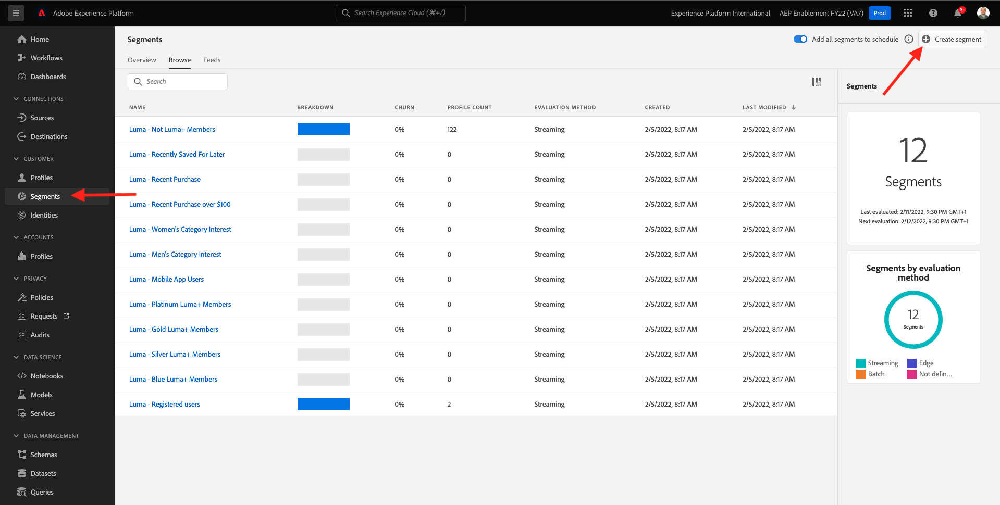
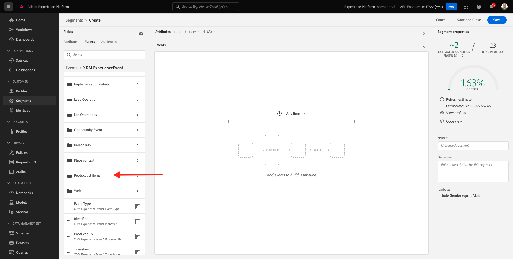
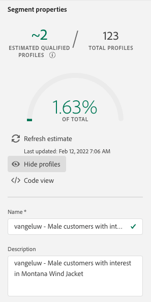

# 3.4 Criar um segmento - Interface do usuário

Neste exercício, você criará um segmento usando o Construtor de segmentos do Adobe Experience Platform.

## História

Ir para [Adobe Experience Platform](https://experience.adobe.com/platform). Depois de fazer logon, você será direcionado para a página inicial do Adobe Experience Platform.


Antes de continuar, é necessário selecionar um **sandbox**. A sandbox a ser selecionada é chamada de ``--aepSandboxId--``. Você pode fazer isso clicando no texto **[!UICONTROL Produto de produção]** na linha azul na parte superior da tela. Depois de selecionar a [!UICONTROL sandbox], você verá a tela mudar e agora você estará em seu [!UICONTROL sandbox].


No menu no lado esquerdo, vá para **Segmentos**. Nesta página, você pode ver uma visão geral de todos os segmentos existentes. Clique no botão **+ Criar segmento** botão para começar a criar um novo segmento.



Quando estiver no novo construtor de segmentos, você imediatamente notará o **Atributos** e a **Perfil individual XDM** referência.


Como o XDM é a linguagem que alimenta os negócios da experiência, o XDM também é a base do construtor de segmentos. Todos os dados assimilados na Platform devem ser mapeados em relação ao XDM e, como tal, todos os dados se tornam parte do mesmo modelo de dados, independentemente de onde esses dados vêm. Isso oferece uma grande vantagem ao criar segmentos, a partir dessa interface do usuário do construtor de segmentos, é possível combinar dados de qualquer origem no mesmo fluxo de trabalho. Os segmentos criados no Construtor de segmentos podem ser enviados para soluções como Adobe Target, Adobe Campaign e Adobe Audience Manager para ativação.

Vamos criar um segmento que inclui todos os **macho** clientes.

Para chegar ao atributo de gênero, você precisa entender e conhecer o XDM.

Gender é um atributo de Pessoa, que pode ser encontrado em Atributos. Então para chegar lá, você começará clicando em **Perfil individual XDM**. Você verá isso. No **Perfil individual XDM** janela , selecione **Pessoa**.


Você verá isso. Em **Pessoa**, você pode encontrar o **Gênero** atributo. Arraste o atributo Gender para o construtor de segmentos.


Agora é possível escolher o gênero específico dentre as opções pré-preenchidas. Nesse caso, vamos escolher **Masculino**.


Depois de selecionar **Masculino**, é possível obter uma estimativa da população do segmento pressionando o **Atualizar Estimativa** botão. Isso é muito útil para um usuário empresarial, para que ele possa ver o impacto de determinados atributos no tamanho do segmento resultante.


Em seguida, você verá uma estimativa como a abaixo:


Em seguida, você deve refinar seu segmento um pouco. É necessário criar um segmento de todos os clientes do sexo masculino que visualizaram o produto **Camisa da Fitness em Proteus (Laranja)**.

Para criar esse segmento, é necessário adicionar um Evento de experiência. Você pode encontrar todos os Eventos de experiência clicando no botão **Eventos** no ícone na **Campos** barra de menu.


Em seguida, você verá o nível superior, **ExperienceEvents XDM** nó . Clique em **ExperiênciaEvento XDM**.


Ir para **Itens da lista de produtos**.



Selecionar **Nome** e arraste e solte a **Nome** objeto do menu esquerdo na tela do construtor de segmentos na **Eventos** seção.


Você verá isso:


O parâmetro de comparação deve ser **igual** e, no campo de entrada, digite **MONTANA WIND JACKET**.


Toda vez que você adicionar um elemento ao construtor de segmentos, você pode clicar no botão **Atualizar Estimativa** para obter uma nova estimativa da população em seu segmento.

Até agora, você só usou a interface do usuário para criar seu segmento, mas também há uma opção de código para criar um segmento.

Ao criar um segmento, você está realmente compondo uma consulta PQL (Profile Query Language). Para visualizar o código PQL, clique no link **Visualização de código** no canto superior direito do construtor de segmentos.


Agora você pode ver a instrução PQL completa:

```sql
person.gender in ["male"] and CHAIN(xEvent, timestamp, [C0: WHAT(productListItems.exists(name.equals("MONTANA WIND JACKET", false)))])
```

Também é possível visualizar uma amostra dos perfis de clientes que fazem parte desse segmento clicando em **Exibir perfis**.


Por fim, vamos dar um nome ao seu segmento e salvá-lo.

Como convenção de nomenclatura, use:

- `--demoProfileLdap-- - Male customers with interest in Montana Wind Jacket`



Em seguida, clique no botão **Salvar e fechar** para salvar seu segmento, depois disso, você será redirecionado para a página Visão geral do segmento .


Agora é possível continuar com o próximo exercício e criar um segmento por meio da API.

Próxima etapa: [3.5 Criar um segmento - API](./ex5.md)

[Voltar ao Módulo 3](./real-time-customer-profile.md)

[Voltar para todos os módulos](../../overview.md)
