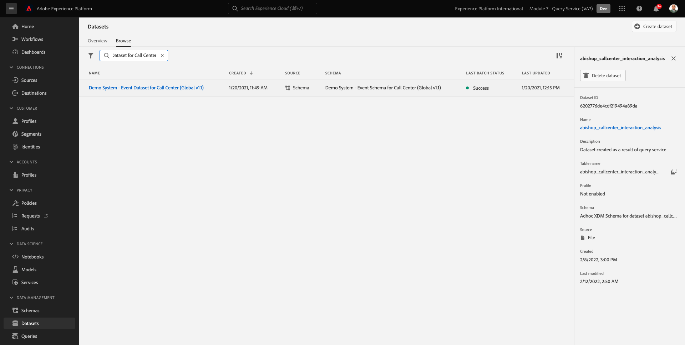
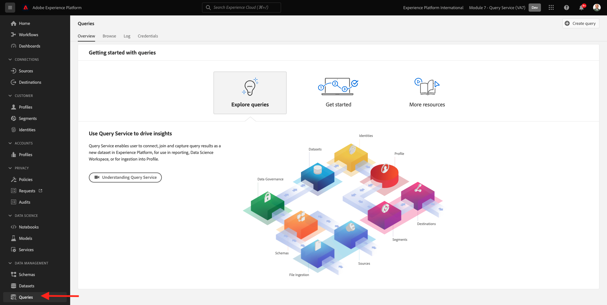

# 4.1 Introdução

## 4.1.1 Conhecimento da interface do usuário do Adobe Experience Platform

Ir para [Adobe Experience Platform](https://experience.adobe.com/platform). Depois de fazer logon, você será direcionado para a página inicial do Adobe Experience Platform.

Antes de continuar, é necessário selecionar um **sandbox**. A sandbox a ser selecionada é chamada de ``--module7sandbox--``. Você pode fazer isso clicando no texto **[!UICONTROL Produto de produção]** na linha azul na parte superior da tela. Depois de selecionar a [!UICONTROL sandbox], você verá a tela mudar e agora você estará em seu [!UICONTROL sandbox].

## 4.1.2 Explorar dados na plataforma

Trazer dados de diferentes canais é uma tarefa difícil para qualquer marca. E neste exercício, os clientes do Haqqani Signal estão se engajando com o Haqqani Signal em seu site, em seu aplicativo móvel, dados de compra são coletados pelo sistema Point of Sale do Haqqani Signal, e eles têm dados de CRM e Fidelidade. O Haqqani Signal está usando o Adobe Analytics e o Adobe Launch para capturar dados em seu site, aplicativo móvel e sistema de PDV, de modo que esses dados já estão fluindo para o Adobe Experience Platform. Vamos começar explorando todos os dados do Haqqani Signal que já existe no Adobe Experience Platform.

No menu esquerdo, acesse **Conjuntos de dados**.

O Haqqani Signal está transmitindo dados para o Adobe Experience Platform e esses dados estão disponíveis no `Demo System - Event Dataset for Website (Global v1.1)` conjunto de dados. Procurar por `Demo System - Event Dataset for Website`.

Os dados de Interação do Centro de Chamadas do Haqqani Signal são capturados na variável `Demo System - Event Dataset for Call Center (Global v1.1)` conjunto de dados. Procurar por `Demo System - Event Dataset for Call Center` dados na caixa de pesquisa. Clique no nome do conjunto de dados para abri-lo.

Depois de clicar no conjunto de dados, você terá uma visão geral da atividade do conjunto de dados, como lotes assimilados e com falha.

Clique em **Visualizar conjunto de dados** para ver uma amostra dos dados armazenados em `Demo System - Event Dataset for Call Center (Global v1.1)` conjunto de dados. O painel esquerdo mostra a estrutura de esquema desse conjunto de dados.

Clique no botão **Fechar** para fechar o **Visualizar conjunto de dados** janela.

## 4.1.3 Introdução ao serviço de query

O Adobe Experience Platform Query Service é acessado ao clicar em **Queries** no menu esquerdo.

Ao acessar **Log** você verá a página Lista de consultas , que fornece uma lista de todas as consultas executadas nessa organização, com as mais recentes na parte superior.

Clique em qualquer consulta SQL na lista e observe os detalhes fornecidos no painel direito.

Você pode rolar a janela para ver toda a consulta, ou clicar no ícone destacado abaixo para copiar toda a consulta para o bloco de notas. Você não precisa copiar o query no momento.

Você não pode apenas ver as consultas que foram executadas, essa Interface do usuário permite criar novos conjuntos de dados a partir de consultas. Esses conjuntos de dados podem ser vinculados ao Perfil do cliente em tempo real da Adobe Experience Platform ou podem ser usados como entrada para o Adobe Experience Platform Data Science Workspace.

## 4.1.4 Conectar o PSQL Client ao Serviço de Consulta

O Serviço de Consulta suporta clientes com um driver para PostgreSQL. Nesse caso, usaremos o PSQL, uma interface de linha de comando e o Power BI ou Tableau. Vamos nos conectar ao PSQL.

Clique em **Credenciais**.

Você verá a tela abaixo. A tela Configuração fornece informações e credenciais do servidor para autenticação no Serviço de query. Por enquanto, nos concentraremos no lado direito da tela que contém um comando connect para PSQL. Clique no botão Copiar para copiar o comando para a área de transferência.

Para Windows: Abra a linha de comando pressionando a tecla Windows e digitando cmd e, em seguida, clicando no resultado do Prompt de comando.

Para macOS: Abra o terminal.app por meio da pesquisa em destaque:

Cole o comando connect que você copiou da interface do usuário do serviço de query e pressione enter na janela de prompt de comando:

Windows:

MacOS:

Agora você está conectado ao Serviço de query usando PSQL.

Nos próximos exercícios, haverá bastante interação com essa janela. Nos referiremos a ele como seu **Interface de linha de comando PSQL**.

Agora você está pronto para começar a enviar consultas.

Próxima etapa: [4.2 Uso do serviço de query](./ex2.md)

[Voltar ao Módulo 4](./query-service.md)

[Voltar para todos os módulos](../../overview.md)
