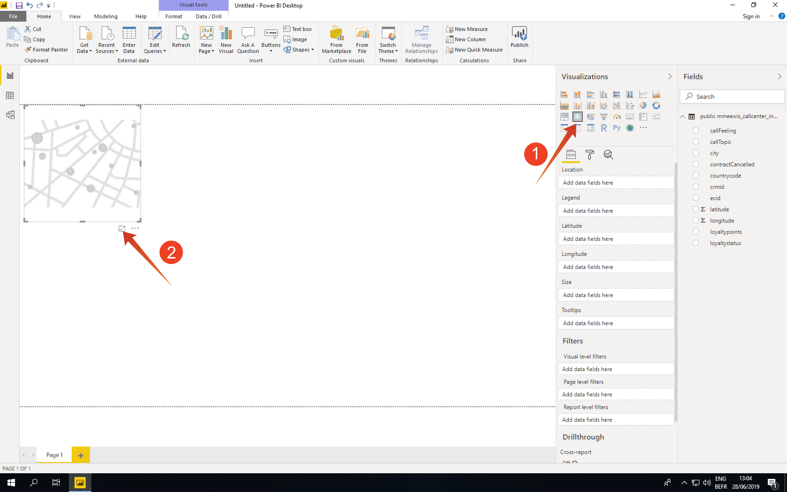

# 4.5 Serviço e Power BI de query

Abra o Microsoft Power BI Desktop.

Clique em **Obter dados**.

Procurar por **pôsteres** (1), selecione **Postgres** (2) da lista e **Connect** (3)

Vá para Adobe Experience Platform, para **Queries** e **Credenciais**.

No **Credenciais** no Adobe Experience Platform, copie a **Host** e cole-o no **Servidor** e copie o **Banco de dados** e cole-o no **Banco de dados** no Power BI, clique em OK (2).

>[!IMPORTANT]
>
>Certifique-se de incluir a porta **80** no final do valor do Servidor porque o Serviço de Consulta não usa atualmente a porta PostgreSQL padrão de 5432.

Na próxima caixa de diálogo, preencha o Nome de usuário e a Senha com seu Nome de usuário e Senha encontrados no **Credenciais** de Consultas no Adobe Experience Platform.

Na caixa de diálogo Navegador, coloque **LDAP** no campo de pesquisa (1) para localizar seus conjuntos de dados do CTAS e marcar a caixa ao lado de cada (2). Em seguida, clique em Carregar (3).

Certifique-se de que o **Relatório** (1) está selecionada.

Selecione o mapa (1) e, depois que ele for adicionado à tela de relatórios, amplie o mapa (2).

Em seguida, precisamos definir as medidas e as dimensões. Para isso, arraste os campos do **campos** seção sobre os espaços reservados correspondentes (localizados em **visualizações**) conforme indicado abaixo:

Como medida, usaremos uma contagem de **customerId**. Arraste o **crmid** do campo **campos** na seção **Tamanho** espaço reservado:

Finalmente, para fazer algumas **callTopic** , vamos arrastar a **callTopic** no campo para **Filtros de nível de página** espaço reservado (talvez seja necessário rolar no **visualizações** seção);

Selecionar/desmarcar **callTopics** para investigar:

Você já terminou este exercício.

Próxima etapa: [4.7 API do serviço de consulta](./ex7.md)

[Voltar ao Módulo 4](./query-service.md)

[Voltar para todos os módulos](../../overview.md)
