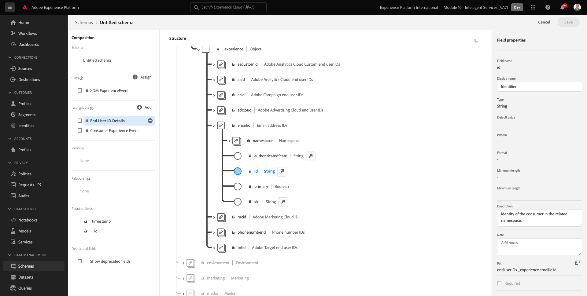
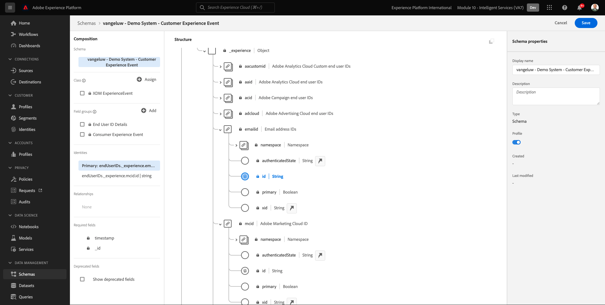
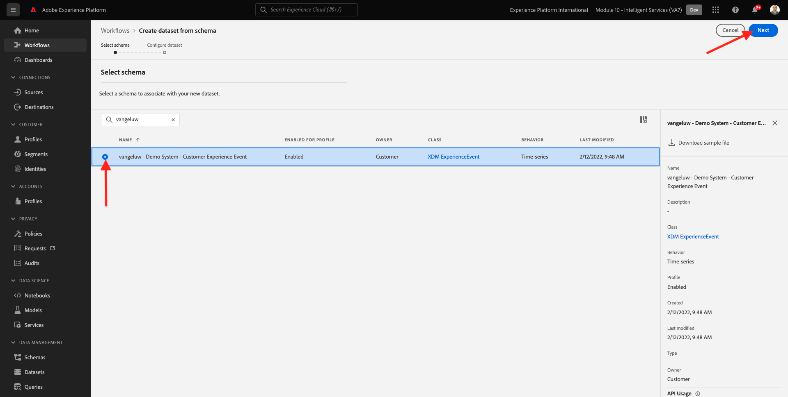
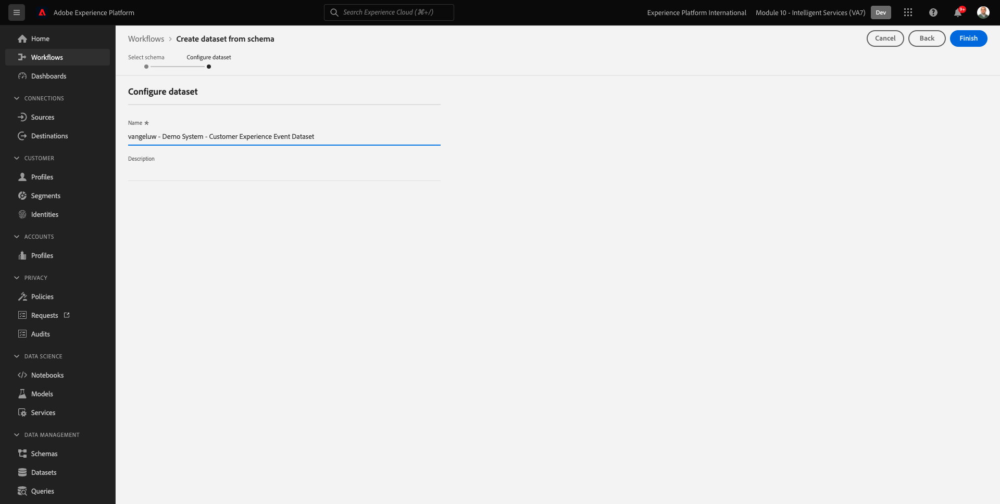

# 5.1 AI do cliente - Preparação de dados (Assimilar)

Para que os Serviços inteligentes descubram insights de seus dados de eventos de marketing, os dados devem ser semanticamente enriquecidos e mantidos em uma estrutura padrão. Os Serviços inteligentes usam esquemas Adobe Experience Data Model (XDM) para alcançar isso.
Especificamente, todos os conjuntos de dados que são usados nos Serviços inteligentes devem estar em conformidade com a **Evento de experiência do consumidor** Esquema XDM.

## 5.1.1 Criar esquema

Neste exercício, você criará um schema que contenha a variável **Mistura de evento de experiência do consumidor**, que é exigido pela **Customer AI** Serviço inteligente.

Faça logon no Adobe Experience Platform acessando este URL: [https://experience.adobe.com/platform](https://experience.adobe.com/platform).

Depois de fazer logon, você será direcionado para a página inicial do Adobe Experience Platform.

Antes de continuar, é necessário selecionar um **sandbox**. A sandbox a ser selecionada é chamada de ``--module10sandbox--``. Você pode fazer isso clicando no texto **[!UICONTROL Produto de produção]** na linha azul na parte superior da tela. Depois de selecionar a sandbox apropriada, você verá a tela mudar e agora estará na sandbox dedicada.

No menu esquerdo, clique em **Esquemas** e ir para **Procurar**. Clique em **Criar esquema**.

Na janela pop-up , selecione **ExperiênciaEvento XDM**.

Você verá isso.

Pesquise e selecione o seguinte **Misturas** para adicionar a este Esquema:

- Evento de experiência do consumidor

   

- Detalhes da ID de usuário final

   

Clique em **Adicionar grupos de campos**.

Você verá isso. Selecione a mistura **Detalhes da ID de usuário final**.

Navegar até o campo **endUserIDs._experience.emailid.id**.

No menu à direita do campo **endUserIDs._experience.emailid.id**, role para baixo e marque a caixa de seleção para **Identidade**, marque a caixa de seleção de **Identidade principal** e selecione o **Namespace de identidade** de **Email**.

Navegar até o campo **endUserIDs._experience.mcid.id**. Marque a caixa de seleção para **Identidade** e selecione o **Namespace de identidade** de **ECID**. Clique em **Aplicar**.

Dê um nome ao esquema agora.

Como o nome do nosso schema, você usará isto:

- `--demoProfileLdap-- - Demo System - Customer Experience Event`

Como exemplo, para ldap **vangeluco**, esse deve ser o nome do schema:

- **vangeluw - Sistema de demonstração - Evento de experiência do cliente**

Isso deveria te dar algo assim. Clique no botão **+ Adicionar** botão para adicionar novo **Misturas**.

Selecione o nome do esquema. Agora, você deve ativar seu esquema para **Perfil**, clicando no botão **Perfil** alternar.

Você verá isso. Clique em **Habilitar**.

Você deveria ter isso agora. Clique em **Salvar** para salvar o esquema.

## 5.1.2 Criar conjunto de dados

No menu esquerdo, clique em **Conjuntos de dados** e ir para **Procurar**. Clique em **Criar conjunto de dados**.

Clique em **Criar conjunto de dados a partir do esquema**.

Na próxima tela, selecione o conjunto de dados criado no exercício anterior, que é nomeado como **[!UICONTROL ldap - Sistema de demonstração - Evento de experiência do cliente]**. Clique em **Próximo**.

Como nome para o conjunto de dados, use `--demoProfileLdap-- - Demo System - Customer Experience Event Dataset`. Clique em **Concluir**.

Seu conjunto de dados foi criado. Ative o **Perfil** alternar.

Clique em **Habilitar**.

Agora você deve ter o seguinte:

Agora você está pronto para começar a assimilar dados de Evento de experiência do consumidor e começar a usar o serviço de IA do cliente.

## 5.1.3 Baixar dados de teste do Evento de experiência

Uma vez **Esquema** e **Conjunto de dados** estiver configurado, agora você está pronto para assimilar dados de Evento de experiência. Como o Customer AI requer dados em **2 trimestres, pelo menos**, será necessário assimilar dados preparados externamente.

Os dados preparados para os eventos de experiência devem estar em conformidade com os requisitos e o schema da variável [Mistura XDM do Evento de experiência do consumidor](https://github.com/adobe/xdm/blob/797cf4930d5a80799a095256302675b1362c9a15/docs/reference/context/experienceevent-consumer.schema.md).

Baixe o arquivo que contém os dados de amostra deste local: [https://dashboard.adobedemo.com/data](https://dashboard.adobedemo.com/data). Clique no botão **Baixar** botão.

Agora você baixou um arquivo chamado **retail-v1-dec2020-xl.json.zip**. Coloque o arquivo na área de trabalho do seu computador e descompacte-o. Em seguida, você verá um arquivo chamado **retail-v1.json**. Você precisará deste arquivo no próximo exercício.

## 5.1.4 Assimilar dados do teste de evento de experiência

No Adobe Experience Platform, acesse **Conjuntos de dados** e abra seu conjunto de dados, que é nomeado como **[!UICONTROL ldap - Sistema de demonstração - Conjunto de dados do evento da experiência do cliente]**.

No conjunto de dados, clique em **Escolher arquivos** para adicionar dados.

Na janela pop-up , selecione o arquivo **retail-v1.json** e clique em **Abrir**.

Você verá os dados que estão sendo importados e um novo lote será criado no **Carregamento** estado. Não saia desta página até que o arquivo seja carregado.

Depois que o arquivo for carregado, você verá a alteração do status do lote de **Carregamento** para **Processamento**.

A inserção e o processamento dos dados podem levar de 10 a 20 minutos.

Quando a assimilação de dados for bem-sucedida, o status do lote será alterado para **Sucesso**.

Próxima etapa: [5.2 Customer AI - Criar uma nova instância (Configurar)](./ex2.md)

[Voltar ao Módulo 5](./intelligent-services.md)

[Voltar para todos os módulos](./../../overview.md)
