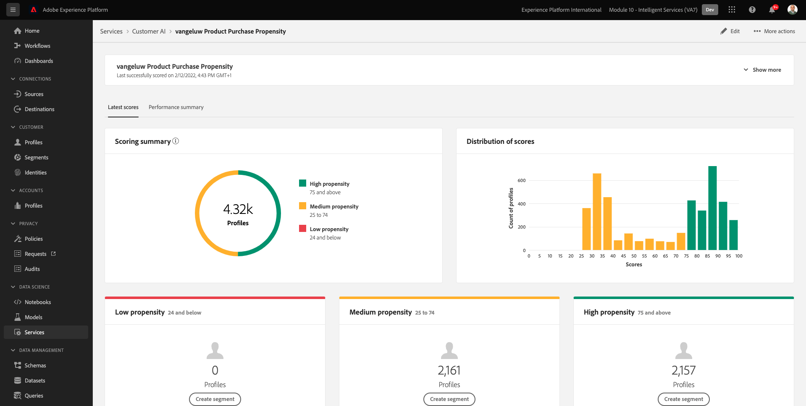

# 5.3 Customer AI - Painel de pontuação e segmentação (Predict &amp; Take Action)

Depois que a instância do Customer AI concluir uma execução de modelo, ela permitirá visualizar a pontuação de propensão que é avaliada para prever que um cliente esteja realizando uma compra nos próximos 30 dias.

>[!NOTE]
>
>Somente uma instância do Customer AI com o status de **Sucesso** permitirá pré-visualizar os insights do serviço.

## 5.3.1 Previsão de tendências

Agora vamos revisar a propensão prevista gerada pelo modelo de instância do Customer AI. Clique no nome da instância para exibir o painel.

O painel do Customer AI mostra o resumo sobre a pontuação, a distribuição da população e os fatores influentes para a avaliação do modelo.

Passe o mouse sobre os fatores influentes para visualizar a desagregação adicional da distribuição de dados.

## 5.3.2 Ações das empresas

### 5.3.2.1 Segmentação de clientes

O painel do Customer AI permite definir segmentos com um clique. Clique no botão **Criar segmento** nos cartões de propensão.

Você verá que uma definição de segmento é criada automaticamente.

Dê um nome ao seu segmento, seguindo essa convenção de nomenclatura: `--demoProfileLdap-- - Customer AI High Propensity`. Clique em **Salvar**.

Agora você pode usar esse segmento para direcionamento usando, por exemplo, CDP em tempo real, Journey Orchestration e Adobe Target.

### 5.3.2.2 Visão geral do perfil

Como a pontuação de propensão do Customer AI se torna parte do Perfil do cliente em tempo real, você pode visualizar a pontuação individual do cliente.

No Adobe Experience Platform, acesse **Perfis** no menu esquerdo e selecione **Procurar**.

Pesquise por um perfil usando qualquer um dos identificadores, como por exemplo **EMAIL hbirkenshawa@businessweek.com**, que estão disponíveis no arquivo JSON que você assimilou. Clique no botão **ID do perfil** para abrir o perfil.

Você verá isso:

Ir para **Atributos**, que contém a saída do modelo do Customer AI.

Role para baixo para ver a Pontuação de propensão, conforme calculada pelo modelo da AI do cliente.

Próxima etapa: [Resumo e benefícios](./summary.md)

[Voltar ao Módulo 5](./intelligent-services.md)

[Voltar para todos os módulos](./../../overview.md)
