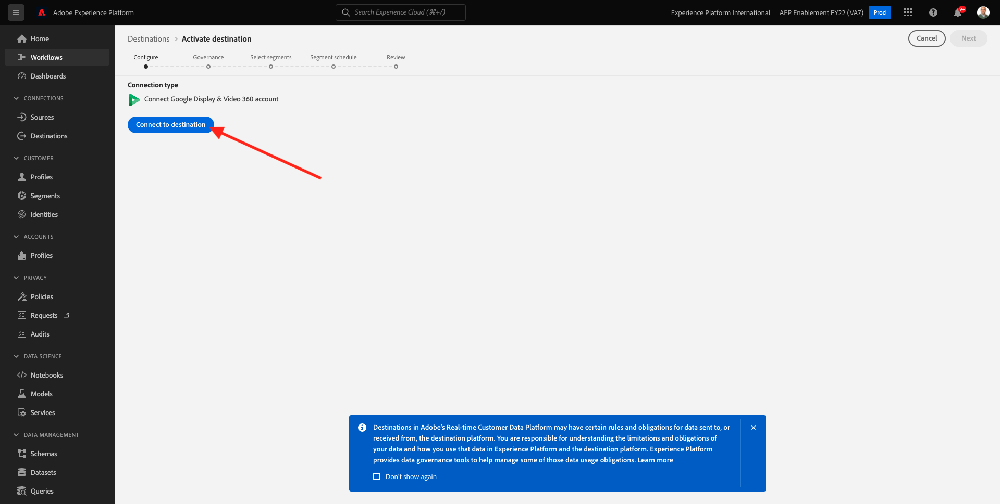

# 6.2 Configurar um destino de publicidade como o Google DV360

>[!IMPORTANT]
>
>O conteúdo abaixo destina-se a FYI - Você **NOT** precisa configurar um novo destino para DV360. O destino já foi criado e você pode usá-lo no próximo exercício.

Ir para [Adobe Experience Platform](https://experience.adobe.com/platform). Depois de fazer logon, você será direcionado para a página inicial do Adobe Experience Platform.

Antes de continuar, é necessário selecionar um **sandbox**. A sandbox a ser selecionada é chamada de ``--aepSandboxId--``. Você pode fazer isso clicando no texto **[!UICONTROL Produto de produção]** na linha azul na parte superior da tela. Depois de selecionar a [!UICONTROL sandbox], você verá a tela mudar e agora você estará em seu [!UICONTROL sandbox].

No menu esquerdo, acesse **Destinos**, em seguida, vá para **Catálogo**. Você verá o **Catálogo de destinos**.

Em **Destinos**, clique em **Tela e vídeo do Google 360** e, em seguida, clique em **+ Configurar**.

Você verá isso. Clique em **Ligar ao destino**.

Na próxima tela, você pode configurar o destino para o Google DV360.

Insira um valor nos campos **Nome** e **Descrição**.

O campo **ID da conta** é **ID do anunciante** da conta DV360. Você pode encontrar isso aqui:

O **Tipo de conta** deve ser definido como **Convidar anunciante**.

Agora você tem isso. Clique em **Próximo**.

>[!NOTE]
>
>A Google precisa incluir o Adobe na lista de permissões para que o Adobe Experience Platform envie dados para o Google DV360. Entre em contato com o Gerente de conta da Google para ativar esse fluxo de dados.

Depois de criar o destino, você verá isso. Opcionalmente, é possível selecionar uma política de governança de dados. Em seguida, clique em **Salvar e sair**.

Em seguida, você verá uma lista de destinos disponíveis.
No próximo exercício, você conectará o segmento criado no exercício anterior ao destino Google DV360.

Próxima etapa: [6.3 Tomar medidas: enviar seu segmento para o DV360](./ex3.md)

[Voltar ao Módulo 6](./real-time-cdp-build-a-segment-take-action.md)

[Voltar para todos os módulos](../../overview.md)
