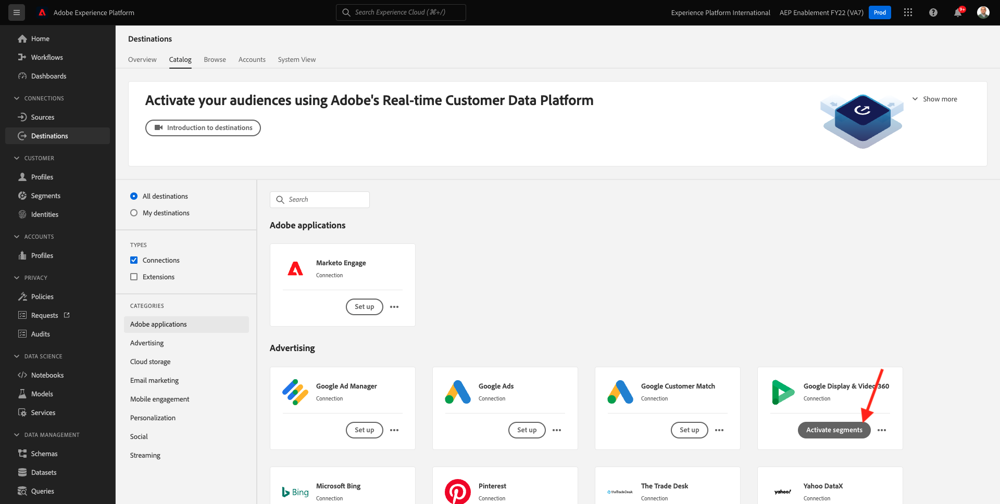
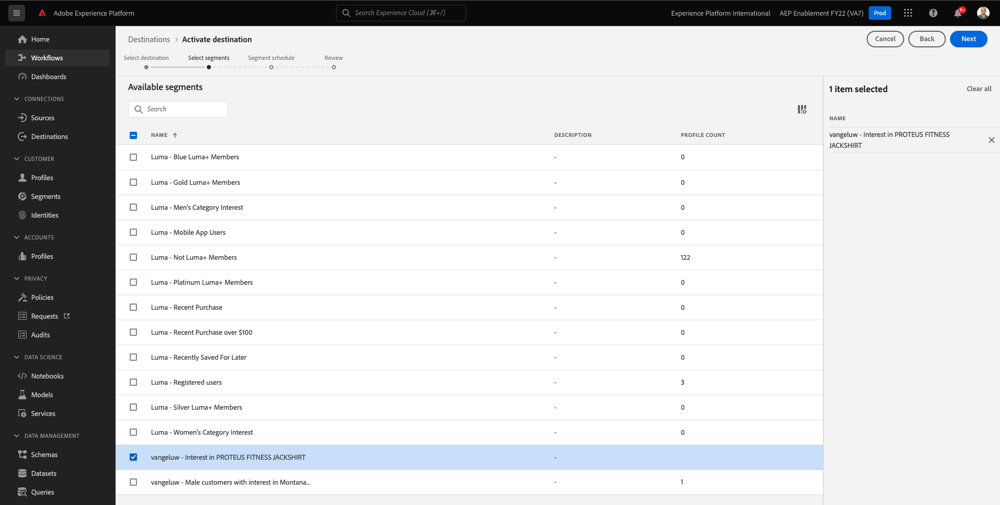

# 6.3 Tomar medidas: enviar seu segmento para o DV360

Ir para [Adobe Experience Platform](https://experience.adobe.com/platform). Depois de fazer logon, você será direcionado para a página inicial do Adobe Experience Platform.

Antes de continuar, é necessário selecionar um **sandbox**. A sandbox a ser selecionada é chamada de ``--aepSandboxId--``. Você pode fazer isso clicando no texto **[!UICONTROL Produto de produção]** na linha azul na parte superior da tela. Depois de selecionar a [!UICONTROL sandbox], você verá a tela mudar e agora você estará em seu [!UICONTROL sandbox].

No menu esquerdo, acesse **Destinos**, em seguida, vá para **Catálogo**. Você verá o **Catálogo de destinos**.

Em **Destinos**, clique no botão **Ativar segmentos** no **Tela e vídeo do Google 360** cartão.

Selecione seu destino e clique em **Próximo**.

Na lista de segmentos disponíveis, selecione o segmento que você criou no exercício anterior. Clique em **Próximo**.

No **Agendamento do segmento** página, clique em **Próximo**.

Por último, no **Revisão** página, clique em **Concluir**.

Seu segmento agora está vinculado ao Google DV360. Toda vez que um cliente se qualifica para esse segmento, um sinal será enviado para o Google DV360 para incluir esse cliente no público-alvo no lado do Google DV360.

Próxima etapa: [6.4 Tomar medidas: enviar seu segmento para um destino S3](./ex4.md)

[Voltar ao Módulo 6](./real-time-cdp-build-a-segment-take-action.md)

[Voltar para todos os módulos](../../overview.md)
