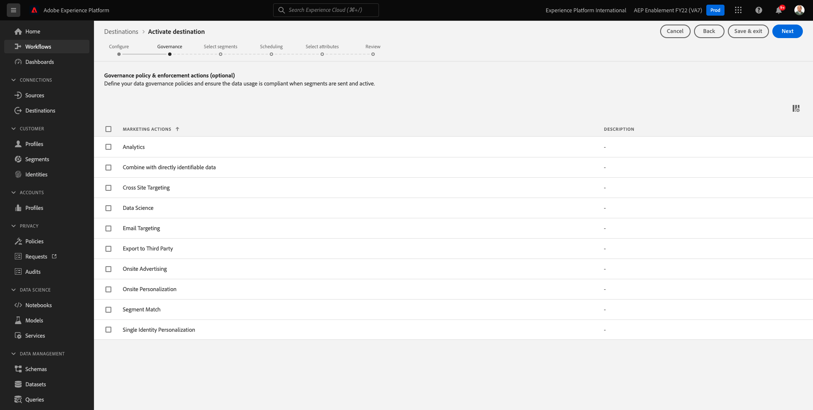
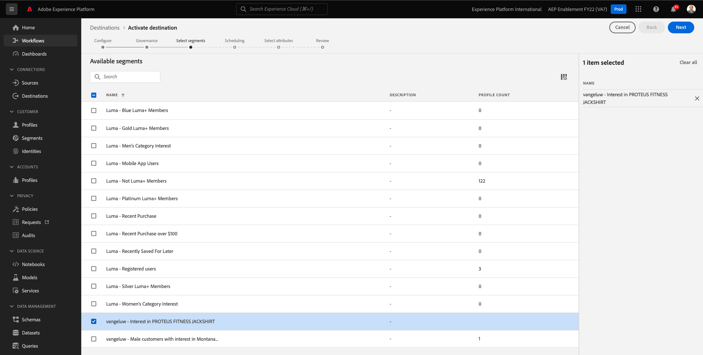

# 6.4 Tomar medidas: enviar seu segmento para um destino S3

O Adobe Experience Platform também tem a capacidade de compartilhar públicos para destinos de marketing por email, como o Salesforce Marketing Cloud, Oracle Eloqua, Oracle Responsys e Adobe Campaign.

Você pode usar o FTP ou SFTP como parte dos destinos dedicados para cada um desses Destinos de marketing de email, ou pode usar o AWS S3 para trocar listas de clientes entre o Adobe Experience Platform e esses Destinos de marketing de email.

Neste módulo, você configurará esse destino usando um bucket do AWS S3.

## 6.4.1 Criar o bucket S3

Ir para [https://console.aws.amazon.com](https://console.aws.amazon.com) e faça logon com a conta Amazon criada anteriormente.

Depois de fazer logon, você será redirecionado para a variável **Console de gerenciamento do AWS**.

No **Localizar Serviços** , pesquisar por **s3**. Clique no primeiro resultado da pesquisa: **S3 - Armazenamento escalável na nuvem**.

Você verá o **Amazon S3** homepage. Clique em **Criar bucket**.

No **Criar bucket** , você precisa configurar duas coisas:

- Nome: usar o nome `aepmodulertcdp--demoProfileLdap--`. Como exemplo, neste exercício, o nome do bucket é **aepmodulertcdpvangeluw**
- Região: usar a região **UE (Frankfurt) eu-central-1**

Deixe todas as outras configurações padrão como estão. Role para baixo e clique em **Criar bucket**.

Você verá seu bucket sendo criado e será redirecionado para a página inicial do Amazon S3.

## 6.4.2 Defina as permissões para acessar seu bucket S3

A próxima etapa é configurar o acesso ao seu bucket S3.

Para fazer isso, acesse [https://console.aws.amazon.com/iam/home](https://console.aws.amazon.com/iam/home).

O acesso aos recursos da AWS é controlado pelo Amazon Identity and Access Management (IAM).

Agora você verá esta página.

No menu esquerdo, clique em **Usuários**. Você verá o **Usuários** tela. Clique em **Adicionar usuários**.

Em seguida, configure o usuário:

- Nome de usuário: use `s3_--demoProfileLdap--_rtcdp` como um nome, portanto, neste exemplo, o nome é `s3_vangeluw_rtcdp`.
- Tipo de acesso AWS: select **Chave de acesso - Acesso programático**.

Clique em **Próximo: Permissões**.

Você verá essa tela de permissões. Clique em **Anexar as políticas existentes diretamente**.

Insira o termo de pesquisa **s3** para ver todas as políticas S3 relacionadas. Selecionar a política **AmazonS3FullAccess**. Clique em **Próximo: Tags**.

No **Tags** não há necessidade de configurar nada. Clique em **Próximo: Revisão**.

Revise sua configuração. Clique em **Criar usuário**.

Seu usuário foi criado e você está vendo suas credenciais para acessar o ambiente S3. É a única vez que você verá suas credenciais, então, por favor, anote-as.

Clique em **Mostrar** para ver sua chave de acesso Secret:

>[!IMPORTANT]
>
>Armazene suas credenciais em um arquivo de texto em seu computador.
>
> - ID da chave de acesso: ...
> - Chave de acesso secreta: ...
>
> Depois de clicar **Fechar** você nunca verá suas credenciais novamente!

Clique em **Fechar**.

Agora você criou com êxito um bucket do AWS S3 e criou um usuário com permissões para acessar esse bucket.

## 6.4.3 Configurar destino no Adobe Experience Platform

Ir para [Adobe Experience Platform](https://experience.adobe.com/platform). Depois de fazer logon, você será direcionado para a página inicial do Adobe Experience Platform.

Antes de continuar, é necessário selecionar um **sandbox**. A sandbox a ser selecionada é chamada de ``--aepSandboxId--``. Você pode fazer isso clicando no texto **[!UICONTROL Produto de produção]** na linha azul na parte superior da tela. Depois de selecionar a [!UICONTROL sandbox], você verá a tela mudar e agora você estará em seu [!UICONTROL sandbox].

No menu esquerdo, acesse **Destinos**, em seguida, vá para **Catálogo**. Você verá o **Catálogo de destinos**.

Clique em **Armazenamento na nuvem**, em seguida, clique no botão **Configurar** (ou ativar) **Ativar segmentos**, dependendo do seu ambiente) na **Amazon S3** cartão.

Dependendo do seu ambiente, talvez seja necessário clicar em **+ Configurar novo destino** para começar a criar o destino.

Selecionar **Nova conta** como Tipo de conta. Use as credenciais do S3 que foram fornecidas a você na etapa anterior:

| ID da chave de acesso | Chave de acesso secreta |
|:-----------------------:| :-----------------------:|
| AKIA...... | Cm5Ln...... |

Clique em **Ligar ao destino**.

Em seguida, você verá uma confirmação visual de que esse destino está conectado.

É necessário fornecer um nome e uma pasta para que o Adobe Experience Platform possa se conectar ao bucket S3.

Como convenção de nomenclatura, use o seguinte:

| ID da chave de acesso | Chave de acesso secreta |
|:-----------------------:| :-----------------------:|
| Nome | `AWS - S3 - --demoProfileLdap--` |
| Descrição | `AWS - S3 - --demoProfileLdap--` |
| Nome do bucket | `aepmodulertcdp--demoProfileLdap--` |
| Caminho da pasta | / |

Clique em **Próximo**.

Agora é possível anexar opcionalmente uma Política de Governança de Dados ao seu novo destino. Clique em **Próximo**.

Na lista de segmentos, pesquise o segmento criado no exercício 1 e selecione-o. Clique em **Próximo**.

Você verá isso. Se desejar, edite o agendamento clicando no botão **lápis** ícone . **Criar Programação**.

Defina seu cronograma de escolha. Selecionar **Exportar arquivos incrementais** e defina a frequência como **Por hora** each **3 horas**. Clique em **Criar**.

Você terá isso. Clique em **Próximo**.

Agora é possível selecionar atributos para a exportação para o AWS S3. Clique em **Adicionar novo campo** e garantir o campo `--aepTenantId--.identification.core.ecid` é adicionado e marcado como **Chave de desduplicação**.

Como opção, você pode adicionar quantos outros campos forem necessários.

Depois de adicionar todos os campos, clique em **Próximo**.

Revise sua configuração. Clique em **Concluir** para concluir a configuração.

Você estará de volta na tela de Ativação de destino e verá seu segmento adicionado a esse destino.

Se quiser adicionar mais exportações de segmento, clique em **Ativar segmentos** para reiniciar o processo e adicionar mais segmentos.

Próxima etapa: [6.5 Tomar medidas: enviar seu segmento para a Adobe Target](./ex5.md)

[Voltar ao Módulo 6](./real-time-cdp-build-a-segment-take-action.md)

[Voltar para todos os módulos](../../overview.md)
