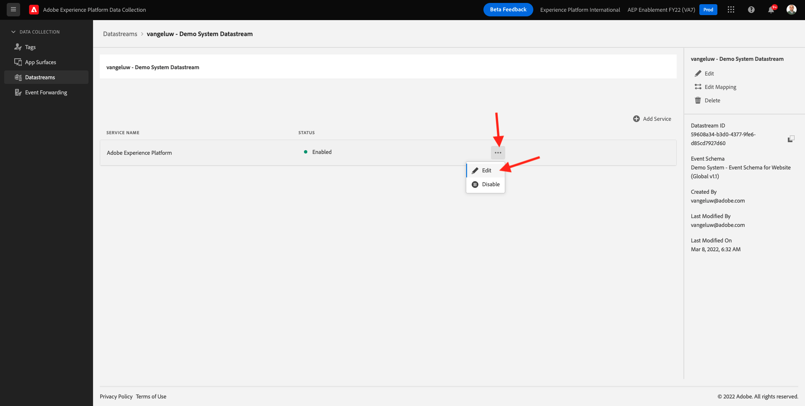
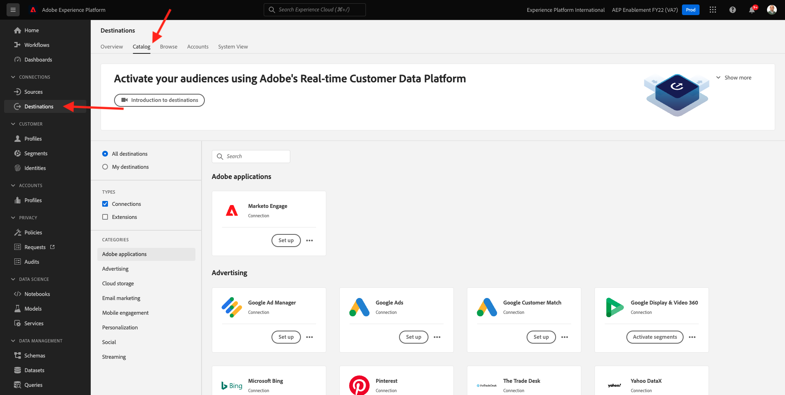
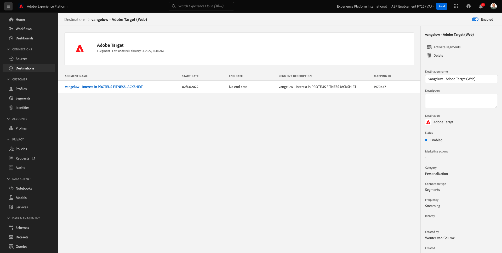
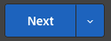
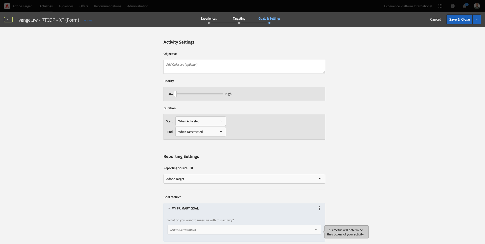

# 6.5 Tomar medidas: enviar seu segmento para a Adobe Target

Ir para [Adobe Experience Platform](https://experience.adobe.com/platform). Depois de fazer logon, você será direcionado para a página inicial do Adobe Experience Platform.


Antes de continuar, é necessário selecionar um **sandbox**. A sandbox a ser selecionada é chamada de ``--aepSandboxId--``. Você pode fazer isso clicando no texto **[!UICONTROL Produto de produção]** na linha azul na parte superior da tela. Depois de selecionar a [!UICONTROL sandbox], você verá a tela mudar e agora você estará em seu [!UICONTROL sandbox].


## 6.5.1 Verificar o fluxo de dados

O destino Adobe Target no Real-Time CDP é conectado ao conjunto de dados usado para assimilar dados na rede de borda do Adobe. Se quiser definir seu destino do Adobe Target, primeiro verifique se o armazenamento de dados já está habilitado para o Adobe Target. Seu datastram foi configurado em [Exercício 0.2 Criar o conjunto de dados](./../module0/ex2.md) e foi nomeado `--demoProfileLdap-- - Demo System Datastream`.

Ir para [https://experience.adobe.com/#/data-collection/](https://experience.adobe.com/#/data-collection/), depois clique em **Datastreams** ou **Datastreams (Beta)**.


No canto superior direito da tela, selecione o nome da sandbox, que deve ser `--aepSandboxId--`.


Em Datastreams, procure o conjunto de dados chamado `--demoProfileLdap-- - Demo System Datastream`. Clique no armazenamento de dados para abri-lo.


Você verá isso, clique em **...** ao lado de **Adobe Experience Platform** e, em seguida, clique em **Editar**.



Marque as caixas de seleção para ambas **Segmentação de borda** e **Destinos de personalização**. Clique em **Salvar**.


Em seguida, clique em **+ Adicionar serviço**.


Selecionar o serviço **Adobe Target**. Clique em **Salvar**.


Seu armazenamento de dados agora está configurado para o Adobe Target.


## 6.5.2 Configurar o destino do Adobe Target

O Adobe Target está disponível como destino do Real-Time CDP. Para configurar a integração do Adobe Target, acesse **Destinos** para **Catálogo**.



Clique em **Personalização** no **Categorias** menu. Você verá o **Adobe Target** cartão de destino. Clique em **Ativar segmentos** ou **Configurar** dependendo do seu ambiente).


Dependendo do seu ambiente, talvez seja necessário clicar em **+ Configurar novo destino** para começar a criar o destino.


Você verá isso.


No **Configurar novo destino** , você precisa configurar duas coisas:

- Nome: usar o nome `--demoProfileLdap-- - Adobe Target (Web)`, que deve ter esta aparência: **vangeluw - Adobe Target (Web)**.
- ID do conjunto de dados: é necessário selecionar o armazenamento de dados configurado em [Exercício 0.2 Criar o conjunto de dados](./../module0/ex2.md). O nome do seu armazenamento de dados deve ser: `--demoProfileLdap-- - Demo System Datastream`.

Clique em **Próximo**.


Na próxima tela, você pode selecionar opcionalmente uma política de governança. Não é necessário selecionar um, nesse caso, não há necessidade de selecionar um, portanto clique em **Criar**.


Seu destino agora é criado e será exibido na lista. Selecione seu destino e clique em **Próximo** para começar a enviar segmentos para o seu destino.


Na lista de segmentos disponíveis, selecione o segmento criado em [Exercício 6.1 Criar um segmento](./ex1.md), que é nomeado como `--demoProfileLdap-- - Interest in PROTEUS FITNESS JACKSHIRT`. Em seguida, clique em **Próximo**.


Na próxima página, clique em **Próximo**.


Clique em **Concluir**.


Seu segmento agora é ativado no Adobe Target.



>[!IMPORTANT]
>
>Quando você acabou de criar seu destino Adobe Target no Real-Time CDP, pode levar até uma hora para que o destino esteja ativo. Esse é um tempo de espera único, devido à configuração do back-end. Quando o tempo de espera inicial de 1 hora e a configuração de backend forem concluídos, os segmentos de borda recém-adicionados que são enviados para o destino do Adobe Target estarão disponíveis para direcionamento em tempo real.

## 6.5.3 Configurar a atividade baseada em formulário do Adobe Target

Agora que seu segmento do Real-Time CDP está configurado para ser enviado ao Adobe Target, você pode configurar a atividade de Direcionamento de experiência no Adobe Target. Neste exercício, você configurará uma atividade baseada em formulário.

Acesse a página inicial do Adobe Experience Cloud acessando [https://experiencecloud.adobe.com/](https://experiencecloud.adobe.com/). Clique em **Target** para abri-lo.


No **Adobe Target** página inicial, você verá todas as atividades existentes.


Clique em **+ Criar atividade** para criar uma nova Atividade.


Selecionar **Direcionamento de experiência**.


Selecionar **Formulário** e selecione **Sem restrições de propriedade**. Clique em **Próximo**.


Agora você está no compositor de atividades baseado em formulário.


Para o campo **LOCAL 1**, selecione **target-global-mbox**.


O público-alvo padrão está no momento **Todos os visitantes**. Clique no botão **3 pontos** ao lado de **Todos os visitantes** e clique em **Alterar público-alvo**.


Agora você está vendo a lista de públicos disponíveis, e o segmento do Adobe Experience Platform que você criou e enviou anteriormente para o Adobe Target agora faz parte dessa lista. Selecione o segmento criado anteriormente no Adobe Experience Platform. Clique em **Atribuir público-alvo**.


Seu segmento do Adobe Experience Platform agora faz parte dessa atividade de direcionamento de experiência.


Agora vamos mudar a Imagem do Herói na página inicial do site. Clique para abrir a lista suspensa ao lado de **Conteúdo padrão** e clique em **Criar oferta de HTML**.


Cole o código a seguir. Em seguida, clique em **Próximo**.

```javascript
<script>document.querySelector("#home > div > div > div > div > div.banner_img.d-none.d-lg-block > img").src="https://parsefiles.back4app.com/hgJBdVOS2eff03JCn6qXXOxT5jJFzialLAHJixD9/ff92fdc3885972c0090ad5419e0ef4d4_Luma - Product - Proteus - Hero Banner.png"; document.querySelector(".banner_text > *").remove()</script>
```


Você verá a nova experiência com a nova imagem, para o público-alvo selecionado.


Clique no título da Atividade no canto superior esquerdo para renomeá-la.


Para o nome, use:

- `--demoProfileLdap-- - RTCDP - XT (Form)`


Clique em **Próximo**.



No **Metas e configurações** - página, vá para **Métricas de meta**.



Defina a meta principal como **Envolvimento** - **Tempo no Site**.


Clique em **Salvar e fechar**.


Você está agora no **Visão geral da atividade** página. Ainda é necessário ativar sua atividade.


Clique no campo **Inativo** e selecione **Ativar**.


Em seguida, você receberá uma confirmação visual de que sua atividade agora está ativa.


Sua atividade agora está ao vivo e pode ser testada no site de demonstração.

>[!IMPORTANT]
>
>Quando você acabou de criar seu destino Adobe Target no Real-Time CDP, pode levar até uma hora para que o destino esteja ativo. Esse é um tempo de espera único, devido à configuração do back-end. Quando o tempo de espera inicial de 1 hora e a configuração de backend forem concluídos, os segmentos de borda recém-adicionados que são enviados para o destino do Adobe Target estarão disponíveis para direcionamento em tempo real.

Agora, se você voltar ao seu site de demonstração e visitar a página do produto para PROTEUS FITNESS JACKSHIRT, você se qualificará instantaneamente para o segmento criado, e verá a atividade do Adobe Target ser exibida na página inicial em tempo real.


Próxima etapa: [6.6 Públicos-alvo externos](./ex6.md)

[Voltar ao Módulo 6](./real-time-cdp-build-a-segment-take-action.md)

[Voltar para todos os módulos](../../overview.md)
