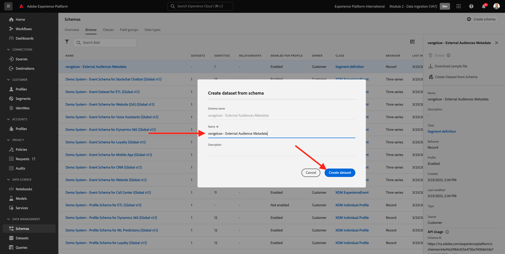
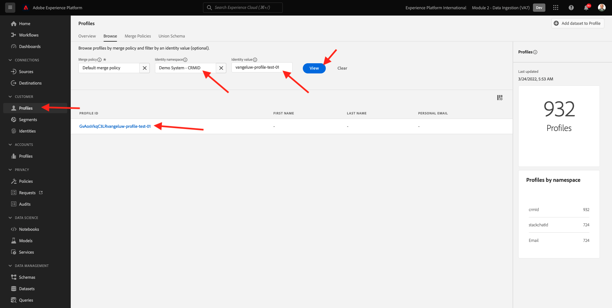

# 6.6 Públicos-alvo externos

Em muitos casos, sua empresa pode querer usar segmentos existentes de outros aplicativos para enriquecer o perfil do cliente no Adobe Experience Platform.
Esses públicos-alvo externos podem ter sido definidos com base em um modelo de ciência de dados ou usando plataformas de dados externas.

O recurso de públicos externos do Adobe Experience Platform permite que você se concentre na assimilação de públicos externos e em sua ativação, sem precisar redefinir a definição de segmento correspondente em detalhes no Adobe Experience Platform.

O processo geral é dividido em três etapas principais:

- Importe os metadados de público externo: esta etapa destina-se a assimilar os metadados externos do público, como o nome do público-alvo, no Adobe Experience Platform.
- Atribua a assinatura do público externo ao perfil do cliente: essa etapa destina-se a enriquecer o perfil do cliente com o atributo de associação de segmento externo.
- Crie os segmentos no Adobe Experience Platform: esta etapa destina-se a criar segmentos acionáveis com base na associação de públicos externos.

## 6.6.1 Metadados

Ir para [Adobe Experience Platform](https://experience.adobe.com/platform). Depois de fazer logon, você será direcionado para a página inicial do Adobe Experience Platform.


>[!IMPORTANT]
>
>A sandbox a ser usada para este exercício é ``--module2sandbox--``!

Antes de continuar, é necessário selecionar um **sandbox**. A sandbox a ser selecionada é chamada de ``--module2sandbox--``. Você pode fazer isso clicando no texto **[!UICONTROL Produto de produção]** na linha azul na parte superior da tela. Depois de selecionar a [!UICONTROL sandbox], você verá a tela mudar e agora você estará em seu [!UICONTROL sandbox].


Embora os dados do segmento definam a condição para que um perfil faça parte de um segmento, os metadados do segmento são informações sobre o segmento, como o nome, a descrição e o status do segmento. Como os metadados de públicos externos serão armazenados no Adobe Experience Platform, é necessário usar um namespace de identidade para assimilar os metadados no Adobe Experience Platform.

## 6.6.1.1 Namespace de identidade para públicos externos

Um namespace de identidade já foi criado para uso com **Públicos-alvo externos**.
Para exibir a identidade já criada, acesse **Identidades** e pesquisar por **Externo**. Clique no item &quot;Públicos externos&quot;.

Observe que:

- O símbolo de identidade **externalaudiences** será usada nas próximas etapas para fazer referência à identidade dos públicos externos.
- O **Identificador de não pessoas** é usado para esse namespace de identidade, pois esse namespace não se destina a identificar perfis de clientes, mas segmentos.


## 6.6.1.2 Criar o esquema de metadados de públicos externos

Os metadados de públicos-alvo externos se baseiam na variável **Esquema de definição de segmento**. Você pode encontrar mais detalhes na [Repositório XDM Github](https://github.com/adobe/xdm/blob/master/docs/reference/classes/segmentdefinition.schema.md).

No menu esquerdo, vá para Schemas. Clique em **+ Criar esquema** e, em seguida, clique em **Procurar**.


Para atribuir uma classe, pesquise por **definição de segmento**. Selecione o **Definição de segmento** classe e clique **Atribuir classe**.


Você verá isso. Clique em **Cancelar**.


Você verá isso. Selecione o campo **_id**. No menu direito, role para baixo e habilite a opção **Identidade** e **Identidade primária** caixas de seleção. Selecione o **Públicos-alvo externos** namespace de identidade. Clique em **Aplicar**.


Em seguida, selecione o nome do schema **Esquema sem título**. Altere o nome para `--demoProfileLdap-- - External Audiences Metadata`.


Ative o **Perfil** alterne e confirme. Finalmente, clique em **Salvar**.


## 6.6.1.3 Criar o conjunto de dados de metadados de públicos-alvo externos

Em **Esquemas**, vá para **Procurar**. Pesquise e clique no botão `--demoProfileLdap-- - External Audiences Metadata` schema criado na etapa anterior. Em seguida, clique em **Criar conjunto de dados a partir do esquema**.


Para o campo **Nome**, insira `--demoProfileLdap-- - External Audience Metadata`. Clique em **Criar conjunto de dados**.



Você verá isso. Não se esqueça de habilitar o **Perfil** alternar!


## 6.6.1.4 Criar uma conexão de origem de API HTTP

Em seguida, é necessário configurar o Conector de fonte da API HTTP que será usado para assimilar os metadados no conjunto de dados.

Ir para **Fontes**. No campo de pesquisa, digite **HTTP**. Clique em **Adicionar dados**.


Insira a seguinte informação:

- **Tipo de conta**: select **Nova conta**
- **Nome da conta**: enter `--demoProfileLdap-- - External Audience Metadata`
- Marque a caixa de seleção **Caixa compatível com XDM**

Em seguida, clique em **Conectar-se à origem**.


Você verá isso. Clique em **Próximo**.


Selecionar **Conjunto de dados existente** e, no menu suspenso, pesquise e selecione o conjunto de dados `--demoProfileLdap-- - External Audience Metadata`.

Verifique o **Detalhes do fluxo de dados** e, em seguida, clique em **Próximo**.


Você verá isso.

O **Mapeamento** A etapa do assistente está vazia, pois você assimilará uma carga compatível com XDM no conector de origem da API HTTP; portanto, nenhum mapeamento é necessário. Clique em **Próximo**.


No **Revisão** opcionalmente, é possível revisar a conexão e os detalhes do mapeamento. Clique em **Concluir**.


Você verá isso.


## 6.6.1.5 Ingestão de metadados de públicos-alvo externos

Na guia Visão geral do Conector de origem , clique em **...** e, em seguida, clique em **Copiar carga do esquema**.


Abra o aplicativo Editor de texto no computador e cole a carga que acabou de copiar, a qual se parece com isto. Em seguida, é necessário atualizar o **xdmEntity** nesta carga.


O objeto **xdmEntity** precisa ser substituído pelo código abaixo. Copie o código abaixo e cole-o em seu arquivo de texto substituindo o **xdmEntity** no editor de texto.

```
"xdmEntity": {
    "_id": "--demoProfileLdap---extaudience-01",
    "description": "--demoProfileLdap---extaudience-01 description",
    "segmentIdentity": {
      "_id": "--demoProfileLdap---extaudience-01",
      "namespace": {
        "code": "externalaudiences"
      }
    },
    "segmentName": "--demoProfileLdap---extaudience-01 name",
    "segmentStatus": "ACTIVE",
    "version": "1.0"
  }
```

Você deve ver isso:


Em seguida, abra um novo **Terminal** janela. Copie todo o texto no Editor de texto e cole-o na janela do terminal.


Em seguida, clique em **Enter**.

Em seguida, você verá uma confirmação da assimilação de dados na janela Terminal:


Atualize a tela do conector da Fonte de API HTTP, onde você verá que os dados estão sendo processados:


## 6.6.1.6 Validar a assimilação de metadados de públicos-alvo externos

Quando o processamento é concluído, é possível verificar a disponibilidade dos dados no conjunto de dados usando o Serviço de query.

No menu direito, acesse **Conjuntos de dados** e selecione o `--demoProfileLdap-- - External Audience Metadata` conjunto de dados criado anteriormente.


No menu à direita, vá para Queries e clique em **Criar query**.


Insira o código a seguir e pressione **SHIFT + ENTER**:

```
select * from --demoProfileLdap--_external_audience_metadata
```

Nos resultados da query, você verá os metadados do público externo que você assimilou.


## 6.6.2 Associação de segmento

Com os metadados de público-alvo externos disponíveis, agora é possível assimilar a associação de segmento para um perfil de cliente específico.

Agora é necessário preparar um conjunto de dados de perfil enriquecido em relação ao schema de associação de segmentos. Você pode encontrar mais detalhes na [Repositório XDM Github](https://github.com/adobe/xdm/blob/master/docs/reference/datatypes/segmentmembership.schema.md).

## 6.6.2.1 Criar o esquema de associação de públicos-alvo externos

No menu direito, acesse **Esquemas**. Clique em **Criar esquema** e, em seguida, clique em **Perfil individual XDM**.


No **Adicionar grupos de campos** pop-up, pesquisar **Perfil principal**. Selecione o **Core v2 de perfil** grupo de campos.


Em seguida, no **Adicionar grupos de campos** pop-up, pesquisar **Associação de segmento**. Selecione o **Detalhes da associação ao segmento** grupo de campos. Em seguida, clique em **Adicionar grupos de campos**.


Você verá isso. Navegar até o campo `--aepTenantId--.identification.core`. Clique no botão **crmId** campo. No menu direito, role para baixo e marque a opção **Identidade** e **Identidade primária** caixas de seleção. Para o **Namespace de identidade** select **Sistema de demonstração - CRMID**.

Clique em **Aplicar**.


Em seguida, selecione o nome do Esquema **Esquema sem título**. No campo nome para exibição, digite `--demoProfileLdap-- - External Audiences Membership`.


Em seguida, ative a **Perfil** alterne e confirme. Clique em **Salvar**.


## 6.6.2.2 Criar o conjunto de dados de associação de públicos-alvo externos

Em **Esquemas**, vá para **Procurar**. Pesquise e clique no botão `--demoProfileLdap-- - External Audiences Membership` schema criado na etapa anterior. Em seguida, clique em **Criar conjunto de dados a partir do esquema**.


Para o campo **Nome**, insira `--demoProfileLdap-- - External Audiences Membership`. Clique em **Criar conjunto de dados**.


Você verá isso. Não se esqueça de habilitar o **Perfil** alternar!


## 6.6.2.3 Criar uma conexão de origem de API HTTP


Em seguida, é necessário configurar o Conector de fonte da API HTTP que será usado para assimilar os metadados no conjunto de dados.

Ir para **Fontes**. No campo de pesquisa, digite **HTTP**. Clique em **Adicionar dados**.


Insira a seguinte informação:

- **Tipo de conta**: select **Nova conta**
- **Nome da conta**: enter `--demoProfileLdap-- - External Audience Membership`
- Marque a caixa de seleção **Caixa compatível com XDM**

Em seguida, clique em **Conectar-se à origem**.


Você verá isso. Clique em **Próximo**.


Selecionar **Conjunto de dados existente** e, no menu suspenso, pesquise e selecione o conjunto de dados `--demoProfileLdap-- - External Audiences Membership`.

Verifique o **Detalhes do fluxo de dados** e, em seguida, clique em **Próximo**.


Você verá isso.

O **Mapeamento** A etapa do assistente está vazia, pois você assimilará uma carga compatível com XDM no conector de origem da API HTTP; portanto, nenhum mapeamento é necessário. Clique em **Próximo**.


No **Revisão** opcionalmente, é possível revisar a conexão e os detalhes do mapeamento. Clique em **Concluir**.


Você verá isso.


## 6.6.2.4 Ingestão de dados de participação de públicos externos

Na guia Visão geral do Conector de origem , clique em **...** e, em seguida, clique em **Copiar carga do esquema**.


Abra o aplicativo Editor de texto no computador e cole a carga que acabou de copiar, a qual se parece com isto. Em seguida, é necessário atualizar o **xdmEntity** nesta carga.


O objeto **xdmEntity** precisa ser substituído pelo código abaixo. Copie o código abaixo e cole-o em seu arquivo de texto substituindo o **xdmEntity** no editor de texto.

```
  "xdmEntity": {
    "_id": "--demoProfileLdap---profile-test-01",
    "_experienceplatform": {
      "identification": {
        "core": {
          "crmId": "--demoProfileLdap---profile-test-01"
        }
      }
    },
    "personID": "--demoProfileLdap---profile-test-01",
    "segmentMembership": {
      "externalaudiences": {
        "--demoProfileLdap---extaudience-01": {
          "status": "realized",
          "lastQualificationTime": "2022-03-05T00:00:00Z"
        }
      }
    }
  }
```

Você deve ver isso:


Em seguida, abra um novo **Terminal** janela. Copie todo o texto no Editor de texto e cole-o na janela do terminal.


Em seguida, clique em **Enter**.

Em seguida, você verá uma confirmação da assimilação de dados na janela Terminal:


Atualize a tela do conector de Origem da API HTTP, onde, após alguns minutos, você verá que os dados estão sendo processados:


## 6.6.2.5 Validar a assimilação de membros de públicos externos

Quando o processamento é concluído, é possível verificar a disponibilidade dos dados no conjunto de dados usando o Serviço de query.

No menu direito, acesse **Conjuntos de dados** e selecione o `--demoProfileLdap-- - External Audiences Membership ` conjunto de dados criado anteriormente.


No menu à direita, vá para Queries e clique em **Criar query**.


Insira o código a seguir e pressione **SHIFT + ENTER**:

```
select * from --demoProfileLdap--_external_audiences_membership
```

Nos resultados da query, você verá os metadados do público externo que você assimilou.


## 6.6.3 Criar um segmento

Agora você está pronto para agir nos públicos externos.
No Adobe Experience Platform, a ação é realizada por meio da criação de segmentos, do preenchimento dos respectivos públicos-alvo e do compartilhamento desses públicos-alvo para os destinos.
Agora você criará um segmento usando o público externo que acabou de criar.

No menu esquerdo, acesse **Segmentos** e clique em **Criar segmento**.


Ir para **Públicos-alvo**. Você verá isso. Clique em **Públicos-alvo externos**.


Selecione o público-alvo externo que você criou anteriormente, que é nomeado `--demoProfileLdap---extaudience-01`. Arraste e solte o público-alvo na tela.


Dê um nome ao seu segmento, use `--demoProfileLdap-- - extaudience-01`. Clique em **Salvar e fechar**.


Você verá isso. Você também notará que o perfil para o qual você assimilou a associação de segmento agora é exibido na lista de **Perfis de exemplo**.


Seu segmento está pronto e pode ser enviado para um destino para ativação.

## 6.6.4 Visualizar o perfil do cliente

Agora você também pode visualizar a qualificação de segmento no seu perfil de cliente. Ir para **Perfis**, use o namespace de identidade **Sistema de demonstração - CRMID** e fornecer a identidade `--demoProfileLdap---profile-test-01`, que utilizou como parte do exercício 6.6.2.4, e clique em **Exibir**. Em seguida, clique no botão **ID do perfil** para abrir o perfil.



Ir para **Associação de segmento**, onde você verá seu público externo aparecer.


Próxima etapa: [SDK de destinos 6.7](./ex7.md)

[Voltar ao Módulo 6](./real-time-cdp-build-a-segment-take-action.md)

[Voltar para todos os módulos](../../overview.md)
