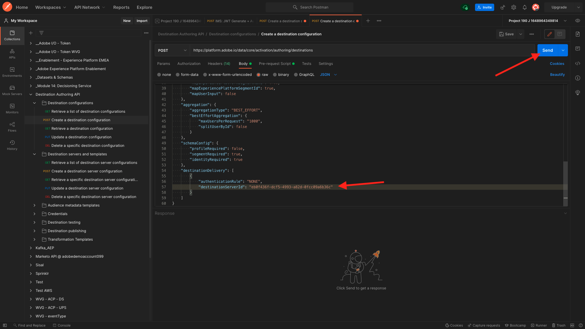

# SDK de destinos 6.7

## 6.7.1 Configurar o projeto do Adobe I/O

>[!IMPORTANT]
>
>Se você criou seu projeto do Adobe I/O depois de dezembro de 2021, você pode reutilizar esse projeto, ignorar esse exercício e passar para o exercício 6.7.2 imediatamente.
>
>Se você criou seu projeto do Adobe I/O antes de dezembro de 2021, crie um novo projeto para garantir que ele seja compatível com a API de criação de destinos.

Neste exercício, você usará o Adobe I/O intensamente para consultar as APIs da Platform. Siga as etapas abaixo para configurar o Adobe I/O.

Ir para [https://developer.adobe.com/console/home](https://developer.adobe.com/console/home)


Selecione a instância correta do Adobe Experience Platform no canto superior direito da tela. Sua instância é `--envName--`.


Clique em **Criar novo projeto**.

 ou


Selecionar **+ Adicionar ao projeto** e selecione **API**.


Você verá isso:


Clique no botão **Adobe Experience Platform** ícone .


Clique em **API Experience Platform**.


Clique em **Próximo**.


Agora você pode optar por fazer com que o Adobe I/O gere seu par de chaves de segurança ou faça upload de um existente.

Choose **Opção 1 - Gerar um par de chaves**.


Clique em **Gerar par de chaves**.


Você verá um ponteiro por cerca de 30 segundos.


Você verá isso e seu par de chaves gerado será baixado como um arquivo zip: **config.zip**.

Descompacte o arquivo **config.zip** no desktop, você verá que ele contém 2 arquivos:


- **certificate_pub.crt** é seu certificado de chave pública. Do ponto de vista de segurança, esse é o certificado livremente usado para configurar integrações com aplicativos online.
- **private.key** é sua chave privada. Isso nunca deve ser compartilhado com ninguém. A Chave privada é o que você usa para autenticar na implementação da API e deve ser um segredo. Se você compartilhar sua Chave privada com qualquer pessoa, ela poderá acessar sua implementação e utilizar a API para assimilar dados mal-intencionados no Platform e extrair todos os dados que estão no Platform.


Certifique-se de salvar o **config.zip** em um local seguro, pois será necessário para as próximas etapas e para acesso futuro às APIs do Adobe I/O e Adobe Experience Platform.

Clique em **Próximo**.


Agora é necessário selecionar a variável **Perfil(s) de produto** para sua integração.

Selecione os Perfis de produto necessários.

**FYI**: na instância do Adobe Experience Platform, os Perfis de produto terão um nome diferente. É necessário selecionar pelo menos um perfil de produto com os direitos de acesso adequados, que são configurados na Adobe Admin Console.


Clique em **Salvar API configurada**.


Você verá um ponteiro por alguns segundos.


E em seguida, você verá sua integração.


Clique no botão **Download para Postman** e clique em **Conta de serviço (JWT)** para baixar um ambiente Postman (aguarde até que o ambiente seja baixado, isso pode levar alguns segundos).


Role para baixo até ver **Conta de serviço (JWT)**, que é o local onde você pode encontrar todos os detalhes de integração usados para configurar a integração com o Adobe Experience Platform.


O Projeto de E/S tem um nome genérico no momento. Você precisa dar um nome amigável à integração. Clique em **Projeto 1** (ou nome similar), conforme indicado


Clique em **Editar projeto**.


Insira um Nome e uma Descrição para a integração. Como convenção de nomenclatura, usaremos `AEP API --demoProfileLdap--`. Substitua o ldap pelo seu ldap.
Por exemplo, se seu ldap é vangeluw, o nome e a descrição da sua integração se tornam vangeluw da API AEP.

Enter `AEP API --demoProfileLdap--` como **Título do projeto**. Clique em **Salvar**.


A integração do Adobe I/O foi concluída.


## 6.7.2 Autenticação Postman para o Adobe I/O

Ir para [https://www.getpostman.com/](https://www.getpostman.com/).

Clique em **Introdução**.


Em seguida, baixe e instale o Postman.


Após a instalação do Postman, inicie o aplicativo.

No Postman, há dois conceitos: Ambientes e coleções.

- O Ambiente contém todas as variáveis ambientais que são mais ou menos consistentes. No Ambiente, você encontrará coisas como o IMSOrg do nosso ambiente da plataforma, junto com credenciais de segurança como sua chave privada e outras. O arquivo de ambiente é aquele que você baixou durante a configuração do Adobe I/O no exercício anterior, é o nome a seguir: **service.postman_environment.json**.

- A coleção contém várias solicitações de API que podem ser usadas. Usaremos duas coleções
   - 1 Collection for Authentication to Adobe I/0
   - 1 Coleção para os exercícios neste módulo
   - 1 coleção para os exercícios no módulo Real-Time CDP, para Criação de destinos

Baixe o arquivo [postman.zip](../../assets/postman/postman_profile.zip) no desktop local.

Neste **postman.zip** , você encontrará os seguintes arquivos:

- `_Adobe I-O - Token.postman_collection.json`
- `_Adobe Experience Platform Enablement.postman_collection.json`
- `Destination_Authoring_API.json`

Descompacte o **postman.zip** armazene esses 3 arquivos em uma pasta no desktop, junto com o ambiente Postman baixado do Adobe I/O. Você precisa ter esses 4 arquivos nessa pasta:


Volte para o Postman. Clique em **Importar**.


Clique em **Fazer upload de arquivos**.


Navegue até a pasta na área de trabalho na qual você extraiu os 4 arquivos baixados. Selecione esses 4 arquivos ao mesmo tempo e clique em **Abrir**.


Depois de clicar **Abrir**, o Postman exibirá uma visão geral do Ambiente e das Coleções que você está prestes a importar. Clique em **Importar**.


Agora você tem tudo o que precisa no Postman para começar a interagir com o Adobe Experience Platform por meio das APIs.

A primeira coisa a fazer é certificar-se de que você está autenticado corretamente. Para ser autenticado, é necessário solicitar um token de acesso.

Certifique-se de ter o Ambiente correto selecionado antes de executar qualquer solicitação. Você pode verificar o Ambiente atualmente selecionado, verificando a lista suspensa Ambiente no canto superior direito.

O Ambiente selecionado deve ter um nome semelhante a este:


Clique no botão **olho** e clique em **Editar** para atualizar a Chave privada no arquivo de ambiente.


Você verá isso. Todos os campos são preenchidos previamente, exceto pelo campo **PRIVATE_KEY**.


A chave privada foi gerada quando você criou o Projeto Adobe I/O. Ele foi baixado como um arquivo zip, chamado **config.zip**. Extraia o arquivo zip para a área de trabalho.


Abra a pasta **configuração** e abra o arquivo **private.key** com o editor de texto de sua escolha.


Você verá algo semelhante a isto, copie todo o texto para a área de transferência.


Retorne ao Postman e cole a chave privada nos campos ao lado da variável **PRIVATE_KEY**, para ambas as colunas **VALOR INICIAL** e **VALOR ATUAL**. Clique em **Salvar**.


Seu ambiente e coleções do Postman agora estão configurados e funcionando. Agora é possível autenticar do Postman para o Adobe I/O.

Para fazer isso, você precisa carregar uma biblioteca externa que cuidará da criptografia e da descriptografia da comunicação. Para carregar essa biblioteca, você deve executar a solicitação com o nome **INIT: Carregar biblioteca de criptografia para RS256**. Selecione essa solicitação no **_Adobe I/O - Coleção de tokens** e vocês verão-no no meio da tela.


Clique no azul **Enviar** botão. Após alguns segundos, você deverá ver uma resposta exibida na **Corpo** seção do Postman:


Com a biblioteca de criptografia carregada, podemos autenticar para o Adobe I/O.

No **\_Adobe I/O - Coleção de tokens**, selecione a solicitação com o nome **IMS: Gerar JWT + Auth**. Novamente, você verá os detalhes da solicitação exibidos no meio da tela.


Clique no azul **Enviar** botão. Após alguns segundos, você deverá ver uma resposta exibida na **Corpo** seção do Postman:


Se sua configuração foi bem-sucedida, você deve ver uma resposta semelhante que contém as seguintes informações:

| Chave | Valor |
|:-------------:| :---------------:| 
| token_type | **portador** |
| access_token | **eyJ4NXUiJpbXNfbmEx...QT7mqZkumN1tdsPEioOEl4087Dg** |
| expires_in | **86399973** |

Adobe I/O deu-lhe uma **portador**-token, com um valor específico (esse acesso_token muito longo) e uma janela de expiração.

O token que recebemos agora é válido por 24 horas. Isso significa que, após 24 horas, se quiser usar o Postman para autenticar no Adobe I/O, será necessário gerar um novo token executando essa solicitação novamente.

## 6.7.3 Definir endpoint e formato

Para este exercício, você precisará de um terminal para configurar, de modo que, quando um segmento se qualificar, o evento de qualificação possa ser transmitido para esse terminal. Neste exercício, você usará um terminal de amostra usando [https://webhook.site/](https://webhook.site/). Ir para [https://webhook.site/](https://webhook.site/), onde você verá algo semelhante a isto. Clique em **Copiar para a área de transferência** para copiar o url. Você precisará especificar este url no próximo exercício. O URL neste exemplo é `https://webhook.site/e0eb530c-15b4-4a29-8b50-e40877d5490a`.


Quanto ao formato , usaremos um template padrão que fará o stream de qualificações ou inqualificações de segmento junto com metadados como identificadores de clientes. Os modelos podem ser personalizados para atender às expectativas de endpoints específicos, mas neste exercício reutilizaremos um template padrão, o que resultará em uma carga como essa que será transmitida ao endpoint.

```json
{
  "profiles": [
    {
      "identities": [
        {
          "type": "ecid",
          "id": "64626768309422151580190219823409897678"
        }
      ],
      "AdobeExperiencePlatformSegments": {
        "add": [
          "f58c723c-f1e5-40dd-8c79-7bb4ab47f041"
        ],
        "remove": []
      }
    }
  ]
}
```

## 6.7.4 Criar uma configuração de servidor e modelo

A primeira etapa para criar seu próprio Destino no Adobe Experience Platform é criar uma configuração de servidor e modelo.

Para fazer isso, acesse **API de criação de destino** para **Servidores e modelos de destino** e clique em para abrir a solicitação **POST - Criar uma configuração de servidor de destino**. Você verá isso. Em **Cabeçalhos**, é necessário atualizar manualmente o valor da chave **x-sandbox-name** e defina-o como `--aepSandboxId--`. Selecione o valor **{{SANDBOX_NAME}}**.


Substitua-o por `--aepSandboxId--`.


Em seguida, acesse **Corpo**. selecione o espaço reservado **{{body}}**.


Agora é necessário substituir o espaço reservado **{{body}}** pelo código abaixo:

```json
{
    "name": "Custom HTTP Destination",
    "destinationServerType": "URL_BASED",
    "urlBasedDestination": {
        "url": {
            "templatingStrategy": "PEBBLE_V1",
            "value": "yourURL"
        }
    },
    "httpTemplate": {
        "httpMethod": "POST",
        "requestBody": {
            "templatingStrategy": "PEBBLE_V1",
            "value": "{\n    \"profiles\": [\n    \n        {\n            \"identities\": [\n            \n            \n                \n                {\n                    \"type\": \"{{ namespace }}\",\n                    \"id\": \"{{ identity.id }}\"\n                },\n                ,\n            \n            ],\n            \"AdobeExperiencePlatformSegments\": {\n                \"add\": [\n                \n                    \"{{ segment.key }}\",\n                \n                ],\n                \"remove\": [\n                {#- Alternative syntax for filtering segments by status: -#}\n                \n                    \"{{ segment.key }}\",\n                \n                ]\n            }\n        },\n    \n    ]\n}"
        },
        "contentType": "application/json"
    }
}
```

Depois de colar o código acima, é necessário atualizar manualmente o campo **urlBasedDestination.url.value** e você precisa configurá-lo para o url do webhook criado na etapa anterior, que foi `https://webhook.site/e0eb530c-15b4-4a29-8b50-e40877d5490a` neste exemplo.


Após atualizar o campo **urlBasedDescription.url.value** Mas deve ser assim. Clique em **Enviar**.


Depois de clicar **Enviar**, seu modelo de servidor será criado e, como parte da resposta, você verá um campo chamado **instanceId**. Escreva-o, como você precisará na próxima etapa. Neste exemplo, a variável **instanceId** é
`eb0f436f-dcf5-4993-a82d-0fcc09a6b36c`.


## 6.7.5 Criar a configuração de destino

No Postman, em **API de criação de destino**, vá para **Configurações de destino** e clique em para abrir a solicitação **POST - Criar uma configuração de destino**. Você verá isso. Em **Cabeçalhos**, é necessário atualizar manualmente o valor da chave **x-sandbox-name** e defina-o como `--aepSandboxId--`. Selecione o valor **{{SANDBOX_NAME}}**.


Substitua-o por `--aepSandboxId--`.


Em seguida, acesse **Corpo**. selecione o espaço reservado **{{body}}**.


Agora é necessário substituir o espaço reservado **{{body}}** pelo código abaixo:

```json
{
    "name": "--demoProfileLdap-- - Webhook",
    "description": "Exports segment qualifications and identities to a custom webhook via Destination SDK.",
    "status": "TEST",
    "customerAuthenticationConfigurations": [
        {
            "authType": "BEARER"
        }
    ],
    "customerDataFields": [
        {
            "name": "endpointsInstance",
            "type": "string",
            "title": "Select Endpoint",
            "description": "We could manage several instances across the globe for REST endpoints that our customers are provisioned for. Select your endpoint in the dropdown list.",
            "isRequired": true,
            "enum": [
                "US",
                "EU",
                "APAC",
                "NZ"
            ]
        }
    ],
    "uiAttributes": {
        "documentationLink": "https://experienceleague.adobe.com/docs/experience-platform/destinations/home.html?lang=en",
        "category": "streaming",
        "connectionType": "Server-to-server",
        "frequency": "Streaming"
    },
    "identityNamespaces": {
        "ecid": {
            "acceptsAttributes": true,
            "acceptsCustomNamespaces": false
        }
    },
    "segmentMappingConfig": {
        "mapExperiencePlatformSegmentName": true,
        "mapExperiencePlatformSegmentId": true,
        "mapUserInput": false
    },
    "aggregation": {
        "aggregationType": "BEST_EFFORT",
        "bestEffortAggregation": {
            "maxUsersPerRequest": "1000",
            "splitUserById": false
        }
    },
    "schemaConfig": {
        "profileRequired": false,
        "segmentRequired": true,
        "identityRequired": true
    },
    "destinationDelivery": [
        {
            "authenticationRule": "NONE",
            "destinationServerId": "yourTemplateInstanceID"
        }
    ]
}
```


Depois de colar o código acima, é necessário atualizar manualmente o campo **destinationDelivery. destinationServerId** e é necessário defini-lo como **instanceId** do modelo de servidor de destino criado na etapa anterior, que foi `eb0f436f-dcf5-4993-a82d-0fcc09a6b36c` neste exemplo. Em seguida, clique em **Enviar**.



Você verá essa resposta.


Seu destino agora é criado no Adobe Experience Platform. Vamos lá verificar.

Ir para [Adobe Experience Platform](https://experience.adobe.com/platform). Depois de fazer logon, você será direcionado para a página inicial do Adobe Experience Platform.


Antes de continuar, é necessário selecionar um **sandbox**. A sandbox a ser selecionada é chamada de ``--aepSandboxId--``. Você pode fazer isso clicando no texto **[!UICONTROL Produto de produção]** na linha azul na parte superior da tela. Depois de selecionar a [!UICONTROL sandbox], você verá a tela mudar e agora você estará em seu [!UICONTROL sandbox].


No menu esquerdo, acesse **Destinos**, clique em **Catálogo** e role para baixo até a categoria **Streaming**. Você verá seu destino disponível lá agora.


## 6.7.6 Vincular seu segmento ao destino

Em **Destinos** > **Catálogo**, clique em **Configurar** no destino para começar a adicionar segmentos ao novo destino.


Insira um token de portador de teste, como **1234**. Clique em **Ligar ao destino**.


Você verá isso. Como nome para o seu destino, use `--demoProfileLdap-- - Webhook`. Selecione um terminal escolhido, neste exemplo **UE**. Clique em **Próximo**.


Opcionalmente, é possível selecionar uma política de governança de dados. Clique em **Próximo**.


Selecione o segmento criado anteriormente, que é nomeado como `--demoProfileLdap-- - Interest in PROTEUS FITNESS JACKSHIRT`. Clique em **Próximo**.


Você verá isso. Certifique-se de mapear a variável **CAMPO DE ORIGEM** `--aepTenantId--.identification.core.ecid` ao campo `Identity: ecid`. Clique em **Próximo**.


Clique em **Concluir**.


Seu destino agora está ativo, novas qualificações de segmento serão transmitidas ao seu webhook personalizado agora.


## 6.7.7 Testar a ativação do segmento

Ir para [https://builder.adobedemo.com/projects](https://builder.adobedemo.com/projects). Depois de fazer logon com sua Adobe ID, você verá isso. Clique no projeto do seu site para abri-lo.


Agora você pode seguir o fluxo abaixo para acessar o site. Clique em **Integrações**.


No **Integrações** , é necessário selecionar a propriedade Data Collection criada no exercício 0.1.


Você verá seu site de demonstração aberto. Selecione o URL e copie-o para a área de transferência.


Abra uma nova janela incógnita do navegador.


Cole o URL do site de demonstração, que você copiou na etapa anterior. Em seguida, você será solicitado a fazer logon usando sua Adobe ID.


Selecione o tipo de conta e conclua o processo de logon.


Você verá seu site carregado em uma janela incógnita do navegador. Para cada demonstração, você precisará usar uma nova janela incógnita do navegador para carregar o URL do site de demonstração.


No **Luma** homepage, vá para **Homens** e clique no produto **JACKSHIRT DE ADEQUAÇÃO DO PROTEUS**.


Agora você visitou a página do produto para **JACKSHIRT DE ADEQUAÇÃO DO PROTEUS**, o que significa que agora você se qualificará para o segmento criado anteriormente neste exercício.


Ao abrir o Visualizador de perfil, acesse **Segmentos**, você verá o segmento qualificado.


Agora volte para seu webhook aberto em [https://webhook.site/](https://webhook.site/), onde você deve ver uma nova solicitação recebida, que é originada da Adobe Experience Platform e que contém o evento de qualificação de segmento.


Próxima etapa: [Resumo e benefícios](./summary.md)

[Voltar ao Módulo 6](./real-time-cdp-build-a-segment-take-action.md)

[Voltar para todos os módulos](../../overview.md)
