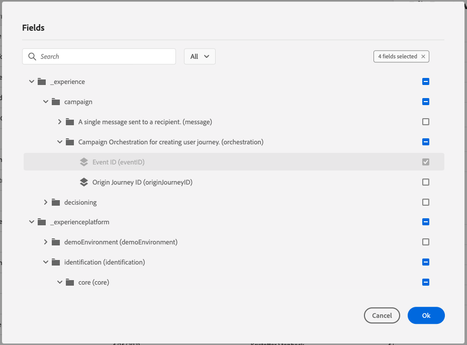

# 7.1 Criar seu evento

Faça logon no Adobe Journey Optimizer acessando [Adobe Experience Cloud](https://experience.adobe.com). Clique em **Journey Optimizer**.

Você será redirecionado para o **Início**  no Journey Optimizer. Primeiro, certifique-se de usar a sandbox correta. A sandbox a ser usada é chamada de `--aepSandboxId--`. Para alterar de uma sandbox para outra, clique em **Produto de produção (VA7)** e selecione a sandbox na lista. Neste exemplo, a sandbox é chamada de **Ativação AEP FY22**. Você estará no **Início** exibição da sandbox `--aepSandboxId--`.

No menu esquerdo, role para baixo e clique em **Configurações**. Em seguida, clique no botão **Gerenciar** botão abaixo **Eventos**.

Em seguida, você verá uma visão geral de todos os eventos disponíveis. Clique em **Criar evento** para começar a criar seu próprio evento.

Uma nova janela de evento vazia aparecerá.

Primeiro de tudo, dê a seu Evento um Nome como este: `--demoProfileLdap--AccountCreationEvent`.

Em seguida, adicione uma descrição como esta `Account Creation Event`.

Em seguida, verifique se o **Tipo** está definida como **Unitário** e para o **Tipo de ID do evento** seleção, selecione **Sistema gerado**.

Em seguida está a seleção Esquema. Um esquema foi preparado para este exercício. Use o esquema `Demo System - Event Schema for Website (Global v1.1) v.1`.

Após selecionar o Esquema, você verá vários campos sendo selecionados na variável **Carga** seção. Agora você deve passar o mouse sobre o **Carga** e você verá 3 ícones pop-up. Clique no botão **Editar** ícone .

Você verá um **Campos** pop-up de janela, em que é necessário selecionar alguns dos campos que precisamos para personalizar o email.  Escolheremos outros atributos de perfil posteriormente, usando os dados já existentes no Adobe Experience Platform.

No objeto `--aepTenantId--.demoEnvironment`, selecione os campos **brandLogo** e **brandName**.

No objeto `--aepTenantId--.identification.core`, selecione o campo **email**.

Clique em **Ok** para salvar as alterações.

Você deve ver isso:

Clique em **Salvar** mais uma vez para salvar suas alterações.

Seu evento agora está configurado e salvo.

Clique no evento novamente para abrir o **Editar evento** novamente. Passe o mouse sobre **Carga** novamente para ver os 3 ícones novamente. Clique no botão **Exibir carga** ícone .

Você verá um exemplo da carga esperada.

Seu evento tem uma orquestration eventID exclusiva, que pode ser encontrada ao rolar para baixo na carga útil até que você veja `_experience.campaign.orchestration.eventID`.

A ID de evento é o que precisa ser enviado para o Adobe Experience Platform para acionar a Jornada que você criará no Exercício 7.2. Lembre-se dessa eventID, pois ela será necessária no Exercício 7.3.
`"eventID": "227402c540eb8f8855c6b2333adf6d54d7153d9d7d56fa475a6866081c574736"`

Clique em **Ok**, seguida de clicar em **Cancelar**.

Você já terminou este exercício.

Próxima etapa: [7.2 Journey Optimizer: Criar sua jornada e mensagem de email](./ex2.md)

[Voltar ao Módulo 7](./journey-orchestration-create-account.md)

[Voltar para todos os módulos](../../overview.md)
