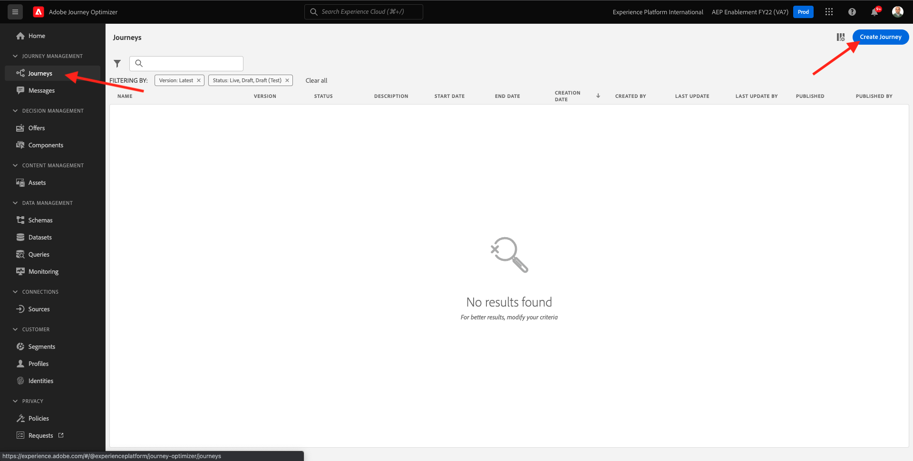
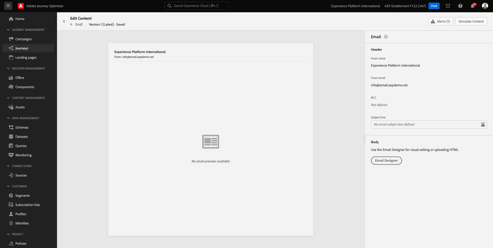
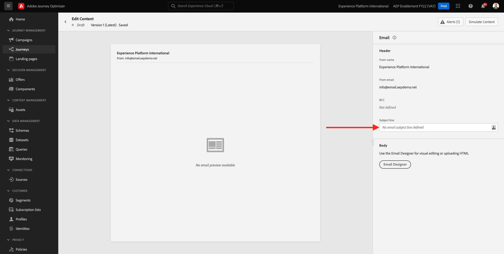
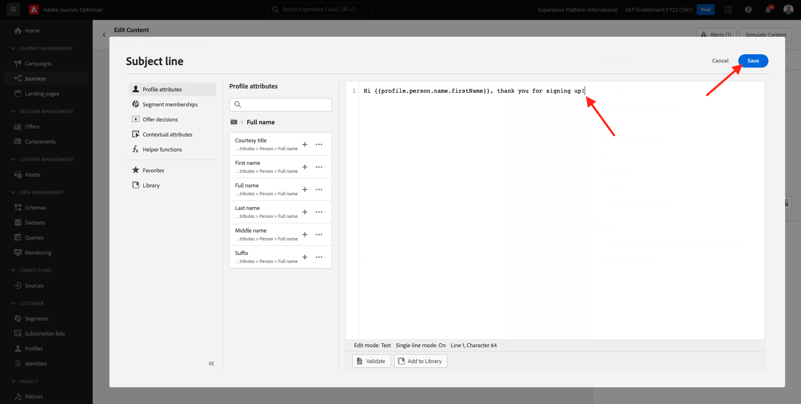
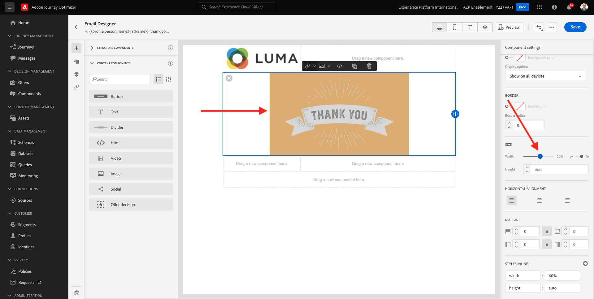
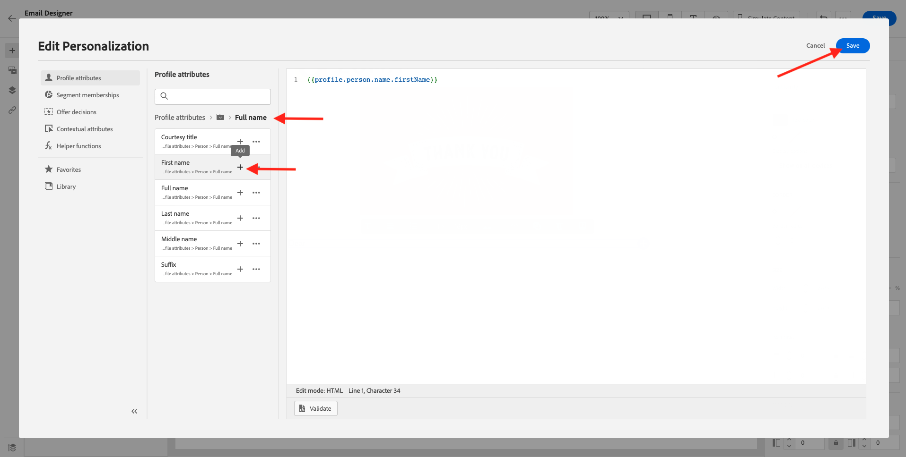
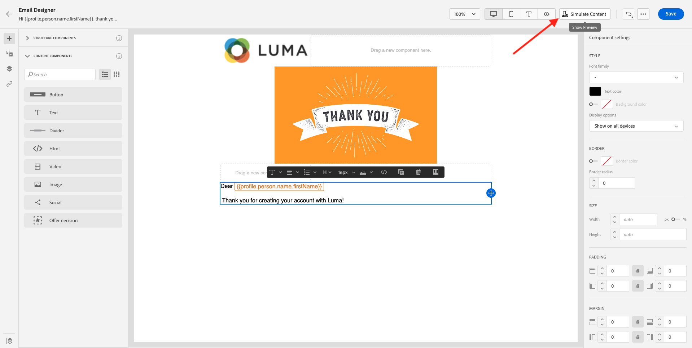
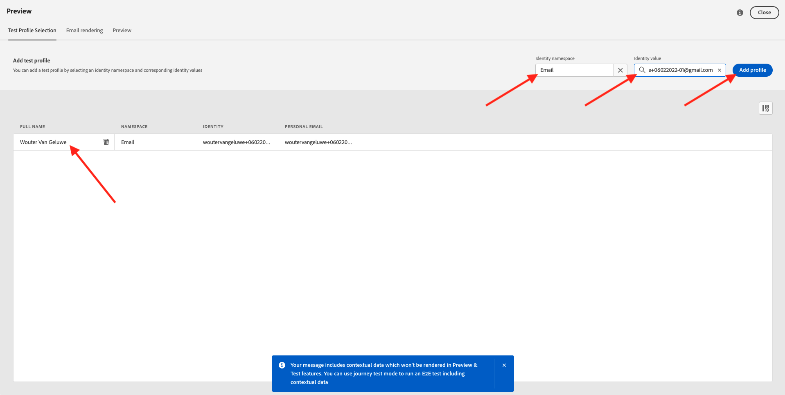
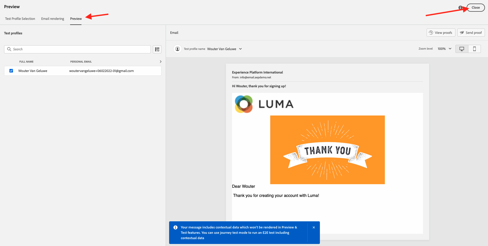

# 7.2 Criar sua jornada e mensagem de email

Neste exercício, você irá configurar a jornada e a mensagem que precisa ser acionada quando alguém criar uma conta no site de demonstração.

Faça logon no Adobe Journey Optimizer acessando [Adobe Experience Cloud](https://experience.adobe.com). Clique em **Journey Optimizer**.

Você será redirecionado para o **Início**  no Journey Optimizer. Primeiro, certifique-se de usar a sandbox correta. A sandbox a ser usada é chamada de `--aepSandboxId--`. Para alterar de uma sandbox para outra, clique em **Produto de produção (VA7)** e selecione a sandbox na lista. Neste exemplo, a sandbox é chamada de **Ativação AEP FY22**. Você estará no **Início** exibição da sandbox `--aepSandboxId--`.

## 7.2.1 Criar a jornada

No menu esquerdo, clique em **Jornada**. Em seguida, clique em **Criar Jornada** para criar uma nova jornada.

Você verá uma tela de jornada vazia.

No exercício anterior, você criou um novo **Evento**. Você o nomeou assim `ldapAccountCreationEvent` e substituído `ldap` com seu ldap. Este foi o resultado da criação do Evento:

Agora é necessário tomar esse evento como o início desta Jornada. Você pode fazer isso indo para o lado esquerdo da tela e procurando pelo evento na lista de eventos.

Selecione seu evento, arraste-o e solte-o na tela de Jornada. A Jornada agora tem esta aparência:

Como a segunda etapa da jornada, é necessário adicionar um curto **Aguardar** etapa. Vá para o lado esquerdo da tela para **Orquestração** para encontrar isso. Você estará usando os atributos do perfil e precisará verificar se eles estão preenchidos no Perfil do cliente em tempo real.

Sua jornada agora fica assim. No lado direito da tela, é necessário configurar o tempo de espera. Defina para 1 minuto. Isso dará tempo suficiente para que os atributos do perfil estejam disponíveis após o acionamento do evento.

Clique em **Ok** para salvar as alterações.

Como a terceira etapa da jornada, é necessário adicionar um **Email** ação. Vá para o lado esquerdo da tela para **Ações**, selecione o **Email** , em seguida, arraste e solte no segundo nó da jornada. Agora você vê isso.

Defina as **Categoria** para **Marketing** e selecione uma superfície de email que permita enviar emails. Nesse caso, a superfície do email a ser selecionada é **Email**. Certifique-se de que as caixas de seleção de **Cliques no email** e **aberturas de email** estão ativadas.

A próxima etapa é criar a mensagem. Para fazer isso, clique em **Editar conteúdo**.

## 7.2.2 Criar sua mensagem

Para criar sua mensagem, clique em **Editar conteúdo**.

Agora você vê isso.

Clique no botão **Linha de assunto** campo de texto.

Na área de texto, comece a escrever **Oi**

A linha de assunto ainda não foi feita. Em seguida, é necessário trazer o token de personalização para o campo **Nome** armazenado em `profile.person.name.firstName`. No menu esquerdo, role para baixo até encontrar a variável **Pessoa** e clique na seta para ir um nível mais fundo.

Agora encontre a variável **Nome completo** e clique na seta para ir um nível mais fundo.

Finalmente, encontre a **Nome** e clique no botão **+** sinal ao lado. Em seguida, você verá o token de personalização aparecer no campo de texto.

Em seguida, adicione o texto **, obrigado por se inscrever!**. Clique em **Salvar**.

Então você estará de volta. Clique em **Email Designer** para criar o conteúdo do email.

Na próxima tela, você receberá 3 métodos diferentes para fornecer o conteúdo do email:

- **Design do zero**: Comece com uma tela em branco e use o editor WYSIWYG para arrastar e soltar a estrutura e os componentes de conteúdo para criar visualmente o conteúdo do email.
- **Codifique seu próprio**: Crie seu próprio modelo de email codificando-o usando o HTML
- **Importar HTML**: Importe um template HTML existente, que poderá editar.

Clique em **Design do zero**.

No menu esquerdo, você encontrará os componentes de estrutura que podem ser usados para definir a estrutura do email (linhas e colunas).

Arraste e solte uma **Coluna 1:2 Esquerda** no menu da tela. Este será o espaço reservado para a imagem do logotipo.

Arraste e solte uma **Coluna 1:1** abaixo do componente anterior. Este será o bloco do banner.

Arraste e solte uma **Coluna 1:2 Esquerda** abaixo do componente anterior. Esse será o conteúdo real com uma imagem no lado esquerdo e o texto no lado direito.

Em seguida, arraste e solte uma **Coluna 1:1** abaixo do componente anterior. Este será o rodapé do email. A tela deve ficar assim:

Em seguida, vamos usar Componentes de conteúdo para adicionar conteúdo dentro desses blocos. Clique no botão **Componentes de conteúdo** item de menu

Arraste e solte um **Imagem** na primeira célula da primeira linha. Clique em **Procurar**.

Você verá isso. Navegue até a pasta **ativos de habilitação** e selecione o arquivo **luma-logo.png**. Clique em **Selecionar**.

Agora você está de volta aqui:

Ir para **Componentes de conteúdo** e arraste e solte uma **Imagem** na primeira célula da primeira linha. Clique em **Procurar**.

No **Ativos** , acesse o **ativos de habilitação** pasta. Nesta pasta, você encontrará todos os ativos preparados e carregados anteriormente pela equipe criativa. Selecionar **module23-thank-you-new.png** e clique em **Selecionar**.

Você terá isso:

Selecione sua imagem e, no menu direito, role para baixo até ver a variável **Tamanho** componente do controle deslizante de largura. Use o controle deslizante para alterar a largura para f.i. **60%**.

Em seguida, acesse **Componentes de conteúdo** e arraste e solte uma **Texto** no componente de estrutura na quarta linha.

Selecionar o texto padrão **Digite seu texto aqui.** como faria com qualquer editor de texto. Gravar **Caro** em vez disso. Observe a barra de ferramentas de texto exibida quando você está no modo de texto.

Na barra de ferramentas, clique no botão **Adicionar personalização** ícone .

Em seguida, você precisa trazer o **Nome** token de personalização armazenado em `profile.person.name.firstName`. No menu, encontre a variável **Pessoa** elemento, navegue até o **Nome completo** e clique no botão **+** ícone para adicionar o campo Nome no editor de expressão.

Clique em **Salvar**.

Agora você perceberá como o campo de personalização foi adicionado ao texto.

No mesmo campo de texto, pressione **Enter** duas vezes para adicionar duas linhas e gravar **Obrigado por criar sua conta com o Luma!**.

A verificação final a ser executada para garantir que seu email esteja pronto é pré-visualizá-lo, clique no botão **Simular conteúdo** botão.

Comece identificando qual perfil você deseja usar para a visualização. Selecione o **email** namespace clicando no ícone ao lado de **Inserir namespace de identidade** campo.

Na lista de namespaces de identidade, selecione o **Email** namespace.

No **Valor de identidade** , insira o endereço de email de um perfil de demonstração anterior que já esteja armazenado no Perfil de cliente em tempo real. Por exemplo **woutervangeluwe+06022022-01@gmail.com** e clique no botão **Localizar Perfil de Teste** botão

Quando o perfil for exibido na tabela, clique no link **Visualizar** para acessar a tela de visualização.

Quando a visualização estiver pronta, valide se a personalização está correta na linha de assunto, o texto do corpo e o link de unsubscription são destacados como um hiperlink.

Clique em **Fechar** para fechar a visualização.

Clique em **Salvar** para salvar sua mensagem.

Volte para o painel de mensagens clicando no botão **seta** ao lado do texto da linha de assunto no canto superior esquerdo.

Você concluiu a criação do email de registro. Clique na seta no canto superior esquerdo para retornar à jornada.

Clique em **Ok**.

## 7.2.3 Publicar a jornada

Você ainda precisa dar um Nome à sua jornada. Você pode fazer isso clicando no botão **Propriedades** no lado superior direito da tela.

Você pode então inserir o nome da jornada aqui. Use `--demoProfileLdap-- - Account Creation Journey`. Clique em **OK** para salvar as alterações.

Agora você pode publicar sua jornada clicando em **Publicar**.

Clique em **Publicar** novamente.

Em seguida, você verá uma barra de confirmação verde informando que sua jornada foi publicada.

Você já terminou este exercício.

Próxima etapa: [7.3 Atualize sua propriedade de Coleta de dados e teste sua jornada](./ex3.md)

[Voltar ao Módulo 7](./journey-orchestration-create-account.md)

[Voltar para todos os módulos](../../overview.md)
