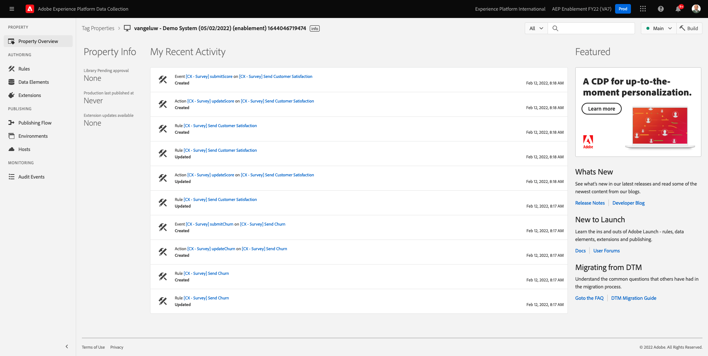
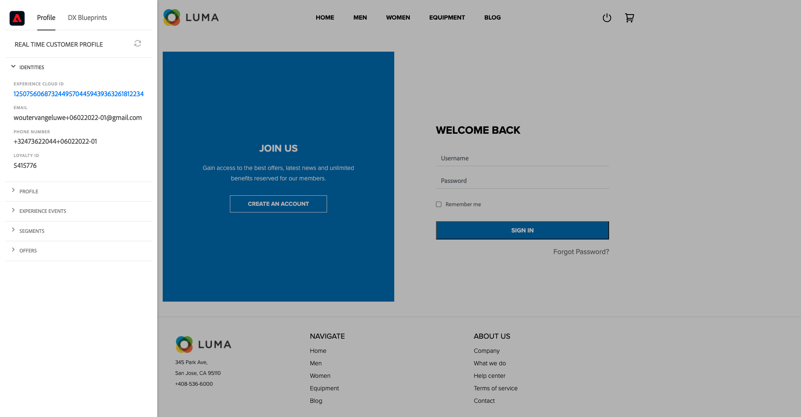

# 7.3 Atualize sua propriedade de Coleta de dados e teste sua jornada

## 7.3.1 Atualizar a propriedade de Coleta de dados

Ir para [Coleta de dados do Adobe Experience Platform](https://experience.adobe.com/launch/) e selecione **Tags**.

Esta é a página Propriedades da coleta de dados do Adobe Experience Platform que você viu anteriormente.

No módulo 0, o Demo System criou duas propriedades do cliente para você: um para o site e um para o aplicativo móvel. Localizá-los pesquisando por `--demoProfileLdap--` no **[!UICONTROL Pesquisar]** caixa. Clique para abrir o **Web** propriedade.

Você verá isso.

No menu esquerdo, acesse **Regras** e pesquisar a regra **Registrar perfil**. Clique na regra **Registrar perfil** para abri-lo.

Você verá os detalhes dessa regra. Clique em para abrir a ação **Enviar &quot;Evento de registro&quot; para AEP - trigger JO**.

Você verá que, quando essa ação for acionada, um elemento de dados específico será usado para definir a estrutura de dados XDM. Você precisa atualizar esse elemento de dados e definir a variável **ID do evento** do evento que você configurou em [Exercício 7.1](./ex1.md).

Agora é necessário atualizar o elemento de dados **XDM - Evento de registro**. Para fazer isso, acesse **Elementos de dados**. Procurar por **XDM - Evento de registro** e clique em para abrir esse elemento de dados.

Você verá isso:

Navegar até o campo `_experience.campaign.orchestration.eventID`. Remova o valor atual e cole sua eventID lá.

Como lembrete, a ID do evento pode ser encontrada no Adobe Journey Optimizer em **Configurações > Eventos** e você encontrará a ID do evento na carga de amostra do seu par, que tem a seguinte aparência: `"eventID": "227402c540eb8f8855c6b2333adf6d54d7153d9d7d56fa475a6866081c574736"`.

Depois de colar a eventID, a tela deve ficar assim. Em seguida, clique em **Salvar** ou **Salvar na biblioteca**.

Por fim, é necessário publicar as alterações. Ir para **Fluxo de publicação** no menu esquerdo.

Clique em **Adicionar todos os recursos alterados** e, em seguida, clique em **Salvar e criar no desenvolvimento**.

Sua biblioteca será atualizada e, após 1 a 2 minutos, você poderá continuar testando sua configuração.

## 7.3.2 Testar sua Jornada

Ir para [https://builder.adobedemo.com/projects](https://builder.adobedemo.com/projects). Depois de fazer logon com sua Adobe ID, você verá isso. Clique no projeto do seu site para abri-lo.

No **Telas** página, clique em **Executar**.

Você verá seu site de demonstração aberto. Selecione o URL e copie-o para a área de transferência.

Abra uma nova janela incógnita do navegador.

Cole o URL do site de demonstração, que você copiou na etapa anterior. Em seguida, você será solicitado a fazer logon usando sua Adobe ID.

Selecione o tipo de conta e conclua o processo de logon.

Você verá seu site carregado em uma janela incógnita do navegador. Para cada demonstração, você precisará usar uma nova janela incógnita do navegador para carregar o URL do site de demonstração.

Clique no ícone do logotipo do Adobe no canto superior esquerdo da tela para abrir o Visualizador de perfil.

Consulte o painel Visualizador de perfil e o Perfil do cliente em tempo real com a **Experience Cloud ID** como o identificador principal para este cliente atualmente desconhecido.

Vá para a página Registrar/fazer logon . Clique em **CRIAR UMA CONTA**.

Preencha os detalhes e clique em **Registrar** depois disso, você será redirecionado para a página anterior.

Abra o painel Visualizador de perfil e acesse Perfil do cliente em tempo real. No painel Visualizador de perfil, você deve ver todos os seus dados pessoais exibidos, como o email e os identificadores de telefone adicionados recentemente.

Um minuto depois de ter criado sua conta, você receberá seu email de criação de conta do Adobe Journey Optimizer.

Próxima etapa: [Resumo e benefícios](./summary.md)

[Voltar ao Módulo 7](./journey-orchestration-create-account.md)

[Voltar para todos os módulos](../../overview.md)
