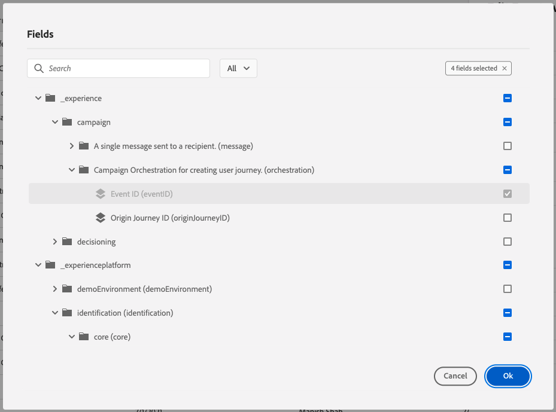

# 8.1 Definir um evento

Faça logon no Adobe Journey Optimizer acessando [Adobe Experience Cloud](https://experience.adobe.com). Clique em **Journey Optimizer**.

Você será redirecionado para o **Início**  no Journey Optimizer. Primeiro, certifique-se de usar a sandbox correta. A sandbox a ser usada é chamada de `--aepSandboxId--`. Para alterar de uma sandbox para outra, clique em **Produto de produção (VA7)** e selecione a sandbox na lista. Neste exemplo, a sandbox é chamada de **Ativação AEP FY22**. Você estará no **Início** exibição da sandbox `--aepSandboxId--`.

No menu esquerdo, role para baixo e clique em **Configurações**. Em seguida, clique no botão **Gerenciar** botão abaixo **Eventos**.

Em seguida, você verá uma visão geral de todos os eventos disponíveis. Clique em **Criar evento** para começar a criar seu próprio evento.

Uma nova janela de evento vazia aparecerá.

Como um Nome para o Evento, use `--demoProfileLdap--GeofenceEntry`. Neste exemplo, o Nome do evento é `vangeluwGeofenceEntry`.

Defina Descrição como: `Geofence Entry Event`.

Em seguida, verifique se o **Tipo** está definida como **Unitário** e para o **Tipo de ID do evento** seleção, selecione **Sistema gerado**

Em seguida, é necessário selecionar um schema. Todos os esquemas mostrados aqui são Esquemas do Adobe Experience Platform.

Você observará que nem todos os esquemas são mostrados. Há muito mais schemas disponíveis no Adobe Experience Platform.
Para aparecer nessa lista, um schema precisa ter um grupo de campos muito específico vinculado a ele. O grupo de campos necessário para aparecer aqui é chamado de `Orchestration eventID`.

Vamos ter uma visão rápida de como esses esquemas são definidos no Adobe Experience Platform.

No menu esquerdo, acesse **Esquemas** e abra-o em uma nova guia do navegador. Em **Esquemas**, vá para **Procurar** para ver a lista de Esquemas disponíveis.
Abrir o esquema `Demo System - Event Schema for Website (Global v1.1)`.

Após abrir o Esquema, você verá que o grupo de campos `Orchestration eventID` faz parte do schema .
Este grupo de campos tem apenas dois campos, `_experience.campaign.orchestration.eventID` e `originJourneyID`.

Quando esse grupo de campos e esse campo eventID específico fizerem parte de um esquema, esse esquema estará disponível para uso pelo Adobe Journey Optimizer.

Volte para a configuração do evento no Adobe Journey Optimizer.

Nesse caso de uso, você deseja ouvir um Evento de geofence para entender se um cliente está em um local específico, então agora, selecione o Esquema `Demo System - Event Schema for Website (Global v1.1)` como o Esquema do seu Evento.

O Adobe Journey Optimizer selecionará automaticamente alguns campos obrigatórios, mas é possível editar os campos que são disponibilizados para o Adobe Journey Optimizer.

Clique no botão **lápis** ícone para editar os campos.

Em seguida, você verá uma janela pop-up com uma hierarquia de esquema que permite selecionar campos.

Campos como ECID e Orchestration eventID são obrigatórios e, como tal, pré-selecionados.

No entanto, um profissional de marketing precisa ter acesso flexível a todos os pontos de dados que fornecem contexto a uma Jornada. Portanto, vamos garantir que também selecione os seguintes campos no mínimo (encontrados no nó Local context ):

- Cidade

Depois disso, clique em **OK**.

A Adobe Journey Optimizer também precisa de um Identificador para identificar o cliente. Como o Adobe Journey Optimizer é vinculado ao Adobe Experience Platform, o Identificador principal de um Esquema é automaticamente considerado o Identificador da Jornada.
O Identificador principal também levará em conta automaticamente o Gráfico de identidade completo do Adobe Experience Platform e vinculará todos os comportamentos em todas as identidades, dispositivos e canais disponíveis ao mesmo perfil, para que o Adobe Journey Optimizer seja contextual, relevante e consistente.

Clique em **Salvar** para salvar seu evento personalizado.

Seu evento fará parte da lista de eventos disponíveis.

Por fim, é necessário recuperar a variável `Orchestration eventID` para seu evento personalizado.

Abra o evento novamente clicando nele na lista de eventos.
No seu Evento, clique no botão **Exibir carga** ícone ao lado de **Campos**.

Clicar no **Exibir carga** ícone abre uma amostra de carga XDM para esse evento.

Role para baixo no **Carga** até que você veja a linha `eventID`.

Anote o `eventID` como você precisará na última vez para testar sua configuração.

Neste exemplo, a variável `eventID` é `fa42ab7982ba55f039eacec24c1e32e5c51b310c67f0fa559ab49b89b63f4934`.

Agora você definiu o evento que acionará a jornada que estamos criando. Quando a jornada for acionada, os campos de geofence, como Cidade, e quaisquer outros que você tenha escolhido (como País, Latitude e Longitude) serão disponibilizados para a jornada.

Conforme discutido na descrição do caso de uso, precisamos fornecer promoções contextuais que dependem do clima. Para obter informações sobre o tempo, precisaremos definir fontes de dados externas que nos forneçam as informações sobre o tempo desse local. Você usará o **OpenWeather** serviço para nos fornecer quais informações, como parte de 2.

Próxima etapa: [8.2 Definir uma fonte de dados externa](./ex2.md)

[Voltar ao Módulo 8](journey-orchestration-external-weather-api-sms.md)

[Voltar para todos os módulos](../../overview.md)
