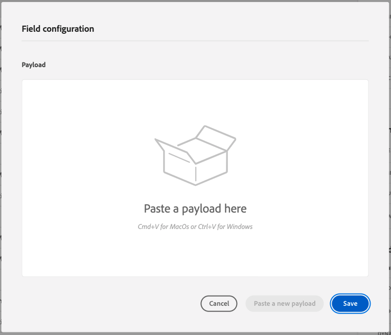

# 8.2 Definir uma fonte de dados externa

Neste exercício, você criará uma fonte de dados externa personalizada usando o Adobe Journey Optimizer.

Faça logon no Adobe Journey Optimizer acessando [Adobe Experience Cloud](https://experience.adobe.com). Clique em **Journey Optimizer**.


Você será redirecionado para o **Início**  no Journey Optimizer. Primeiro, certifique-se de usar a sandbox correta. A sandbox a ser usada é chamada de `--aepSandboxId--`. Para alterar de uma sandbox para outra, clique em **Produto de produção (VA7)** e selecione a sandbox na lista. Neste exemplo, a sandbox é chamada de **Ativação AEP FY22**. Você estará no **Início** exibição da sandbox `--aepSandboxId--`.


No menu esquerdo, role para baixo e clique em **Configurações**. Em seguida, clique no botão **Gerenciar** botão abaixo **Fontes de dados**.


Você verá o **Fontes de dados** lista.
Clique em **Criar fonte de dados** para começar a adicionar a fonte de dados.


Você verá um pop-up de fonte de dados vazio.


Antes de começar a configurar isso, você precisará de uma conta com o **Abrir mapa de clima** serviço. Siga estas etapas para criar sua conta e obter a chave de API.

Ir para [https://openweathermap.org/](https://openweathermap.org/). Na página inicial, clique em **Fazer logon**.


Clique em **Criar uma conta**.


Preencha os detalhes.


Clique em **Criar conta**.


Em seguida, você será redirecionado para a sua Página da conta.


No menu, clique em **Chaves de API** para recuperar a chave de API, que será necessário configurar a fonte de dados externa personalizada.


Um **Chave da API** tem esta aparência: `b2c4c36b6bb59c3458d6686b05311dc3`.

Você pode encontrar a variável **Documentação da API** para **Tempo atual** [here](https://openweathermap.org/current).

No nosso caso de uso, implementaremos a conexão com o Open Weather Map com base na cidade em que o cliente está.


Volte para **Adobe Journey Optimizer**, em seu vazio **Fonte de Dados Externa** pop-up.


Como um Nome para a fonte de dados, use `--demoProfileLdap--WeatherApi`. Neste exemplo, o Nome da fonte de dados é `vangeluwWeatherApi `.

Defina Descrição como: `Access to the Open Weather Map`.

O URL para a API do mapa de tempo aberto é: **http://api.openweathermap.org/data/2.5/weather?units=metric**


Em seguida, é necessário selecionar a Autenticação a ser usada.

Use estas variáveis:

| Campo | Valor |
|:-----------------------:| :-----------------------|
| Tipo | **Chave de API** |
| Nome | **APPID** |
| Valor | **sua chave de API** |
| Localização | **Parâmetro de consulta** |


Por fim, é necessário definir um **FieldGroup**, que é basicamente a solicitação que você enviará para a API do tempo. No nosso caso, queremos usar o nome da Cidade para solicitar o Tempo Atual para aquela Cidade.


De acordo com a Documentação da API do tempo, precisamos enviar um parâmetro `q=City`.


Para corresponder à Solicitação de API esperada, configure o FieldGroup da seguinte maneira:

>[!IMPORTANT]
>
>O nome do grupo de campos deve ser exclusivo. Use esta convenção de nomenclatura: `--demoProfileLdap--WeatherByCity` nesse caso, o nome deve ser `vangeluwWeatherByCity`


Para a Carga de Resposta, é necessário colar um exemplo da Resposta que será enviada pela API de Tempo.

Você pode encontrar a resposta JSON da API esperada na página Documentação da API [here](https://openweathermap.org/current).


Ou você pode copiar a Resposta JSON daqui:

```json
{"coord": { "lon": 139,"lat": 35},
  "weather": [
    {
      "id": 800,
      "main": "Clear",
      "description": "clear sky",
      "icon": "01n"
    }
  ],
  "base": "stations",
  "main": {
    "temp": 281.52,
    "feels_like": 278.99,
    "temp_min": 280.15,
    "temp_max": 283.71,
    "pressure": 1016,
    "humidity": 93
  },
  "wind": {
    "speed": 0.47,
    "deg": 107.538
  },
  "clouds": {
    "all": 2
  },
  "dt": 1560350192,
  "sys": {
    "type": 3,
    "id": 2019346,
    "message": 0.0065,
    "country": "JP",
    "sunrise": 1560281377,
    "sunset": 1560333478
  },
  "timezone": 32400,
  "id": 1851632,
  "name": "Shuzenji",
  "cod": 200
}
```

Copie a resposta JSON acima para a área de transferência e vá para a tela de configuração personalizada da fonte de dados.

Clique no botão **Editar carga** ícone .


Você verá um pop-up em que agora precisa colar a Resposta JSON acima.



Cole a resposta JSON, depois disso você verá isso. Clique em **Salvar**.


A configuração personalizada da fonte de dados foi concluída. Role para cima e clique **Salvar**.


Sua fonte de dados agora foi criada com êxito e faz parte do **Fontes de dados** lista.


Próxima etapa: [8.3 Definir uma ação personalizada](./ex3.md)

[Voltar ao Módulo 8](journey-orchestration-external-weather-api-sms.md)

[Voltar para todos os módulos](../../overview.md)
