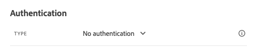

# 8.3 Definir uma ação personalizada

Neste exercício, você criará duas ações personalizadas usando o Adobe Journey Optimizer em combinação.

Faça logon no Adobe Journey Optimizer acessando [Adobe Experience Cloud](https://experience.adobe.com). Clique em **Journey Optimizer**.


Você será redirecionado para o **Início**  no Journey Optimizer. Primeiro, certifique-se de usar a sandbox correta. A sandbox a ser usada é chamada de `--aepSandboxId--`. Para alterar de uma sandbox para outra, clique em **Produto de produção (VA7)** e selecione a sandbox na lista. Neste exemplo, a sandbox é chamada de **Ativação AEP FY22**. Você estará no **Início** exibição da sandbox `--aepSandboxId--`.


No menu esquerdo, role para baixo e clique em **Configurações**. Em seguida, clique no botão **Gerenciar** botão abaixo **Ações**.


Você verá o **Ações** lista.


Você definirá uma ação que envia um texto para um canal de Slack.

## 8.3.1 Ação: Enviar texto para canal de Slack

Agora você usará um canal de Slack existente e enviará mensagens para esse canal de Slack. O Slack tem uma API fácil de usar e usaremos o Adobe Journey Optimizer para acionar a API.


Clique em **Criar ação** para começar a adicionar uma nova ação.


Você verá um pop-up de Ação vazio.


Como um Nome para a Ação, use `--demoProfileLdap--TextSlack`. Neste exemplo, o Nome da ação é `vangeluwTextSlack`.

Defina Descrição como: `Send Text to Slack`.


Para o **Configuração de URL** use esta opção:

- URL: `https://2mnbfjyrre.execute-api.us-west-2.amazonaws.com/prod`
- Método: **POST**

>[!NOTE]
>
>O URL acima se refere a uma função AWS Lambda que encaminhará sua solicitação para o canal Slack, como mencionado acima. Isso é feito para proteger o acesso a um canal Slack de propriedade do Adobe. Se você tiver seu próprio canal Slack, deve criar um aplicativo Slack por meio de [https://api.slack.com/](https://api.slack.com/), é necessário criar um Webhook de entrada nesse aplicativo do Slack e, em seguida, substituir o URL acima pelo URL do Webhook de entrada.

Não é necessário alterar os Campos de cabeçalho.


**Autenticação** deve ser definido como **Sem Autenticação**.



Para o **Parâmetros de ação**, é necessário definir quais campos devem ser enviados para o Slack. Na lógica, queremos que o Adobe Journey Optimizer e o Adobe Experience Platform sejam o cérebro da personalização, de modo que o texto a ser enviado para o Slack deve ser definido pelo Adobe Journey Optimizer e enviado para o Slack para execução.

Assim para o **Parâmetros de ação**, clique no botão **Editar carga** ícone .


Em seguida, você verá uma janela pop-up vazia.


Copie o texto abaixo e cole-o na janela pop-up vazia.

```json
{
 "text": {
  "toBeMapped": true,
  "dataType": "string",
  "label": "textToSlack"
 }
}
```

FYI: ao especificar os campos abaixo, esses campos ficarão acessíveis na Jornada do cliente e você poderá preenchê-los dinamicamente a partir da Jornada:

**&quot;toBeMapped&quot;: true,**

**&quot;dataType&quot;: &quot;string&quot;,**

**&quot;label&quot;: &quot;textToSlack&quot;**

Você verá isso:


Clique em **Salvar**.


Role para cima e clique **Salvar** mais uma vez para salvar sua ação personalizada.


Sua ação personalizada agora faz parte do **Ações** lista.


Você definiu eventos, uma fonte de dados externa e ações. Agora vamos consolidar tudo isso em uma jornada.

Próxima etapa: [8.4 Criar sua jornada e mensagens](./ex4.md)

[Voltar ao Módulo 8](journey-orchestration-external-weather-api-sms.md)

[Voltar para todos os módulos](../../overview.md)
