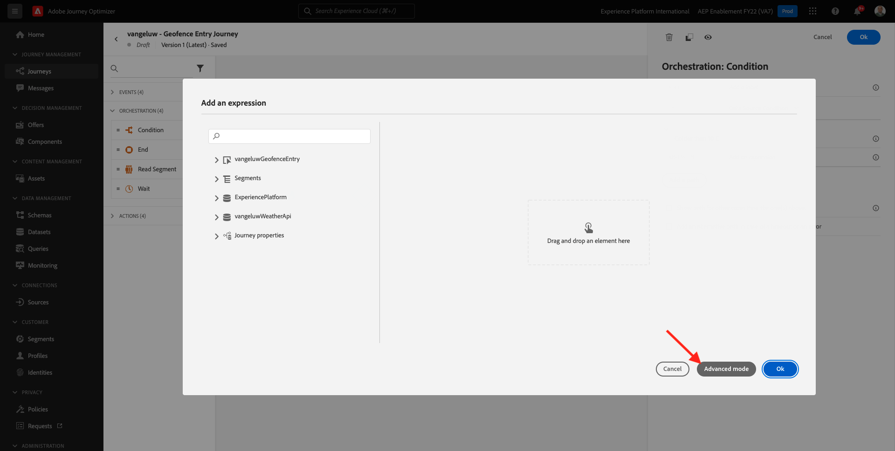
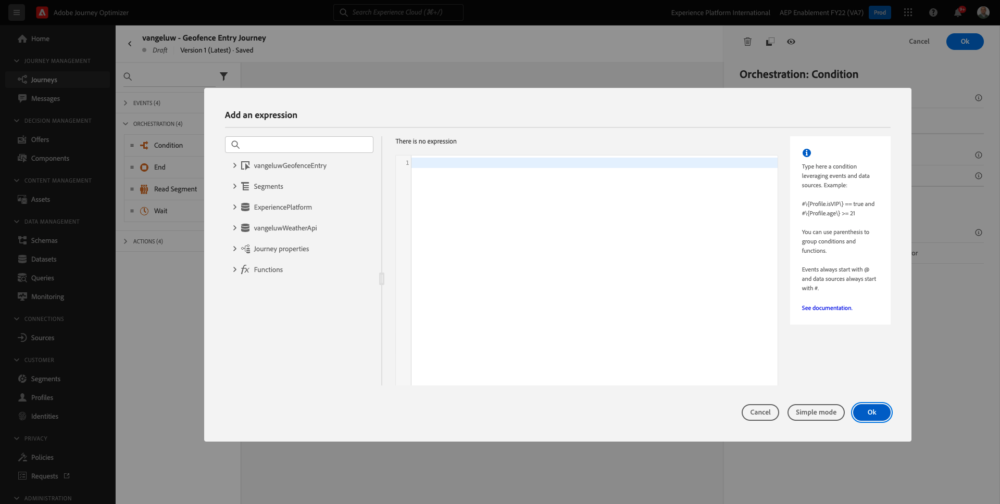
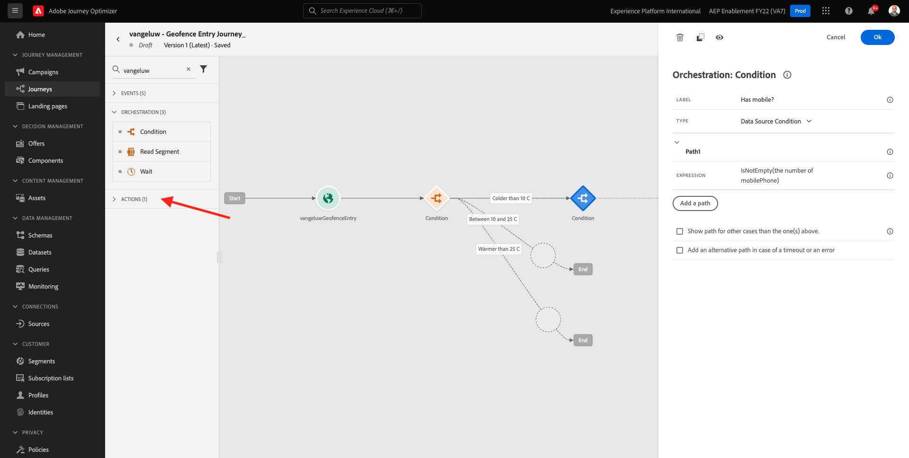
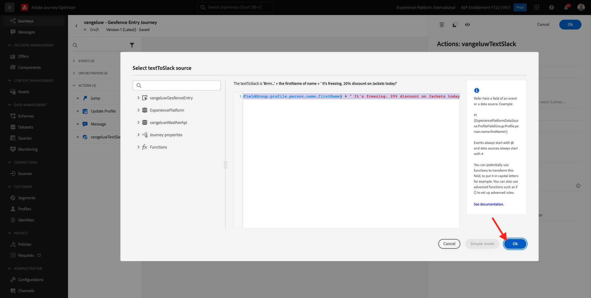
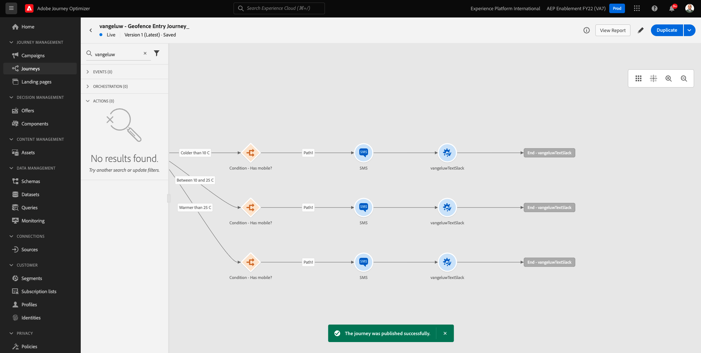

# 8.4 Criar sua jornada e mensagens

Neste exercício, você criará uma jornada e várias mensagens de texto usando o Adobe Journey Optimizer.

Para esse caso de uso, o objetivo é enviar diferentes mensagens SMS com base nas condições climáticas da localização do cliente. Foram definidos 3 cenários:

- Mais frio que 10° Celsius
- Entre 10° e 25° Celsius
- Mais quente que 25° Celsius

Para essas 3 condições, você precisará definir 3 mensagens SMS no Adobe Journey Optimizer.

## 8.4.1 Criar a jornada

Faça logon no Adobe Journey Optimizer acessando [Adobe Experience Cloud](https://experience.adobe.com). Clique em **Journey Optimizer**.


Você será redirecionado para o **Início**  no Journey Optimizer. Primeiro, certifique-se de usar a sandbox correta. A sandbox a ser usada é chamada de `--aepSandboxId--`. Para alterar de uma sandbox para outra, clique em **Produto de produção (VA7)** e selecione a sandbox na lista. Neste exemplo, a sandbox é chamada de **Ativação AEP FY22**. Você estará no **Início** exibição da sandbox `--aepSandboxId--`.


No menu esquerdo, acesse **Jornada** e clique em **Criar Jornada** para começar a criar a Jornada.


Você deve dar um nome à sua jornada.

Como um Nome para a jornada, use `--demoProfileLdap-- - Geofence Entry Journey`. Neste exemplo, o nome da jornada é `vangeluw - Geofence Entry Journey`. Nenhum outro valor deve ser definido no momento. Clique em **OK**.


No lado esquerdo da tela, dê uma olhada **Eventos**. Você deve ver o evento criado anteriormente nessa lista. Selecione-o e arraste-o e solte-o na tela de jornada. Sua jornada fica assim. Clique em **Ok**.


Em seguida, clique em **Orquestração**. Agora você vê o disponível **Orquestração** recursos. Selecionar **Condição**, em seguida, arraste e solte na Tela de Jornada.


Agora, é necessário definir três condições:

- Está mais frio que 10° Celsius
- Está entre 10° e 25° Celsius
- Está mais quente que 25° Celsius

Vamos definir a primeira condição.

### Condição 1: Mais frio que 10° Celsius

Clique no botão **Condição**.  Clique em **Caminho1** e edite o nome do caminho para **Mais de 10 C**. Clique no botão **Editar** ícone para a expressão de Path1.


Você verá um vazio **Editor simples** tela. Sua consulta será um pouco mais avançada, portanto, você precisará da variável **Modo avançado**. Clique em **Modo avançado**.



Você verá o **Editor avançado** que permite a entrada de código.



Selecione o código abaixo e cole-o no **Editor avançado**.

`#{--demoProfileLdap--WeatherApi.--demoProfileLdap--WeatherByCity.main.temp} <= 10`

Você verá isso.


Para recuperar a temperatura como parte dessa condição, você precisa fornecer a cidade em que o cliente está atualmente.
O **Cidade** precisa ser vinculado ao parâmetro dinâmico `q`, como vimos anteriormente na Documentação da API Open Weather.

Clique no campo **valor dinâmico: q** conforme indicado na captura de tela.


Em seguida, é necessário encontrar o campo que contém a cidade atual do cliente em uma das Fontes de dados disponíveis.


Você pode encontrar o campo navegando até `--demoProfileLdap--GeofenceEntry.placeContext.geo.city`.

Ao clicar nesse campo, ele será adicionado como o valor dinâmico do parâmetro `q`. Esse campo será preenchido pelo, por exemplo, o serviço de localização geográfica que você implementou em seu aplicativo móvel. Em nosso caso, simularemos isso com o Admin Console do site de demonstração. Clique em **OK**.


### Condição 2: Entre 10° e 25° Celsius

Após adicionar a primeira condição, você verá essa tela. Clique em **Adicionar caminho**.


Clique duas vezes em **Caminho1** e edite o nome do caminho para **Entre 10 C e 25 C**. Clique no botão **Editar** ícone para a expressão deste caminho.


Você verá um vazio **Editor simples** tela. Sua consulta será um pouco mais avançada, portanto, você precisará da variável **Modo avançado**. Clique em **Modo avançado**.


Você verá o **Editor avançado** que permite a entrada de código.


Selecione o código abaixo e cole-o no **Editor avançado**.

`#{--demoProfileLdap--WeatherApi.--demoProfileLdap--WeatherByCity.main.temp} > 10 and #{--demoProfileLdap--WeatherApi.--demoProfileLdap--WeatherByCity.main.temp} <= 25`

Você verá isso.


Para recuperar a temperatura como parte dessa Condição, você precisa fornecer a cidade em que o cliente está atualmente.
O **Cidade** precisa ser vinculado ao parâmetro dinâmico **q**, como vimos anteriormente na Documentação da API Open Weather.

Clique no campo **valor dinâmico: q** conforme indicado na captura de tela.


Em seguida, é necessário encontrar o campo que contém a cidade atual do cliente em uma das Fontes de dados disponíveis.


Você pode encontrar o campo navegando até `--demoProfileLdap--GeofenceEntry.placeContext.geo.city`. Ao clicar nesse campo, ele será adicionado como o valor dinâmico do parâmetro **q**. Esse campo será preenchido pelo, por exemplo, o serviço de localização geográfica que você implementou em seu aplicativo móvel. Em nosso caso, simularemos isso com o Admin Console do site de demonstração. Clique em **OK**.


Em seguida, você adicionará a terceira condição.

### Condição 3: Mais quente que 25° Celsius

Após adicionar a segunda condição, você verá essa tela. Clique em **Adicionar caminho**.


Clique duas vezes em Caminho1 para alterar o nome para **Mais quente que 25 C**.
Em seguida, clique no botão **Editar** ícone para a expressão deste caminho.


Você verá um vazio **Editor simples** tela. Sua consulta será um pouco mais avançada, portanto, você precisará da variável **Modo avançado**. Clique em **Modo avançado**.


Você verá o **Editor avançado** que permite a entrada de código.


Selecione o código abaixo e cole-o no **Editor avançado**.

`#{--demoProfileLdap--WeatherApi.--demoProfileLdap--WeatherByCity.main.temp} > 25`

Você verá isso.


Para recuperar a temperatura como parte dessa Condição, você precisa fornecer a cidade em que o cliente está atualmente.
O **Cidade** precisa ser vinculado ao parâmetro dinâmico **q**, como vimos anteriormente na Documentação da API Open Weather.

Clique no campo **valor dinâmico: q** conforme indicado na captura de tela.


Em seguida, é necessário encontrar o campo que contém a cidade atual do cliente em uma das Fontes de dados disponíveis.


Você pode encontrar o campo navegando até ```--demoProfileLdap--GeofenceEntry.placeContext.geo.city```. Ao clicar nesse campo, ele será adicionado como o valor dinâmico do parâmetro **q**. Esse campo será preenchido pelo, por exemplo, o serviço de localização geográfica que você implementou em seu aplicativo móvel. Em nosso caso, simularemos isso com o Admin Console do site de demonstração. Clique em **OK**.


Agora você tem três caminhos configurados. Clique em **Ok**.


Como esta é uma jornada para fins de aprendizado, agora vamos configurar algumas ações para mostrar a variedade de opções que os profissionais de marketing agora têm para entregar mensagens.

## 8.4.2 Enviar mensagens para o caminho: Mais frio que 10° Celsius

Para cada um dos contextos de temperatura, tentaremos enviar uma mensagem de texto para nosso cliente. Só podemos enviar uma mensagem de texto se tivermos um Número de celular disponível para um cliente, portanto primeiro teremos que verificar se sim.

Vamos nos concentrar em **Mais de 10 C**.


Vamos tomar outro **Condição** e arraste-o conforme indicado na captura de tela abaixo. Verificaremos se, para esse cliente, temos um número de celular disponível.


Como este é apenas um exemplo, estamos configurando apenas a opção em que o cliente tem um número de celular disponível. Adicione um rótulo de **O tem celular?**.

Clique no botão **Editar** ícone para a Expressão do **Caminho1** caminho.


Nas Fontes de dados mostradas à esquerda, navegue até **ExperiencePlatform.ProfileFieldGroup.profile.mobilePhone.number**. Agora você está lendo o número do celular diretamente do Perfil do cliente em tempo real da Adobe Experience Platform.


Selecione o campo **Número**, em seguida, arraste-o e solte-o na Tela de condição.

Selecione o operador **não está vazio**. Clique em **Ok**.


Você verá isso. Clique em **OK** novamente.


Sua jornada ficará assim. Clique em **Ações** conforme indicado na captura de tela.



Selecione a ação **SMS**, em seguida, arraste-a e solte-a depois da condição que você acabou de adicionar.


Defina as **Categoria** para **Marketing** e selecione uma superfície de SMS que permita enviar SMS. Nesse caso, a superfície do email a ser selecionada é **SMS**.


A próxima etapa é criar a mensagem. Para fazer isso, clique em **Editar conteúdo**.


Agora você vê o painel de mensagens, onde pode configurar o texto do seu SMS. Clique no botão **Compor mensagem** área para criar a mensagem.


Insira o seguinte texto: `Brrrr... {{profile.person.name.firstName}}, it's freezing. 20% discount on jackets today!`. Clique em **Salvar**.


Você verá isso. Clique na seta no canto superior esquerdo para retornar à jornada.


Então você estará de volta. Clique em **Ok**.


No menu esquerdo, volte para **Ações**, selecione a Ação `--demoProfileLdap--TextSlack`, em seguida, arraste-o e solte-o depois da **Mensagem** ação.


Ir para **Parâmetros de ação** e clique no botão **Editar** ícone do parâmetro `TEXTTOSLACK`.


Na janela pop-up, clique em **Modo avançado**.


Selecione o código abaixo, copie-o e cole-o no **Editor de modo avançado**. Clique em **Ok**.

`"Brrrr..." + #{ExperiencePlatform.ProfileFieldGroup.profile.person.name.firstName} + " It's freezing. 20% discount on Jackets today!"`



Você verá a ação concluída. Clique em **Ok**.


Esse caminho da jornada agora está pronto.

## 8.4.3 Enviar mensagens para o caminho: Entre 10° e 25° Celsius

Para cada um dos contextos de temperatura, tentaremos enviar uma mensagem de texto para nosso cliente. Só podemos enviar uma mensagem de texto se tivermos um Número de celular disponível para um cliente, portanto primeiro teremos que verificar se sim.

Vamos nos concentrar em **Entre 10 C e 25 C** caminho.


Vamos tomar outro **Condição** e arraste-o conforme indicado na captura de tela abaixo. Verificaremos se, para esse cliente, temos um número de celular disponível.


Como este é apenas um exemplo, estamos configurando apenas a opção em que o cliente tem um número de celular disponível. Adicione um rótulo de **O tem celular?**.

Clique no botão **Editar** ícone para a Expressão do **Caminho1** caminho.


Nas Fontes de dados mostradas à esquerda, navegue até **ExperiencePlatform.ProfileFieldGroup.profile.mobilePhone.number**. Agora você está lendo o número do celular diretamente do Perfil do cliente em tempo real da Adobe Experience Platform.


Selecione o campo **Número**, em seguida, arraste-o e solte-o na Tela de condição.

Selecione o operador **não está vazio**. Clique em **Ok**.


Você verá isso. Clique em **Ok**.


Sua jornada ficará assim. Clique em **Ações** conforme indicado na captura de tela.


Selecione a ação **SMS**, em seguida, arraste-a e solte-a depois da condição que você acabou de adicionar.


Defina as **Categoria** para **Marketing** e selecione uma superfície de SMS que permita enviar SMS. Nesse caso, a superfície do email a ser selecionada é **SMS**.


A próxima etapa é criar a mensagem. Para fazer isso, clique em **Editar conteúdo**.


Agora você vê o painel de mensagens, onde pode configurar o texto do seu SMS. Clique no botão **Compor mensagem** área para criar a mensagem.


Insira o seguinte texto: `What a nice weather for the time of year, {{profile.person.name.firstName}} - 20% discount on Sweaters today!`. Clique em **Salvar**.


Você verá isso. Clique na seta no canto superior esquerdo para retornar à jornada.


Agora você verá a ação concluída. Clique em **Ok**.


No menu esquerdo, volte para **Ações**, selecione a Ação `--demoProfileLdap--TextSlack`, em seguida, arraste-o e solte-o depois da **Mensagem** ação.


Ir para **Parâmetros de ação** e clique no botão **Editar** ícone do parâmetro `TEXTTOSLACK`.


Na janela pop-up, clique em **Modo avançado**.


Selecione o código abaixo, copie-o e cole-o no **Editor de modo avançado**. Clique em **Ok**.

`"What nice weather for the time of year, " + #{ExperiencePlatform.ProfileFieldGroup.profile.person.name.firstName} + " 20% discount on Sweaters today!"`


Você verá a ação concluída. Clique em **Ok**.


Esse caminho da jornada agora está pronto.

## 8.4.4 Enviar mensagens para o caminho: Mais quente que 25° Celsius

Para cada um dos contextos de temperatura, tentaremos enviar uma mensagem de texto para nosso cliente. Só podemos enviar uma mensagem de texto se tivermos um Número de celular disponível para um cliente, portanto primeiro teremos que verificar se sim.

Vamos nos concentrar em **Mais quente que 25 C** caminho.


Vamos tomar outro **Condição** e arraste-o conforme indicado na captura de tela abaixo. Você verificará se, para esse cliente, tem um número de celular disponível.


Como este é apenas um exemplo, estamos configurando apenas a opção em que o cliente tem um número de celular disponível. Adicione um rótulo de **O tem celular?**.

Clique no botão **Editar** ícone para a Expressão do **Caminho1** caminho.


Nas Fontes de dados mostradas à esquerda, navegue até **ExperiencePlatform.ProfileFieldGroup.profile.mobilePhone.number**. Agora você está lendo o número do celular diretamente do Perfil do cliente em tempo real da Adobe Experience Platform.


Selecione o campo **Número**, em seguida, arraste-o e solte-o na Tela de condição.

Selecione o operador **não está vazio**. Clique em **Ok**.


Você verá isso. Clique em **OK**.


Sua jornada ficará assim. Clique em **Ações** conforme indicado na captura de tela.


Selecione a ação **SMS**, em seguida, arraste-a e solte-a depois da condição que você acabou de adicionar.


Defina as **Categoria** para **Marketing** e selecione uma superfície de SMS que permita enviar SMS. Nesse caso, a superfície do email a ser selecionada é **SMS**.


A próxima etapa é criar a mensagem. Para fazer isso, clique em **Editar conteúdo**.


Agora você vê o painel de mensagens, onde pode configurar o texto do seu SMS. Clique no botão **Compor mensagem** área para criar a mensagem.


Insira o seguinte texto: `So warm, {{profile.person.name.firstName}}! 20% discount on swimwear today!`. Clique em **Salvar**.


Você verá isso. Clique na seta no canto superior esquerdo para retornar à jornada.


Agora você verá a ação concluída. Clique em **Ok**.


No menu esquerdo, volte para **Ações**, selecione a Ação `--demoProfileLdap--TextSlack`, em seguida, arraste-o e solte-o depois da **Mensagens** ação.


Ir para **Parâmetros de ação** e clique no botão **Editar** ícone do parâmetro `TEXTTOSLACK`.


Na janela pop-up, clique em **Modo avançado**.


Selecione o código abaixo, copie-o e cole-o no **Editor de modo avançado**. Clique em **Ok**.

`"So warm, " + #{ExperiencePlatform.ProfileFieldGroup.profile.person.name.firstName} + "! 20% discount on swimwear today!"`


Você verá a ação concluída. Clique em **Ok**.


Esse caminho da jornada agora está pronto.

## 8.4.5 Publicar a jornada

Sua jornada está totalmente configurada. Clique em **Publicar**.


Clique em **Publicar** novamente.


Sua jornada foi publicada.



Próxima etapa: [8.5 Acione sua jornada](./ex5.md)

[Voltar ao Módulo 8](journey-orchestration-external-weather-api-sms.md)

[Voltar para todos os módulos](../../overview.md)
