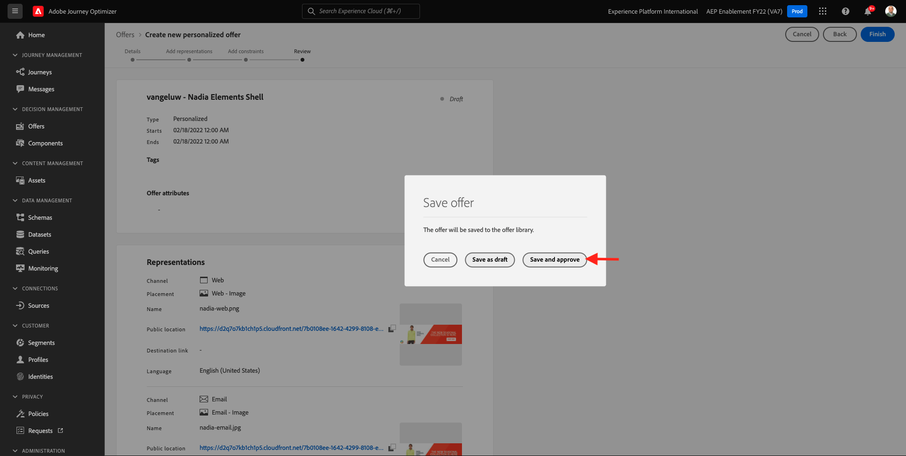

# 9.2 Configurar as ofertas e a decisão

## 9.2.1 Criar suas ofertas personalizadas

Neste exercício, você criará quatro **Ofertas personalizadas**. Estes são os detalhes a serem considerados ao criar essas ofertas:

| Nome | Date Range | Link de imagem para email | Link de imagem para a Web | Texto | Prioridade | Elegibilidade | Idioma |
|-----|------------|----------------------|--------------------|------|:--------:|--------------|:-------:|
| `--demoProfileLdap-- - Nadia Elements Shell` | hoje - 1 mês depois | https://bit.ly/3nPiwdZ | https://bit.ly/2INwXjt | `{{ profile.person.name.firstName }}, 10% discount on Nadia Elements Shell` | 25 | all - Clientes do sexo feminino | Inglês (Estados Unidos) |
| `--demoProfileLdap-- - Radiant Tee` | hoje - 1 mês depois | https://bit.ly/2HfA17v | https://bit.ly/3pEIdzn | `{{ profile.person.name.firstName }}, 5% discount on Radiant Tee` | 15 | all - Clientes do sexo feminino | Inglês (Estados Unidos) |
| `--demoProfileLdap-- - Zeppelin Yoga Pant` | hoje - 1 mês depois | https://bit.ly/2IOaItW | https://bit.ly/2INZHZd | `{{ profile.person.name.firstName }}, 10% discount on Zeppelin Yoga Pant` | 25. | all - Clientes masculinos | Inglês (Estados Unidos) |
| `--demoProfileLdap-- - Proteus Fitness Jackshirt` | hoje - 1 mês depois | https://bit.ly/330a43n | https://bit.ly/36USaQW | `{{ profile.person.name.firstName }}, 5% discount on Proteus Fitness Jackshirt` | 15. | all - Clientes masculinos | Inglês (Estados Unidos) |

{style=&quot;table-layout:auto&quot;}

Faça logon no Adobe Journey Optimizer acessando [Adobe Experience Cloud](https://experience.adobe.com). Clique em **Journey Optimizer**.

Você será redirecionado para o **Início**  no Journey Optimizer. Primeiro, certifique-se de usar a sandbox correta. A sandbox a ser usada é chamada de `--aepSandboxId--`. Para alterar de uma sandbox para outra, clique em **Produto de produção (VA7)** e selecione a sandbox na lista. Neste exemplo, a sandbox é chamada de **Ativação AEP FY22**. Você estará no **Início** exibição da sandbox `--aepSandboxId--`.

No menu esquerdo, clique em **Ofertas** e então vá para **Ofertas**. Clique em **+ Criar oferta**.

Você verá esse pop-up. Selecionar **Oferta personalizada** e clique em **Próximo**.

Você está agora no **Detalhes** exibir.

Nesse caso, é necessário configurar a oferta `--demoProfileLdap-- - Nadia Elements Shell`. Use as informações na tabela acima para preencher os campos. Neste exemplo, o nome da Oferta personalizada é **vangeluw - Shell de Elementos da Nadia**. Além disso, defina a variável **Data e hora de início** como ontem e defina a variável **Data e hora de término** para uma data daqui a um mês.

Uma vez feito, você deveria ter isso. Clique em **Próximo**.

Agora é necessário criar **Representações**. As representações são uma combinação de um **Posicionamento** e um ativo real.

Para **Representação 1**, selecione:

- Canal: Web
- Disposição: Web - Imagem
- Conteúdo: URL
- Localização pública: copiar o URL da coluna **Link de imagem para a Web** na tabela acima

Como alternativa, você pode selecionar **Biblioteca de ativos** para o conteúdo e clique em **Procurar**.

Em seguida, você verá um pop-up da Biblioteca de ativos, vá para a pasta **ativos de habilitação** e selecione o arquivo de imagem **nadia-web.png**. Em seguida, clique em **Selecionar**.

Você verá isso:

Clique em **+ Adicionar representação**.

Para **Representação 2**, selecione:

- Canal: Email
- Disposição: Email - Imagem
- Conteúdo: URL
- Localização pública: copiar o URL da coluna **Link de imagem para email** na tabela acima

Como alternativa, você pode selecionar **Biblioteca de ativos** para o conteúdo e clique em **Procurar**.

Em seguida, você verá um pop-up da Biblioteca de ativos, vá para a pasta **ativos de habilitação** e selecione o arquivo de imagem **nadia-email.png**. Em seguida, clique em **Selecionar**.

Você verá isso:

Em seguida, clique em **+ Adicionar representação**.

Para **Representação 3**, selecione:

- Canal: Não digital
- Disposição: Não digital - Texto

Em seguida, é necessário adicionar conteúdo. Nesse caso, isso significa adicionar o texto a ser usado como uma chamada para a ação .

Clique em **Adicionar conteúdo**.

Você verá esse pop-up.

Selecionar **Texto personalizado** e preencha estes campos:

Veja o **Texto** na tabela acima e insira o texto aqui, neste caso: `{{ profile.person.name.firstName }}, 10% discount on Nadia Elements Shell`.

Você também notará que pode selecionar qualquer atributo de perfil e incluí-lo como um campo dinâmico no texto da oferta. Neste exemplo, o campo `{{ profile.person.name.firstName }}` garantirá que o nome do cliente que receberá essa oferta seja incluído no texto da oferta.

Você verá isso. Clique em **Salvar**.

Agora você tem isso. Clique em **Próximo**.

Você verá isso:

Selecionar **Por regra de decisão definida** e clique no botão **+** ícone para adicionar a regra **all - Clientes do sexo feminino**.

Você verá isso. Preencha o **Prioridade** conforme indicado no quadro acima. Clique em **Próximo**.

Você verá uma visão geral da nova **Oferta personalizada**.

Finalmente, clique em **Salvar e aprovar**.

Em seguida, você verá sua Oferta personalizada recém-criada disponível na Visão geral das ofertas:

Agora você deve repetir as etapas acima para criar as três outras Ofertas personalizadas para os produtos &quot;Raio de chá&quot;, &quot;Zeppelin Yoga Pant&quot; e &quot;Proteus Fitness Jackshirt&quot;.

Quando terminar, seu **Visão geral da oferta** tela para **Ofertas personalizadas** O deve mostrar todas as suas ofertas.

## 9.2.2 Criar sua oferta de fallback

Depois de criar quatro ofertas personalizadas, você deve configurar um **Oferta de fallback**.

Certifique-se de que você esteja no **Ofertas** exibir:

Clique em **+ Criar oferta**.

Você verá esse pop-up. Selecionar **Oferta de fallback** e clique em **Próximo**.

Você verá isso:

Insira este nome para sua oferta de fallback: `--demoProfileLdap-- - Luma Fallback Offer`. Clique em **Próximo**.

Agora é necessário criar **Representações**. As representações são uma combinação de um **Posicionamento** e um ativo real.

Para **Representação 1**, selecione:

- Canal: Web
- Disposição: Web - Imagem
- Conteúdo: URL
- Localização pública: `https://bit.ly/3nBOt9h`

Como alternativa, você pode selecionar **Biblioteca de ativos** para o conteúdo e clique em **Procurar**.

Em seguida, você verá um pop-up da Biblioteca de ativos, vá para a pasta **ativos de habilitação** e selecione o arquivo de imagem **spriteyogastraps-web.png**. Em seguida, clique em **Selecionar**.

Você verá isso:

Para **Representação 2**, selecione:

- Canal: Email
- Disposição: Email - Imagem
- Conteúdo: URL
- Localização pública: `https://bit.ly/3nF4qvE`

Como alternativa, você pode selecionar **Biblioteca de ativos** para o conteúdo e clique em **Procurar**.

Em seguida, você verá um pop-up da Biblioteca de ativos, vá para a pasta **ativos de habilitação** e selecione o arquivo de imagem **spriteyogastraps-email.png**. Em seguida, clique em **Selecionar**.

Você verá isso:

Em seguida, clique em **+ Adicionar representação**.

Para **Representação 3**, selecione:

- Canal: Não digital
- Disposição: Não digital - Texto

Em seguida, é necessário adicionar conteúdo. Nesse caso, isso significa adicionar o link da imagem.

Clique em **Adicionar conteúdo**.

Você verá esse pop-up.

Selecionar **Texto personalizado** e preencha estes campos:

Inserir o texto `{{ profile.person.name.firstName }}, discover our Sprite Yoga Straps!` e clique em **Salvar**.

Você verá isso. Clique em **Próximo**.

Você verá uma visão geral da nova **Oferta de fallback**. Clique em **Concluir**.

Finalmente, clique em **Salvar e aprovar**.

Em seu **Visão geral da oferta** , agora você verá o seguinte:

## 9.2.3 Criar sua coleção

Uma Coleção é usada para **filter** Descarregue um subconjunto de ofertas da lista de ofertas personalizadas e use-a como parte de uma Decisão para acelerar o processo de decisão.

Ir para **Coleções**. Clique em **+ Criar coleção**.

Você verá esse pop-up. Configure sua coleção da seguinte maneira. Clique em **Próximo**.

- Nome da coleção: use `--demoProfileLdap-- - Luma Collection`
- Selecionar **Criar coleção estática**.

Na próxima tela, selecione os quatro **Ofertas personalizadas** você criou no exercício anterior. Clique em **Salvar**.

Agora você verá o seguinte:

## 9.2.4 Criar sua decisão

Uma Decisão combina disposições, uma coleção de ofertas personalizadas e uma oferta de fallback a ser usada pelo mecanismo do Offer Decisioning para encontrar a melhor oferta para um perfil específico, com base em cada uma das características de oferta personalizada individuais, como prioridade, restrição de elegibilidade e limite total/usuário.

Para configurar o **Decisão**, vá para **Decisões**. Clique em **+ Criar atividade**.

Você verá isso:

Preencha os campos assim. Clique em **Próximo**.

- Nome: `--demoProfileLdap-- - Luma Decision`
- Data e hora de início: ontem
- Data e hora de término: hoje + 1 mês

Na próxima tela, você precisa adicionar disposições aos escopos de decisão. Você precisará criar escopos de decisão para as disposições **Web - Imagem**, **Email - Imagem** e **Não digital - Texto**.

Primeiro, crie o escopo de decisão para **Não digital - Texto** selecionando essa disposição na lista suspensa. Em seguida, clique no botão **Adicionar** para adicionar critérios de avaliação.

Selecione sua coleção `--demoProfileLdap-- - Luma Collection` e clique em **Adicionar**.

Você verá isso. Clique no botão **-** para adicionar um novo escopo de decisão.

Selecione a disposição **Web - Imagem** e adicione sua coleção `--demoProfileLdap-- - Luma Collection` segundo critérios de avaliação. Em seguida, clique no botão **+** para adicionar um novo escopo de decisão.

Selecione a disposição **Email - Imagem** e adicione sua coleção `--demoProfileLdap-- - Luma Collection` segundo critérios de avaliação. Em seguida, clique em **Próximo**.

Agora, é necessário selecionar o **Oferta de fallback**, que é nomeado como `--demoProfileLdap-- - Luma Fallback Offer`. Clique em **Próximo**.

Revise sua decisão. Clique em **Concluir**.

Na janela pop-up, clique em **Salvar e ativar**.

E finalmente, você verá sua decisão na visão geral:

Agora você configurou sua decisão com êxito. Sua decisão agora está disponível e pode ser usada para fornecer ofertas personalizadas e otimizadas para seus clientes, em tempo real.

Próxima etapa: [9.3 Preparar a propriedade do cliente de coleta de dados e a configuração do SDK da Web para o Offer Decisioning](./ex3.md)

[Voltar ao Módulo 9](./offer-decisioning.md)

[Voltar para todos os módulos](./../../overview.md)
