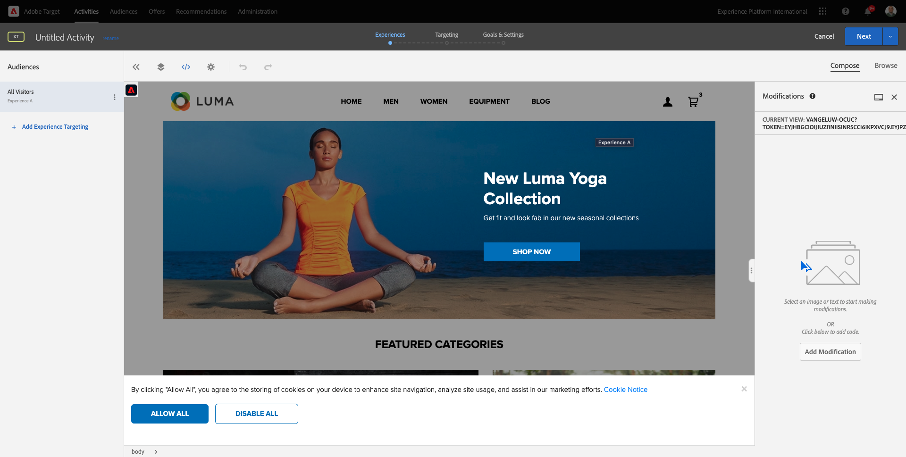
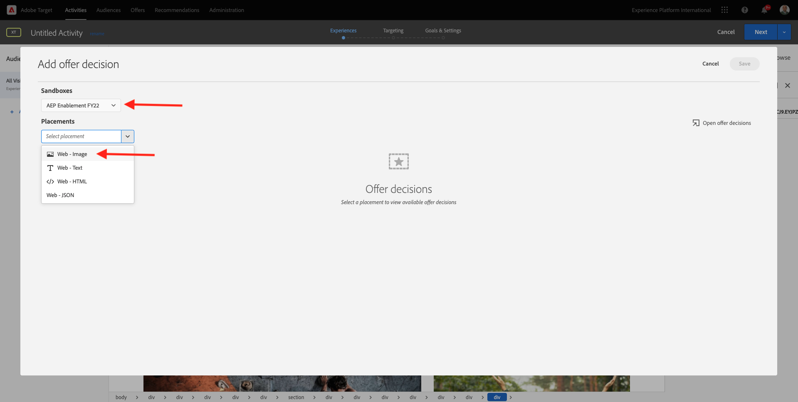

# 9.4 Combinar Adobe Target e Offer Decisioning

## 9.4.1 Colete o link compartilhável do seu projeto de demonstração

Para carregar o projeto do site de demonstração no Adobe Target, primeiro é necessário coletar um link especial que permitirá que o Adobe Target carregue o projeto do site de demonstração.

Para fazer isso, acesse [https://builder.adobedemo.com/projects](https://builder.adobedemo.com/projects). Depois de fazer logon com sua Adobe ID, você verá isso. Clique no projeto do seu site para abri-lo.

Você verá isso agora. Clique em **Compartilhar**.

Clique em **Gerar link** e, em seguida, copie o link para a área de transferência.

Ir para [https://bitly.com](https://bitly.com), cole o link copiado e clique em **Encurtar**. Agora você terá um link encurtado, que se parece com o seguinte: `https://bit.ly/3JxN7aG`. Você precisará desse link no próximo exercício.

## 9.4.2 Coleta

Agora vá para a página inicial do Adobe Experience Cloud acessando [https://experiencecloud.adobe.com/](https://experiencecloud.adobe.com/). Clique em **Target**.

No **Adobe Target** página inicial, você verá todas as atividades existentes.

Clique em **+ Criar atividade** para criar uma nova Atividade.

Selecionar **Direcionamento de experiência**.

Em seguida, selecione **Visual** e cole o link encurtado no campo **Inserir URL da atividade**. Clique em **Próximo**.

Em seguida, você verá seu projeto de demonstração do site sendo carregado no Visual Experience Composer.

Ir para **Procurar** modo para clicar **Permitir tudo** no pop-up de consentimento do cookie.

Clique na área que contém o texto **Categorias em destaque**. Clique em **Inserir antes** e depois selecione **Decisão da oferta**.

Você verá esse pop-up. Selecionar a sandbox `--aepSandboxId--` e, em seguida, selecione a disposição **Web - Imagem**.

Em seguida, selecione sua decisão `--demoProfileLdap-- - Luma Decision`. Clique em **Salvar**.

Você verá isso. Certifique-se de adicionar uma regra de modelo adicional **URL** **contém** **nome do projeto**. CLick **Salvar**.

Você verá isso. Clique em **Próximo**.

Insira um nome para a oferta, use este nome: `--demoProfileLdap-- - XT with Offers (VEC)`. Clique em **Próximo**.

Você verá isso. Defina as **Métrica de objetivo** conforme indicado. Clique em **Salvar e fechar**.

Sua oferta foi criada e está sendo publicada.

Depois que a oferta for publicada, você poderá ativá-la.

Próxima etapa: [9.5 Use sua decisão em um email e sms](./ex5.md)

[Voltar ao Módulo 9](./offer-decisioning.md)

[Voltar para todos os módulos](./../../overview.md)
