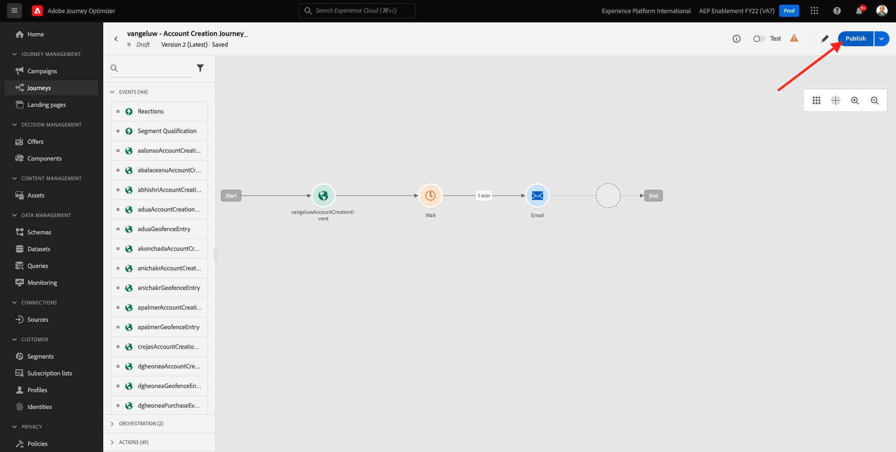

# 9.5 Use sua decisão em um e-mail

Neste exercício, você usará sua decisão para personalizar o delivery de um email e SMS.

Ir para **Jornada**. Encontre a jornada criada no exercício 7.2, que é chamada de `--demoProfileLdap-- - Account Creation Journey`. Clique na jornada para abri-la.

Você verá isso. Clique em **Criar uma nova versão**.

Clique em **Criar uma nova versão**.

Clique no botão **Email** e clique em **Editar conteúdo**.

Em seguida, você verá o painel de mensagens. Clique em **Email Designer**.

Você verá isso.

Você verá isso. Arraste um novo **Coluna 1:1** componente de estrutura na tela.

No menu , acesse **Componentes de conteúdo**. Selecione o **Decisão da oferta** e arraste e solte esse componente no espaço reservado da oferta de conteúdo do email, conforme indicado. Em seguida, clique em **Adicionar**.

Selecione o tipo de disposição que deseja incluir no email. No **Posicionamentos** seleção do menu suspenso **Email - Imagem** e selecione sua decisão `--demoProfileLdap-- - Luma Decision`. Clique em **Adicionar**.

Agora você vê todas as ofertas personalizadas e a oferta de fallback sendo visualizada no designer de email. Clique em  **Simular conteúdo** para visualizar a mensagem de email com um perfil de cliente real.

Comece identificando qual perfil você deseja usar para a visualização. Selecione o **email** namespace e insira o endereço de email de um perfil de cliente que você criou no site de demonstração. Em seguida, clique em **Visualizar**.

Depois que o email for exibido e a oferta for exibida corretamente, clique no botão **Fechar** botão.

Finalmente, clique em **Salvar**.

Agora, clique na seta para voltar à tela anterior.

Você verá isso. Clique na seta no canto superior esquerdo para retornar à jornada.

Clique em **Ok** para fechar **Email** ação.

Clique em **Publicar** para publicar sua jornada atualizada.

Confirme clicando em **Publicar** novamente.

Sua mensagem foi publicada.

Ao criar uma nova conta no site de demonstração, você receberá este email:

Terminou este exercício.

Próxima etapa: [9.6 Teste sua decisão usando a API](./ex6.md)

[Voltar ao Módulo 9](./offer-decisioning.md)

[Voltar para todos os módulos](./../../overview.md)
