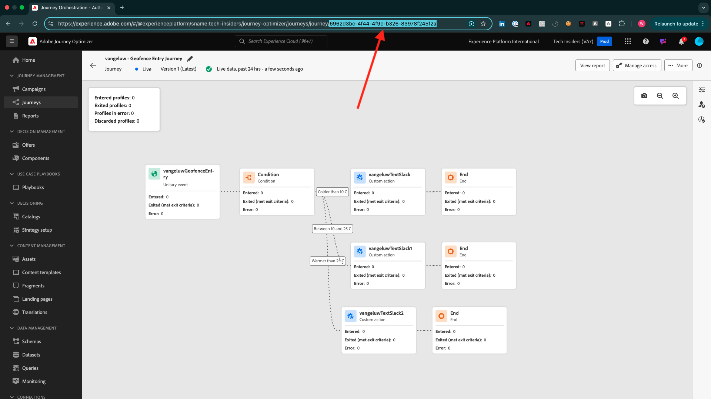
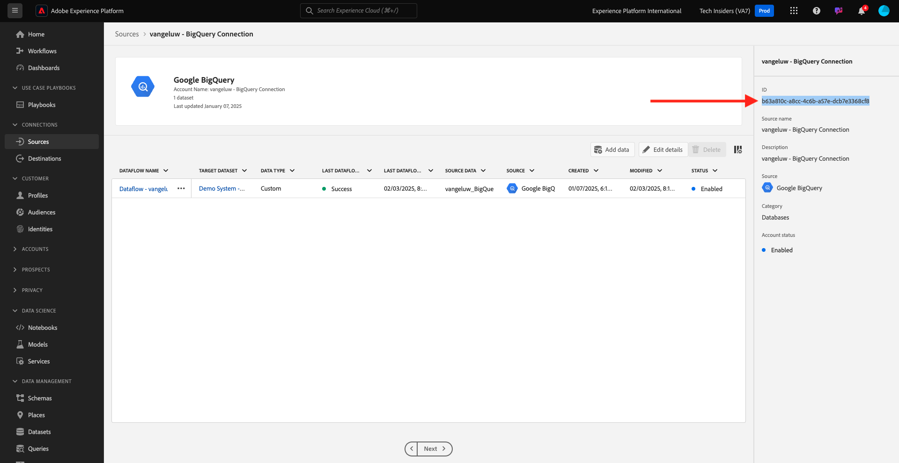

# Como a conclusão é medida?

Vá para [https://certification.adobe.com](https://certification.adobe.com) e navegue até o curso **XXX**.

Para concluir um módulo, você deve fornecer uma prova de conclusão.

Abaixo estão as provas de conclusão esperadas para cada módulo.

## Introdução

A prova de conclusão esperada para o módulo **Introdução** é a ID do projeto do Sistema de Demonstração para a Web que você criou.

A ID do projeto do Sistema de Demonstração para o formato da Web é semelhante a: `--demoProfileLdap-- - OCUC`.

## 1.1 Coleta de dados do Adobe Experience Platform e extensão do SDK da Web

A prova de conclusão esperada para o módulo **Coleção de dados e SDK da Web** é o nome da propriedade Coleção de dados para Web.

O nome da propriedade da Coleção de Dados para o formato Web tem esta aparência: `--demoProfileLdap-- - Demo System (05/02/2022) (enablement) 1644046719474`.

## 1.2 Assimilação de dados

A prova de conclusão esperada para o módulo **Assimilação de dados** é a ID do conjunto de dados para os dois conjuntos de dados criados.

O formato da ID do conjunto de dados é semelhante a: **5f069724723ef41916a8b5d2**.

`--demoProfileLdap-- - Demo System - Event Dataset for Website`

`--demoProfileLdap-- - Demo System - Profile Dataset for Website`

## 1.3 Composição de público-alvo federado

A prova de conclusão esperada para o módulo **Composição de Público Federado** é...

## 2.1 Perfil do cliente em tempo real

A prova de conclusão esperada para o módulo **Perfil de Cliente em Tempo Real** é a **ID de Segmento** do segmento que você criou por meio da interface, `--demoProfileLdap-- - Male customers with interest in Montana Wind Jacket`.

O formato da ID do segmento é semelhante a: **8cb7034d-d4ae-4d26-a61f-a76559c12457**.

## 2.2 Serviços inteligentes

A prova de conclusão esperada para o módulo **Serviços inteligentes** é a ID do seu **Serviço de IA de Cliente de Propensão de Compra de Produto**.

O formato tem esta aparência: **12729** e você poderá recuperá-lo da URL ao abrir o serviço.

## 2.3 Real-Time CDP: Crie um público-alvo e aja!

A prova de conclusão esperada para o módulo **Real-Time CDP** é a identificação da sua **Atividade do Adobe Target**.

O formato tem esta aparência: **111804**.

## 2.4 Real-Time CDP: Audience Activation para o Hub de eventos do Microsoft Azure

A prova de conclusão esperada para o módulo **RTCDP: EventHub** é a identificação do seu destino do **Hub de Eventos do Microsoft Azure** na Adobe Experience Platform.

Você pode encontrar a **ID de Destino do Hub de Eventos do Microsoft Azure**, que se parece com este **fa3f7ce5-86fd-4096-bf7c-e586fdc096ba**, aqui:

## 2.5 Conexões do Real-Time CDP: encaminhamento de eventos

A prova de conclusão esperada para o módulo **Conexões RTCDP** é sua **ID de Propriedade de Encaminhamento de Eventos**.

Você pode encontrar a **ID de Propriedade do Encaminhamento de Eventos**, que se parece com este **PR40f44184c888472e9c19d8d602aab0de**, aqui:

## 2.6 Transmitir dados do Apache Kafka para o Real-Time CDP

A prova de conclusão esperada para o módulo **Apache Kafka** é a identificação do conector de origem `--demoProfileLdap-- - Kafka`.

A ID é semelhante a este **f843d50a-ee30-4ca8-a766-0e4f3d29a2f7**, e você pode encontrá-la aqui:

## 3.1 Adobe Journey Optimizer: Orquestração

A prova de conclusão esperada para o módulo **AJO: Orquestração** é a eventID para seu `--demoProfileLdap--AccountCreationEvent`.

O formato tem esta aparência: **227402c540eb8f8855c6b2333adf6d54d7153d9d7d56fa475a6866081c574736**.

## 3.2 Adobe Journey Optimizer: fontes de dados externas e ações personalizadas

A prova de conclusão esperada para o módulo **AJO: Ações Personalizadas** é a eventID para o seu evento `--demoProfileLdap--GeofenceEntry`.

O formato tem esta aparência: **fa42ab7982ba55f039eacec24c1e32e5c51b310c67f0fa559ab49b89b63f4934**.

## 3.3 Adobe Journey Optimizer: Offer Decisioning

A prova de conclusão esperada para o módulo **AJO: Ofertas** é a ID da **Decisão de Oferta** que você criou.

Você pode encontrar a **ID da Decisão da Oferta**, que se parece com este **xcore:offer-activity:1122fcc4603ea499**, aqui:

## 3.4 Adobe Journey Optimizer: Jornadas baseadas em eventos

A prova de conclusão esperada para o módulo **AJO: Eventos** é a eventID para seu `--demoProfileLdap--StoreEntryEvent`.

O formato tem esta aparência: **e3a8f0bdc0b609667cd96a72a6b1e5aafa0ddaf6ccf121c574e6a2030860a633**.

## Customer Journey Analytics 4.1: Criar um painel usando o Analysis Workspace

A prova de conclusão esperada para o módulo **CJA** é a ID do seu projeto `--demoProfileLdap-- - Omnichannel Analysis`.

O formato tem esta aparência: **6217344f6249ac70c726db60**, você pode encontrá-lo na URL quando tiver aberto o projeto.

## 4.2 Customer Journey Analytics: Assimilar e analise dados de Google Analytics no Adobe Experience Platform com o BigQuery Source Connector

A prova de conclusão esperada para o módulo **CJA: BigQuery** é a identificação da sua conexão **BigQuery**.

Você pode encontrar a **ID da Conexão do BigQuery**, que se parece com este **85a2394d-8b94-410c-a239-4d8b94b10c38**, aqui:

## 5.1 Serviço de consulta

A prova de conclusão esperada para o módulo **Serviço de Consulta** é a ID do conjunto de dados para seu `--demoProfileLdap--_callcenter_interaction_analysis` - conjunto de dados que você obtém depois de concluir o módulo.

O formato tem esta aparência: **62076f68f14a9d194995d4e2**.

[Voltar a todos os módulos](./overview.md)
