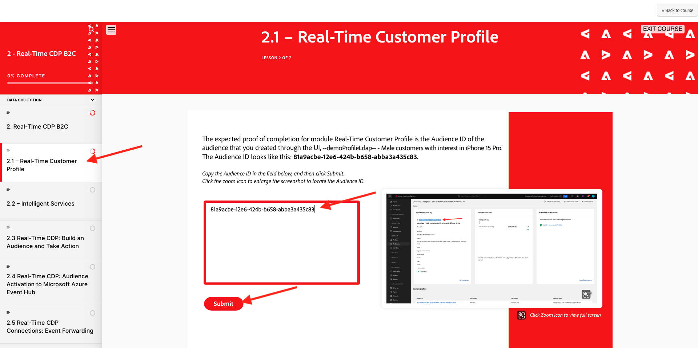
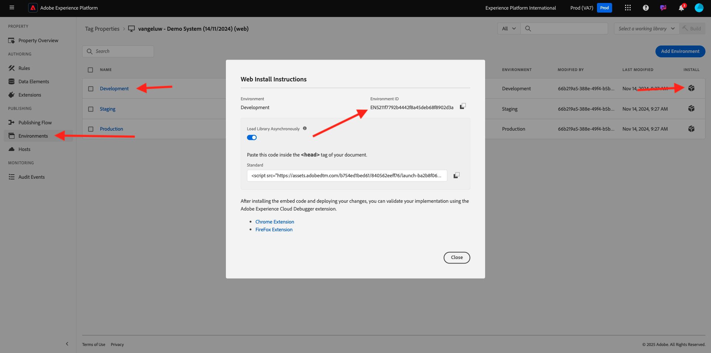

# Como a conclusão é medida?

Ir para [https://certification.adobe.com/courses/1258](https://certification.adobe.com/courses/1258).

{zoomable="yes"}

Clique em **Iniciar** ao lado do módulo para o qual você deseja enviar a conclusão.

{zoomable="yes"}

Para concluir um módulo, é necessário fornecer uma prova de conclusão e enviá-la para cada módulo.

{zoomable="yes"}

Abaixo estão as provas de conclusão esperadas para cada módulo.

## Introdução

A prova de conclusão esperada para o módulo **Introdução** é a ID do projeto do Sistema de Demonstração para a Web que você criou.

A ID do projeto do Sistema de Demonstração para o formato da Web é semelhante a: `--aepUserLdap-- - QIMU`.

{zoomable="yes"}

## 1.1 Coleta de dados do Adobe Experience Platform e extensão do Web SDK

A prova de conclusão esperada para o módulo **Coleta de Dados e Web SDK** é a **ID de Ambiente** da propriedade Coleta de Dados para Web.

A ID de Ambiente da propriedade de Coleção de Dados para o formato da Web tem esta aparência: `EN5211f7792b4442f8a45deb68f8902d3a`.

{zoomable="yes"}

## 1.2 Assimilação de dados

A prova de conclusão esperada para o módulo **Assimilação de dados** é a ID de fluxo de dados para a conexão Source da Zona de Aterrissagem de Dados.

A ID do Fluxo de Dados tem esta aparência: **374c2c6d-f39a-4b0b-b568-40c41e6c4e8e**.

{zoomable="yes"}

## 1.3 Composição de público-alvo federado

A prova de conclusão esperada para o módulo **Composição de Público-Alvo Federado** é a ID do Modelo de Dados Federado que você criou.

A ID do Federated Data Model tem esta aparência: **DMO5110** e pode ser obtida da URL conforme indicado na imagem abaixo.

{zoomable="yes"}

## 2.1 Perfil do cliente em tempo real

A prova de conclusão esperada para o módulo **Perfil de Cliente em Tempo Real** é a **ID de Público-alvo** do público-alvo que você criou por meio da interface, `--aepUserLdap-- - Male customers with interest in iPhone 15 Pro`.

A ID de Público-alvo é semelhante a: **81a9acbe-12e6-424b-b658-abba3a435c83**.

{zoomable="yes"}

## 2.2 Serviços inteligentes

A prova de conclusão esperada para o módulo **Serviços inteligentes** é a **ID de público-alvo** do público-alvo que você criou por meio da interface do usuário, `--aepUserLdap-- - Customer AI High Propensity`.

A ID de Público-alvo é semelhante a: **cb6db21d-8fa3-484a-93ac-25aa1ab48412**.

{zoomable="yes"}

## 2.3 Real-Time CDP: Crie um público-alvo e aja!

A prova de conclusão esperada para o módulo **Real-Time CDP: crie uma audiência e aja!** é a identificação do seu **Destino do Webhook do SDK**.

A ID de destino do seu webhook é semelhante a: **b5b4b959-3166-40e2-8279-8223d00c3987** e pode ser retirada da URL conforme indicado na imagem abaixo.

{zoomable="yes"}

## 2.4 Real-Time CDP: Audience Activation para o Hub de eventos do Microsoft Azure

A prova de conclusão esperada para o módulo **Real-Time CDP: Audience Activation para o Hub de Eventos do Microsoft Azure** é a identificação do seu destino do **Hub de Eventos do Microsoft Azure** na Adobe Experience Platform.

Você pode encontrar a **ID de Destino do Hub de Eventos do Microsoft Azure**, que se parece com este **43cf85bc-3d01-49fd-80c9-a2913db45e3c**, na URL conforme indicado abaixo:

{zoomable="yes"}

## 2.5 Conexões do Real-Time CDP: encaminhamento de eventos

A prova de conclusão esperada para o módulo **Conexões do Real-Time CDP: Encaminhamento de Eventos** é sua **ID de Propriedade de Encaminhamento de Eventos**.

Você pode encontrar a **ID de Propriedade do Encaminhamento de Eventos**, que se parece com este **PRa18819171c1241dfb16d74a49993dd5b**, na URL conforme indicado na imagem abaixo:

{zoomable="yes"}

## 2.6 Transmitir dados do Apache Kafka para o Real-Time CDP

A prova de conclusão esperada para o módulo **Dados de fluxo do Apache Kafka para o Real-Time CDP** é a identificação do conector de origem `--aepUserLdap-- - Kafka`.

A ID é semelhante a este **f843d50a-ee30-4ca8-a766-0e4f3d29a2f7**, e você pode encontrá-la aqui:

{zoomable="yes"}

## 3.1 Adobe Journey Optimizer: Orquestração

A prova de conclusão esperada para o módulo **Adobe Journey Optimizer: Orchestration** é a identificação se a jornada tiver sido criada.

A ID da jornada é semelhante a esta, **594fa01f-1a3b-450c-ba09-b7e3ff377c0f**, e pode ser obtida da URL conforme indicado na imagem abaixo.

{zoomable="yes"}

## 3.2 Adobe Journey Optimizer: fontes de dados externas e ações personalizadas

A prova de conclusão esperada para o módulo **Adobe Journey Optimizer: Fontes de dados externas e ações personalizadas** é a identificação da jornada que você criou.

A identificação da jornada é semelhante a: **6962d3bc-4f44-4f9c-b326-83978f245f2a**, e pode ser obtida da URL conforme indicado na imagem abaixo.

{zoomable="yes"}

## 3.3 Adobe Journey Optimizer: Offer Decisioning

A prova de conclusão esperada para o módulo **Adobe Journey Optimizer: Offer Decisioning** é a identificação da **Decisão** que você criou.

Você pode encontrar a **ID da Decisão**, que se parece com este **dps:offer-activity:1a08ba4b529b2fb2**, aqui:

{zoomable="yes"}

## 3.4 Adobe Journey Optimizer: Jornadas baseadas em eventos

A prova de conclusão esperada para o módulo **Adobe Journey Optimizer: Jornadas baseadas em eventos** é a identificação da jornada que você criou.

A identificação da jornada é semelhante a: **5f5efc7e-49f7-44c1-85df-b23482b38d32**, e pode ser retirada da URL conforme indicado na imagem abaixo.

{zoomable="yes"}

## 3.5 Adobe Journey Optimizer: serviços de tradução

A prova de conclusão esperada para o módulo **Adobe Journey Optimizer: Serviços de Tradução** é a **ID da versão do Campaign** da sua campanha de Fibra CitiSignal.

A ID da versão do Campaign do Federated Data Model tem esta aparência: **b11c998b-a345-4f8e-afb1-6285547eb693** e pode ser copiada da tela Visão Geral do Campaign, conforme indicado na imagem abaixo.

{zoomable="yes"}

## Customer Journey Analytics 4.1: Criar um painel usando o Analysis Workspace

A prova de conclusão esperada para o módulo **Customer Journey Analytics: Criar um painel usando o Analysis Workspace** é a identificação do seu projeto `--aepUserLdap-- - Omnichannel Analysis`.

O formato tem esta aparência: **677bcb247064db3c7de2a0e4**, você poderá encontrá-lo na URL quando tiver aberto o projeto.

{zoomable="yes"}

## 4.2 Customer Journey Analytics: Assimilar e analise dados de Google Analytics no Adobe Experience Platform com o BigQuery Source Connector

A prova de conclusão esperada para o módulo **Customer Journey Analytics: Assimilar e Analisar dados de Google Analytics no Adobe Experience Platform com o Conector de Source do BigQuery** é a identificação da sua conexão de origem **BigQuery**.

Você pode encontrar a **ID da Conexão do BigQuery**, que se parece com este **b63a810c-a8cc-4c6b-a57e-dcb7e3368cf8**, aqui:

{zoomable="yes"}

## 5.1 Serviço de consulta

A prova de conclusão esperada para o módulo **Serviço de Consulta** é a ID do conjunto de dados para seu `--aepUserLdap--_callcenter_interaction_analysis` - conjunto de dados que você obtém depois de concluir o módulo.

A ID é semelhante a: **675033c903fb3b2aefed8a0a**.

{zoomable="yes"}{width="50px" align="left"}

>[!NOTE]
>
>Em caso de dúvidas, envie um email para **techinsiders@adobe.com** para compartilhar comentários gerais sobre sugestões para conteúdo futuro. Entre em contato diretamente com o Tech Insiders.

[Voltar a todos os módulos](./overview.md)