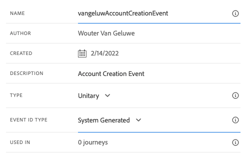

# 3.1.1 Criar o evento

Faça login no Adobe Journey Optimizer em [Adobe Experience Cloud](https://experience.adobe.com). Clique em **Journey Optimizer**.

Você será redirecionado para a exibição **Página inicial** no Journey Optimizer. Primeiro, verifique se você está usando a sandbox correta. A sandbox a ser usada é chamada `--aepSandboxName--`. Para alterar a sandbox, clique em **Produção (VA7)** e selecione a sandbox na lista. Neste exemplo, a sandbox é chamada de **AEP Enablement FY22**. Você estará na exibição **Página inicial** da sua sandbox `--aepSandboxName--`.

No menu esquerdo, role para baixo e clique em **Configurações**. Em seguida, clique no botão **Gerenciar** em **Eventos**.

Você verá uma visão geral de todos os eventos disponíveis. Clique em **Criar evento** para começar a criar seu próprio evento.

Uma nova janela de evento vazia será exibida.

Primeiro, dê ao seu Evento um Nome como este: `--aepUserLdap--AccountCreationEvent`.

Em seguida, adicione uma descrição como esta `Account Creation Event`.

Em seguida, verifique se o **Tipo** está definido como **Unitário** e, para a seleção do **Tipo de ID de Evento**, selecione **Sistema Gerado**.

O próximo é a seleção Esquema. Um esquema foi preparado para este exercício. Use o esquema `Demo System - Event Schema for Website (Global v1.1) v.1`.

Depois de selecionar o esquema, você verá vários campos sendo selecionados na seção **Carga**. Agora você deve passar o mouse sobre a seção **Carga** e verá três ícones pop-up. Clique no ícone **Editar**.

Você verá um pop-up de janela **Campos**, no qual é necessário selecionar alguns dos campos necessários para personalizar o email.  Escolheremos outros atributos de perfil posteriormente, usando os dados já existentes no Adobe Experience Platform.

No objeto `--aepTenantId--.demoEnvironment`, selecione os campos **brandLogo** e **brandName**.

No objeto `--aepTenantId--.identification.core`, certifique-se de selecionar o campo **email**.

Clique em **Ok** para salvar suas alterações.

Você deverá ver isso:

Clique em **Salvar** mais uma vez para salvar as alterações.

Seu evento agora está configurado e salvo.

Clique no evento novamente para abrir a tela **Editar Evento** novamente. Passe o mouse sobre o campo **Carga** novamente para ver os 3 ícones novamente. Clique no ícone **Exibir carga**.

Agora você verá um exemplo da carga útil esperada.

Seu Evento tem uma eventID de orquestração exclusiva, que você pode encontrar rolando para baixo nessa carga até ver `_experience.campaign.orchestration.eventID`.

A ID de evento é o que precisa ser enviado para o Adobe Experience Platform para acionar a Jornada que você criará no Exercício 7.2. Lembre-se dessa eventID, pois ela será necessária no Exercício 7.3.
`"eventID": "227402c540eb8f8855c6b2333adf6d54d7153d9d7d56fa475a6866081c574736"`

Clique em **Ok**, depois em **Cancelar**.

Você terminou este exercício agora.

Próxima Etapa: [3.1.2 Journey Optimizer: criar sua jornada e mensagem de email](./ex2.md)

[Voltar ao módulo 3.1](./journey-orchestration-create-account.md)

[Voltar a todos os módulos](../../../overview.md)
