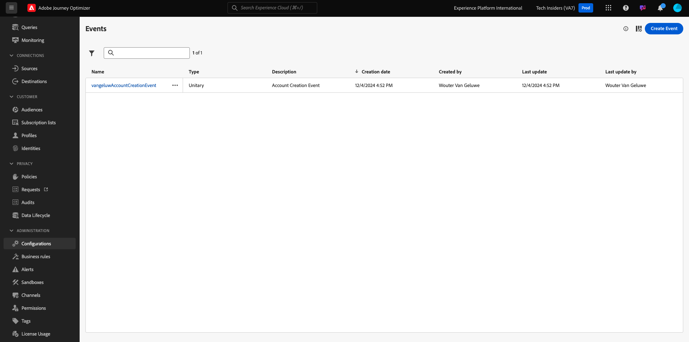
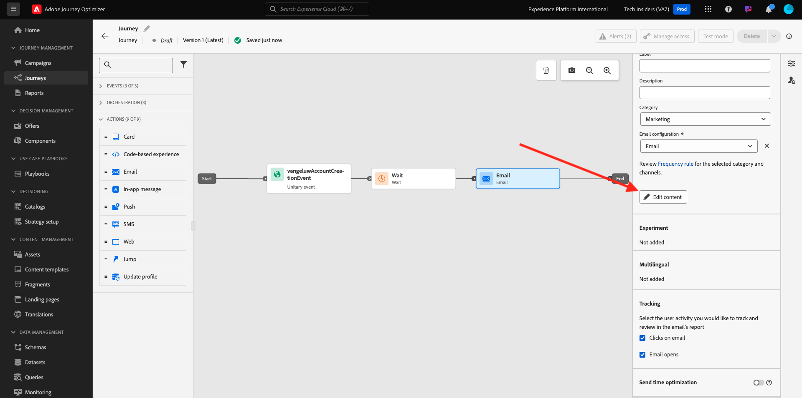
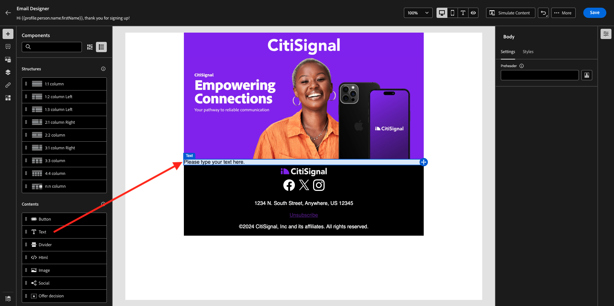
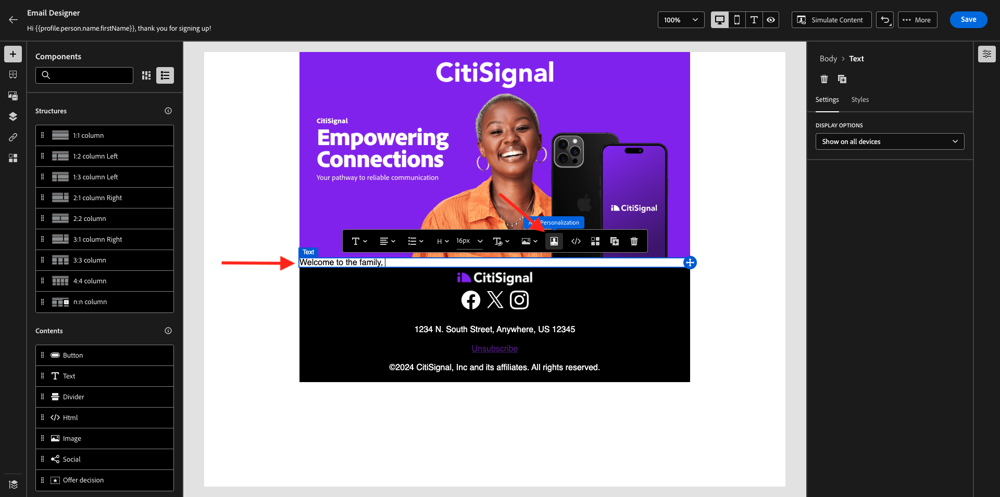

# 3.1.2 Criar a jornada e a mensagem de email

Neste exercício, você configurará a jornada e a mensagem que precisa ser acionada quando alguém criar uma conta no site de demonstração.

Faça login no Adobe Journey Optimizer em [Adobe Experience Cloud](https://experience.adobe.com). Clique em **Journey Optimizer**.

Você será redirecionado para a exibição **Página inicial** no Journey Optimizer. Primeiro, verifique se você está usando a sandbox correta. A sandbox a ser usada é chamada `--aepSandboxName--`. Para alterar a sandbox, clique em **Produção (VA7)** e selecione a sandbox na lista. Neste exemplo, a sandbox é chamada de **AEP Enablement FY22**. Você estará na exibição **Página inicial** da sua sandbox `--aepSandboxName--`.

## 3.1.2.1 Criar sua jornada

No menu esquerdo, clique em **Jornadas**. Em seguida, clique em **Criar Jornada** para criar uma nova jornada.

Você verá uma tela de jornada vazia.

No exercício anterior, você criou um novo **Evento**. Você nomeou como este `ldapAccountCreationEvent` e substituiu `ldap` pelo seu ldap. Este foi o resultado da criação do Evento:

Agora, é necessário tomar este evento como o início desta Jornada. Você pode fazer isso indo para o lado esquerdo da tela e procurando seu evento na lista de eventos.

Selecione o evento, arraste e solte-o na tela de Jornada. Agora a Jornada tem esta aparência:

Como a segunda etapa da jornada, você precisa adicionar uma pequena etapa **Aguardar**. Vá para o lado esquerdo da tela para a seção **Orquestração** para encontrar isso. Você estará usando atributos de perfil e precisa verificar se eles estão preenchidos no Perfil do cliente em tempo real.

Sua jornada agora está assim. No lado direito da tela, é necessário configurar o tempo de espera. Defina-o como 1 minuto. Isso dará bastante tempo para que os atributos de perfil estejam disponíveis após o acionamento do evento.

Clique em **Ok** para salvar suas alterações.

Como terceira etapa da jornada, você precisa adicionar uma ação **Email**. Vá para o lado esquerdo da tela para **Ações**, selecione a ação **Email** e arraste-a e solte-a no segundo nó da jornada. Agora vocês podem ver isso.

Defina a **Categoria** como **Marketing** e selecione uma superfície de email que permita o envio de emails. Nesse caso, a superfície de email a ser selecionada é **Email**. Verifique se as caixas de seleção para **Cliques no email** e **aberturas de email** estão habilitadas.

A próxima etapa é criar a mensagem. Para fazer isso, clique em **Editar conteúdo**.

## 3.1.2.2 Criar a mensagem

Para criar sua mensagem, clique em **Editar conteúdo**.

Agora vocês podem ver isso.

Clique no campo de texto **Linha de assunto**.

Na área de texto comece a gravar **Olá**

A linha de assunto ainda não foi terminada. Em seguida, você precisa trazer o token de personalização para o campo **Nome**, que é armazenado em `profile.person.name.firstName`. No menu esquerdo, role para baixo para encontrar o elemento **Person** e clique na seta para ir um nível mais fundo.

Agora, encontre o elemento **Nome completo** e clique na seta para ir um nível mais fundo.

Finalmente, encontre o campo **Nome** e clique no sinal **+** ao lado dele. Você verá o token de personalização aparecer no campo de texto.

Em seguida, adicione o texto **, obrigado por se inscrever!**. Clique em **Salvar**.

Você estará de volta aqui. Clique em **Email do Designer** para criar o conteúdo do email.

Na próxima tela, 3 métodos diferentes serão exibidos para fornecer o conteúdo do email:

- **Criar do zero**: comece com uma tela em branco e use o editor de WYSIWYG para arrastar e soltar componentes de estrutura e conteúdo para criar visualmente o conteúdo do email.
- **Codifique o seu próprio**: crie seu próprio modelo de email codificando-o usando o HTML
- **Importar HTML**: importe um modelo de HTML existente, que poderá ser editado.

Clique em **Design do zero**.

No menu esquerdo, você encontrará os componentes de estrutura que podem ser usados para definir a estrutura do email (linhas e colunas).

Arraste e solte uma coluna **1:2 à esquerda** do menu na tela. Este será o espaço reservado para a imagem do logotipo.

Arraste e solte uma **coluna 1:1** abaixo do componente anterior. Este será o bloco de banner.

Arraste e solte uma coluna **1:2 à esquerda** abaixo do componente anterior. Este será o conteúdo real com uma imagem no lado esquerdo e o texto no lado direito.

Em seguida, arraste e solte uma **coluna 1:1** abaixo do componente anterior. Este será o rodapé do email. Agora, sua tela terá esta aparência:

Em seguida, vamos usar Componentes de conteúdo para adicionar conteúdo dentro desses blocos. Clique no item de menu **Componentes de Conteúdo**

Arraste e solte um componente **Imagem** na primeira célula da primeira linha. Clique em **Procurar**.

Você verá isso. Navegue até a pasta **enablement-assets** e selecione o arquivo **luma-logo.png**. Clique em **Selecionar**.

Agora você está de volta aqui:

Vá para **Componentes do Conteúdo** e arraste e solte um componente de **Imagem** na primeira célula da primeira linha. Clique em **Procurar**.

No pop-up **Assets**, vá para a pasta **enablement-assets**. Nessa pasta, você encontrará todos os ativos preparados e carregados anteriormente pela equipe criativa. Selecione **module23-thankyou-new.png** e clique em **Selecionar**.

Você terá isto:

Selecione sua imagem e, no menu direito, role para baixo até ver o componente controle deslizante de largura de **Tamanho**. Use o controle deslizante para alterar a largura para f.i. **60%**.

Em seguida, vá para **Componentes do Conteúdo** e arraste e solte um componente de **Texto** no componente de estrutura na quarta linha.

Selecione o texto padrão **Digite o texto aqui.** como faria com qualquer editor de texto. Em vez disso, escreva **Dear**. Observe a barra de ferramentas de texto exibida quando você está no modo de texto.

Na barra de ferramentas, clique no ícone **Adicionar personalização**.

Em seguida, você precisa trazer o token de personalização de **Nome**, que é armazenado em `profile.person.name.firstName`. No menu, localize o elemento **Pessoa**, vá para o elemento **Nome Completo** e clique no ícone **+** para adicionar o campo Nome ao editor de expressão.

Clique em **Salvar**.

Agora você observará como o campo de personalização foi adicionado ao seu texto.

No mesmo campo de texto, pressione **Enter** duas vezes para adicionar duas linhas e escreva **Obrigado por criar sua conta com o Luma!**.

A verificação final a ser executada para garantir que seu email está pronto é visualizá-lo, clique no botão **Simular Conteúdo**.

Comece identificando qual perfil você deseja usar para a visualização. Selecione o namespace de **email** clicando no ícone ao lado do campo **Inserir namespace de identidade**.

Na lista de namespaces de identidade, selecione o namespace **Email**.

No campo **Valor de identidade**, digite o endereço de email de um perfil de demonstração anterior que já está armazenado no Perfil de cliente em tempo real. Por exemplo **woutervangeluwe+06022022-01@gmail.com** e clique no botão **Localizar Perfil de Teste**

Quando seu perfil aparecer na tabela, clique na guia **Visualizar** para acessar a tela de visualização.

Quando a visualização estiver pronta, valide se a personalização está correta na linha de assunto, se o texto do corpo e o link de unsubscription estão destacados como um hiperlink.

Clique em **Fechar** para fechar a visualização.

Clique em **Salvar** para salvar sua mensagem.

Volte para o painel da mensagem clicando na **seta** ao lado do texto da linha de assunto no canto superior esquerdo.

Você concluiu a criação do email de registro. Clique na seta no canto superior esquerdo para voltar à jornada.

Clique em **Ok**.

## 3.1.2.3 Publish e sua jornada

Você ainda precisa dar um Nome à sua jornada. Você pode fazer isso clicando no ícone **Propriedades** na parte superior direita da tela.

Em seguida, você pode inserir o nome da jornada aqui. Use `--aepUserLdap-- - Account Creation Journey`. Clique em **OK** para salvar suas alterações.

Agora você pode publicar sua jornada clicando em **Publish**.

Clique novamente em **Publish**.

Você verá uma barra de confirmação verde informando que a jornada foi publicada.

Você terminou este exercício agora.

Próxima Etapa: [3.1.3 Atualize sua propriedade Coleção de Dados e teste sua jornada](./ex3.md)

[Voltar ao módulo 3.1](./journey-orchestration-create-account.md)

[Voltar a todos os módulos](../../../overview.md)
