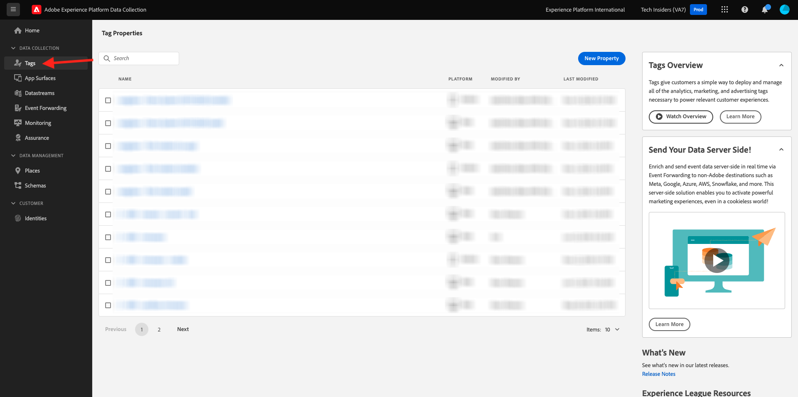

# 3.1.3 Atualize a propriedade Coleção de dados e teste a jornada

## 3.1.3.1 Atualizar a propriedade Coleção de dados

Vá para [Coleção de dados do Adobe Experience Platform](https://experience.adobe.com/launch/) e selecione **Marcas**.

Em **Introdução**, o Sistema de Demonstração criou duas propriedades do Cliente para você: uma para o site e outra para o aplicativo móvel. Localize-os procurando por `--aepUserLdap--` na caixa **[!UICONTROL Pesquisar]**. Clique para abrir a propriedade **Web**.

Você verá isso.

No menu esquerdo, vá para **Regras** e procure a regra **Criar conta**. Clique na regra **Criar conta** para abri-la.

Você verá os detalhes dessa regra. Clique para abrir a ação **Enviar Evento de Experiência &quot;Evento de Registro&quot;**.

Você verá que, quando essa ação for acionada, um elemento de dados específico será usado para definir a estrutura de dados XDM. Você precisa atualizar esse elemento de dados e definir a **ID de Evento** do evento que você configurou no [Exercício 3.1.1](./ex1.md).

Agora é necessário atualizar o elemento de dados **XDM - Evento de registro**. Para fazer isso, vá para **Elementos de dados**. Procure por **XDM - Registro** e clique para abrir esse elemento de dados.

Você verá isto:

Navegue até o campo `_experience.campaign.orchestration.eventID`. Remova o valor atual e cole sua eventID lá.

Lembrando que a ID de Evento pode ser encontrada no Adobe Journey Optimizer em **Configurações > Eventos**, e você encontrará a ID de evento na carga de exemplo do seu evento, que tem esta aparência: `"eventID": "5ae9b8d3f68eb555502b0c07d03ef71780600c4bd0373a4065c692ae0bfbd34d"`.

Depois de colar a eventID, a tela deve ter esta aparência. Em seguida, clique em **Salvar** ou **Salvar na Biblioteca**.

Por fim, você precisa publicar suas alterações. Vá para **Fluxo de Publicação** no menu esquerdo e clique para abrir sua biblioteca **Principal**.

Clique em **Adicionar todos os recursos alterados** e em **Salvar e criar no desenvolvimento**.

Sua biblioteca será atualizada e, após 1 a 2 minutos, você poderá testar sua configuração.

## 3.1.3.2 Testar a Jornada

Ir para [https://dsn.adobe.com](https://dsn.adobe.com). Depois de fazer logon com sua Adobe ID, você verá isso. Clique nos 3 pontos **...** do projeto do site e clique em **Executar** para abri-lo.

Você verá seu site de demonstração aberto. Selecione o URL e copie-o para a área de transferência.

Abra uma nova janela incógnita do navegador.

Cole o URL do site de demonstração que você copiou na etapa anterior. Você será solicitado a fazer logon usando sua Adobe ID.

Selecione o tipo de conta e conclua o processo de logon.

Em seguida, você verá seu site carregado em uma janela incógnita do navegador. Para cada exercício, será necessário usar uma janela do navegador nova e incógnita para carregar o URL do site de demonstração.

Clique no ícone do logotipo do Adobe no canto superior esquerdo da tela para abrir o Visualizador de perfis.

Consulte o painel Visualizador de perfis e o Perfil do cliente em tempo real com a **ID de Experience Cloud** como o identificador principal para este cliente atualmente desconhecido. Clique em **Fazer logon**.

Clique em **CRIAR UMA CONTA**.

Preencha seus detalhes e clique em **Registrar**; depois disso, você será redirecionado para a página anterior.

Abra o painel Visualizador de perfis e vá para Perfil do cliente em tempo real. No painel Visualizador de perfis, você deve ver todos os seus dados pessoais exibidos, como emails recém-adicionados e identificadores de telefone.

1 minuto após a criação da sua conta, você receberá um email da Adobe Journey Optimizer sobre a criação da conta.

Você também verá a entrada da jornada e o progresso pela jornada no painel da jornada no Journey Optimizer.

Próxima etapa: [Resumo e benefícios](./summary.md)

[Voltar ao módulo 3.1](./journey-orchestration-create-account.md)

[Voltar a todos os módulos](../../../overview.md)
