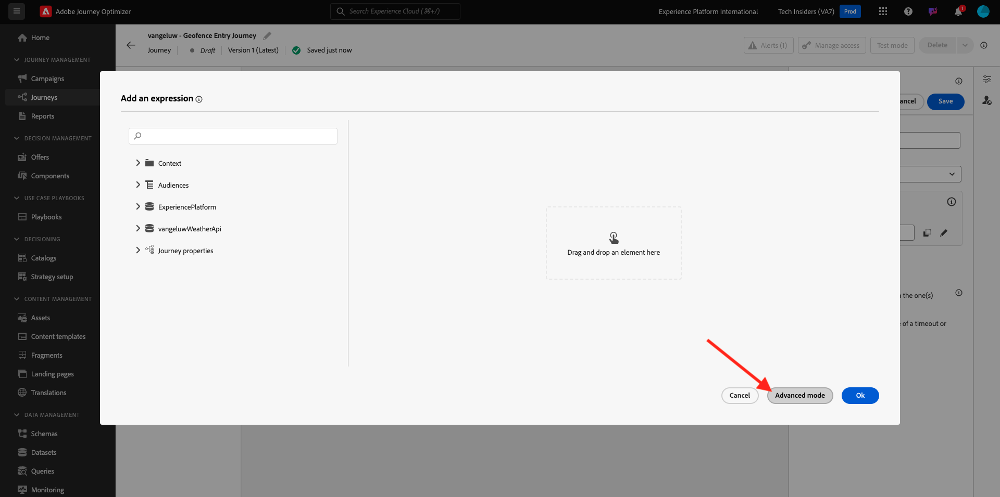
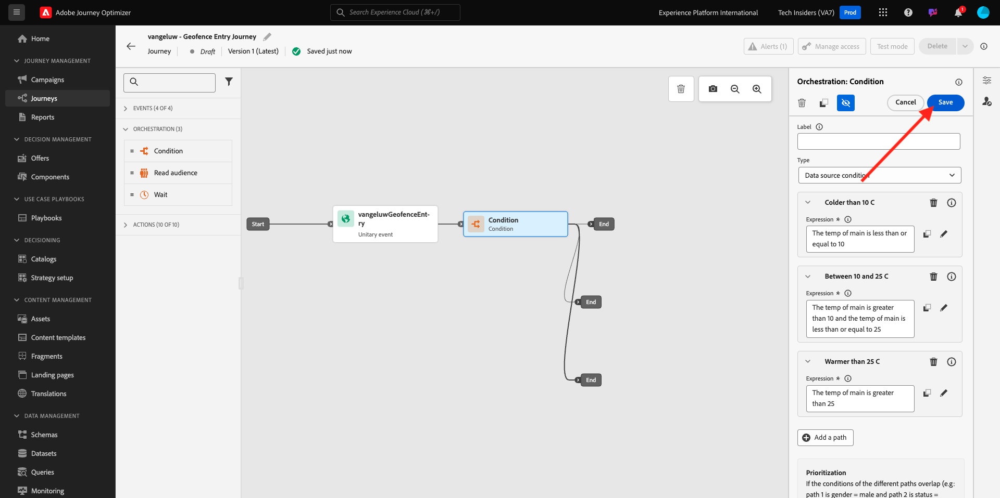
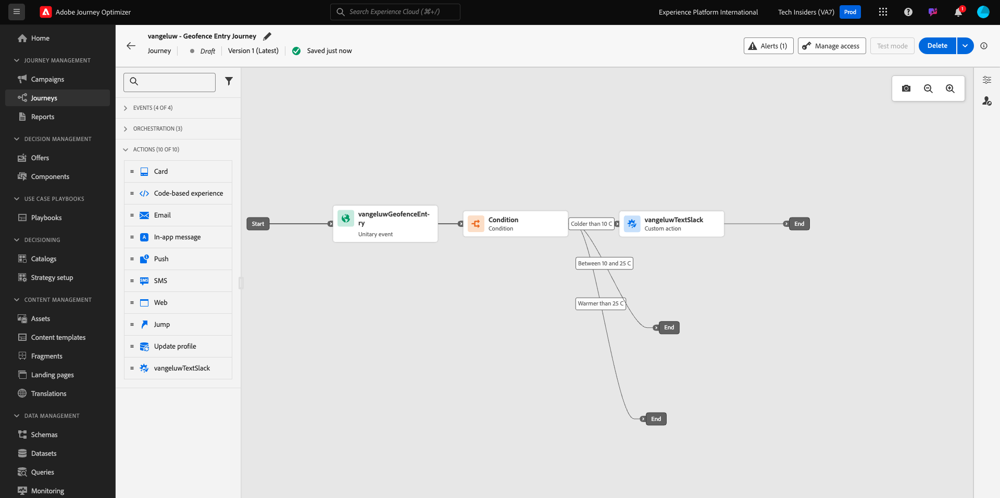

# 3.2.4 Criar a jornada e as mensagens

Neste exercício, você criará uma jornada e várias mensagens de texto usando o Adobe Journey Optimizer.

Para esse caso de uso, o objetivo é enviar mensagens SMS diferentes com base nas condições meteorológicas da localização do seu cliente. Foram definidos três cenários:

- Mais frio que 10° Celsius
- Entre 10° e 25° Celsius
- Mais quente que 25° Celsius

Para essas três condições, você precisará definir três mensagens SMS no Adobe Journey Optimizer.

## 3.2.4.1 Criar a jornada

Faça login no Adobe Journey Optimizer em [Adobe Experience Cloud](https://experience.adobe.com). Clique em **Journey Optimizer**.


Você será redirecionado para a exibição **Página inicial** no Journey Optimizer. Primeiro, verifique se você está usando a sandbox correta. A sandbox a ser usada é chamada `--aepSandboxName--`. Para alterar a sandbox, clique em **Produção (VA7)** e selecione a sandbox na lista. Neste exemplo, a sandbox é chamada de **AEP Enablement FY22**. Você estará na exibição **Página inicial** da sua sandbox `--aepSandboxName--`.


No menu esquerdo, vá para **Jornadas** e clique em **Criar Jornada** para começar a criar sua Jornada.


Você deveria nomear sua jornada.

Como Nome da jornada, use `--aepUserLdap-- - Geofence Entry Journey`. Neste exemplo, o nome da jornada é `vangeluw - Geofence Entry Journey`. Nenhum outro valor deve ser definido neste momento. Clique em **OK**.


À esquerda da tela, dê uma olhada em **Eventos**. Você deve ver o evento criado anteriormente nessa lista. Selecione-a e, em seguida, arraste-a e solte-a na tela de jornada. Sua jornada fica assim. Clique em **Ok**.


Em seguida, clique em **Orquestração**. Agora você vê os recursos disponíveis do **Orchestration**. Selecione **Condição** e arraste-a e solte-a na Tela de Jornada.


Agora, você precisa definir três condições:

- Está mais frio que 10° Celsius
- Está entre 10° e 25° Celsius
- Está mais quente que 25° Celsius

Vamos definir a primeira condição.

### Condição 1: Mais frio que 10° Celsius

Clique na **Condição**.  Clique em **Caminho1** e edite o nome do caminho para **Mais frio que 10 C**. Clique no ícone **Editar** para a expressão de Path1.


Você verá uma tela vazia **Editor simples**. Sua consulta será um pouco mais avançada, portanto, você precisará do **Modo Avançado**. Clique em **Modo Avançado**.



Você verá o **Editor Avançado** que permite a entrada de código.


Selecione o código abaixo e cole-o no **Editor Avançado**.

`#{--aepUserLdap--WeatherApi.--aepUserLdap--WeatherByCity.main.temp} <= 10`

Você verá isso.


Para recuperar a temperatura como parte dessa condição, é necessário fornecer a cidade em que o cliente está atualmente.
A **Cidade** precisa ser vinculada ao parâmetro dinâmico `q`, da mesma forma que vimos anteriormente na Documentação da API de Open Weather.

Clique no campo **val dinâmico: q** conforme indicado na captura de tela.


Em seguida, é necessário localizar o campo que contém a cidade atual do cliente em uma das Fontes de dados disponíveis.


Você pode encontrar o campo navegando até `--aepUserLdap--GeofenceEntry.placeContext.geo.city`.

Ao clicar nesse campo, ele será adicionado como o valor dinâmico do parâmetro `q`. Este campo será preenchido, por exemplo, pelo serviço de localização geográfica que você implementou no aplicativo móvel. Em nosso caso, simularemos isso com o Admin Console do site de demonstração. Clique em **OK**.


### Condição 2: Entre 10° e 25° Celsius

Depois de adicionar a primeira condição, você verá essa tela. Clique em **Adicionar caminho**.


Clique duas vezes no **Caminho1** e edite o nome do caminho para **Entre 10 e 25 C**. Clique no ícone **Editar** para a expressão deste caminho.


Você verá uma tela vazia **Editor simples**. Sua consulta será um pouco mais avançada, portanto, você precisará do **Modo Avançado**. Clique em **Modo Avançado**.


Você verá o **Editor Avançado** que permite a entrada de código.


Selecione o código abaixo e cole-o no **Editor Avançado**.

`#{--aepUserLdap--WeatherApi.--aepUserLdap--WeatherByCity.main.temp} > 10 and #{--aepUserLdap--WeatherApi.--aepUserLdap--WeatherByCity.main.temp} <= 25`

Você verá isso.


Para recuperar a temperatura como parte dessa Condição, você precisa fornecer a cidade em que o cliente está atualmente.
A **Cidade** precisa ser vinculada ao parâmetro dinâmico **q**, da mesma forma que vimos anteriormente na Documentação da API de Open Weather.

Clique no campo **val dinâmico: q** conforme indicado na captura de tela.


Em seguida, é necessário localizar o campo que contém a cidade atual do cliente em uma das Fontes de dados disponíveis.


Você pode encontrar o campo navegando até `--aepUserLdap--GeofenceEntry.placeContext.geo.city`. Ao clicar nesse campo, ele será adicionado como valor dinâmico para o parâmetro **q**. Este campo será preenchido, por exemplo, pelo serviço de localização geográfica que você implementou no aplicativo móvel. Em nosso caso, simularemos isso com o Admin Console do site de demonstração. Clique em **OK**.


Em seguida, você adicionará a terceira condição.

### Condição 3: mais quente que 25° Celsius

Depois de adicionar a segunda condição, você verá essa tela. Clique em **Adicionar caminho**.


Clique duas vezes em Path1 para alterar o nome para **Warmer than 25 C**.
Em seguida, clique no ícone **Editar** da expressão neste caminho.


Você verá uma tela vazia **Editor simples**. Sua consulta será um pouco mais avançada, portanto, você precisará do **Modo Avançado**. Clique em **Modo Avançado**.


Você verá o **Editor Avançado** que permite a entrada de código.


Selecione o código abaixo e cole-o no **Editor Avançado**.

`#{--aepUserLdap--WeatherApi.--aepUserLdap--WeatherByCity.main.temp} > 25`

Você verá isso.


Para recuperar a temperatura como parte dessa Condição, você precisa fornecer a cidade em que o cliente está atualmente.
A **Cidade** precisa ser vinculada ao parâmetro dinâmico **q**, da mesma forma que vimos anteriormente na Documentação da API de Open Weather.

Clique no campo **val dinâmico: q** conforme indicado na captura de tela.


Em seguida, é necessário localizar o campo que contém a cidade atual do cliente em uma das Fontes de dados disponíveis.


Você pode encontrar o campo navegando até ```--aepUserLdap--GeofenceEntry.placeContext.geo.city```. Ao clicar nesse campo, ele será adicionado como valor dinâmico para o parâmetro **q**. Este campo será preenchido, por exemplo, pelo serviço de localização geográfica que você implementou no aplicativo móvel. Em nosso caso, simularemos isso com o Admin Console do site de demonstração. Clique em **OK**.


Agora você tem três caminhos configurados. Clique em **Ok**.



Como essa é uma jornada para fins de aprendizado, vamos configurar algumas ações para mostrar a variedade de opções que os profissionais de marketing agora têm para enviar mensagens.

## 3.2.4.2 Enviar mensagens para o caminho: mais frio que 10° Celsius

Para cada um dos contextos de temperatura, tentaremos enviar uma mensagem de texto ao nosso cliente. Só é possível enviar uma mensagem de texto se tivermos um número de celular disponível para um cliente, portanto, primeiro teremos que verificar se o temos.

Vamos nos concentrar em **Mais frio que 10 C**.


Vamos pegar outro elemento **Condition** e arrastá-lo conforme indicado na captura de tela abaixo. Verificaremos se há um número de celular disponível para este cliente.


Como isso é apenas um exemplo, estamos configurando apenas a opção em que o cliente tem um número de celular disponível. Adicione um rótulo de **Possui celular?**.

Clique no ícone **Editar** para a Expressão do caminho **Caminho1**.


Nas Fontes de Dados mostradas à esquerda, navegue até **ExperiencePlatform.ProfileFieldGroup.profile.mobilePhone.number**. Agora você está lendo o número do telefone celular diretamente no Perfil de cliente em tempo real da Adobe Experience Platform.


Selecione o campo **Número** e arraste-o e solte-o na Tela de Condição.

Selecione o operador **não está vazio**. Clique em **Ok**.


Você verá isso. Clique novamente em **OK**.


Sua jornada terá esta aparência. Clique em **Ações** conforme indicado na captura de tela.


Selecione a ação **SMS** e arraste-a e solte-a depois da condição que você acabou de adicionar.


Defina a **Categoria** como **Marketing** e selecione uma superfície de SMS que permita o envio de SMS. Nesse caso, a superfície de email a ser selecionada é **SMS**.


A próxima etapa é criar a mensagem. Para fazer isso, clique em **Editar conteúdo**.


Agora você vê o painel da mensagem, onde é possível configurar o texto do SMS. Clique na área **Compor mensagem** para criar sua mensagem.


Digite o seguinte texto: `Brrrr... {{profile.person.name.firstName}}, it's freezing. 20% discount on jackets today!`. Clique em **Salvar**.


Você verá isso. Clique na seta no canto superior esquerdo para voltar à jornada.


Você estará de volta aqui. Clique em **Ok**.


No menu esquerdo, volte para **Ações**, selecione a Ação `--aepUserLdap--TextSlack` e arraste-a e solte-a depois da ação **Mensagem**.


Vá para **Parâmetros de Ação** e clique no ícone **Editar** do parâmetro `TEXTTOSLACK`.


Na janela pop-up, clique em **Modo Avançado**.


Selecione o código abaixo, copie-o e cole-o no **Editor do Modo Avançado**. Clique em **Ok**.

`"Brrrr..." + #{ExperiencePlatform.ProfileFieldGroup.profile.person.name.firstName} + " It's freezing. 20% discount on Jackets today!"`


Você verá sua ação concluída. Clique em **Ok**.


Esse caminho da jornada agora está pronto.

## 3.2.4.3 Enviar mensagens para caminho: Entre 10° e 25° Celsius

Para cada um dos contextos de temperatura, tentaremos enviar uma mensagem de texto ao nosso cliente. Só é possível enviar uma mensagem de texto se tivermos um número de celular disponível para um cliente, portanto, primeiro teremos que verificar se o temos.

Vamos focalizar o caminho **Entre 10 e 25 C**.



Vamos pegar outro elemento **Condition** e arrastá-lo conforme indicado na captura de tela abaixo. Verificaremos se há um número de celular disponível para este cliente.


Como isso é apenas um exemplo, estamos configurando apenas a opção em que o cliente tem um número de celular disponível. Adicione um rótulo de **Possui celular?**.

Clique no ícone **Editar** para a Expressão do caminho **Caminho1**.


Nas Fontes de Dados mostradas à esquerda, navegue até **ExperiencePlatform.ProfileFieldGroup.profile.mobilePhone.number**. Agora você está lendo o número do telefone celular diretamente no Perfil de cliente em tempo real da Adobe Experience Platform.


Selecione o campo **Número** e arraste-o e solte-o na Tela de Condição.

Selecione o operador **não está vazio**. Clique em **Ok**.


Você verá isso. Clique em **Ok**.


Sua jornada terá esta aparência. Clique em **Ações** conforme indicado na captura de tela.


Selecione a ação **SMS** e arraste-a e solte-a depois da condição que você acabou de adicionar.


Defina a **Categoria** como **Marketing** e selecione uma superfície de SMS que permita o envio de SMS. Nesse caso, a superfície de email a ser selecionada é **SMS**.


A próxima etapa é criar a mensagem. Para fazer isso, clique em **Editar conteúdo**.


Agora você vê o painel da mensagem, onde é possível configurar o texto do SMS. Clique na área **Compor mensagem** para criar sua mensagem.


Digite o seguinte texto: `What a nice weather for the time of year, {{profile.person.name.firstName}} - 20% discount on Sweaters today!`. Clique em **Salvar**.


Você verá isso. Clique na seta no canto superior esquerdo para voltar à jornada.


Agora você verá sua ação concluída. Clique em **Ok**.


No menu esquerdo, volte para **Ações**, selecione a Ação `--aepUserLdap--TextSlack` e arraste-a e solte-a depois da ação **Mensagem**.


Vá para **Parâmetros de Ação** e clique no ícone **Editar** do parâmetro `TEXTTOSLACK`.


Na janela pop-up, clique em **Modo Avançado**.


Selecione o código abaixo, copie-o e cole-o no **Editor do Modo Avançado**. Clique em **Ok**.

`"What nice weather for the time of year, " + #{ExperiencePlatform.ProfileFieldGroup.profile.person.name.firstName} + " 20% discount on Sweaters today!"`


Você verá sua ação concluída. Clique em **Ok**.


Esse caminho da jornada agora está pronto.

## 3.2.4.4 Enviar mensagens para o caminho: mais quente que 25° Celsius

Para cada um dos contextos de temperatura, tentaremos enviar uma mensagem de texto ao nosso cliente. Só é possível enviar uma mensagem de texto se tivermos um número de celular disponível para um cliente, portanto, primeiro teremos que verificar se o temos.

Vamos focalizar o caminho **Mais quente que 25 C**.


Vamos pegar outro elemento **Condition** e arrastá-lo conforme indicado na captura de tela abaixo. Você verificará se, para este cliente, você tem um número de celular disponível.


Como isso é apenas um exemplo, estamos configurando apenas a opção em que o cliente tem um número de celular disponível. Adicione um rótulo de **Possui celular?**.

Clique no ícone **Editar** para a Expressão do caminho **Caminho1**.


Nas Fontes de Dados mostradas à esquerda, navegue até **ExperiencePlatform.ProfileFieldGroup.profile.mobilePhone.number**. Agora você está lendo o número do telefone celular diretamente no Perfil de cliente em tempo real da Adobe Experience Platform.


Selecione o campo **Número** e arraste-o e solte-o na Tela de Condição.

Selecione o operador **não está vazio**. Clique em **Ok**.


Você verá isso. Clique em **OK**.


Sua jornada terá esta aparência. Clique em **Ações** conforme indicado na captura de tela.


Selecione a ação **SMS** e arraste-a e solte-a depois da condição que você acabou de adicionar.


Defina a **Categoria** como **Marketing** e selecione uma superfície de SMS que permita o envio de SMS. Nesse caso, a superfície de email a ser selecionada é **SMS**.


A próxima etapa é criar a mensagem. Para fazer isso, clique em **Editar conteúdo**.


Agora você vê o painel da mensagem, onde é possível configurar o texto do SMS. Clique na área **Compor mensagem** para criar sua mensagem.


Digite o seguinte texto: `So warm, {{profile.person.name.firstName}}! 20% discount on swimwear today!`. Clique em **Salvar**.


Você verá isso. Clique na seta no canto superior esquerdo para voltar à jornada.


Agora você verá sua ação concluída. Clique em **Ok**.


No menu esquerdo, volte para **Ações**, selecione a Ação `--aepUserLdap--TextSlack` e arraste-a e solte-a depois da ação **Mensagens**.


Vá para **Parâmetros de Ação** e clique no ícone **Editar** do parâmetro `TEXTTOSLACK`.


Na janela pop-up, clique em **Modo Avançado**.


Selecione o código abaixo, copie-o e cole-o no **Editor do Modo Avançado**. Clique em **Ok**.

`"So warm, " + #{ExperiencePlatform.ProfileFieldGroup.profile.person.name.firstName} + "! 20% discount on swimwear today!"`


Você verá sua ação concluída. Clique em **Ok**.


Esse caminho da jornada agora está pronto.

## 3.2.4.5 Publish na jornada

A jornada está totalmente configurada. Clique em **Publish**.


Clique novamente em **Publish**.


Sua jornada foi publicada.


Próxima etapa: [3.2.5 Acionar sua jornada](./ex5.md)

[Voltar ao módulo 3.2](journey-orchestration-external-weather-api-sms.md)

[Voltar a todos os módulos](../../../overview.md)
